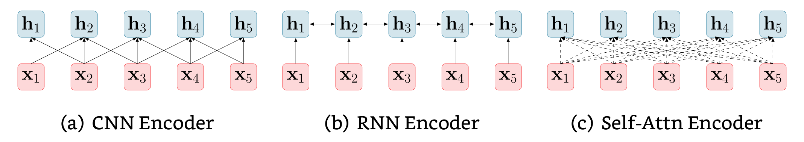
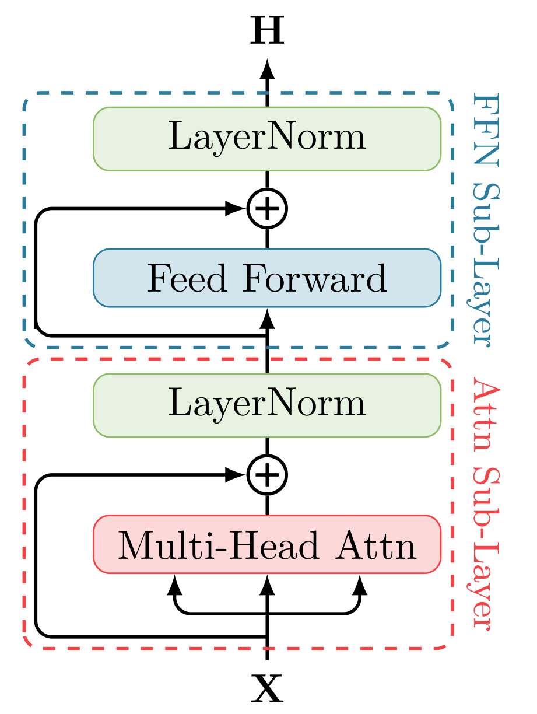
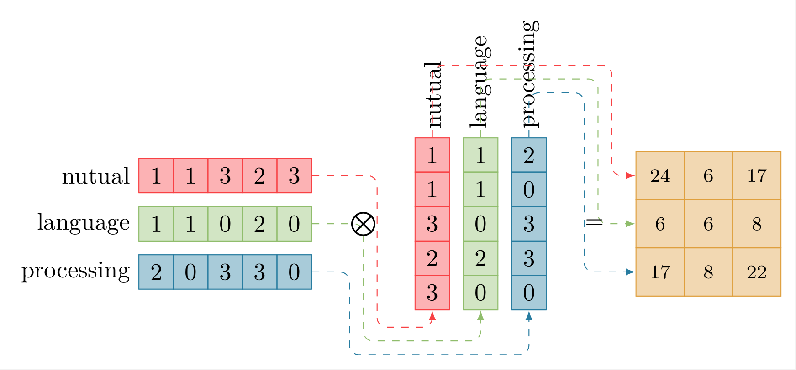
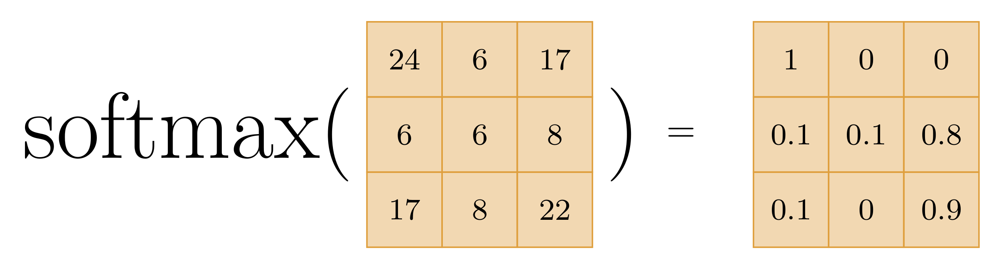
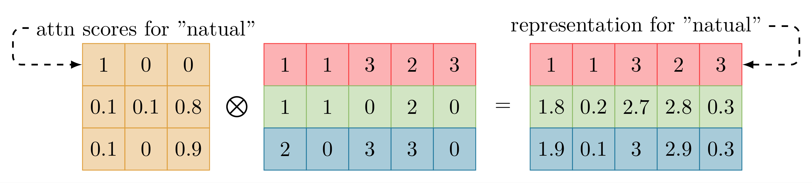
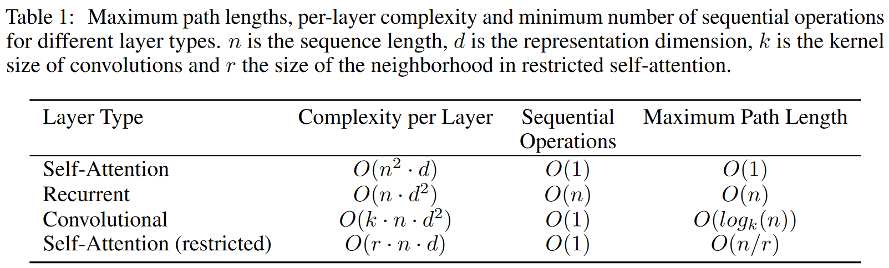
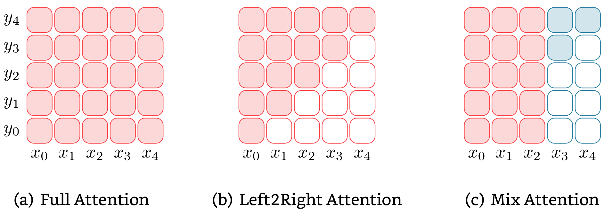
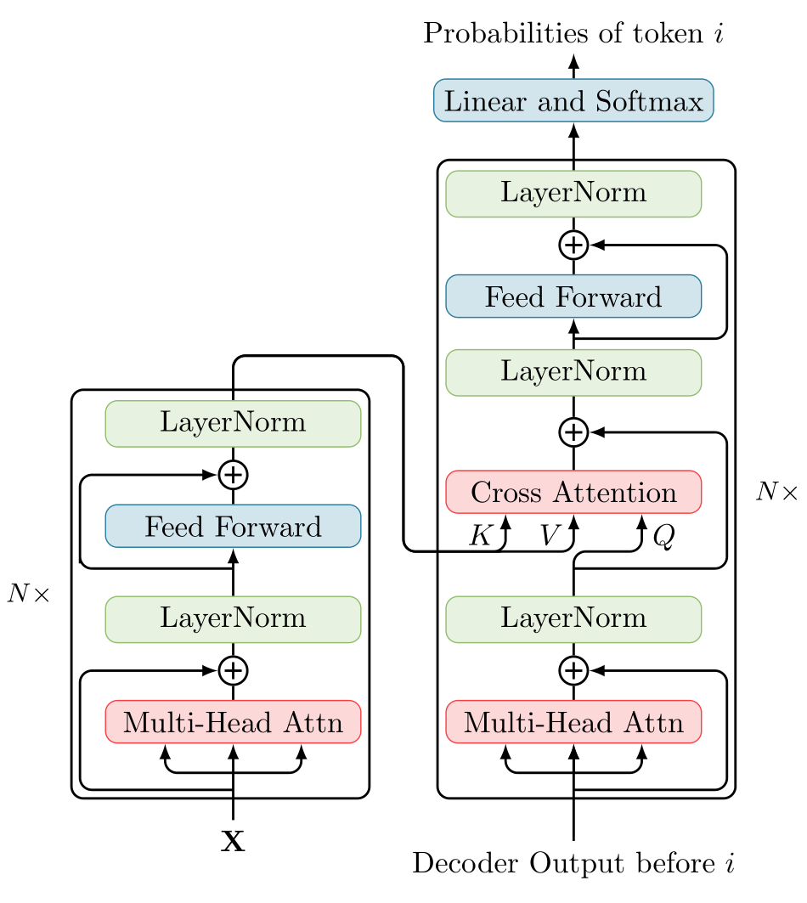

# Introduction to PLMs

<!--more-->

## Think Language Modeling as Representation Learning

自 [@Bengio2003] 将前馈神经网络引入自然语言处理以来，表征学习就是语言建模的主要思想。通常认为，好的语言表征应该能够捕捉到文本的表层语法信息和隐式的语义知识。基于 [[Attention-is-all-you-need|Transformer]] 的 PLMs 实际上就是利用 self-attention 的序列建模能力学习上下文表征。

对于长度为 $L$ 的自然语言语句 $\mathbf{s}=\{x_1, x_2, ..., x_L\}$, 其中 $x_i$ 是自然语言 token，表征计算即如下的过程：

$$[\mathbf{h}_1, \mathbf{h}_2, ..., \mathbf{h}_L] = \text{Encoder}(\mathbf{x}_1, \mathbf{x}_2, ..., \mathbf{x}_L)$$

其中 $\mathbf{x}_i$ 是 token $x_i$ 的嵌入向量，$\mathbf{h}_i$ 是 $x_i$ 的表征，$\text{Encoder}$ 是一个神经网络编码器。

通常，$\text{Encoder}$ 是多层堆叠结构，根据每层中的基本计算单元可以将其分为三类：

### Convolutional Language Encoder

卷积编码器通常用来捕捉局部上下文信息，其计算过程为：

$$\mathbf{h}_i = \text{CNN}(\mathbf{x}_{i-k : i+k})$$

其中，$\mathbf{x}_{i-k:i+k}$ 是 token $x_i$ 的 $2k$ 邻域内 tokens 嵌入向量的拼接矩阵，$2k$ 是卷积核的尺寸。不难看出，每层的卷积操作只能捕捉一个有限的邻域内的信息，长程信息只能通过多层卷积间接获得

### Recurrent Language Encoder

RNN 是在 [[Attention-is-all-you-need|Transformer]] 网络之前 NLP 的主流网络结构，由于 RNN 存在的梯度消失/爆炸问题，通常使用的计算单元是其变体 LSTM([@hochreiter1997]) 和 GRU([@chung2014]). 其计算过程为：

$$\mathbf{h}_i = \text{RNN}(\mathbf{h}_{i-1}, \mathbf{x}_i)$$

可以看出，对于输入序列, RNN 必须逐 token 的顺序计算：第 $i$ 个 token 的表征计算依赖于第 $i - 1$ 个 token 的表征, 因此无法有效并行。除此之外，RNN 只能建模单向(L2R)依赖，除非同时对逆序的输入序列再使用一次 RNN 计算(e.g., [@Peters2018]). 

### Self-Attention Lanugage Encoder

Self-Attention mechanism 可以简述为：在进行序列表征学习(序列建模)时，让模型自动选择基于该序列 (Self) 的哪些部分进行计算，即：

$$\mathbf{h}_i=\sum_{j=1}^L\alpha_{ij}\mathbf{x}_j$$

其中的 $\mathbf{x}_i$ 是嵌入向量或模型上一层的表征，$\mathbf{h}_i$ 可以认为是相对于 $\mathbf{x}$ 的**上下文**表征，$\alpha_{ij}$ 则是 attention 参数，被认为建模了 token $i$ 和 $j$ 之间的关系。

[[Attention-is-all-you-need|Transformer]]([@Vaswani2017a]) Layer 由两个子层：Self-Attention Sublayer 和 Feed-Forward Sublayer 组成，每个子层还使用了 Residual Connection ([@He2016])和 [[LayerNormalization|Layer Normalization]] ([@Ba2016]). 

#### Attention Layer

Attention Layer 的核心在于**How to attention**: 即如何计算上文说到的 $\alpha_{ij}$. Transformer 使用 Query-Key-Value(Q, K, V) 模型实现 $\alpha_{ij}$ 的计算。

下面首先介绍 Scaled dot-product attention 的计算过程，然后解释其为什么有效，最后介绍 transformer 的 attention sublayer 中使用的 multi-head attention 的计算过程。

##### Scaled dot-product attention

1. 首先计算 $\mathbf{Q}, \mathbf{K}, \mathbf{V}$：
    $$\mathbf{Q}, \mathbf{K}, \mathbf{V} = \mathbf{X}\mathbf{W}^Q, \mathbf{X}\mathbf{W}^K, \mathbf{X}\mathbf{W}^V$$

    $\mathbf{X} = \text{concat}(\mathbf{x}_1, \mathbf{x}_2, ..., \mathbf{x}_L)$ 是输入文本嵌入向量的拼接，$\mathbf{W}^Q, \mathbf{W}^K, \mathbf{W}^V$ 是投影矩阵，也是模型参数
2. self-attention 通过以下过程计算表征：
    $$\mathbf{H}=\text{Attn}(\mathbf{Q}, \mathbf{K}, \mathbf{V}) = \text{softmax}(\frac{\mathbf{QK}^\top}{\sqrt{d_k}})\mathbf{V}$$
    其中 $d_k$ 是模型维度，$\mathbf{H}\in\mathbb{R}^{L\times d_k}$ 是输出表征的拼接矩阵，即：$\mathbf{h}_i = \mathbf{H}[i, :]\text{ for }i\in[1, L]$

##### 为什么有效？

回忆上文所说的 attention 过程即选择序列的某些部分的过程，那么 Query-Key-Value 模型则是在模拟该选择过程。

首先明确一个概念：矩阵相乘即相似度计算。

然后考虑 attention 的计算过程的简化版： 

$$\text{Attn}(\mathbf{X}) = \text{softmax}(\mathbf{XX}^\top)\mathbf{X}$$

其中 $\mathbf{X} = [\mathbf{x}_1; \mathbf{x}_2; ...; \mathbf{x}_L]$, $\mathbf{x}_i$ 是 $d_k$ 维行向量，代表 token $i$ 的嵌入向量。

分析其行为：
1. $$\begin{aligned}
    \mathbf{XX}^\top &= \left[\begin{matrix}
        \mathbf{x}_1\\
        \mathbf{x}_2\\
        \vdots\\
        \mathbf{x}_L
    \end{matrix}\right]\cdot
    [\mathbf{x}_1^\top, \mathbf{x}_2^\top, \cdots, \mathbf{x}_L^\top]\\
    &=\left[\begin{matrix}
        &\mathbf{x}_1\mathbf{x}_1^\top &\mathbf{x}_1\mathbf{x}_2^\top &\cdots &\mathbf{x}_1\mathbf{x}_L^\top\\
        &\mathbf{x}_2\mathbf{x}_1^\top &\mathbf{x}_2\mathbf{x}_2^\top &\cdots &\mathbf{x}_2\mathbf{x}_L^\top\\
        &\vdots &\vdots &\ddots &\vdots\\
        &\mathbf{x}_L\mathbf{x}_1^\top &\mathbf{x}_L\mathbf{x}_2^\top &\cdots &\mathbf{x}_L\mathbf{x}_L^\top
    \end{matrix}\right]\\

    &\in\mathbb{R}^{L\times L}
    \end{aligned}$$
    
    显然, $\mathbf{x}_i\cdot\mathbf{x}_j^\top$ 的结果表征的是向量 $\mathbf{x}_i$ 和 $\mathbf{x}_j$ 之间的相似度。于是 $\mathbf{XX}^\top_{ij}$ 具备了 $\alpha_{ij}$ 的作用：描述了第 $i,j$ 个 token 之间的关系
2. [[Softmax]] 函数可以简单理解为一种归一化手段，它将上述向量内积的结果归一化到 $(0, 1)$ 的范围内，且同一行中所有值的和为 $1$. 
    这样，上述过程中 $\text{softmax}(\mathbf{XX}^\top)$ 的结果可以认为是一个归一化的加权矩阵
3. 最后一步的意义是显然的：根据前面计算的加权矩阵为输入序列的嵌入计算加权和，作为输出表征, 即 $\mathbf{h}_i = \sum_{j=1}^L\alpha_{ij}\mathbf{x}_j$ 的过程.

下面是一个模拟该过程的图示：
1. 矩阵相乘计算相似度分数：
    
2. softmax 归一化:
    
3. 根据归一化的注意力分数计算表征:
    

下面解释原始计算过程中的细节问题。对于原始的计算过程，其与简化版的区别在于：
1. 输入表征经过线性投影后参与计算，而不是直接计算
2. 存在一个缩放系数 $\sqrt{d_k}$

下面解释其原因：
1. $\mathbf{W}^Q, \mathbf{W}^K, \mathbf{W}^V$三个矩阵都是与输入相乘而起作用，其本质是对输入表征进行线性变换，主要的信息仍然是 $\mathbf{X}$，其意义在于
    1. 提升模型的拟合能力。三个线性变换相当于线性层，属于神经网络的一种。
    2. 如果不使用这三个线性变换，$\mathbf{XX}^\top$ 的结果中，$\mathbf{XX}^\top_{ii}$ 的值，即每个 token 对自己的注意力将会大大超过对其他 token 的注意力，经过 [[Softmax|Softmax]] 之后其他 token 的 attention score 会被严重挤压
2. 缩放系数 $\sqrt{d_k}$ 对矩阵的内积进行缩放
    1. 如果不进行缩放，在 $d_k$ 即向量维度很大时向量之间的内积也会很大，这样经过 [[Softmax|Softmax]] 之后的梯度会非常小[^1]。

如上就是 self-attention 中 scaled dot-product attention 的主要内容，实际上 transformer 模型中使用的是它的简单复合：Multi-Head Attention

##### Multi-Head Attention

在 Scaled dot-product attention 中，输入表征直接被投影到 $d_k$ 维度的 Query, Key, Value 向量，然后进行 self-attention 的加权平均过程。[@Vaswani2017a] 认为这个过程抑制了模型从**多个方面**提取文本序列的特征，于是提出进一步在多个子空间 (Multi-Head) 中分别进行 self-attention 计算。

具体地说，就是将 $\mathbf{Q}, \mathbf{K}, \mathbf{V}$ 三个矩阵进一步投影到 $h$ 个子空间, 然后进行 self-attention 计算：

$$\text{head}_i = \text{Attn}(\mathbf{QW}_i^Q, \mathbf{KW}_i^K, \mathbf{VW}_i^V)$$

其中 $i\in[1,h]$, $\mathbf{W}_i^Q, \mathbf{W}_i^K\in\mathbb{R}^{d_\text{model}\times d_k}$, $\mathbf{W}_i^V\in\mathbb{R}^{d_\text{model}\times d_v}$

Multi-Head Attention 中 $d_k$, $d_v$ 是一个比 $d_\text{model}$ 小的值，在 *Attention is all you need*([@Vaswani2017a])中, 作者取 $h=8, d_k=d_v=d_\text{model}/h$

在 $h$ 个子空间进行 self-attention 计算将对每个词获得 $h$ 个 $d_v$ 维度的表征，Multi-Head Attention 将它们拼接起来并投影回 $d_\text{model}$ 维度。

$$\text{MultiHead}(\mathbf{Q}, \mathbf{K}, \mathbf{V}) = \text{concat}(\text{head}_1, ..., \text{head}_h)\mathbf{W}_O$$

其中 $\mathbf{W}_O\in\mathbb{R}^{hd_v\times d_\text{model}}$ 是投影矩阵 

至此就是 Transformer 模型中关于 self-attention sublayer 的全部内容。

#### Feed-Forward Layer

Feed-Forward sublayer 是一个全连接层，由两个线性层和 [[ReLU|ReLU]] 激活函数组成，它对所有 token 的表征分别进行同等的变换:

$$\text{FFN}(\mathbf{x}) = \text{ReLU}(\mathbf{xW}_1 + \mathbf{b}_1)\mathbf{W}_2 + \mathbf{b}_2$$

虽然 self-attention 是 transformer 成功的关键，但是 FFN 层的参数实际上是 self-attention 层的两倍，以 Transformer 模型为例，[@Vaswani2017a] 使用的参数是 $d_\text{model}=512$, 而 FFN 层的隐藏层维度是 $d_{ff}=2048$。一些工作认为预训练的 transformer 模型中 FFN 层存储着与下游任务相关的信息, 而 self-attention 层中存储的则是文本之间如何进行有效交互的信息 ([@Geva2021], [@He2022]).

#### Residual Connection and Layer Normalization

Residual Connection ([@He2016]) 和 Layer Normalization ([@Ba2016]) 实际上都是为解决深度模型训练困难的实践性问题提出的，并无理论解释。对于 Residual Connection，自 ResNet([@He2016]) 以来，就一直是深度模型必备的部分，它主要解决了在过深的模型中训练时梯度(信息)消失的问题。

对于 Layer Normalization，它是针对 Batch Normalization ([@ioffe2015]) 提出的，而 Normalization 操作简而言之就是将神经网络中每层的输出(神经元激活分数)的**分布**恢复为均值为 $0$, 方差为 $1$ 的正态分布，解决 [[Interval-Covariate-Shift|Interval Covariate Shift]] 问题。区别在于，BatchNormal 操作是对每个隐藏单元在 batch 内归一化，达到每个隐藏单元在同一 batch 内均匀分布的效果, 需要在一个有足够样本数量的 batch 中才能进行；而 LayerNormal 操作是对同一层的所有隐藏单元进行归一化，达到同一个样本的所有隐藏单元均匀分布的效果, 可以对单个样本进行。而主流的 NLP 模型因序列长度不确定，无法稳定获得足够的统计样本只能使用 Layer Normalization

总而言之，结合了 Residual Connection 和 Layer Normalization 的 transformer 层计算过程为：

$$\begin{aligned}
    \mathbf{H}_\text{attn} &= \text{LayerNorm}(\text{MultiHead}(\mathbf{X}) + \mathbf{X})\\
    \mathbf{H}_\text{ffn} &= \text{LayerNorm}(\text{FFN}(\mathbf{H}_\text{attn}) + \mathbf{H}_\text{attn})
\end{aligned}$$

$\mathbf{H}_\text{ffn}$ 即最终的输出表征。

### Why Self-Attention

从三个方面考虑 Self-Attention 替代 CNN 和 RNN 的益处：
1. 每层总的计算复杂度
2. 可以并行化的计算比例
3. 建模长距离依赖时需要的计算路径长度

其中 3 在 NLP 以及其他序列建模任务中非常关键，一般来说，建模长距离依赖需要在网络中经过的计算路径越多，信息损失越严重，也就越难建模长距离依赖。

[@Vaswani2017a] 总结的上述三点的对比如下：

## PLMs

NLP 任务中，优质的数据标注高度依赖领域专家知识，直接在任务的标注数据上进行监督学习通常很困难，而且无法迁移到不同领域。预训练则是一种自监督学习，利用大量存在的原始语料进行通用的语言建模。在足够大规模的语料库上预训练过的语言表征通常被认为有利于下游任务的性能([@Radford2018])，同时能够提升深度神经网络的泛化性([@erhan2010])。

较早的预训练语言模型如 word2vec[@mikolov2013], GloVe[@Pennington2014] 等词嵌入模型在语料库上将词映射到向量空间，训练后的词嵌入可以用在下游任务上以提高性能。这些静态的词嵌入相当于上下文无关的词表征，无法表示词的多义性。而多义性是自然语言中常见且重要的特征之一，因此后来的预训练语言模型主要关注于上下文相关的语言表征。

[@Peters2018] 提出的 ELMo 使用双向 LSTM 网络计算上下文表征，ELMo 生成的表征作为特征在下游任务模型中使用，相当于仅作为文本特征提取器嵌入到下游任务模型。随着 transformer 模型和预训练-微调模式的出现，仅作为特征提取器的预训练模型很快消失，ELMo 基本成为这类预训练模型的绝唱。

### 结构

在 transformer 时代，PLM 根据模型架构可以分为三种：
1. Encoder based([[BERT-Pre-training-of-Deep-Bidirectional-Transformers-for-Language-Understanding|BERT]]([@Devlin2019]), [[RoBERTa-A-Robustly-Optimized-BERT-Pretraining-Approach|RoBERTa]]([@Liu2019]), [[XLNet|XLNet]]([@Yang2019]).)
2. Decoder based(GPT-1([@Radford2018]), GPT-2([@Radford2019]), GPT-3([@Brown2020]).)
3. Encoder-Decoder based([[BART-Denoising-Sequence-to-Sequence-Pre-training-for-Natural-Language-Generation-Translation-and-Comprehension|BART]]([@Lewis2019]), MASS([@Song2019]).)

#### Encoder based Model

Encoder 模型使用多层 transformer 对输入序列进行编码，生成动态的上下文语言表征。与上面讲到的 Self-Attention Encoding 过程一致

#### Decoder based Model

Decoder 模型与 Encoder 只有轻微不同：Encoder 模型在计算 token 表征时在整个输入序列的上下文范围内进行注意力计算，而 Decoder 模型只在当前 token 的**上文**进行注意力过程，即 Autoregressive 过程。

#### Encoder-Decoder based Model

Encoder-Decoder 模型由一个 Encoder 和一个 Decoder 组成，首先利用 Encoder 为输入文本生成表征，然后在 Decoder 中对该表征进行注意力计算。与 Decoder 模型相似，Encoder-Decoder 模型中的 Decoder 也会对当前 token 的上文进行注意力计算。即：Decoder 同时以**输入文本的表征**和**生成结果的上文**为条件进行生成，这一模式与翻译，摘要生成等 seq2seq 任务十分契合。

### 预训练目标

语言模型的训练目标基本可以简单归为以某种方式计算文本 $x$ 的概率 $P(x)$。在 PLM 中主要有三种预训练目标，基本与上述三种模型结构相对应。

#### Autoencoding Modeling

Autoencoding Modeling 常用于 Encoder based Model，如 BERT([@Devlin2019]) 中使用的 MLM。它的过程可以简述为：首先向原始文本中插入噪音，将其变为受损的文本，然后训练模型恢复**受损的部分**，训练的损失仅根据受损部分的文本计算，损失函数可以表示为：

$$\mathbfcal{L}_\text{AE}(\hat{\mathbf{X}})=\sum_{x_i\in m(\mathbf{X})}\log P(x_i|\mathbf{X}\backslash m(\mathbf{X}))$$

其中 $\mathbf{X}$ 是输入序列，$\hat{\mathbf{X}}$ 是原始文本序列经过噪音函数后的文本序列 $\hat{\mathbf{X}} = f_\text{noise}(\mathbf{X})$，$m(\mathbf{X})$ 是输入序列中受损的部分。

#### Autoregressive Modeling

Autoregressive Modeling 有时也称 Standard Language Modeling(SLM)，常在 Decoder based Model 中使用，如 GPT 系列模型就是 Autoregressive 模型。Autoregressive 模型是一种单向生成模型，即它根据**上文**信息训练模型生成下一个词，训练损失为：

$$\mathcal{L}_\text{AR}(\mathbf{X}) = \sum_{i=1}^{|\mathbf{X}|}\log P(x_i|x_1, x_2, ..., x_{i-1})$$

#### Sequence-2-Sequence Modeling

seq2seq 常用于 Encoder-Decoder based Model，它的过程是 Autoencoding 和 Autoregressive 过程的结合：首先向输入文本加入噪音，然后训练模型基于受损的文本使用编码器和解码器恢复出原始文本，其训练损失是恢复文本与原始文本之间的负对数似然：

$$\mathcal{L}_{SS} = \sum_{i=1}^{|\mathbf{X}|}\log P(x_i|\hat{\mathbf{X}}, x_1, x_2, ..., x_{i-1})$$

一些噪音函数([@Lewis2019])：
- Token Masking:  随机采样一些 tokens 并使用 [MASK] 替换
- Token Deletion:  随机删去一些 tokens ，与 Token Masking 相比，这种方法迫使模型预测被删除的位置
- Text Infilling: 随机采样一些文本片段，并用遮罩 [MASK] 替换。对于长度为 0 的文本片段，相当于插入了 [MASK] 。这种噪声迫使模型预测被替换的文本片段的长度
- Sentence Permutation: 将文档按照句号分割成不同的句子，然后随机排列句子的顺序。这种噪声迫使模型学习同一文档中句子的顺序
- Document Rotation: 随机选择一个 token ，然后将文本旋转到以这个 token 为开头的状态。这种噪声训练模型识别文本开头的能力

[^1]: 例如对于均值为 $0$, 方差为 $1$ 的 $d_k$ 维向量 $\mathbf{q}, \mathbf{k}$, 他们内积结果 $\mathbf{q}\cdot\mathbf{k}^\top$ 的均值为 $0$, 方差为 $d_k$. 当 $d_k$ 很大时, 意味着分布 $\mathbf{q}\cdot\mathbf{k}^\top$ 的值集中在绝对值大的区域，即 $\text{softmax}(\mathbf{q}\cdot\mathbf{k}^\top)$ 的大部分值之间的梯度很小。因此需要以 $\sqrt{k}$ 进行缩放，使内积结果的方差为 $1$
