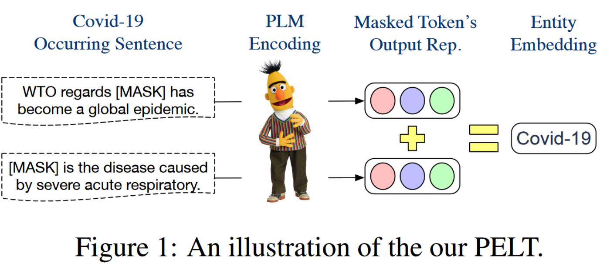

作者提出一种向 PLM 注入实体知识的简单方法：首先利用 PLM 为实体提及生成的表征预构建实体嵌入查找表，并在模型推理时修改嵌入层，将实体提及的嵌入直接替换为查找表中的嵌入，实现无特殊预训练的条件下向 PLM 注入实体知识。

<!--more-->

# Methodology

## 构建实体嵌入

作者观察到在 PLM 如 BERT 中，词的嵌入和输出表征实际处于相同的向量空间，因此作者考虑有可能利用输出表征构建嵌入。

对于实体 $e$, 其嵌入记作 $\mathbf{E}(e)$. 在实践中，作者按如下过程计算 $\mathbf{E}(e)$:

1. 收集包含 $e$ 的句子集 $S_e$
2. 对 $S_e$ 中每个句子，替换 $e$ 为 $[MASK]$
3. 记 $x_i$ 为每个句子中替换的 $[MASK]$, $\mathbf{E}(e) = C\cdot\sum_{x_i\in S_e}\mathbf{r}_{x_i}$
   其中 $C$ 是缩放系数，$r_{x_i}$ 是 PLM 为 $x_i$ 生成的表征。

(作者给出了为何如此设计的数学上的理由)

同时，作者将 $\mathbf{E}(e)$ 的范数限定为常数 $L$。

## 将实体嵌入注入 PLM

首先修改输入语句，在输入语句中实体提及的后面加上 "(e)", 即一对括号和实体 $e$，此时，实体 $e$ 作为词典中存在的 token 出现。

例如对于输入语句：$\text{Steve Job works for [MASK]}$, 修改后为 $\text{Steve Job(Steven_Job) works for [MASK]}$.

随后在嵌入层，被插入的实体 $\text{Steve_Job}$ 的嵌入将使用查找表中预生成的嵌入，其他 token 使用原来的嵌入。随后将该嵌入直接送入 encoder。