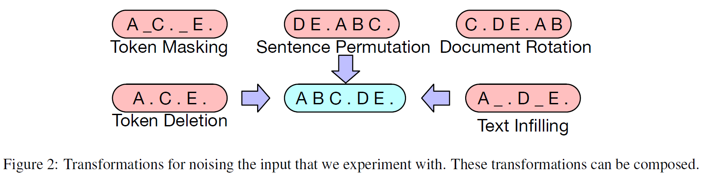
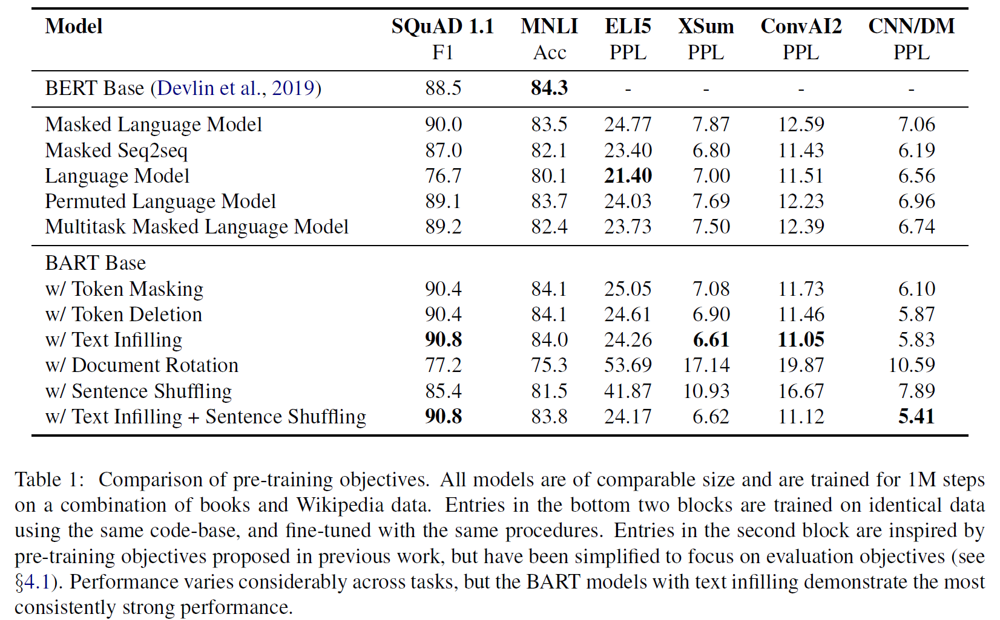

# Introduction

BART是一种用于预训练seq2seq模型的降噪自动编码器。BART使用标准的Transformer架构，训练时使用任意噪声函数对文本加噪，然后试图重建受损的文本。

BART的一个关键优势在于它的预训练过程使用任意的噪声函数，包括打乱原始句子的顺序，对任意长度的文本片段进行掩码替换等。这迫使模型对句子的整体长度进行更多推理，并对输入进行更长范围的转换。

BART格外适合微调到生成任务，在阅读理解，抽象对话，问答和总结任务中也有很好的效果。本文还基于BART介绍了一种新的机器翻译的模式，即在BART之上添加一些额外的Transformer层来将外语转换为带有噪声的目标语言，从而使用BART作为目标端语言模型进行去噪。

<!--more-->

# Background

早期的语言模型使用L2R(GPT)或者L2R和R2L叠加(ELMo)的方法，这样只能基于一侧的信息或者无法提取两侧信息的交互，在一些任务上有问题。（自回归模型，在生成任务上表现较好，但在分类任务上较差）

BERT使用MLM，允许在预训练过程中学习两侧信息的交互，但是由于预测过程不是自回归的，在生成任务上不是最优的。

# Model

BART是一个标准的seq2seq模型，其编码器是双向的，解码器是L2R自回归的。在预训练时我们优化重建文本和原始文本的负对数似然(negative log likehood)

## Architecture

BART使用标准的Transformer架构，但是将ReLu激活函数替换为GeLus，并且从分布 $N(0, 0.02)$ 中初始化参数。

BART的模型结构与BERT相似，有以下不同：

1. decoder的每一层额外的在encoder的最终隐藏层上做交叉注意
2. BERT在执行单词预测之前还有一层前馈网络，但BART没有

## Pre-training BART

BART基于受损文本重建任务进行预训练，重建损失即decoder的输出和原始文本之间的交叉熵。

BART允许使用任意类型的噪声。实验中我们使用了以下几种：

- Token Masking: 与BERT使用的相同，即随机采样一些tokens并使用[MASK]替换
- Token Deletion: 随机删去一些tokens，与Token Masking相比，这种方法迫使模型预测被删除的位置
- Text Infilling: 随机采样一些长度符合泊松分布( $\lambda = 3$ ) 的文本片段，并用遮罩 [MASK] 替换。对于长度为0的文本片段，相当于插入了[MASK]。这种噪声迫使模型预测被替换的文本片段的长度。
- Sentence Permutation: 将文档按照句号分割成不同的句子，然后随机排列句子的顺序。这种噪声迫使模型学习同一文档中句子的顺序。
- Document Rotation: 随机选择一个token，然后将文本旋转到以这个token为开头的状态。这种噪声训练模型识别文本开头的能力。

# Fine-tuning BART

## 序列分类任务

对于序列分类任务，将输入同时送进encoder和decoder，与BERT的[CLS] token类似，BART在decoder输出的末尾位置添加一个token专门用于分类任务，对应于这个token的最终隐藏层输出经过一个线性分类器得到输入序列的分类

在末尾添加的原因是这样decoder中这个token的表征可以注意到整个输入在decoder中的信息。

## Token分类任务

对于Token分类任务，将完整的输入文本送入encoder和decoder，然后使用decoder的顶部隐藏状态(top hidden state)作为每个词的表征，这个表征用于token的分类(即每个词属于某种token)。

## 序列生成任务

BART的decoder是自回归的，因此它可以直接微调到如抽取式问答和总结类的生成任务。在这类任务中，信息直接从输入中抽取并修改，这与BART的去噪预训练目标吻合。

## 机器翻译任务

对于翻译任务，BART通过将encoder的embedding层替换为少量随机初始化的encoder层，利用这个新的encoder将外语编码成有噪声的目标语言的编码。然后将该有噪声的编码作为BART的输入，由BART将其降噪成高质量的翻译结果。即，BART作为目标语言端解码器，新添加的encoder作为外语端编码器，组成了一个新的seq2seq机器翻译模型。
具体地说，微调该翻译任务分为两步：

1.  保持大多数的BART参数不变，仅更新新添加的encoder，BART的位置嵌入层和BART的encoder中第一层自注意力层的投影矩阵( $W_Q, W_K, W_V$ ) 
2. 在少量迭代下更新所有的参数

# 数据/任务集

SQuAD, MNLI, ELI5, XSum。详情参考：

[[Data-Set-and-Benchmark]]

# 实验说明的一些结论

实验结果：

- 预训练方法的性能因任务而异
- Token Masking是十分重要的预训练目标
- L2R的预训练能够提高生成任务的性能
- 对于SQuAD任务，双向编码器十分重要(在分类任务中，结合token之后的信息十分关键)
- 预训练目标不是唯一关键的因素