C++ 中以继承的方式实现动态多态是存在额外开销的, 具体地说，C++ 对象使用了额外的内存保存关于基类信息才实现了运行时多态. 但这种额外信息究竟以何种方式在对象的内存中报错对我来说仍是未知. 受到前人文章的启发, 本文借助 GDB 调试器一步步地观察记录 C++ 对象的内存布局, 力求理解实际 C++ 编译器 (gcc 9.4.0) 对 C++ 对象的内存布局以及派生类的实现.

<!--more-->

## 从空类谈起

对于空的类, 我们都知道它理论上的 `size` 应该是 0, 但是实际使用 `sizeof` 运算符的结果是 1. 这是因为为了实现对对象的引用, 对象必须在内存中占有一定的位置才能拥有一个地址. C++ 编译器对这一要求的实现就是为空类分配一个字节的内存.

```cpp
#include <iostream>

using std::cout;
class EmptyBase {};
int main() {
  EmptyBase empty{};
  // output: 1 1
  cout << sizeof(EmptyBase) << " " << sizeof(empty);
  return 0;
}
```

对上述代码调试的结果也支持这一结论:

```bash
(gdb) p empty
$1 = {<No data fields>}
(gdb) p sizeof(empty)
$2 = 1 # sizeof empty is 1
(gdb) p sizeof(EmptyBase)
$3 = 1 # sizeof EmptyBase (type) is 1
```

当类型非空时, 例如类型中有成员变量时, 编译器就不再需要特殊的空字节以维持对象在内存中的存在了.

```
class NonEmptyBase {
    int i{};
    int j{}
};
int main() {
    NonEmptyBase b{};
    return 0;
}
```

对象的地址就是其第一个成员变量的地址, 并且可以看出对于多个成员变量, 其地址是按照在类中定义的顺序连续分配的.

```bash
(gdb) p b
$3 = {
  i = 0,
  j = 0
}
(gdb) p sizeof b
$4 = 8
(gdb) p &b
$5 = (NonEmptyBase *) 0x7fffffffd7f8
(gdb) p &b.i
$6 = (int *) 0x7fffffffd7f8
(gdb) p &b.j
$7 = (int *) 0x7fffffffd7fc
```

### 虚函数的影响

当类的定义中存在虚函数时, 编译器会在对象的内存中额外存储一个 `vptr`(虚表指针), 指向一个虚函数表, 虚函数表中的条目即虚函数指针.

```cpp
class EmptyBase {
 public:
  virtual void foo() { endl(cout << "EmptyBase foo"); }
  virtual void bar() { endl(cout << "EmptyBase bar"); }
};

int main(){
  EmptyBase eb{};
  return 0;
}
```

对于上面定义的 `EmptyBase`, 其运行时调试信息是:

```bash
(gdb) p eb
$1 = {
  _vptr.EmptyBase = 0x555555557d78 <vtable for EmptyBase+16>
}
(gdb) p sizeof(eb)
$2 = 8
(gdb) p &eb
$3 = (EmptyBase *) 0x7fffffffd7f8
```

可以看出对象的内存中存有一个 `_vptr`, 其值是一个 64 位整数, 代表一个地址. 打印这个地址处的内容:

```bash
(gdb) p /a *(void **)0x555555557d78
$2 = 0x55555555522a <EmptyBase::foo()>
```

可以看到其内容是 `EmptyBase` 的成员函数 `EmptyBase::foo`. 考虑到 `EmptyBase` 中定义了两个虚函数, 猜测第二个虚函数位置应该在 `EmptyBase::foo` 后面:

```bash
$2 = 0x55555555522a <EmptyBase::foo()>
(gdb) p /a *(void **)(0x555555557d78 + 8)
```

根据这些信息可以大致画出对象 `eb` 的内存布局:


## 派生类的内存模型

存在继承关系时, 对象的内存中应该含有基类的成员.

```cpp
class EmptyBase {
 public:
  virtual void foo() { endl(cout << "EmptyBase foo"); }
  virtual void bar() { endl(cout << "EmptyBase bar"); }
};

class Derived : public EmptyBase {
 public:
  void foo() override { endl(cout << "Derived foo"); }
};

int main() {
  Derived eb{};
  return 0;
}
```

`eb` 的调试信息为:

```bash
(gdb) p eb
$4 = {
  <EmptyBase> = {
    _vptr.EmptyBase = 0x555555557d60 <vtable for Derived+16>
  }, <No data fields>}
(gdb) p sizeof(eb)
$5 = 8
(gdb) p &eb
$6 = (Derived *) 0x7fffffffd7f8
```

很简单, 似乎 `eb` 直接把派生类的部分放进自己的内存. 打印 `_vptr` 指向的虚表:

```bash
(gdb) p /a *(void **)(0x555555557d60)
$2 = 0x555555555258 <Derived::foo()>
(gdb) p /a *(void **)(0x555555557d60 + 8)
$3 = 0x55555555522a <EmptyBase::bar()>
```

可以看到对于派生类中没有重写的函数 `EmptyBase::bar`, 虚表中保存的仍然是派生类的实现的地址; 而对于重写的函数 `foo`, 虚表中的条目被修改为了派生类的实现地址. 注意这一过程是编译时发生的, 因此对继承的这种形式的使用还称不上「多态」.

### 派生类的非 `override` 虚函数

需要注意的是, `override` 是一种语义而非机制, 并非声明为 `override` 的函数才是重写函数. 实际上, 只要是派生类中的函数定义 (`virtual` or not) 在基类中存在同名虚函数, 那么这个派生类的函数就被称为 `override` 了基类中的虚函数版本.

那么对于派生类中的非 `override` 虚函数, C++ 是如何处理的呢?

```
class EmptyBase {
 public:
  virtual void foo() { endl(cout << "EmptyBase foo"); }
  virtual void bar() { endl(cout << "EmptyBase bar"); }
};

class Derived : public EmptyBase {
 public:
  void foo() override { endl(cout << "Derived foo"); }
  virtual void foobar () {}
};

int main() {
  Derived d;
  return 0;
}
```

上面的实现中, 函数 `Derived::foobar` 就是一个非 `override` 虚函数, 我们通过对象 `d` 打印出它的内存布局:

```bash
(gdb) p d
$1 = {
  <EmptyBase> = {
    _vptr.EmptyBase = 0x555555557d50 <vtable for Derived+16>
  }, <No data fields>}
(gdb) p /a *(void **)(0x555555557d50)
$2 = 0x55555555529e <Derived::foo()>
(gdb) p /a *(void **)(0x555555557d50 + 8)
$3 = 0x555555555270 <EmptyBase::bar()>
(gdb) p /a *(void **)(0x555555557d50 + 16)
$5 = 0x5555555552cc <Derived::foobar()>
```

可以看出, 内存中仍然是只有基类的虚表指针存在, 并且需表中存在 3 个函数指针, 分别是:
- 派生类 `override` 的 `Derived::foo`
- 基类定义的 `EmptyBase::Bar`
- 派生类特有的 `Derived::foobar`

可以得出结论: 对于派生类中的非 `override` 虚函数, C++ 的处理方式是将它的指针放在虚表中基类函数条目的后面.

### 多态的实现

在继承这一语境中, 「多态」这一术语通常指运行时多态, 即指向基类的指针在运行时动态地决定调用函数的哪一份实现.

下面模拟类似的场景:

```cpp
class EmptyBase {
 public:
  virtual void foo() { endl(cout << "EmptyBase foo"); }
  virtual void bar() { endl(cout << "EmptyBase bar"); }
};

class Derived : public EmptyBase {
 public:
  void foo() override { endl(cout << "Derived foo"); }
};

class Derived2nd : public EmptyBase {
 public:
  void bar() override { endl(cout << "Derived2nd bar"); }
};

int main() {
  EmptyBase* b = new Derived;
  b->foo();
  b->bar();

  b = new Derived2nd;
  b->foo();
  b->bar();
  return 0;
}
```

上面的实现中, 派生类 `Derived` 和 `Derived2nd` 分别重写了基类 `EmptyBase` 的 `foo` 和 `bar` 函数. 在主函数中, 通过一个基类的指针 `b` 分别调用 `b->foo()`, `b->bar()`, 输出的结果是:

```
Derived foo
EmptyBase bar
EmptyBase foo
Derived2nd bar
```

可以看出, 当基类指针 `b` 指向的是类型 `Derived` 的对象时, `b->foo()` 调用的是 `Derived::foo`, `b->bar()` 调用的是 `EmptyBase::bar()`. 当运行时将指针 `b` 指向 `Derived2nd` 的对象后, 再次对同样的指针调用 `foo` 和 `bar` 函数, 实际调用的函数变为了 `EmptyBase::foo()`, `EmptyBase::bar()`.

这样在运行时可以动态改变被调用函数的行为即运行时多态.

下面观察 `Derived` 对象和 `Derived2nd` 对象的内存布局:

首先在第 19 行位置设置断点, 然后打印 `b` 指针 (此时指向 `Derived` 对象) 的信息

```bash
(gdb) p *b
$2 = {
  _vptr.EmptyBase = 0x555555557d20 <vtable for Derived+16>
}
(gdb) p /a *(void **)(0x555555557d20)
$4 = 0x55555555532a <Derived::foo()>
(gdb) p /a *(void **)(0x555555557d20 + 8)
$5 = 0x5555555552fc <EmptyBase::bar()>
```

然后在第 23 行位置设置断点, 继续执行程序, 打印 `b` 指针 (此时指向 `Derived2nd` 对象) 的信息

```bash
$6 = {
  _vptr.EmptyBase = 0x555555557d00 <vtable for Derived2nd+16>
}
(gdb) p /a *(void **)(0x555555557d00)
$7 = 0x5555555552ce <EmptyBase::foo()>
(gdb) p /a *(void **)(0x555555557d00 + 8)
$8 = 0x555555555358 <Derived2nd::bar()>
```

可以看出上述对象内存和虚表信息的模式与直接使用对象时没有区别.

运行时多态的实现得益于每个对象内存中的虚表指针: 调用虚函数时, 只需要根据虚表指针定位到虚表, 然后根据所调用的函数符号在虚表基址上加上特定的偏移, 就可以定位到实际的函数地址, 进而实现多态. 使用基类指针时, 随着基类指针所指向的对象的不同, 其内部的虚表指针所指向的虚表自然也不同.

按道理说, 虚表指针存在于对象的内存中, 那么只要及时更新对象, 使用基类的对象而非指针应该也可以是实现运行时多态. 即下面的代码:

```cpp
int main() {
  EmptyBase b;
  b = Derived();
  b.foo();
  b.bar();

  b = Derived2nd();
  b.foo();
  b.bar();
  return 0;
}
```

可实际上上面的代码输出的结果是:

```
EmptyBase foo
EmptyBase bar
EmptyBase foo
EmptyBase bar
```

~~这是因为复制对象时, C++ 不会复制对象的虚表指针, 因此只能将指针指向不同的派生类对象, 而不能将派生类对象赋值给基类对象实现多态~~.

原因是当使用对象直接调用虚成员函数时, C++ 编译器不会经过虚表寻址, 而是直接静态决议生成函数 (符号) 调用的代码.

### 多重继承的情况

当一个派生类同时继承多个基类时, 派生类的虚表中会同时存在所有基类的虚表条目.

```cpp
class EmptyBase {
 public:
  virtual void foo() { endl(cout << "EmptyBase foo"); }
  virtual void bar() { endl(cout << "EmptyBase bar"); }
};

class EmptyBase2nd {
 public:
  virtual void foo() { endl(cout << "EmptyBase2nd foo"); }
  virtual void bar() { endl(cout << "EmptyBase2nd bar"); }
};

class Derived : public EmptyBase, public EmptyBase2nd {
 public:
  void foo() override { endl(cout << "Derived foo"); }
  virtual void foobar() {}
};

int main() {
  Derived d;
  return 0;
}
```

上面的实现具有下面的特点:
- 派生类同时继承 `EmptyBase` 和 `EmptyBase2nd`
- `EmptyBase` 和 `EmptyBase2nd` 中都定义有虚函数 `foo` 和 `bar`
- 派生类 `Derived` 中 `override` 了虚函数 `foo`, 定义了新的虚函数 `foobar`

下面通过对象 `d` 观察其内存布局:

首先是 `d` 对象本身, 可以看到它内部有两个虚表指针

```bash
(gdb) p d
$1 = {
  <EmptyBase> = {
    _vptr.EmptyBase = 0x555555557d00 <vtable for Derived+16>
  }, 
  <EmptyBase2nd> = {
    _vptr.EmptyBase2nd = 0x555555557d28 <vtable for Derived+56>
  }, <No data fields>}
```

观察第一个基类 `EmptyBase` 的虚表:

```bash
(gdb) p /a *(void**)(0x555555557d00)
$2 = 0x5555555552d8 <Derived::foo()>
(gdb) p /a *(void**)(0x555555557d00 + 8)
$3 = 0x55555555527c <EmptyBase::bar()>
(gdb) p /a *(void**)(0x555555557d00 + 16)
$4 = 0x555555555310 <Derived::foobar()>
```

其中的内容是:
- 虚函数 `foo` (地址被派生类的 `override` 实现覆盖)
- 虚函数 `bar` (基类的实现)
- **派生类特有的虚函数 `foobar`** (派生类的虚函数条目存储在第一基类的虚表中)

观察第二个基类 `EmptyBase2nd` 的虚表:

```bash
(gdb) p /a *(void**)(0x555555557d28)
$6 = 0x555555555306 <_ZThn8_N7Derived3fooEv>
(gdb) p /a *(void**)(0x555555557d28 + 8)
$7 = 0x5555555552aa <EmptyBase2nd::bar()>
```

注意到其中第一个条目是一个特殊信息 `<_ZThn8_N7Derived3fooEv>`, 根据上面的观察得到的经验, 这个条目本应该用来存储虚函数 `foo`. 但是考虑到虚函数 `foo` 被派生类 `override`, 并且在 `EmptyBase` 的虚表中已经存了 `Derived::foo` 的地址, 那么我猜想这里的特殊信息是指导通过 `EmptyBase2nd` 的指针调用 `foo` 函数时重定位到 `Derived::foo` 用的.

虚表的第二个条目就比较符合常规, 是 `EmptyBase2nd::bar` 的地址.

总的来说, 上面的多重继承内存布局可以简述为下图:


## 多重继承的歧义性

上面对派生类的内存模型的分析看起来很美好, 但实际上存在一些问题. 例如上面的多重继承例子中, 如果派生类 `Derived` 的对象 `d` 调用了基类 `EmptyBase` 和 `EmptyBase2nd` 中都存在定义的 `bar` 函数:

```cpp
class EmptyBase {
 public:
  virtual void foo() { endl(cout << "EmptyBase foo"); }
  virtual void bar() { endl(cout << "EmptyBase bar"); }
};

class EmptyBase2nd {
 public:
  virtual void foo() { endl(cout << "EmptyBase2nd foo"); }
  virtual void bar() { endl(cout << "EmptyBase2nd bar"); }
};

class Derived : public EmptyBase, public EmptyBase2nd {
 public:
  void foo() override { endl(cout << "Derived foo"); }
  virtual void foobar() {}
};

int main() {
  Derived d;
  d.bar(); // Error!
  return 0;
}
```

那么编译器会抱怨它无法确定具体要调用哪一个 `bar` 的实现:

```bash
# error from gcc
../polymorphism/polymorphism.cpp: In function ‘int main()’:
../polymorphism/polymorphism.cpp:23:5: error: request for member ‘bar’ is ambiguous
   23 |   d.bar();
      |     ^~~
../polymorphism/polymorphism.cpp:12:16: note: candidates are: ‘virtual void EmptyBase2nd::bar()’
   12 |   virtual void bar() { endl(cout << "EmptyBase2nd bar"); }
      |                ^~~
../polymorphism/polymorphism.cpp:6:16: note:                 ‘virtual void EmptyBase::bar()’
    6 |   virtual void bar() { endl(cout << "EmptyBase bar"); }
      |                ^~~

# error from clang
../polymorphism/polymorphism.cpp:23:5: error: member 'bar' found in multiple base classes of different types
  d.bar();
    ^
../polymorphism/polymorphism.cpp:6:16: note: member found by ambiguous name lookup
  virtual void bar() { endl(cout << "EmptyBase bar"); }
               ^
../polymorphism/polymorphism.cpp:12:16: note: member found by ambiguous name lookup
  virtual void bar() { endl(cout << "EmptyBase2nd bar"); }
               ^
1 error generated.
```

根据上面对多重继承下 `Derived` 类型对象内存的分析, `Derived` 类型对象的虚表中同时存在 `EmptyBase::bar` 和 `EmptyBase2nd::bar`. 再根据 `public` 继承的语义, `Derived` 对象也是 `EmptyBase` 对象和 `EmptyBase2nd` 对象. 因此 `Derived` 对象对函数 `bar` 的调用是具有歧义的: 调用任何一个而放弃另一个都是没有道理的.

### 菱形继承

上面的例子是我们非要在两个基类中定义同一个虚函数, 然后还要同时继承, 最过分的是还要不加区分地调用, 是一种庸人自扰. 那么再看另一个场景: 类型 `EmptyBase` 是基类, 类型 `MiddleA` 和 `MiddleB` 都继承 `EmptyBase`, 类型 `Derived` 则多重继承 `MiddleA` 和 `MiddleB`. 四个类型的继承关系形成了一个菱形:



假设 `MiddleA` 和 `MiddleB` 都是空类, 那么就不存在一个虚函数在两个基类中定义的行为, 但是下面的代码的行为仍然存在问题:

```cpp
class EmptyBase {
 public:
  EmptyBase() { endl(cout << "Construct EmptyBase"); }
  ~EmptyBase() { endl(cout << "Destruct EmptyBase"); }
  virtual void foo() { endl(cout << "EmptyBase foo"); }
  virtual void bar() { endl(cout << "EmptyBase bar"); }
};

class MiddleA : public EmptyBase {
 public:
  MiddleA() { endl(cout << "Construct MiddleA"); }
  ~MiddleA() { endl(cout << "Destruct MiddleA"); }
};

class MiddleB : public EmptyBase {
 public:
  MiddleB() { endl(cout << "Construct MiddleB"); }
  ~MiddleB() { endl(cout << "Destruct MiddleB"); }
};

class Derived : public MiddleA, public MiddleB {};

int main() {
  Derived d;
  // d.foo();
  return 0;
}
```

上面的代码输出为:

```
Construct EmptyBase
Construct MiddleA
Construct EmptyBase
Construct MiddleB
Destruct MiddleB
Destruct EmptyBase
Destruct MiddleA
Destruct EmptyBase
```

可以看出: `EmptyBase` 被构造和析构了两次, 分别是在构造和析构基类 `MiddleA` 的部分和 `MiddleB` 的部分时. 这个行为是不正确的, 因为对于一个派生类的对象 `d`, `EmptyBase` 在语义上只是它的基类, `d` 中不应该有两份 `EmptyBase` 的成分.

然而如果我们深入观察 `d` 的内存:

```bash
(gdb) p d
$1 = {
  <MiddleA> = {
    <EmptyBase> = {
      _vptr.EmptyBase = 0x555555557c70 <vtable for Derived+16>
    }, <No data fields>}, 
  <MiddleB> = {
    <EmptyBase> = {
      _vptr.EmptyBase = 0x555555557c90 <vtable for Derived+48>
    }, <No data fields>}, <No data fields>}
```

然后分别观察两个虚表的条目:

```bash
# MiddleA::EmptyBase::_vptr.EmptyBase
(gdb) p /a *(void **)(0x555555557c70)
$2 = 0x55555555531e <EmptyBase::foo()>
(gdb) p /a *(void **)(0x555555557c70 + 8)
$3 = 0x55555555534c <EmptyBase::bar()>

# MiddleB::EmptyBase::_vptr.EmptyBase
(gdb) p /a *(void **)(0x555555557c90)
$8 = 0x55555555531e <EmptyBase::foo()>
(gdb) p /a *(void **)(0x555555557c90 + 8)
$9 = 0x55555555534c <EmptyBase::bar()>
```

就会发现 `d` 中确实是存了两份关于 `EmptyBase` 的信息, 这无疑是愚蠢的.


同样的, 如果调用 `EmptyBase` 的 `foo` 和 `bar` 中任意函数, 都会导致歧义性编译错误.

## 虚继承

对于菱形继承中的歧义性问题, C++ 提供的解决方案是 **虚继承**, 虚继承体系中的基类被称为虚基类:


虚继承实现的语义是: 虚继承的派生类声明它愿意和当前虚基类的其他派生类共享虚基类, 即在菱形继承中两个中间基类可以共享根部的虚基类, 因此菱形继承中 `MiddleA` 和 `MiddleB` 使用虚继承的结果是 `Derived` 对象中只会存在一份 `EmptyBase` 的成分.

```cpp
class EmptyBase {
 public:
  EmptyBase() { endl(cout << "Construct EmptyBase"); }
  ~EmptyBase() { endl(cout << "Destruct EmptyBase"); }
  virtual void foo() { endl(cout << "EmptyBase foo"); }
  virtual void bar() { endl(cout << "EmptyBase bar"); }
};

class MiddleA : virtual public EmptyBase {
 public:
  MiddleA() { endl(cout << "Construct MiddleA"); }
  ~MiddleA() { endl(cout << "Destruct MiddleA"); }
};

class MiddleB : public virtual EmptyBase {
 public:
  MiddleB() { endl(cout << "Construct MiddleB"); }
  ~MiddleB() { endl(cout << "Destruct MiddleB"); }
};

class Derived : public MiddleA, public MiddleB {};

int main() {
  Derived d;
  d.foo(); // OK
  return 0;
}
```

此时再查看 `d` 的内存:

```bash
(gdb) p d
$1 = {
  <MiddleA> = {
    <EmptyBase> = {
      _vptr.EmptyBase = 0x555555557ba0 <vtable for Derived+40>
    }, <No data fields>}, 
  <MiddleB> = {<No data fields>}, <No data fields>}
```

非常容易理解: 现在 `d` 中只有一份 `EmptyBase` 的成分, 存储在 `MiddleA` 的部分中.

### 虚继承的一般模型

我们已经知道了在菱形继承的情况下, 虚继承提供了一种共享根部虚基类的机制. 上面给出的例子中, 只有虚基类中存在虚函数定义, 中间基类和派生类中都没有数据成员. 那么对于一般的虚继承, C++ 会如何构建对象的内存呢?

#### 单虚继承

首先模拟一种简单的单继承情况:

```cpp
class EmptyBase {
  int i{};

 public:
  EmptyBase() { endl(cout << "Construct EmptyBase"); }
  ~EmptyBase() { endl(cout << "Destruct EmptyBase"); }
  virtual void foo() { endl(cout << "EmptyBase foo"); }
  virtual void bar() { endl(cout << "EmptyBase bar"); }
};

class Derived : virtual public EmptyBase {
  int l{};
  virtual void bar() {}
  virtual void foobar() {}
};

int main() {
  Derived d;
  d.foo();  // OK
  return 0;
}
```

上面定义了一个有虚函数和成员变量的基类, 派生类通过虚继承继承这个基类, 并且派生类中定义了:
- 成员变量
- `override` 的虚函数
- 特有的虚函数

下面观察派生类对象 `d` 的内存:

```bash
(gdb) p d
$1 = {
  <EmptyBase> = {
    _vptr.EmptyBase = 0x555555557d00 <vtable for Derived+72>,
    i = 0
  }, 
  members of Derived:
  _vptr.Derived = 0x555555557cd0 <vtable for Derived+24>,
  l = 0
}
```

可以看到 `Derived` 对象 `d` 的内存中有这么几个条目:
- 基类 `EmptyBase` 的部分
    - 虚表指针 `_vptr`
    - 成员变量 `i`
- 派生类的部分
    - 虚表指针 `_vptr`
    - 成员变量 `l`

与一般的派生类 (非虚继承; [[#派生类的内存模型]]) 不同的地方在于内存中有两个虚表指针. 下面分别观察这两个虚表指针指向的虚表的内容:

`EmptyBase::_vptr.EmptyBase`:

```bash
(gdb) p /a *(void **)(0x555555557d00)@2
$2 = {0x55555555535a <EmptyBase::foo()>, 0x5555555553c5 <_ZTv0_n32_N7Derived3barEv>}
```

`Derived::_vptr.Derived`:

```bash
(gdb) p /a *(void **)(0x555555557cd0)@2
$3 = {0x5555555553b6 <Derived::bar()>, 0x5555555553d2 <Derived::foobar()>}
```

派生类的虚表中存有派生类定义的两个虚函数的地址, 而基类的虚表中只有一个虚函数的地址. **这是因为虚基类的另一个虚函数已经在派生类中 `override`, 因此这个虚函数已经被存在了派生类的虚表中, 不需要在基类的虚表中重复.**

与 *非虚继承* 的派生类对象内存做一个对比:



一个上面的例子无法揭示的事实:

实际上, 虚继承体系中, 即使派生类中没有定义虚函数, 只要其中有成员变量, 编译器就会为其创建虚表指针. 此时该虚表指针指向的虚表是空的.


#### 菱形继承

上面讨论了单虚继承下更为一般的内存模型, 下面观察更具一般性的菱形虚继承对象.

首先定义基类和派生类都含有成员变量和一个 `override` 虚函数和一个特有虚函数的菱形虚继承模型:

```cpp
class EmptyBase {
  int i{};

 public:
  EmptyBase() { endl(cout << "Construct EmptyBase"); }
  ~EmptyBase() { endl(cout << "Destruct EmptyBase"); }
  virtual void foo() { endl(cout << "EmptyBase foo"); }
  virtual void bar() { endl(cout << "EmptyBase bar"); }
  virtual void func() {}
  virtual void foobarfunc() {}
};

class MiddleA : virtual public EmptyBase {
  int a{};

 public:
  MiddleA() { endl(cout << "Construct MiddleA"); }
  ~MiddleA() { endl(cout << "Destruct MiddleA"); }
  virtual void foo() override {}
  virtual void foobarA() {}
};

class MiddleB : public virtual EmptyBase {
  int b{};

 public:
  MiddleB() { endl(cout << "Construct MiddleB"); }
  ~MiddleB() { endl(cout << "Destruct MiddleB"); }
  virtual void bar() override {}
  virtual void foobarB() {}
};

class Derived : public MiddleA, public MiddleB {
  int l{};
  virtual void func() {}
  virtual void foobar() {}
};

int main() {
  Derived d;
  return 0;
}
```

注意到上面的继承体系有以下特点:
- 基类 `EmptyBase` 有 4 个虚函数, 其中三个分别被派生类 `override`
- 每个类都有一个成员变量
- 每个派生类都有一个 `override` 虚函数和一个特有的虚函数

可以画出继承关系如下图所示:


对象 `d` 的内存:

```bash
(gdb) p d
$1 = {
  <MiddleA> = {
    <EmptyBase> = {
      _vptr.EmptyBase = 0x555555557b68 <vtable for Derived+144>,
      i = 0
    }, 
    members of MiddleA:
    _vptr.MiddleA = 0x555555557af0 <vtable for Derived+24>,
    a = 0
  }, 
  <MiddleB> = {
    members of MiddleB:
    _vptr.MiddleB = 0x555555557b28 <vtable for Derived+80>,
    b = 0
  }, 
  members of Derived:
  l = 0
}
```

三个虚表指针, 分别是:
- 虚基类的虚表指针 `MiddleA::EmptyBase._vptr.EmptyBase` (存在于 `MiddleA` 的部分)
- `MiddleA` 的虚表指针 `MiddleA::_vptr.MiddleA`
- `MiddleB` 的虚表指针 `MiddleB::_vptr.MiddleB`

可以看出虚继承加持下的菱形继承实现了虚基类 `EmptyBase` 的共享, 并且每一个虚继承的派生类都持有自己的虚表指针 (`Derived` 不是虚继承, 因此它没有自己的虚表指针).

下面分别观察三个虚表的内容:

1. **`MiddleA::EmptyBase._vptr.EmptyBase`:**
从基址 `0x555555557b68` 出发打印 12 个地址 (8字节对其) 的内容, 发现其中含有大量的特殊信息
```bash
(gdb) p /a *(void **)(0x555555557b68)@12
$12 = {0x555555555493 <_ZTv0_n24_N7MiddleA3fooEv>, 
  0x555555555591 <_ZTv0_n32_N7MiddleB3barEv>, 0x5555555555bd <_ZTv0_n40_N7Derived4funcEv>, 
  0x5555555553a2 <EmptyBase::foobarfunc()>, 0x555555557af0 <_ZTV7Derived+24>, 
  0x555555557bd8 <_ZTC7Derived0_7MiddleA+24>, 0x555555557c18 <_ZTC7Derived0_7MiddleA+88>, 
  0x555555557c50 <_ZTC7Derived16_7MiddleB+24>, 0x555555557c90 <_ZTC7Derived16_7MiddleB+88>, 
  0x555555557b68 <_ZTV7Derived+144>, 0x555555557b28 <_ZTV7Derived+80>, 0x20}
```

其中的 `0x5555555553a2 <EmptyBase::foobarfunc()>` 是可以解读的函数地址.


这里的特殊信息在本文中一直避免对它进行讨论, 主要因为:
1. 笔者水平和见识有限, 对它们没有认识
2. 这类信息很大程度上与编译器实现对象内存的方式有关, 笔者希望避免对这些特殊实现细节的讨论

但笔者做一个大胆的猜测就是这些信息可能跟类型的运行时类型信息 (Run time type infomation, RTTI) 有关.


可见关于虚函数, 虚基类 `EmptyBase` 的虚表中只存储了它特有的一个.

2. **`MiddleA::_vptr.MiddleA`**:

打印发现这个虚表中有 4 个有效的函数地址, 并且中间还有其他信息

```bash
(gdb) p /a *(void **)(0x555555557af0)@4
$17 = {0x555555555484 <MiddleA::foo()>, 0x5555555554a0 <MiddleA::foobarA()>, 
  0x5555555555ae <Derived::func()>, 0x5555555555ca <Derived::foobar()>}
```

分别是
- `0x555555555484 <MiddleA::foo()>`
- `0x5555555554a0 <MiddleA::foobarA()>`
- `0x5555555555ae <Derived::func()>`
- `0x5555555555ca <Derived::foobar()>`

这说明编译器将派生类的虚函数也都放进了它的 `MiddleA` 虚表.

3. **`MiddleB::_vptr.MiddleB`**:

`MiddleB` 的虚表中只有它自己的两个虚函数地址

```bash
(gdb) p /a *(void **)(0x555555557b28)@2
$20 = {0x555555555582 <MiddleB::bar()>, 0x55555555559e <MiddleB::foobarB()>}
```

根据以上观察可以画出下图:


需要注意的是, 除了上图中 `EmptyBase` 的虚表部分, 本文中所有虚表图示都省略了除虚函数以外的其他信息, 但实际的虚表中是含有除虚函数地址以外的如 RTTI 信息的.

## 总结

本文中笔者利用 GDB 调试器近距离观察了 C++ 对象在涉及虚函数和继承时的内存布局, 主要关注了编译器对虚函数的处理, 以及基于虚表和虚表指针实现的多态机制. 最后, 笔者分析了较为复杂的多重继承和菱形继承模型. 对于菱形继承, C++ 提供了虚继承语义解决歧义性问题, 笔者对这一语义的实现和菱形继承内存布局进行了观察和分析. 本文主要的观察有:
1. 对于没有虚函数的类型, 它的对象内存中只有自己的成员变量
2. 对于没有虚函数的派生类, 它的对象内存布局相当于嵌套的结构体
3. 对于有虚函数的类型, 它的对象内存中存在一个虚表指针 `_vptr`, 指向一个虚表. 虚表中的条目是该类型虚函数的地址
4. 对于涉及虚函数的 **非虚继承** 的派生类, 它的内存模型和不涉及虚函数时一致, 都是包含有基类的部分. 只不过在 **基类** 中有虚函数时, 派生类中的虚函数会被放进虚函数部分的虚表:
    1. 对于派生类中的 `override` 虚函数, 编译器的做法是直接使用该 `override` 虚函数的地址覆盖基类部分虚表中对应的条目
    2. 对于派生类中的非 `override` 虚函数, 编译器的做法是直接将该虚函数的地址放在基类部分虚表的后面
5. 对于多重 **非虚** 继承, 派生类的内存布局没有特殊机制: 仍然是派生类中包含有基类的部分. 因此当多个基类中含有相同函数签名的虚函数时, 派生类对该函数的调用会产生歧义.
6. 对于菱形 **非虚** 继承, 它的歧义性产生原因和多重继承一样: 根部基类中的虚函数地址同时存在于中间层基类的虚表中, 因此派生类对根部基类的虚函数的调用存在多条路径.
7. 对于虚继承语义, 在菱形继承时 C++ 只会在派生类中存放一份虚基类的虚函数地址, 一般存在派生类的第一顺位基类中.

## Reference

1. [Zero-overhead principle - cppreference.com](https://en.cppreference.com/w/cpp/language/Zero-overhead_principle)
2. [c++头脑风暴-多态、虚继承、多重继承内存布局 - 掘金 (juejin.cn)](https://juejin.cn/post/6974569481171369997)
3. [C++中虚函数、虚继承内存模型 - 知乎 (zhihu.com)](https://zhuanlan.zhihu.com/p/41309205)
4. [Derived classes - cppreference.com](https://en.cppreference.com/w/cpp/language/derived_class)
