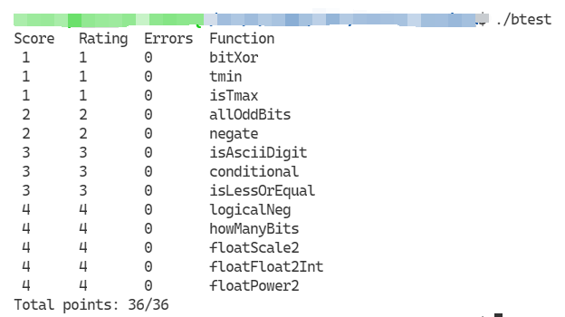

# 0x00 简介

一直在学习CS:APP这本书，本以为大名鼎鼎的Lab会出现在书本上，没想到一直看到第三章也没看见。在网上查了以下才知道是在线的。想想也十分合理，毕竟可能会经常有更新。这里就记录完成第一个Lab——DataLab的过程。

DataLab是使用受限的C语言运算子集来实现逻辑运算/补码运算/浮点运算的函数，例如，可能会要求仅使用位级运算和线性的过程来实现求绝对值的函数。这个Lab可以帮助理解C数据类型的位级表示和数据操作的位级行为。

<!--more-->

## 要求

这个Lab主要是在一个C语言文件中实现函数，在实现时对于使用的运算种类和数量都有严格的要求。同时Lab提供了一组工具用于检查代码中使用的运算是否符合要求以及用于测试代码正确与否。还提供了一个小工具可以打印整形数据和浮点数据的16进制或10禁止表示。

具体的编码要求附在文末，同时每道题可能还有自己的更加严格的要求。

## 概览

总共有不同分值的整数和浮点数函数共13个：

| 函数             | 描述                     | 分值 |
| ---------------- | ------------------------ | ---- |
| `bitXor`         | 计算异或                 | 1    |
| `tmin`           | 返回最小补码值           | 1    |
| `isTmax`         | 判断是否最大补码值       | 2    |
| `allOddBits`     | 判断是否奇数位置都为1    | 2    |
| `negate`         | 求相反数                 | 2    |
| `isAsciiDigit`   | 判断是否Ascii数字        | 3    |
| `conditional`    | 实现条件分支             | 3    |
| `isLessOrEqual`  | 实现小于等于             | 3    |
| `logicalNeg`     | 实现逻辑非(!)            | 4    |
| `howManyBits`    | 计算能表达数据的最小长度 | 4    |
| `floatScale2`    | 实现位级浮点数*2         | 4    |
| `floatFloat2Int` | 实现位级float转int       | 4    |
| `floatPower2`    | 实现位级2.0^x            | 4    |

# 0x01 bitXor

第一道题目：
```C
/* 
 * bitXor - x^y using only ~ and & 
 *   Example: bitXor(4, 5) = 1
 *   Legal ops: ~ &
 *   Max ops: 14
 *   Rating: 1
 */
int bitXor(int x, int y) {
  return 2;
}
```

只使用 `~` 和 `&` 运算符实现 `^` 运算。最多可以使用14个运算符。

考虑位级异或运算的真值表：

| `x` | `y` | `x ^ y` |
| --- | --- | ------- |
| `0` | `0` | `0`     |
| `0` | `1` | `1`     |
| `1` | `0` | `1`     |
| `1` | `1` | `0`     |

可以看到令 `x ^ y = 1` 的情况分别是 `x = 0, y = 1` 和 `x = 1, y = 0`，根据卡诺图化简的方法和逻辑代数的表达方式，这个真值表可以化简为：`X'Y + XY'`，即：`x ^ y = (x & ~y) | (~x & y)`。

由于题目要求只能使用 `&` 和 `~`，消去上式中的 `|`：

```
(x & ~y) | (~x & y)
= ~~((x & ~y) | (~x & y))
= ~((~x | y) & (x | ~y))
= ~(~~(~x | y) & ~~(x | ~y))
= ~(~(x & ~y) & ~(~x & y))
```

因此直接将上面的 `return 2` 改成 `return ~(~(x & ~y) & ~(~x & y))` 即可。

这道题目还可以在卡诺图化简时选择反函数，即化简出 `~(x ^ y)` 的表达式。具体来说，是选择真值表中结果为`0`的项进行化简：`~(x ^ y) = (x & y) | (~x & ~y)`。这样的情况下，有：`(x ^ y) = ~((x & y) | (~x & ~y)) = (~x | ~y) & (x | y) = ~(x & y) & ~(~x & ~y)`。这个结果比上一个少用了1个运算符。

# 0x02 tmin

```C
/* 
 * tmin - return minimum two's complement integer 
 *   Legal ops: ! ~ & ^ | + << >>
 *   Max ops: 4
 *   Rating: 1
 */
int tmin(void) {
  return 2;
}
```

这道非常简单，返回最小的补码值，即 `0x80000000`。由于不能使用除 `0x00~0xff` 之外的常数，直接返回 `0x01 << 31` 即可。

# 0x03 isTmax

```C
/*
 * isTmax - returns 1 if x is the maximum, two's complement number,
 *     and 0 otherwise 
 *   Legal ops: ! ~ & ^ | +
 *   Max ops: 10
 *   Rating: 1
 */
int isTmax(int x) {
  return 2;
}
```

这道是判断参数是否是最大补码值，即 `0x7fffffff`。不难知道对于 `0x7fffffff`，其处在溢出的边缘，再加 `1` 就会得到最小的补码值 `0x80000000`。观察最小补码值和最大补码值的位模式，得知最小补码值只有最高位为 `1`，其余位为 `0`；而最大补码值相反——只有最高位为 `0`，其余位为 `1`——因此最小补码值取反应该为最大补码值。

基于以上原理，当 `x = 0x7fffffff` 时，`!(x ^ ~(x + 1)) = 1`。这就实现了最大补码值时返回 `1`。

实际测试时发现，当 `x = 0xffffffff` 时，由于也处于溢出边缘，也具有上述的性质，对结果造成误判。因此需要过滤掉该种情况。

当 `x = 0xffffffff` 时，其位模式是所有位都为 `1`。因此对其取反可以得到特殊值 `0`。可以使用表达式 `~x` 进行过滤，这样的话总的结果就是 `!(x ^ ~(x + 1)) & ~x`。对这个结果使用 `x = 0x7fffffff` 进行验证，发现 `~x = 0x80000000`，这样的话最终结果就是 `0x80000000 & 0x1 = 0`，因此还需要对 `~x` 的值进行二值化，让其取值只落在 `0` 和 `1` 的范围内。即 `!!~x`。

最终结果为 `!(x ^ ~(x + 1)) & (!!~x)`。

# 0x04 allOddBits

```C
/* 
 * allOddBits - return 1 if all odd-numbered bits in word set to 1
 *   where bits are numbered from 0 (least significant) to 31 (most significant)
 *   Examples allOddBits(0xFFFFFFFD) = 0, allOddBits(0xAAAAAAAA) = 1
 *   Legal ops: ! ~ & ^ | + << >>
 *   Max ops: 12
 *   Rating: 2
 */
int allOddBits(int x) {
  return 2;
}
```

这道题要求判断给定的参数其位模式的奇数位是否都为 `1`。例如，数据 `0xFFFFFFFD` 的最低四位是 `1101`，第1位为 `0`，所以返回 `0`。数据 `0xAAAAAAAA` 则是所有奇数位都为 `1`，所有偶数位都为 `0`，所以返回 `1`。

因为只需要判断奇数位上的情况，偶数位则可以忽略。因此可以使用数据 `0xAAAAAAAA` 作为 mask 来对参数进行校验。如果参数 `x` 的奇数位都为 `1` 的话，表达式 `0xAAAAAAAA & x = 0xAAAAAAAA` 成立。则可以使用表达式 `!(0xAAAAAAAA ^ (0xAAAAAAAA & x))` 作为答案。因为不能直接使用这么大的常数，mask 需要从 `0xAA` 经过运算得到。以下表达式得到 `mask = 0xAAAAAAAA`:

```C
  int mask = 0xAA;
  mask |= mask << 8;
  mask |= mask << 16;
```

所以答案是：

```C
int allOddBits(int x) {
  int mask = 0xAA;
  mask |= mask << 8;
  mask |= mask << 16;
  return !((x & mask) ^ mask);
}
```

# 0x05 negate

```C
/* 
 * negate - return -x 
 *   Example: negate(1) = -1.
 *   Legal ops: ! ~ & ^ | + << >>
 *   Max ops: 5
 *   Rating: 2
 */
int negate(int x) {
  return 2;
}
```

这道题要求使用5个以内给定种类的运算符实现补码相反数操作。

对于补码整数，其编码与无符号数编码一致；对于补码负数，其编码方式则是最高位取负权，其余位取正权。

通过学习CS:APP第二章我们知道，补码的非有两种聪明的求法：

1. 对每一位求补，再对结果加 `1`。在C语言中，对于任意整数 `x`，计算表达式 `-x` 和 `~x+1` 得到的结果完全一样。
2. 将位向量分为两部分，假设 $k$ 是位向量中最右边的 $1$ 的位置，因而 $x$ 的位级表示形如 $[x_{(w−1)}, x_{(w−2)}, …,x_{(k+1)},1,0,…,0]$，这个值的非的二进制形式为：$[~x_{(w−1)},~x_{(w−2)},…,~x_{(k+1)},1,0,…,0]$。即：对位 $k$ 左边的所有位取反。

这题中应用第一种求法，得到答案：`~x + 1`。

# 0x06 isAsciiDigit

```C
/* 
 * isAsciiDigit - return 1 if 0x30 <= x <= 0x39 (ASCII codes for characters '0' to '9')
 *   Example: isAsciiDigit(0x35) = 1.
 *            isAsciiDigit(0x3a) = 0.
 *            isAsciiDigit(0x05) = 0.
 *   Legal ops: ! ~ & ^ | + << >>
 *   Max ops: 15
 *   Rating: 3
 */
int isAsciiDigit(int x) {
  return 2;
}
```

这道题判断所给参数是否是 ASCII 数字，即判断给定参数是否在 `0x30 ~ 0x39` 范围内。

观察 `0x30 ~ 0x39` 这十个数字的位模式，发现其高28位都相同，低4位中涵盖了从 `0` 到 `9` 的范围。下面对照4位二进制数的真值表观察其特征：

| 位模式 | 整数值 | 位模式 | 整数值 |
| ------ | ------ | ------ | ------ |
| `0000` | `0`    | `0101` | `5`    |
| `0001` | `1`    | `0110` | `6`    |
| `0010` | `2`    | `0111` | `7`    |
| `0011` | `3`    | `1000` | `8`    |
| `0100` | `4`    | `1001` | `9`    |

可以看到范围内的值除了 `8` 和 `9` 之外最高位都为 `0`，且最高位为 `0` 时，低3位所有的取值情况都在范围内。对应到32位整数就是除了 `0x38` 和 `0x39` 之外，高29位都相同，且低3位可以为任意值。

我们将 `0x38` 和 `0x39` 这两个数字作为特例，除这两个值外，判断 `x` 高29位是否是合法值，如果是，那么该数字一定是 ASCII Code。如果不是，再判断是否是两个特例值中的一个。

判断高29位的表达式为：`!(((x >> 3) << 3) ^ 0x30)`，判断 `x` 是否是特殊值的表达式是：`!((x ^ 0x38) & (x ^ 0x39))`，最终结果为：`!(((x >> 3) << 3) ^ 0x30) | !((x ^ 0x38) & (x ^ 0x39))`

# 0x07 conditional

```C
/* 
 * conditional - same as x ? y : z 
 *   Example: conditional(2,4,5) = 4
 *   Legal ops: ! ~ & ^ | + << >>
 *   Max ops: 16
 *   Rating: 3
 */
int conditional(int x, int y, int z) {
  return 2;
}
```

使用给定的几种不超过16个运算实现三元运算符，即：`x ? y : z`，若 `x == 0`，返回 `z`，否则返回 `y`。

在不能使用条件分支的情况下，根据 `x` 的取值进行返回，首先比较容易想到使用 `x` 作为 mask 对 `y` 和 `z` 进行过滤。比如当 `x == 0` 时，可以用表达式 `x & y` 过滤掉 `y`；当 `x != 0` 时，根据相反的原则，首先将 `x` 做成所有位都为 `1` 的样子：`~!!x + 1`，然后表达式 `x | z` 可以过滤掉 `z`。

根据上面所说的情况，可以知道使用 `x` 的值作为 mask 的思路大概是可行的。不过要首先将 `x` 转换为全 `0` 或全 `1` 的形式——这里使用额外的变量表示——`int isXZero = ~!!x + 1`。对于两种过滤表达式，考察其取值：

由于：

$$\mathrm{isXZero} = \begin{cases}
  0 & when & x = 0 \\
  -1 & when & x \neq 0
\end{cases} $$

有：

$$\mathrm{isXZero\  \&\  y} = \begin{cases}
  0 & when & x = 0 \\
  y & when & x \neq 0
\end{cases}$$

和：

$$\mathrm{isXZero\  |\  z} = \begin{cases}
  -1 & when & x \neq 0 \\
  z & when & x = 0
\end{cases}$$

可以看到两种滤网滤出的数值根据 `x` 的取值分别取有效值和较为规则的无效值，且取有效值的情况彼此之间错开。这样的情况很容易想到将其相加：

$$\mathrm{(isXZero\ \&\ y) + (isXZero\ |\ z)} = \begin{cases}
  z & when & x = 0 \\
  y - 1 & when & x \neq 0
\end{cases}$$

这样答案就较为明显了，只需在 `x != 0` 时将上述的和式加上 `1` 就可以。可以认为 `x == 0` 时上式加上 `0`，这样加上的实际上是 `x` 的某种变形，即 `~!!x`。所以答案为：`(isXZero | z) + (isXZero & y) + !!x`

# 0x08 isLessOrEqual

```C
/* 
 * isLessOrEqual - if x <= y  then return 1, else return 0 
 *   Example: isLessOrEqual(4,5) = 1.
 *   Legal ops: ! ~ & ^ | + << >>
 *   Max ops: 24
 *   Rating: 3
 */
int isLessOrEqual(int x, int y) {
  return 2;
}
```

这道题要求实现 `<=` 运算。十分自然的想法是利用减法运算 `x - y`，然后判断结果的符号位，看了一下不允许使用减法，又想了一下想起可以用取相反数的方法计算减法，而相反数则可以通过按位取反后加1获得。不知道这样算不算投机取巧。于是首先试一下 `(x + (~y + 1) >> 31) & 0x1`，发现 `isLessOrEqual(-2147483648[0x80000000],-2147483648[0x80000000])` 过不了，这才发觉有溢出时，符号位会丢失。因此下面需要将溢出的情况单列。

众所周知 `~y + 1` 与 `-y` 对于任意整数 `y` 结果都相同，那么溢出的情况实际上就是正常的减法溢出。如较大(绝对值)的负数减去较大的正数，或者较大的正数减去较大(绝对值)的负数，而对于符号相同的情况，就绝不会溢出。总而言之，要被单列的情况一定是 `x` 和 `y` 异号的情况，而对于异号的情况，其大小关系又是确定的，因此本题就容易解了。

对于有符号整数 `x` 和 `y`，除去 `x == y == 0`，他们的正负共有以下四种情况：

$$\begin{cases}
  \mathrm{x < 0, y > 0} \ \text{(1)} \\
  \mathrm{x > 0, y < 0} \ \text{(2)}\\
  \mathrm{x < 0, y < 0} \ \text{(3)}\\
  \mathrm{x > 0, y > 0} \ \text{(4)}
\end{cases}$$

对于1, 2两种情况，其大小关系是显然的，对于3, 4两种情况，其大小关系可以使用表达式 `(x + (~y + 1) >> 31) & 0x1` 判断，于是可以得到答案，由于情况分支较多，直接写位级运算表达式不方便，这里使用临时变量分步计算：

```C
int xPositive = !((x >> 31) & 0x1);                     // 1 if x > 0
int yPositive = !((y >> 31) & 0x1);                     // 1 if y > 0
int xPosAndyNeg = xPositive & (!yPositive);             // 1 if x > 0, y < 0
int xNegAndyPos = (!xPositive) & yPositive;             // 1 if x < 0, y > 0
int xyPosOrNegAndxLessy = ((x + (~y + 1)) >> 31) & 0x1; // 1 if x*y >= 0, x <= y
return (!xPosAndyNeg) & (xNegAndyPos | xyPosOrNegAndxLessy);
```

这样的答案再次测试发现还是无法通过上面那个 `0x80000000` 的用例，原来是因为只注意了 `~y + 1` 与 `-y` 的等价性，忘记了 `-y` 本身就可能溢出，这种溢出情况就是对于最小的负数 `0x80000000` 才会出现的，其原因在于补码正负域的不对称性。因为当且仅当 `y = 0x80000000` 时，才会出现溢出，而且此时当且仅当 `x = 0x80000000` 时才返回 `1`，所以可以将这种情况使用 `x == y` 的条件过滤掉。最终答案是：

```C
int xPositive = !((x >> 31) & 0x1);                     // 1 if x > 0
int yPositive = !((y >> 31) & 0x1);                     // 1 if y > 0
int xPosAndyNeg = xPositive & (!yPositive);             // 1 if x > 0, y < 0
int xNegAndyPos = (!xPositive) & yPositive;             // 1 if x < 0, y > 0
int xyPosOrNegAndxLessy = ((x + (~y + 1)) >> 31) & 0x1; // 1 if x*y >= 0, x <= y
int xyEqual = !(x ^ y);                                 // 1 if x == y
return (!xPosAndyNeg) & (xyEqual | xNegAndyPos | xyPosOrNegAndxLessy);
```

# 0x09 logicalNeg

```C
/* 
 * logicalNeg - implement the ! operator, using all of 
 *              the legal operators except !
 *   Examples: logicalNeg(3) = 0, logicalNeg(0) = 1
 *   Legal ops: ~ & ^ | + << >>
 *   Max ops: 12
 *   Rating: 4 
 */
int logicalNeg(int x) {
  return 2;
}
```

这道题要求实现逻辑非，即若 `x == 0`，返回 `1`，否则返回 `0`。考虑补码整数的位模式，容易想到当 `x == 0` 时，所有位都为 `0`。针对这一特征，若所有位相互取或结果为 `0`，那么该 `x` 一定是 `0`。

想起[leftmost_one](https://blog.zhuwenq.icu/2021/07/22/leftmost-one/#more)或者[判断整数位模式中是否有偶数个1](https://blog.zhuwenq.icu/2021/07/19/%E5%88%A4%E6%96%AD%E6%95%B4%E6%95%B0%E4%BD%8D%E6%A8%A1%E5%BC%8F%E4%B8%AD%E6%98%AF%E5%90%A6%E6%9C%89%E5%81%B6%E6%95%B0%E4%B8%AA1/#more)所提到的将所有位彼此做逻辑运算的方法，可以知道以下的操作将 `x` 的最低位设置成 `x` 的所有位的或：

```C
x |= x >> 16;
x |= x >> 8;
x |= x >> 4;
x |= x >> 2;
x |= x >> 1;
```

这样若 `x == 0`，则 `(~x) & 0x1 == 1`，反之仍然成立。因此答案是：

```C
x |= x >> 16;
x |= x >> 8;
x |= x >> 4;
x |= x >> 2;
x |= x >> 1;
return (~x) & 0x1;
```

# 0x0A howManyBits

```C
/* howManyBits - return the minimum number of bits required to represent x in
 *             two's complement
 *  Examples: howManyBits(12) = 5
 *            howManyBits(298) = 10
 *            howManyBits(-5) = 4
 *            howManyBits(0)  = 1
 *            howManyBits(-1) = 1
 *            howManyBits(0x80000000) = 32
 *  Legal ops: ! ~ & ^ | + << >>
 *  Max ops: 90
 *  Rating: 4
 */
int howManyBits(int x) {
  return 2;
}
```

这道题计算要表示给定的整数，用补码方式最少需要多少位。例如 `12 = 0x0000000C`，仅看低4位是 `1100`。由于补码的最高位是负权，如果仅用4位，那么这个位模式表示的就不是 `12` 而是 `-4`，所以表示 `12` 需要 `4 + 1 = 5` 位。再如 `-5 = 0xFFFFFFFB`，其位模式低四位是 `1011`，这个位模式最高位按负权解释刚好是 `-5`，因此 `-5` 需要4位。根据这种解释方式，其他数据所需的最小位数也可以推导得到，不赘述。同时可以发现一个规律：对于正数，所需的位数就是位模式中最左侧那个 `1` 的位置再加1(符号位)，而对于负数，其所需的位数则是该负数位模式最左侧的 `0` 所在的位置再加1，可以对负数按位取反，这样就可以统一为最左侧 `1` 的位置再加1。

基于这个思想，目前答案的关键是求出位模式最左侧的 `1`。再次根据[leftmost_one](https://blog.zhuwenq.icu/2021/07/22/leftmost-one/#more)所使用的方式和[第七题](#0x07-conditional)所使用的无分支实现conditional方法，可以算出 `x` 的最左侧的1的形式：

```C
int isXNeg = x >> 31;                             // 0xffffffff if x < 0; 0 if x >= 0
int xPositive = isXNeg | x + (isXNeg & 0x1);      // x if x >= 0; -1 if x < 0
int xNegitive = (isXNeg & (~x));                  // ~x if x < 0; 0 if x >= 0
int xAbs = xPositive + xNegitive;                 // x if x >= 0; ~x if x < 0
// get leftmost_one
int leftmost_one = xAbs |= xAbs >> 1;
leftmost_one |= leftmost_one >> 2;
leftmost_one |= leftmost_one >> 4;
leftmost_one |= leftmost_one >> 8;
leftmost_one |= leftmost_one >> 16;
leftmost_one >>= 1;
leftmost_one += 1;
```

这时还剩下一个关键的问题：如何将最左侧的1形式的二进制数转换为10进制整数的形式。具体来说：以四位数为例，就是把下表中由 $\mathrm{Y_3 Y_2 Y_1 Y_0}$ 组成的二进制数转换为由 $\mathrm{X_2 X_1 X_0}$ 组成的二进制无符号整数。

| $\mathrm{Y_3}$ | $\mathrm{Y_2}$ | $\mathrm{Y_1}$ | $\mathrm{Y_0}$ | $\mathrm{X_2}$ | $\mathrm{X_1}$ | $\mathrm{X_0}$ |
| -------------- | -------------- | -------------- | -------------- | -------------- | -------------- | -------------- |
| `0`            | `0`            | `0`            | `0`            | `0`            | `0`            | `0`            |
| `0`            | `0`            | `0`            | `1`            | `0`            | `0`            | `1`            |
| `0`            | `0`            | `1`            | `0`            | `0`            | `1`            | `0`            |
| `0`            | `1`            | `0`            | `0`            | `0`            | `1`            | `1`            |
| `1`            | `0`            | `0`            | `0`            | `1`            | `0`            | `0`            |

这个真值表如果反过来——将 $\mathrm{X_2 X_1 X_0}$ 作为输入参数，而 $\mathrm{Y_3 Y_2 Y_1 Y_0}$ 作为输出参数——有过数字电路学习经验的就会看出这实际上是一个译码过程，更具体的说，是一个3-8译码器的真值表($\mathrm{X_2 X_1 X_0}$ 需要扩展到 $\mathrm{Y_7}$)。

对于上表所示的4位真值表，对 $\mathrm{X_2, X_1, X_0}$ 分别进行卡诺图化简（实际上不需要使用卡诺图，这种类型的解码器逻辑式是相当容易推到的），可以算出：

$$\begin{cases}
  X_0 & = & Y_0 + Y_2 \\
  X_1 & = & Y_1 + Y_2 \\
  X_2 & = & Y_3
\end{cases}$$

这个形式规律较为混乱，猜测主要原因是对于4位的译码输出，只需要2位的整数输入就够了。然而这样的话就要求将 `0000` 的情况单列，从 `0001` 开始映射为2位输出的 `00`。即如下的真值表：

| $\mathrm{Y_3}$ | $\mathrm{Y_2}$ | $\mathrm{Y_1}$ | $\mathrm{Y_0}$ | $\mathrm{X_1}$ | $\mathrm{X_0}$ |
| -------------- | -------------- | -------------- | -------------- | -------------- | -------------- |
| `0`            | `0`            | `0`            | `1`            | `0`            | `0`            |
| `0`            | `0`            | `1`            | `0`            | `0`            | `1`            |
| `0`            | `1`            | `0`            | `0`            | `1`            | `0`            |
| `1`            | `0`            | `0`            | `0`            | `1`            | `1`            |

这种情况下 $\mathrm{X_1, X_0}$ 的逻辑式为：

$$\begin{cases}
  X_0 & = & Y_1 + Y_3 \\
  X_1 & = & Y_2 + Y_3 \\
\end{cases}$$

做到这里还是没有什么明显的头绪，想直接画出32位的真值表又感觉太惊世骇俗，看来这道题给了90个运算符限额真不是太简单的。（2021.7.30 21:50）

（2021.7.31 11:54）过了一夜也没想出解法，我先试试真值表能不能解出来：

| $\mathrm{Y_{32}...Y_1Y_0}$                              | $\mathrm{X_4}$ | $\mathrm{X_3}$ | $\mathrm{X_2}$ | $\mathrm{X_1}$ | $\mathrm{X_0}$ |
| ------------------------------------------------------- | -------------- | -------------- | -------------- | -------------- | -------------- |
| `0000` `0000` `0000` `0000` `0000` `0000` `0000` `0001` | `0`            | `0`            | `0`            | `0`            | `0`            |
| `0000` `0000` `0000` `0000` `0000` `0000` `0000` `0010` | `0`            | `0`            | `0`            | `0`            | `1`            |
| `0000` `0000` `0000` `0000` `0000` `0000` `0000` `0100` | `0`            | `0`            | `0`            | `1`            | `0`            |
| `0000` `0000` `0000` `0000` `0000` `0000` `0000` `1000` | `0`            | `0`            | `0`            | `1`            | `1`            |
| `0000` `0000` `0000` `0000` `0000` `0000` `0001` `0000` | `0`            | `0`            | `1`            | `0`            | `0`            |
| `0000` `0000` `0000` `0000` `0000` `0000` `0010` `0000` | `0`            | `0`            | `1`            | `0`            | `1`            |
| `0000` `0000` `0000` `0000` `0000` `0000` `0100` `0000` | `0`            | `0`            | `1`            | `1`            | `0`            |
| `0000` `0000` `0000` `0000` `0000` `0000` `1000` `0000` | `0`            | `0`            | `1`            | `1`            | `1`            |
| `0000` `0000` `0000` `0000` `0000` `0001` `0000` `0000` | `0`            | `1`            | `0`            | `0`            | `0`            |
| `0000` `0000` `0000` `0000` `0000` `0010` `0000` `0000` | `0`            | `1`            | `0`            | `0`            | `1`            |
| `0000` `0000` `0000` `0000` `0000` `0100` `0000` `0000` | `0`            | `1`            | `0`            | `1`            | `0`            |
| `0000` `0000` `0000` `0000` `0000` `1000` `0000` `0000` | `0`            | `1`            | `0`            | `1`            | `1`            |
| `0000` `0000` `0000` `0000` `0001` `0000` `0000` `0000` | `0`            | `1`            | `1`            | `0`            | `0`            |
| `0000` `0000` `0000` `0000` `0010` `0000` `0000` `0000` | `0`            | `1`            | `1`            | `0`            | `1`            |
| `0000` `0000` `0000` `0000` `0100` `0000` `0000` `0000` | `0`            | `1`            | `1`            | `1`            | `0`            |
| `0000` `0000` `0000` `0000` `1000` `0000` `0000` `0000` | `0`            | `1`            | `1`            | `1`            | `1`            |
| `0000` `0000` `0000` `0001` `0000` `0000` `0000` `0000` | `1`            | `0`            | `0`            | `0`            | `0`            |
| `0000` `0000` `0000` `0010` `0000` `0000` `0000` `0000` | `1`            | `0`            | `0`            | `0`            | `1`            |
| `0000` `0000` `0000` `0100` `0000` `0000` `0000` `0000` | `1`            | `0`            | `0`            | `1`            | `0`            |
| `0000` `0000` `0000` `1000` `0000` `0000` `0000` `0000` | `1`            | `0`            | `0`            | `1`            | `1`            |
| `0000` `0000` `0001` `0000` `0000` `0000` `0000` `0000` | `1`            | `0`            | `1`            | `0`            | `0`            |
| `0000` `0000` `0010` `0000` `0000` `0000` `0000` `0000` | `1`            | `0`            | `1`            | `0`            | `1`            |
| `0000` `0000` `0100` `0000` `0000` `0000` `0000` `0000` | `1`            | `0`            | `1`            | `1`            | `0`            |
| `0000` `0000` `1000` `0000` `0000` `0000` `0000` `0000` | `1`            | `0`            | `1`            | `1`            | `1`            |
| `0000` `0001` `0000` `0000` `0000` `0000` `0000` `0000` | `1`            | `1`            | `0`            | `0`            | `0`            |
| `0000` `0010` `0000` `0000` `0000` `0000` `0000` `0000` | `1`            | `1`            | `0`            | `0`            | `1`            |
| `0000` `0100` `0000` `0000` `0000` `0000` `0000` `0000` | `1`            | `1`            | `0`            | `1`            | `0`            |
| `0000` `1000` `0000` `0000` `0000` `0000` `0000` `0000` | `1`            | `1`            | `0`            | `1`            | `1`            |
| `0001` `0000` `0000` `0000` `0000` `0000` `0000` `0000` | `1`            | `1`            | `1`            | `0`            | `0`            |
| `0010` `0000` `0000` `0000` `0000` `0000` `0000` `0000` | `1`            | `1`            | `1`            | `0`            | `1`            |
| `0100` `0000` `0000` `0000` `0000` `0000` `0000` `0000` | `1`            | `1`            | `1`            | `1`            | `0`            |
| `1000` `0000` `0000` `0000` `0000` `0000` `0000` `0000` | `1`            | `1`            | `1`            | `1`            | `1`            |

此表可以推出$\mathrm{X_4 X_3 X_2 X_1 X_0}$的逻辑表达式：

$$\begin{cases}
  \mathrm{X_0} = \mathrm{Y_{1} + Y_{3} + Y_{5} + Y_{7} + Y_{9} + Y_{11} + Y_{13} + Y_{15} + Y_{17} + Y_{19} + Y_{21} + Y_{23} + Y_{25} + Y_{27} + Y_{29} + Y_{31}} \\
  \mathrm{X_1} = \mathrm{Y_{2} + Y_{3} + Y_{6} + Y_{7} + Y_{10} + Y_{11} + Y_{14} + Y_{15} + Y_{18} + Y_{19} + Y_{22} + Y_{23} + Y_{26} + Y_{27} + Y_{30} + Y_{31}} \\
  \mathrm{X_2} = \mathrm{Y_{4} + Y_{5} + Y_{6} + Y_{7} + Y_{12} + Y_{13} + Y_{14} + Y_{15} + Y_{20} + Y_{21} + Y_{22} + Y_{23} + Y_{28} + Y_{29} + Y_{30} + Y_{31}} \\
  \mathrm{X_3} = \mathrm{Y_{8} + Y_{9} + Y_{10} + Y_{11} + Y_{12} + Y_{13} + Y_{14} + Y_{15} + Y_{24} + Y_{25} + Y_{26} + Y_{27} + Y_{28} + Y_{29} + Y_{30} + Y_{31}} \\
  \mathrm{X_4} = \mathrm{Y_{16} + Y_{17} + Y_{18} + Y_{19} + Y_{20} + Y_{21} + Y_{22} + Y_{23} + Y_{24} + Y_{25} + Y_{26} + Y_{27} + Y_{28} + Y_{29} + Y_{30} + Y_{31}}
\end{cases}$$

接下来就是逐个计算出各个位的值。计算的过程实际上还是与[leftmost_one](https://blog.zhuwenq.icu/2021/07/22/leftmost-one/#more)或者[判断整数位模式中是否有偶数个1](https://blog.zhuwenq.icu/2021/07/19/%E5%88%A4%E6%96%AD%E6%95%B4%E6%95%B0%E4%BD%8D%E6%A8%A1%E5%BC%8F%E4%B8%AD%E6%98%AF%E5%90%A6%E6%9C%89%E5%81%B6%E6%95%B0%E4%B8%AA1/#more)中提到的逐位做逻辑运算的方法一致，具体来说，就是逐步移位并与移位前的值运算。

关于计算方法，还有进一步解释的必要。以 $\mathrm{X_0}$ 的表达式为例，可以看出它的式子中是 $\mathrm{Y_1 | Y_3 | Y_5 | Y_7...}$ 即所有的偶数(从第0位开始算)位之间取或。这种模式就可以先移动两位与原数字取或，做到 $\mathrm{Y_1 | Y_3}$ 和 $\mathrm{Y_5 | Y_7}$ 等。然后移动四位与移动两位取或的结果取或，做到 $\mathrm{Y_1 | Y_3 | Y_5 | Y_7}$ 等。最终移动16位与上一次移位取或的结果取或，做到所有偶数位取或。最终取或的结果总是在位向量的最左侧或者最右侧(取决于移位是向左移还是向右移)。

观察上面5个位的表达式，会发现都具有类似的规律，可以用下面的过程分别求出其值：

```C
int X_0 = (leftmost_one | (leftmost_one >> 16));
X_0 |= X_0 >> 8;
X_0 |= X_0 >> 4;
X_0 |= X_0 >> 2;
X_0 >>= 1;
X_0 &= 0x1;

int X_1 = leftmost_one | (leftmost_one << 1);
X_1 |= X_1 << 4;
X_1 |= X_1 << 8;
X_1 |= X_1 << 16;
X_1 >>= 31;
X_1 &= 0x1;

int X_2 = leftmost_one | (leftmost_one << 8);
X_2 |= X_2 << 16;
X_2 |= X_2 << 2;
X_2 |= X_2 << 1;
X_2 >>= 31;
X_2 &= 0x1;

int X_3 = leftmost_one | (leftmost_one << 16);
X_3 |= X_3 << 4;
X_3 |= X_3 << 2;
X_3 |= X_3 << 1;
X_3 >>= 31;
X_3 &= 0x1;

int X_4 = leftmost_one | (leftmost_one << 8);
X_4 |= X_4 << 4;
X_4 |= X_4 << 2;
X_4 |= X_4 << 1;
X_4 >>= 31;
X_4 &= 0x1;
```

求出每一位的值后，将这5个位组装到一个整数中：

```C
X_4 = X_3 | (X_4 << 1);
X_4 = X_2 | (X_4 << 1);
X_4 = X_1 | (X_4 << 1);
X_4 = X_0 | (X_4 << 1);
```

这样 $\mathrm{X_4}$ 就是解码得到的数。但是由于真值表是从 `00000` 开始的，因此该值还需要加上 `1` 才是最左侧的1真实的位置。

根据上文说到的，最终结果实际上是最左侧1的位置再加1，因此答案应该是 `X_4 + 1 + 1`。但是还有特例：`0` 和 `-1`。对于 `0`，其只需要1位即可表示，但是求解过程中 $\mathrm{X_4} == 0$，最终返回 `2`。对于 `-1`，其也是只需一位，但是对其求反后它的位模式与 `0`相同，因此计算的最左侧1的位置也是0，最终返回 `2`。可以发现对于 `xAbs` 位模式为全零的值，真值表中没有体现，实际计算时得到的 $\mathrm{X_4}$ 值与位模式为最低位为 `1` 的情况一样，都是 `0`。因此这种情况应该特殊处理，即当 `xAbs != 0` 时返回 `X_4 + 1 + 1`，其他时候返回 `X_4 + 1`。最终答案是 `X_4 + 1 + (!!xAbs)`。

最终使用了81个运算符才解出答案，而且过程也十分曲折和愚蠢，记录的也非常拖沓缺乏条理。如果有更好的答案，也许我会学习一个。

# 0x0B floatScale2

```C
/* 
 * floatScale2 - Return bit-level equivalent of expression 2*f for
 *   floating point argument f.
 *   Both the argument and result are passed as unsigned int's, but
 *   they are to be interpreted as the bit-level representation of
 *   single-precision floating point values.
 *   When argument is NaN, return argument
 *   Legal ops: Any integer/unsigned operations incl. ||, &&. also if, while
 *   Max ops: 30
 *   Rating: 4
 */
unsigned floatScale2(unsigned uf) {
  return 2;
}
```

这一题是计算浮点数的2倍，不过是以无符号数的形式进行位级的计算，这样更能够理解当浮点数乘以2时，在位级的层面究竟发生了什么。

根据[IEEE754浮点数](https://blog.zhuwenq.icu/2021/07/31/IEEE754浮点数/index.html)的定义，一个32位的单精度浮点数可以分为**符号位**，**阶码**和**尾数**三部分。其具体的解释可以看[这篇文章](https://blog.zhuwenq.icu/2021/07/31/IEEE754浮点数/index.html)。

```C
int sign = uf >> 31;
int exp = (uf >> 23) & 0xFF;
int frac = (uf << 9) >> 9;
```

首先关注特殊情况，即阶码全为 `1` 或全为 `0` 时：

全为 `1` 时：该浮点数是无穷大或 `NaN`。不管哪种情况，在乘2的情形下都应该原样返回：

```C
if(exp == 0xFF)return uf;
```

全为 `0` 时：该浮点数的尾数相当的小，至少还没有用完尾数的表达空间，此时我们将尾数左移1位作为乘2：

```C
if(exp == 0) frac <<= 1;
```

当阶码既非全 `1` 也非全 `0` 时，即取规格化的值时，此时尾数的编码方式是**隐含的以1开头的**表示，其值一定大于1而小于2，此时无法通过改变尾数来实现乘2，不过根据浮点数的公式：$V = (-1)^S \times M\times 2^E$，通过阶码 $E$ 加1可以实现乘以2：

```C
else exp++;
```

对这三种情况，情况1最为简单，也没有什么问题。情况2则需要考虑溢出的问题：当对尾数左移1位时，有可能造成原来属于尾数的1被移出尾数的范围。这说明移位后尾数值大于1，无法再用阶码全为 `0` 这种方式表示，应该将被移出的位放进阶码，否则乘2的计算就是错误的，因此最终的答案应该加上：

```C
exp += (frac >> 23);
uf = s;
uf = (uf << 8) | exp;
uf = (uf << 23) | frac;
return uf;
```

# 0x0C floatFloat2Int

```C
/* 
 * floatFloat2Int - Return bit-level equivalent of expression (int) f
 *   for floating point argument f.
 *   Argument is passed as unsigned int, but
 *   it is to be interpreted as the bit-level representation of a
 *   single-precision floating point value.
 *   Anything out of range (including NaN and infinity) should return
 *   0x80000000u.
 *   Legal ops: Any integer/unsigned operations incl. ||, &&. also if, while
 *   Max ops: 30
 *   Rating: 4
 */
int floatFloat2Int(unsigned uf) {
  return 2;
}
```

这道题要求实现一个位级的浮点数转整数。还是先将浮点数分为三个部分：

```C
int exp = (uf >> 23) & 0xFF;
int frac = (uf << 9) >> 9;
int sign = uf >> 31;
```

然后根据[这篇文章](https://blog.zhuwenq.icu/2021/07/31/IEEE754%E6%B5%AE%E7%82%B9%E6%95%B0/)可以知道：当阶码小于 `0x7F` 时，浮点数的绝对值都小于 `1`。因此：

```C
if(exp < 0x7F) return 0;
```

同时我们知道最大的补码整数是 `0x7FFFFFFF`，即 $1\times 2^{31} - 1$，对应到浮点数是 $2147483647.0 = 1\times 2^{31}$，因此当指数(E = e - 127)大于31时，应该返回题目要求的`0x80000000u`。

除去以上两种情况，剩下的就是本题的普遍情况。我们知道浮点数的编码方式是 $V = M\times 2^{E}$，其中 $M$ 就是尾数，$E$ 就是阶码。我们还知道尾数的编码方式是负权的，也就是对于 $M = 100$ 这种编码，实际上可以看作 $M = 1.100 = 1\times 2^{-1}$。结合阶码来看，当阶码的值为正时(如果阶码为负根本不会进入这种情况)，例如阶码为 `2`，那么该浮点数的绝对值就是：$|V| = 1\times 2^{-1} \times 2^2 = 110.000$。也就是说，虽然尾数的编码是负权的，但是每一位阶码都可以“解救”一位尾数成为正权。反过来说，对于值为 `E` 的阶码和 `23` 位的尾数，将有 `23 - E` 位的尾数(低位)所表示的信息会由于阶码不够而被舍入。更具体地说，就是尾数向右移动 `23 - E` 位得到的就是浮点数对应整数的绝对值。当然不能忘记该种情况下尾数是隐含1的，也就是尾数的最高位前面还要增加一个1。

由于该题可以使用 `while` 语句，因此这部分可以这样实现：

```C
int result = frac | (1 << 23);
int shift = 23 - E;
while (shift--)
  result >>= 1;
```

最后只需要处理符号部分，当浮点数为负时返回负的补码数就可以。

```C
if(s)return ~result + 1;
return result;
```

# 0x0D floatPower2

```C
/* 
 * floatPower2 - Return bit-level equivalent of the expression 2.0^x
 *   (2.0 raised to the power x) for any 32-bit integer x.
 *
 *   The unsigned value that is returned should have the identical bit
 *   representation as the single-precision floating-point number 2.0^x.
 *   If the result is too small to be represented as a denorm, return
 *   0. If too large, return +INF.
 * 
 *   Legal ops: Any integer/unsigned operations incl. ||, &&. Also if, while 
 *   Max ops: 30 
 *   Rating: 4
 */
unsigned floatPower2(int x) {
  return 2;
}
```

这题要求实现位级2的幂。2的幂与浮点数的表示方式十分亲和，因此这题也较为简单。我们知道单精度浮点数能够表示的范围在 $(1 - \epsilon)\times 2^{-126} \backsim (2 - \epsilon)\times 2^{127}$之间，因此当 `x` 在 `[-126, 127]` 范围之外时，应属于特殊情况：

```C
if(x > 127) return 0x7f800000;
if(x < -126) return 0;
```

其余情况下，对于浮点数 $2.0^x$，它的符号和尾数应该全部是 `0`，而阶数则随着 `x` 变化。具体的说，由于阶码即2的幂，而且阶数 `E = e - 127`，因此阶码 `e = x + 127`。将其移动到阶码的位置，不需要动其他的位，就是正确答案了：

```C
return (127 + x) << 23;
```

# 0x0E 

前后花了3天，甚至正在学习的第三章的内容都被我放下，优先做这个Lab，感觉还是十分有意思的，尤其是做的过程中主动复习了很多逻辑函数方面的知识，对第二章中的重点：数据的编码方式和位级行为的认识也更加清楚。最后放一张全部通过的截图吧，希望能够坚持下去做完所有的Lab。


