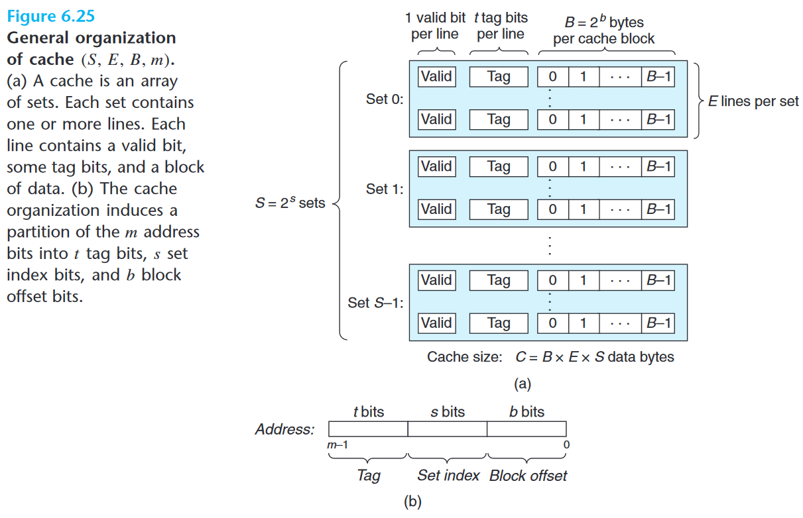
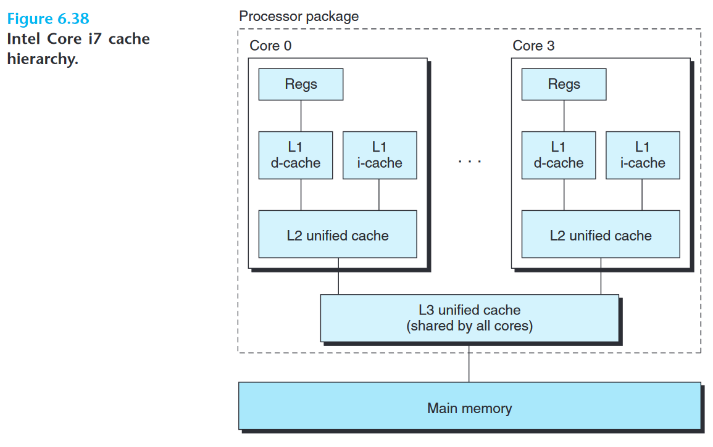

计算机存储器具有金字塔式结构, 即: 较高层的存储器容量小速度快, 低层的存储器容量大速度慢, 计算机通过缓存的方式提高储存系统的整体性能.

<!--more-->

- 缓存命中: 当程序需要第 $k+1$ 层的某个数据对象 $d$ 时, 它首先在当前存储在第 $k$ 层的某个块中查找 $d$. 如果 $d$ 刚好在第 $k$ 层中, 那么就称之为缓存命中 (cache hit)
- 缓存不命中: 如果程序在第 $k$ 层没有找到数据对象 $d$, 就称之为 缓存不命中 (cache miss). 缓存不命中有以下几种:
    - 强制性不命中 (compulsory miss)/冷不命中 (cold miss): 当系统刚启动时, 缓存一般是空的, 即任何数据对象的访问都会不命中. 这种情况称为冷不命中
    - 冲突不命中(conflict miss): 由于高层的缓存容量通常远小于低层的储存器容量, 为了完整映射较大容量的低层存储器, 通常数据对象在缓存中放置的位置需要符合某种放置策略. 因放置策略的原因导致缓存中存有另一个数据对象导致的不命中称为冲突不命中.
    - 容量不命中 (capacity miss): 由于程序在某个阶段访问的数据量过大超过缓存的容量导致的不命中称为容量不命中

## cache 组织结构

对于一个地址为 $m$ 位的计算机, 总共有 $M=2^m$ 个不同的地址, 其 cache 一般符合下图的组织结构:

其中包含由 $S=2^s$ 个**缓存组 (cache set)**, 每个缓存组包含 $E$ 个**缓存行 (cache line)**, 每个缓存行是由一个 $B=2^b$ 字节的**数据块 (block)**, 一个**有效位 (valid bit)** 和 $t=m-(b+s)$ 个 **标记位 (tag bit)** 组成的. 

其中有效位标记着这个行是否存有有意义的信息, 标记位时当前块地址的一个子集.

### cache 块的定位过程

对于 $m$ 位的地址, 其被分为三个部分解读: 位于高位部分的标记位, 位于中间部位的组索引 (set index) 和位于低位部位的块偏移 (block offset).

1. **组选择**: 首先对于位于中间部位的组索引 (set index), 通过它可以直接索引到 cache 块所在的 cache set
2. **行匹配**: 对于一个 cache set 中 $E$ 个 cache line 的每一个, 首先检查 valid bit 是否设置, 只有对于设置了 valid bit 的 cache line, 如果其 tag bit 与地址高位部分的 tag bit 相符, 则说明这个 cache line 中存有要定位的块.
3. **字选择**: 对于确定了的 cache line, 地址低位部分的 $b$ 位 block offset 可以直接定位到要查找的块

当发生 cache miss 时, 必须从更低一层的存储器中取出一行数据并放在缓存中:

- **行替换**: 如果对应的组中存在一个空行, 那么可以直接将新的行写入空行中. 如果不存在空行, 则必须替换一个有效的行. 常见的替换策略有随机替换, LRU, LFU 等.

### 写入内存时与 cache 有关的若干问题

1. 写命中 (write hit), 即要写入的数据对象存在于 cache 中时, 有两种数据更新策略:
    1. 直写 (write through): 即立即将修改后的 cache 块写到低一层的存储器中. 这种策略较为简单, 但是其会引起大量的总写流量
    2. 写回 (write back): 即尽可能迟地推迟更新, 只在替换策略即将驱逐这个更新过了的块时才将其写入到低一层的存储器中. 这种策略能够显著减少总线流量, 但它需要每个 cache line 维护额外的状态位 (dirty bit) 标记这个 cache 块是否被修改过
2. 写不命中 (write miss) 时, 对应地也有两种数据更新策略:
    1. 写分配 (write allocate): 加载相应的数据到 cache 中, 然后更新 cache 块
    2. 非写分配 (non-write-allocate): 绕开 cache, 直接写入到低一层的存储器

通常写回策略与写分配策略会搭配使用

## 真实的 cache 

通常每个 CPU 会有两个 L1 cache, 一个用于缓存数据, 一个用于缓存指令; 同一个 CPU 的两个 L1 cache 共享一个 L2 cache; 所有 CPU 的 L2 cache 共享一个 L3 cache.

