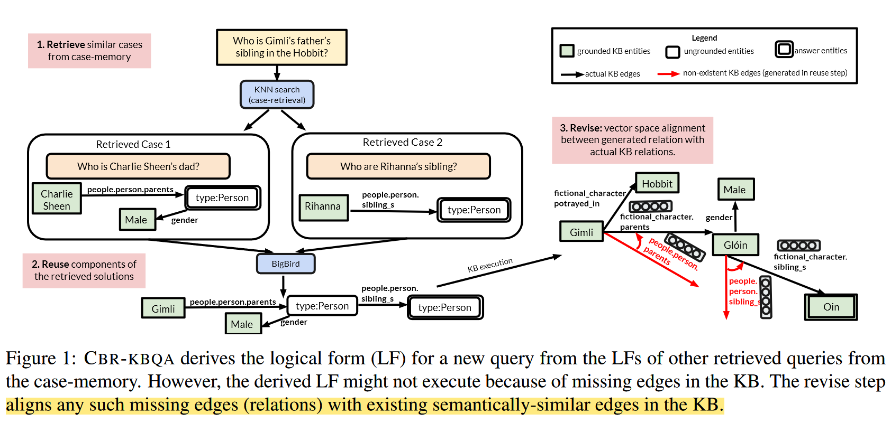

作者提出一种 **基于案例的推理(Case-Based Reasoning, CBR)** 解决 KBQA 问题的模型 CBR-KBQA。文章关注于语义解析方式，根据自然语言问题文本生成可执行的逻辑表达式 (SparQL)，并在知识图谱上执行该逻辑表达式获得答案。

CBR-KBQA 由三部分组成：

1. Retrieval Module
2. Reuse Module
3. Revise Module

首先通过 Retrieval Module 选择相似案例，该模块维护一个案例库，并根据问题中的**关系**的相似度选择相关案例。

随后在逻辑表达式的生成上，作者采用类似于 Prompt 的思想。首先采用一个 seq2seq 模型，将自然语言问题和**案例库**中与该问题相似的案例(自然语言问题+可执行逻辑表达式)拼接作为模型的输入，训练模型结合案例生成新问题的逻辑表达式，实现对案例的复用。

由于 Reuse Module 根据案例生成新的逻辑表达式，生成结果中的关系取自过往案例，同时知识图谱通常是不完整的，这就导致生成结果中的关系在知识图谱中不存在，导致逻辑表达式无法执行。因此作者提出一个 Revise Module，对生成结果中的关系进行修正。该模块通过将生成结果中的关系对齐到知识图谱中存在的最相似的关系实现对结果的修正。

由于 CBR-KBQA 根据案例库中的过往案例为新问题生成逻辑表达式，CBR-KBQA 可以通过向案例库添加新案例的方式泛化到训练过程中从未见过的关系上。

<!--more-->

## CBR-KBQA

案例：案例定义为一条自然语言问题文本与它相应的可执行逻辑表达式文本组成的文本对，作者主要关注于 SPARQL 这种逻辑表达式形式。

记自然语言问题文本为 $q$, KB 为 $\mathcal{K}$，则 KBQA 模型需要根据 $q$ 在 $\mathcal{K}$ 中查询出一个答案列表 $\mathcal{A}$. 作者假设有一个可以访问的案例库 $\mathcal{D} = \{(q_1, l_1), (q_2, l_2), ..., (q_N, l_N)\}$, 其中 $q_i, l_i$ 分别表示自然语言问题和它对应的逻辑表达式。CBR-KBQA 首先利用 retrieve module 从 $\mathcal{D}$ 中抽取 $K$ 个与问题 $q$ 相似的案例，记作 $\mathcal{D}_q$。 然后通过 reuse module 复用 $\mathcal{D}_q$ 中案例的组件生成中间逻辑表达式 $l_\text{inter}$。最后通过 revise module 将 $l_\text{inter}$ 中的关系与知识图谱中同一个实体的最相似的关系对齐，对齐后的逻辑表达式记作 $l$. 最后，CBR-KBQA 在 $\mathcal{K}$ 上执行 $l$, 得到答案列表 $\mathcal{A}$.

### Retrieve

该模块通过为自然语言问题生成表征的方式计算其与案例库中案例的相似度。在计算时，作者同时希望得到的相似案例具有在关系上的高度相似性，而非实体上的相似性。因此在训练时，作者以一定的比例 $p_\text{mask}$ 将问题中出现的实体替换为 $\text{[BLANK]}$. 两个问题之间的相似度由它们表征向量之间的余弦相似度度量。

在训练时，作者利用训练数据中可访问的逻辑表达式作为远程监督：一对问题之间的损失函数 （负对数似然） 由它们的逻辑表达式中出现的关系重复度加权：

$$L = -\sum_{i, j}\omega_{i, j}\log\frac{\exp(\sim(\mathbf{q}_i, \mathbf{q}_j))}{\Sigma_j\exp(\sim(\mathbf{q}_i, \mathbf{q}_j))}$$

其中，$\mathbf{q}_i\in \mathbb{R}^d$ 表示 $q_i$ 的表征向量，$\sim(\mathbf{q}_i, \mathbf{q}_j) = \mathbf{q}_i^T\mathbf{q}_j$, $\omega_{i, j}$ 由 $q_i, q_j$ 对应的逻辑形式中关系的 F1 计算。

作者预计算案例库中所有问题的表征，然后在推理时返回 $q$ 的 top-k 相似的案例。

### Reuse

该模块将 retriever 返回的 k 个案例作为输入送入一个预训练的 encoder-decoder transformer 模型，训练模型为新问题生成逻辑表达式。作者选用具有稀疏注意力的 BigBird 作为该模块的 transformer 模型，主要因为完全注意力的 transformer 模型的空间复杂度是输入序列长度的二次方，例如 BART，T5 等只支持最长 512 的输入序列。

作者按如下格式对问题 $q$ 和案例 $\mathcal{D}_q = \{(q_1', l_1'), (q_2', l_2'), ..., (q_k', l_k')\}$ 进行拼接：

$$\text{Input}_\text{Encoder}(q, \mathcal{D}_q) = q\text{[SEP]}q_1'\text{[SEP]}l_1'...q_k'\text{[SEP]}l_k'$$

作者采用 BART-BASE 初始化模型，并使用标准的 seq2seq 交叉熵损失训练。除此之外，作者在模型输出层的 softmax 层上添加了一个正则化项：有案例 $\mathcal{D}_q$ 时和仅有 $q$ 时得到概率分布之间的 KL 散度。记 seq2seq 模型为函数 $f$, 有 $\mathcal{D}_q$ 时输出的概率分布为 $\sigma = \text{softmax}(f(q, \mathcal{D}_q))$, 仅有 $q$ 时输出的概率分布为 $\sigma' = \text{softmax}(f(q))$, 则添加了 KLD 正则化项的损失函数为：

$$L = L_{CE}(f(q, \mathcal{D}_q), l_q) + \lambda_T\text{KLD}(\sigma, \sigma')$$

其中 $\lambda_T$ 是一个超参数，该正则化项的目的是使得模型在有无案例参与的情况下输出的结果相差不要太大。

### Revise

在 Reuse 模块中，模型复用案例中的关系生成新的逻辑表达式，但是案例中的关系很可能与新问题的实体不匹配，即知识图谱中的该实体不存在生成的关系。

因此作者提出一个对齐策略，对于问题中的实体，首先将其所有的关系取出，然后计算它们与生成关系之间的相似度，取最为相似的关系替换生成的关系。

关系之间的相似度通过关系表征之间的余弦相似度计算。作者尝试了两种关系表征计算方法：TransE 和 RoBERTa 的句子嵌入。由于关系通常是一个短语，RoBERTa 无法发挥其上下文表征的优势，TransE 的预训练表征在测试时更优。