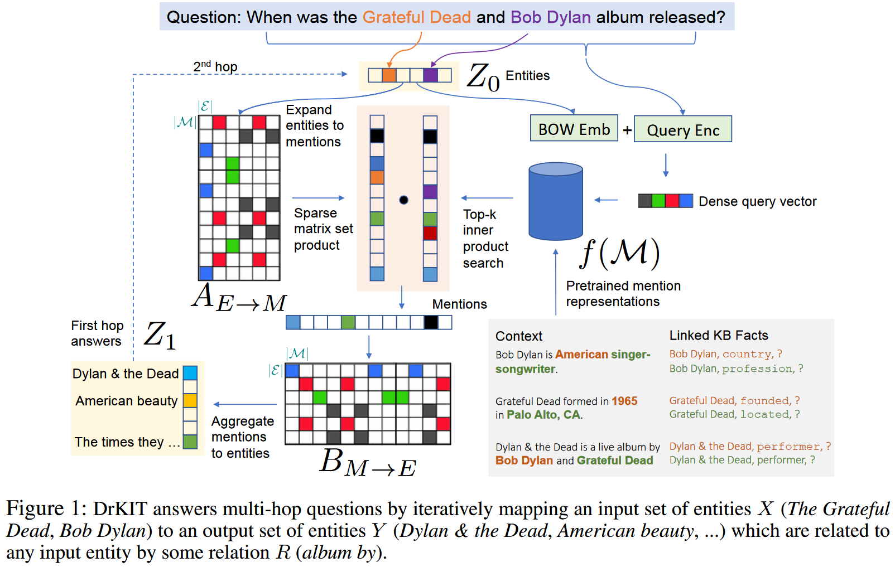

文章主要思想是利用包含事实的语料库作为虚拟知识库进行自然语言问答。2021 年 EMNLP 的文章 [TransferNet: An Effective and Transparent Framework for Multi-hop Question Answering over Relation Graph](https://aclanthology.org/2021.emnlp-main.341) 中提到的在 text form 关系的知识图谱上进行问答的思想与此类似。

<!--more-->

作者首先在语料库上预先提取出所有的实体提及，并为其生成上下文表征，并基于处理的结果制作出**实体->提及**以及**提及->实体**的映射矩阵。随后在执行问答任务时，首先从问题中提取出涉及到的实体，编码成向量。然后通过与**实体->提及**矩阵相乘初步选出提及，随后作者根据整个问题为提及评分，筛选掉与问题不相关的提及。筛选出的结果向量乘以**提及->实体**矩阵得到推理的结果实体向量。对于 k-hop 的问题，只需迭代式地执行 k 次上述过程即可得到结果。

# Methodology

作者提出的主要思想是将语料库看作知识库，并基于此回答自然语言问题 $q$. 首先从问题 $q$ 中提取出涉及到的实体集 $z$, 然后让 $z$ 中的实体跟随问题中蕴含的关系在知识库中找到答案。作者使用 IFIDF 模拟该过程，首先将实体集 $z$ 中的实体扩展到语料库中所有跟其共同出现过的实体提及 $m$, 此时并非 $m$ 中的所有共同出现过的提及都是与问题 $q$ 相关的。因此作者使用一个神经网络根据问题 $q$ 筛选这些提及，筛选后的提及被认为有两个性质：

1. 与 $z$ 中的实体共同出现过
2. 与 $z$ 共同出现的语句描述了和问题 $q$ 类似的关系

根据这些筛选过的提及，作者又将其转换到他们所指代的实体集 $z'$，$z'$ 即候选答案。如果问题是多跳的，则迭代式多次重复上述过程即可。

## Formal Description

记语料库为 $\mathcal{D} = \{d_1, d_2, ..., d_|\mathcal{D}|\}$, 其中 $d_k = (d_k^1, d_k^2, ..., d_k^{L_k})$ 是语料库中有 $L_k$ 个 token 的文档。首先作者使用 entity linker 将一个固定的实体集 $\mathcal{E}$ 在语料库中的提及识别出来，每个提及 $m$ 记作 $(e_m, k_m, i_m, j_m)$, 表示文档 $k_m$ 中的文本片段 $d_{k_m}^{i_m}, ..., d_{k_m}^{j_m}$ 表示实体 $e_m\in\mathcal{E}$. 记语料库中所有的实体提及组成的集合为 $\mathcal{M}$, 则有 $|\mathcal{M}| \gg |\mathcal{E}|$.

作者从概率语言模型出发，考虑一个仅以最终答案 $a\in\mathcal{E}$ 为参考的 T-hop 问题的弱监督场景，记中间 hop 的答案为 $z_0, z_1, ..., z_T\in\mathcal{E}$, 其中 $z_0$ 即问题中出现的实体，$z_T$ 为最终答案 $a$. 则每一个 hop 的计算模型为：

$$\Pr(z_t|q)=\sum_{z_{t-1}\in\mathcal{E}}\Pr(z_t|q, z_{t-1})\Pr(z_{t-1}|q)$$

由于推理过程基于语料库，作者结合语料库中的实体提及 $m$ 来计算 $\Pr(z_t|q, z_{t-1})$：

$$\Pr(z_t|q) = \sum_{m\in\mathcal{M}}\sum_{z_{t-1}\in\mathcal{E}}\Pr(z_t|m)\Pr(m|q,z_{t-1})\Pr(z_{t-1}|q)$$

上式中，$\Pr(m|q, z_{t-1})$ 表示 $m$ 与问题 $q$ 和 上一步的实体 $z_{t-1}$ 之间的相关性。作者利用实体以及实体提及的 TFIDF 向量计算该相关性，同时利用一个神经网络筛选符合问题描述的提及：

$$\Pr(m|q, z_{t-1})\propto \underbrace{\mathbb{1}\{G(z_{t-1})\cdot F(m) > \epsilon\}}_{\text{共现提及展开}}\times \underbrace{s_t(m, z_{t-1}, q)}_{\text{相关性筛选}}$$

上式中第一项被认为基于和上一步的中间实体 $z_{t-1}$ 共现与否筛选提及，第二项根据问题 $q$ 和上一步的实体 $z_{t-1}$ 计算第 t 个 hop 需要的关系类型，并据此进一步筛选提及。

除 $\Pr(m|q, z_{t-1})$ 外，$\Pr(z_t|m)$ 则根据 entity linker 的结果判断提及 $m$ 是否指代实体 $z_t$。指代则为 1， 否则为 0。

在实际实现时，作者使用矩阵计算实现上述模型。首先作者预计算语料库中所有实体和实体提及的 TFIDF 向量，并将其组织成一个稀疏矩阵 $A_{E\leftarrow M}[e, m] = \mathbb{1}(G(e)\cdot F(m) > \epsilon)$(即实体 $e$ 和提及 $m$ 的 TFIDF 向量的积大于阈值 $\epsilon$ 时，$A[e, m] = 1$). 此时共现提及展开可以通过实体向量 $z_{t-1}$ 和 $A_{E\leftarrow M}$ 的乘积得到。

对于相关性筛选，记 $\mathbb{T}_K(s_t(m, z_{t-1}, q))$ 为 top-K 相关的提及，且编码到向量空间 $\mathbb{R}^{|\mathcal{M}|}$. 

对于提及到实体的映射，作者使用另一个稀疏矩阵 $B_{M\leftarrow E}$ 进行，该矩阵表示与相同实体共现过的提及。

综合上述过程，$z_t$ 的计算可以表示为：

$$Z_t = \text{softmax}([Z_{t-1}^TA_{E\leftarrow M}\odot\mathbb{T}_K(s_t(m, z_{t-1}, q))]B_{M\leftarrow E})$$

其中 $Z_t$ 是编码后的实体概率向量。

上式的计算过程是可微的，同时由于 top-K 的限制，每个 hop 的计算最多产生 K 个实体，避免了多跳场景下的实体爆炸。

作者在下文介绍了上式计算中考虑矩阵稀疏性的效率，同时说明了 $s_t(m, z_{t-1}, q)$ 的计算方法：$s_t(m, z_{t-1}, q)\propto \exp\{f(m)\cdot g_t(q, z_{t-1})$
1. 使用 PLM 编码 $m$ 的上下文表征，并用 $m$ 中首尾词的表征的加权和表征 $m$：
   $f(m) = W^T[H_i^d; H_j^d]$
2. 使用 PLM 编码问题 $q$，取 $[CLS]$ 的表征作为 $q$ 的表征 $H^q$。
3. 在此基础上，对于每一个 hop $t = 1, ..., T$ 使用2层 transformer 层根据 $H^q$ 进行最大内积搜索(MIPS)，第一层 transformer layer 被认为产生起始词的 MIPS 查询向量 $H_{st}^q$, 第二层被认为产生结束词的 MIPS 查询向量 $H_{en}^q$, 定义 $\tilde{g}_t(q) = V^T[H_{st}^q; H_{en}^q]$
4. 记所有实体的表征矩阵为 $E\in\mathbb{R}^{|\mathcal{E}\times p|}$, $Z_{t-1}$ 所标示的实体的表征平均值为 $Z_{t-1}^TE$, 则 $g_t(q, z_{t-1}) = \tilde{g}_t(q) + Z_{t-1}^TE$.(实体表征使用实体文本所有词的表征平均计算)

在上述计算过程中，作者发现直接使用 PLM 为实体生成表征效果不理想，仍需要使用知识图谱远程监督训练 PLM 改善实体表征。