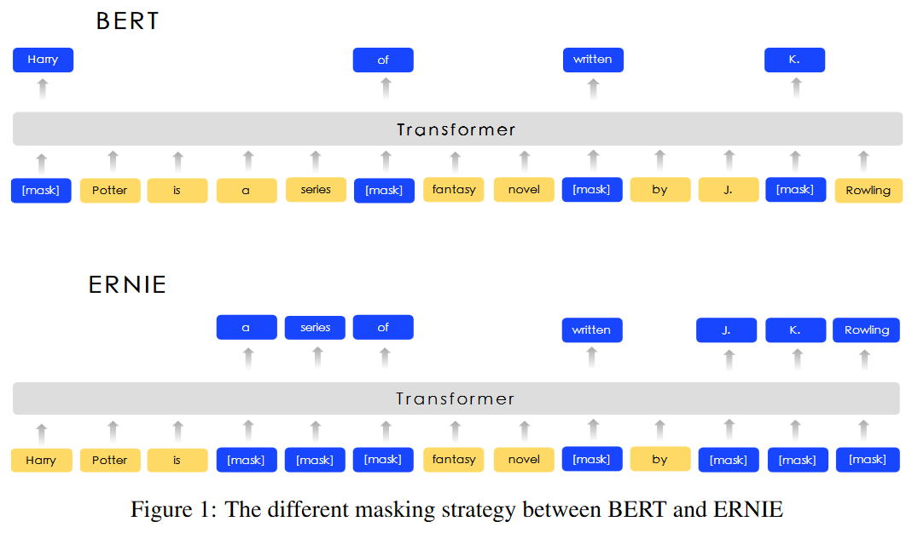
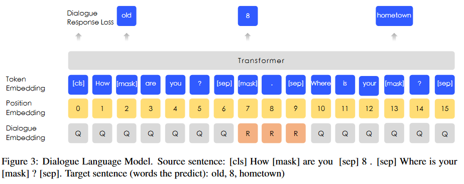
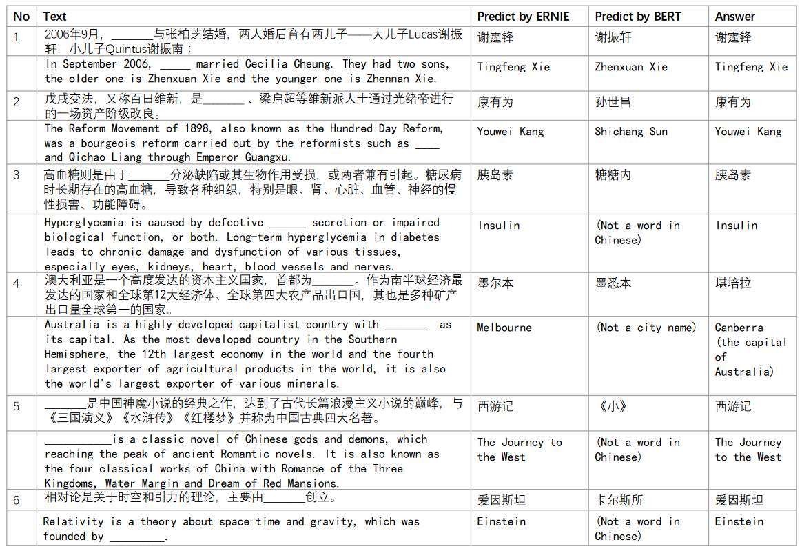

百度 ERNIE, 与清华 ERNIE [[ERNIE-Enhanced-Language-Representation-with-Informative-Entities]] 同名

<!--more-->

# Motivation

现有的表征学习方法在学习 token embedding 时没有考虑语句中的先验知识，作者认为如果模型能够学习到先验知识，则可以获得更可靠的语言表征。

# Methodology

ERNIE 使用 knowledge masking 策略隐式地学习先验知识，除了标准的随机 masking 方法之外，ERNIE 引入了两种特殊的 maksing 策略：phrase-level 和 entity-level，即分别将一个短语或一个实体作为一个基本单元进行 masking。

## BERT as Backbone

语言表征的基础编码器采用和 BERT 等模型相同的多层 Transformer 结构。针对中文语料，作者将每个字用空格分开，并采用 WordPiece 进行 tokenize。每个 token 的输入 embedding 由 token embedding, segment embedding 和 position embedding 相加构成(与 BERT 相同)，每个输入序列的第一个 token 是特殊的分类 token ($[CLS]$)(与 BERT 相同)

## multi-stage knowledge masking strategy

**Base-Level Masking** 第一阶段将输入语句视为基本的语言单元的序列(对于英文，基本单元是词；对于中文，基本单元是字)。这一阶段直接使用 BERT 的 Masking 方法。作者认为此阶段难以对高阶语义知识建模。

**Phrase-Level Masking** 第二阶段将语句中的**短语**视为 Mask 的基本单元。随机选择句子中的一部分短语进行 Masking ，然后预测被 Masking 的短语包含的所有基本语言单元。

**Entity-Level Masking** 第三个阶段从语句中分析出命名实体的存在(使用额外工具)，然后对实体进行 Masking 并预测实体所包含的所有语言单元。

# 实验

对于对话语言模型任务(DLM)，ERINE 使用 dialogue embedding 来标示对话中的角色。另外还构建了假样本用于训练模型分辨一组多轮对话数据是真的对话还是假的对话。

