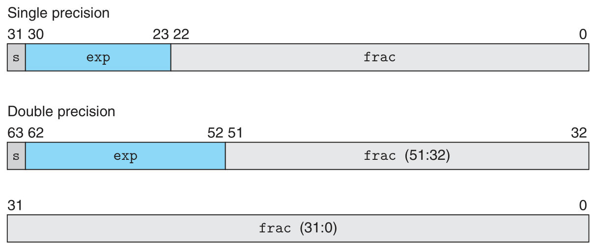
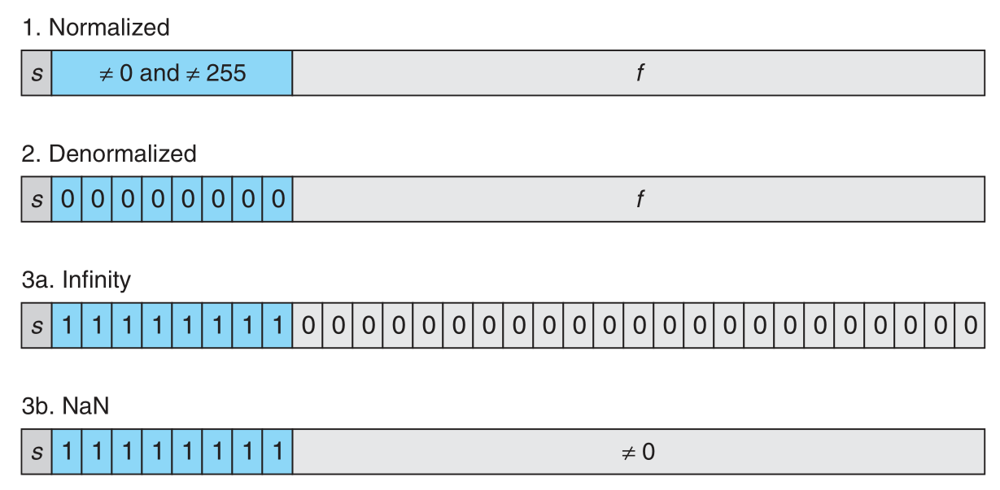

# 二进制小数
考虑十进制下的小数表示：$[d_m d_{m−1}…d_1 d_0\cdot d_{−1} d_{−2}…d_{−n}]$，其中每个十进制数 $d_i$ 取值范围是 $0~9$。这个表达式所描述的数值 $d$ 的定义为：$d= \Sigma^m_{i = -n}10^i\times d_i$ 。数字权的定义与小数点相关，在小数点的左侧，数字的权值是10的正幂，得到整数值。而小数点的右侧数字权值是10的负幂，得到小数值。如 $12.34_{10}$ 表示数字 $1 × 10^1 + 2 × 10^0 + 3 × 10^{−1} + 4 × 10^{−2} = 12\frac{34}{100}$ 。
类似地，考虑一个形如 $[b_m b_{m−1}…b_1 b_0\cdot b_{−1} b_{−2}…b_{−n}]$ 的表达式，其中的每个二进制数字 $b_i$ 的取值范围是 $0$ 和 $1$，这种表示方法表示的数定义为：$b=\Sigma_{i=−n}^m 2^i × b_i$ 。同样的，小数点的左侧数字权值为 $2$ 的正幂，右侧数字权值为 $2$ 的负幂。如 $101.11_2$  表示数字 $1 × 2^2 + 0 × 2^1 + 1 × 2^0 + 1 × 2^{−1} + 1 × 2^{−2} = 5\frac{3}{4}$ 。这种表示法称为浮点数的定点表示法。
如果仅考虑有限长度的编码，那么上述十进制小数无法准确表示如 $1/3,5/7$ 这样的数。类似地，小数的二进制表示法也智能表示具有 $x×2^y$ 形式的数，其他的值只能近似表示。

<!--more-->

# IEEE浮点表示
定点表示法无法有效表示非常大的数字。例如表达式 $5×2^100$ 是用 $101$ 后面跟随 $100$ 个零的位模式来表示。
IEEE浮点标准用 $V=(−1)^s×M×2^E$ 的形式来表示一个数：
- **符号(sign)s**决定这个数是正数 $(s=0)$ 还是负数 $(s=1)$，数值为$0$时符号位的解释作为特殊情况处理
- **尾数(significand)M**是一个二进制小数，它的范围是 $1\thicksim 2−ϵ$，或是 $01\thicksim ϵ$
- **阶码(exponent)E**的作用是对浮点数加权，这个权重是 $2$ 的 $E$ (可能是负数)次幂
将浮点数的位表示划分为三个字段，分别对这些值进行编码：
- 一个单独的符号位 `s` 直接编码符号 `s`
- k位的阶码字段 $exp=e_{k−1}…e_1 e_0$ 编码阶码 `E`
- n位小数字段 $frac=f_{n−1}…f_1 f_0$ 编码尾数 `M`，该字段的解释依赖于阶码字段的值是否为`0`
下图所示是这三个字段在字中的两种最常见格式，对于单精度浮点数，`s`，`exp` 和 `frac`字段分别为 `1`，`8`，`23` 位；对于双精度浮点数，`s`，`exp` 和 `frac` 字段分别为 `1`，`11`，`52` 位。

对于一个给定的浮点数位表示，对其的解释根据阶码字段的值可以分成三种情况(最后一种情况有两个变种)：

1. 情况1：规格化的值
	这是最普遍的情况。当 **exp的位模式既不全为零(数值0)，也不全为1** (单精度情况下数值为255，双精度数值为2047)时，属于这种情况。
	此时阶码字段被解释为以 **偏置(biased)** 形式的有符号整数，即：$E = e - Bias$，其中 **$e$ 是阶码字段编码的无符号数，$Bias$ 是一个等于 $2^{k−1}−1$(单精度是 $127$，双精度是 $1023$ )的偏置值** 。此时产生的指数范围，对于单精度是 $−126\thicksim +127$，对于双精度是 $−1022\thicksim +1023$。
	**小数字段 $frac$ 被解释为小数值 $f$，其中 $0≤f<1$，其二进制表示为：$ 0.f_{n−1}…f_1 f_0$ **，即所有位的权都是2的负幂。尾数 $M$ 定义为 $M=1+f$ 。这种方式叫做**隐含的以1开头的(`implied leading 1`)表示**，可以将位数的位表示看作 $1.f_{n−1}…f_1 f_0$。由于总是可以通过调整阶码 $E$，使得尾数 $M$ 保持在范围 $1≤M<2$ 中，那么这种方法可以无代价的获得一个额外的精度位。
2. 情况2：非规格化的值
	当**阶码域为全0**时，所表示的数是非规格化的值。**此时阶码值是$E = 1-Bias$，尾数的值是$M = f$**，不包含隐含开头的$1$
	非规格化的表示有两个用途：
   1. 它提供了一种表示$0$的方法，在规格化的情况下，$M$总是大于等于$1$的，因此无法表示$0$。实际上，$+0.0$的位模式为全$0$，符号位，阶码和小数域全为$0$；而当符号位为$1$，阶码和小数域为$0$时，该值被解释为$-0.0$
   2. 非规格化数的第二个功能是表示非常接近$0.0$的数。它提供了一种称为逐渐下溢`(gradual underflow)`的特性，让数值的分布均匀地接近$0.0$
   
*Note: 使阶码值为1-Bias而不是简单的-Bias是因为这样可以补偿尾数值由M=f+1变为M=f后造成的数值突变，使数值从非规格数到规格数能够更加平滑的变化*

3. 情况3：特殊值
	最后一类数值是当**阶码全为1**时出现的。
	当小数域全为 $0$ 时，得到的值表示无穷，当 $s=0$ 时表示正无穷，或者当 $s=1$ 时是负无穷。当把两个非常大的数相乘，或者除以 $0$ 时，无穷能够表示溢出的结果。
    **当小数域非0时，结果被称为"NaN"**，即"不是一个数"。如 $\sqrt{-1}$ 或 $]\infin−\infin$的结果是`NaN`。

*Note: 假如将从0到最大值排列的一组无符号数的位模式按照相同字长的浮点数解释，则浮点数结果也是递增的。IEEE格式设计点之一就是为了浮点数能够直接使用整数的排序函数。*

对于有k位阶码和n位小数域的浮点数表示，其具有以下属性：

| 描述             | $exp$   | $frac$ | 值（单精度）     | 十进制（单精度） | 值（双精度）      | 十进制（双精度） |
| ---------------- | ----- | ---- | ---------------- | ---------------- | ----------------- | ---------------- |
| $0$                | $00…00$ | $0…00$ | $0$                | $0.0$              | $0$                 | $0.0$              |
| 最小非规格化正数 | $00…00$ | $0…01$ | $2^{−23}×2^{−126}$ | $1.4×10^{−45}$     | $2^{−52}×2^{−1022}$ | $4.9×10^{−324}$    |
| 最大非规格化数   | $00…00$ | $1…11$ | $(1−ϵ)×2^{−126}$   | $1.2×10^{−38}$     | $(1−ϵ)×2^{−1022}$   | $2.2×10^{−308}$    |
| 最小规格化数     | $00…01$ | $0…00$ | $1×2^{−126}$       | $1.2×10^{−38}$     | $1×2^{−1022}$       | $2.2×10^{−308}$    |
| $1$                | $01…11$ | $0…00$ | $1×2^0$            | $1.0$              | $1×2^0$             | $1.0$              |
| 最大规格化数     | $11…10$ | $1…11$ | $(2−ϵ)×2^{127}$      | $3.4×10^{38}$        | $(2−ϵ)×2^{1023}$      | $1.8×10^{308}$       |

- **值$+0.0$** 总有一个全0的表示
- **最小的正非规格化的值**的位表示，是由最低有效位为1而其他所有位为$0$构成的。它具有小数(此时即尾数)值$M=f=2^{−n}$ 和阶码值$E=−2^{k−1}+2$。因此该表示的数值为$V=2^{−n−2^{k−1}+2}$
- **最大的非规格化值**的位模式是由全为$0$的阶码字段和全为$1$的小数字段组成的。它具有小数（此时即尾数）值$M=f=1−2^{−n}$ (写成$1−ϵ$)和阶码值$E=−2^{k−1}+2$，因此数值$V=(1−2^{−n})×2^{−2^{k−1}+2}$
- **最小的正规格化值**位模式的阶码字段最低有效位为$1$，其他位全为$0$。它的尾数值$M=1$，而阶码值$E=−2^{k−1}+2$。因此数值$V=2^{−2^{k−1}+2}$ 。值得注意的是，这之比最大的非规格化值大一点。
- **值$1.0$** 的位表示阶码字段除了最高有效位为$0$之外，所有其他位都为$1$。它的尾数$M=1$，它的阶码值$E=0$
- **最大的规格化值**的位表示的符号位为$0$，阶码的最低有效位为$0$，其他位均为$1$。它的小数值$f=1−2^{−n}$，尾数值$M=2−2^{−n}$ (写作$2−ϵ$)。阶码值$E=2^{k−1}−1$，得到数值$V=(2−2^{−n} )×2^{2^{k−1}−1}$

# 舍入

对于无法准确表示的值，浮点数采用 **向偶数舍入`(round to even)`** 的规则来获得一个近似值。
向偶数舍入也称向 **最近值舍入`(round to nearest)`** ，它试图找到一个最接近的匹配值。例如，它将 $1.4$ 舍入成$1$，而将$1.6$舍入成$2$，因为它们是最接近的值。对于处于两个可能值正中间的值，向偶数舍入采取的策略是使得结果的最低有效数字是偶数。因此这种方法将$1.5$和$2.5$都舍入成$2$。
浮点数采用这种舍入规则的原因是，对于一组数据而言，如果都采用向上舍入或向下舍入，会不可避免的带来统计偏差，而向偶数舍入可以在大多数情况下避免这种偏差。
对于二进制小数来说，将最低有效位的值$0$视为偶数，值$1$视为奇数。对于处于两种可能值正中间的值来说，舍入后的结果要保证最低有效位为$0$。如$10.11100_2 (2 \frac{7}{8})$被舍入为$11.00_2 (3)$ ，$10.10100_2 (2 \frac{5}{8})$被舍入为$10.10_2 (2 \frac{1}{2})$。

# 浮点运算
IEEE规定的浮点数运算中，把浮点数$x$和$y$看作是实数，浮点数$x,y$运算的结果实际上是实数$x,y$精确运算后舍入的结果。
考虑到舍入的影响，可以将浮点数加法$x+^f y$定义为$Round(x+y)$，即对实数结果舍入。对于所有的浮点数，该运算是可交换的，即$x+^f y=y+^f x$，另一方面，该运算是不可结合的，即$x+^f (y+^f z)\neq (x+^f y) +^f z$。例如在单精度浮点数中，$(3.14+1e10)−1e10=0.0$，这是由于舍入，在$1e10$的大小尺度下，$3.14$被舍去了，同时$3.14+(1e10−1e10)=3.14$
对于乘法浮点数也有类似的属性：浮点数乘法是可交换的，即$x×^f y=y×^f x$。但同时是不可结合的，例如在单精度条件下：$(1e20∗1e20)∗1e−20=+∞$，而$1e20∗(1e20∗1e−20)=1e20$。另外，浮点数乘法不具分配性，例如单精度条件下：$1e20∗(1e20−1e20)=0.0$，而$1e20∗1e20−1e20∗1e20=NaN$。
浮点数运算还具有如下的性质，对于任意$a, b ,c\neq NaN$:

$$\begin{cases}
    a \geqslant b, c \geqslant 0 \Rightarrow a \times^f c \geqslant b \times^f c \\
    a \geqslant b, c \leqslant 0 \Rightarrow a \times^f c \leqslant b \times^f c \\
    a \times^f a \geqslant 0
\end{cases}$$

*Note: C语言标准中并未要求机器使用IEEE浮点数*
