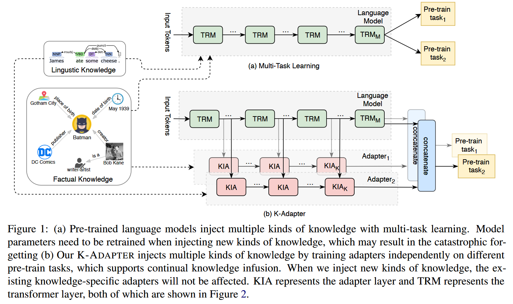
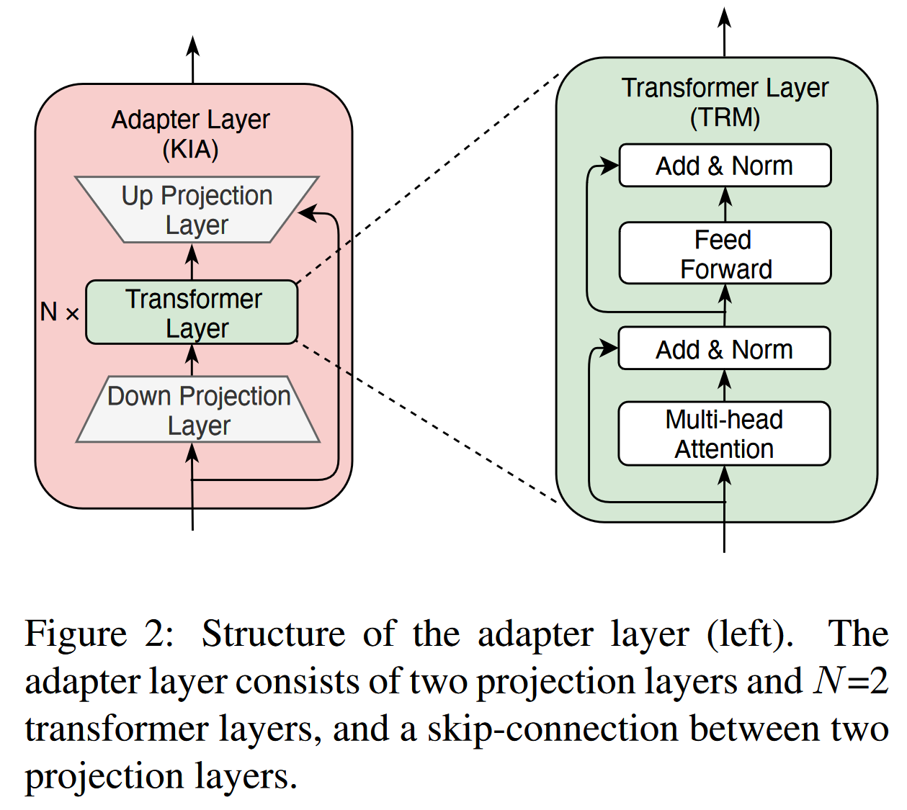
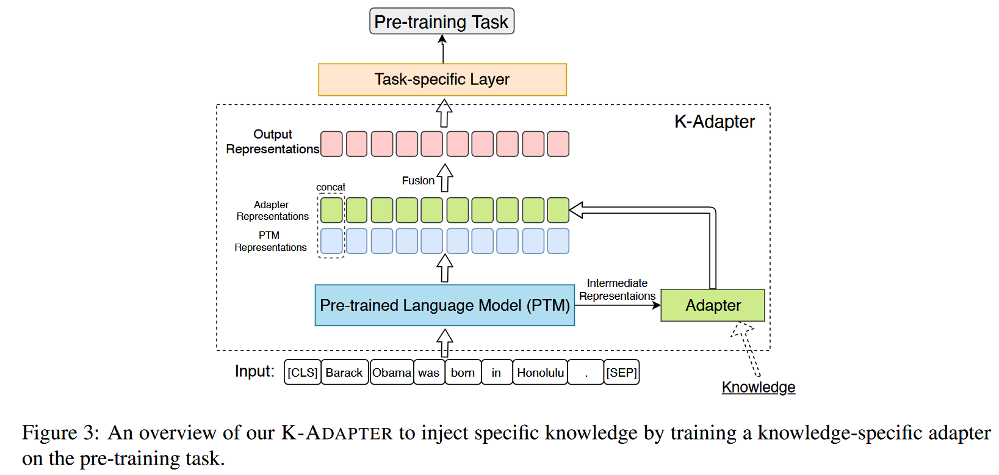

文章主要研究向预训练语言模型中注入知识的方法，现存的工作主要是通过更新预训练模型参数的方式向模型注入知识（即 fine-tune 的方式）。但是这种参数更新过程会将整个模型的参数向新注入的知识上偏移，导致之前注入的知识被削弱或冲刷。作者提出的 K-Adapter 结构，通过将不同的知识分别注入到不同的 Adapter 中实现知识的持续注入，同时 Adapter 的参数量远小于预训练模型，在知识注入的过程中更加经济。

<!--more-->

## K-Adapter

K-Adapter 由一个 Transformer Encoder 模型和一个 Adapter 模型组成，Adapter 层的输入来自 Transformer Encoder 模型中间隐藏层的输出向量和上一层 Adapter 的输出向量的拼接。模型的最终输出由 Adapter 的输出向量和 Transformer Encoder 模型的输出向量拼接。本文中作者选用 RoBERTa 作为 Transformer Encoder。

### Adapter

与 Houlsby et al.[^Adapter] 在每一层 Transformer 层上添加 adapter 层的做法不同，作者提出的 K-Adapter 以外挂的形式工作。K-Adapter 模型中的 Adapter 模型有 K 个 Adapter 层，每个 Adapter 层中有 N 个 transformer 层和两个投影层，同时每层 Adapter 层中有一个残差连接。Adapter 层的结构如下图。

K-Adapter 中的 K 个 Adapter 层被插在 RoBERTa（代指 pre-trained model） 的 K 个不同的 Transformer 层上。每个 Adapter 层的输入由 transformer 层的输出向量和上一个 adapter 层的输出向量的拼接而成，整个 K-Adapter 模型的输出向量则由 RoBERTa 和 Adapter 的最终隐藏层向量拼接而成。

在预训练过程中，作者通过不同的预训练任务分别训练不同的 Adapter 模型，以实现不同知识的注入。在下游任务的微调时，使用的所有 Adapter 的输出向量拼接构成下游任务的输入。

### 预训练设置

实验中，作者使用的 transformer encoder 模型是 $\text{RoBERTa}_{LARGE}(L=24, H=1024, A=16, 335M \text{ params}$, 记使用的 Adapter 模型每层中的 transformer 层数为 $N$, transformer 层的隐藏层维度为 $H_A$, $A_A$ 个 self-attention heads, 下投影和上投影层的维度分别为 $H-d, H_u$. 实验中采用的具体参数为：$N=2, H_A=768, A_A=12, H_u=1024, H_d=768$，adapter 层插入在 RoBERTa 的第 $\{0, 11, 23\}$ 层。Adapter 模型的参数量总共为 42M。在预训练时，RoBERTa 的参数保持不变，仅更新 Adapter 的参数。作者在实验中设计了 Factual Adapter 和 Linguistic Adapter 分别注入事实知识和语法知识。

### Factual Adapter

作者使用从 T-REx[^T-REx] 数据集中提取的子集 T-REx-rc 作为数据集，共包含 430 种关系和 5.5M 个句子。作者采用 **relation classification** 任务训练该 Adapter，具体地说，Adapter 和 RoBERTa 的输出向量拼接后作为关系分类层的输入，并且在输入实体的表征上使用了池化层。

### Linguistic Adapter

语言知识包括语法，语义知识等，作者通过自然语言文本中词之间的依存关系提取语言知识。作者在 BooK Corpus[^BookCorpus] 数据集的一部分上使用现成的依存解析器构建了一个包含 1M 个样本的依存关系预测数据集。并在该数据集上进行**依存关系预测**任务，具体地说即预测输入句子中每个词的 head index。作者将 RoBERTa 和 Adapter 的输出向量拼接后经过一个线性分类层进行每个词的分类。

## 实验

作者在 entity typing，question answering 和 relation classification 等任务上对 K-Adapter 进行了评估。

[^Adapter]: **Parameter-Efficient Transfer Learning for NLP**. *Neil Houlsby, Andrei Giurgiu, Stanislaw Jastrzebski, Bruna Morrone, Quentin De Laroussilhe, Andrea Gesmundo, Mona Attariyan and Sylvain Gelly*. [ICML 2019]
[^T-REx]: **T-REx: A Large Scale Alignment of Natual Language with Knowledge Base Triples**. *Hady ElSahar, Pavlos Vougiouklis, Arslen Remaci, Christophe and Elena Simperl*. [LERC 2018]
[^BookCorpus]: **Aligning Books and Movies: Towards Story-Like Visual Explanations by Watching Movies and Reading Books**. *Yukun Zhu, Ryan Kiros, Rich Zemel, Ruslan Salakhutdinov, Raquel Urtasun, Antonio Torralba and Sanja Fidler*. [ICCV 2015]