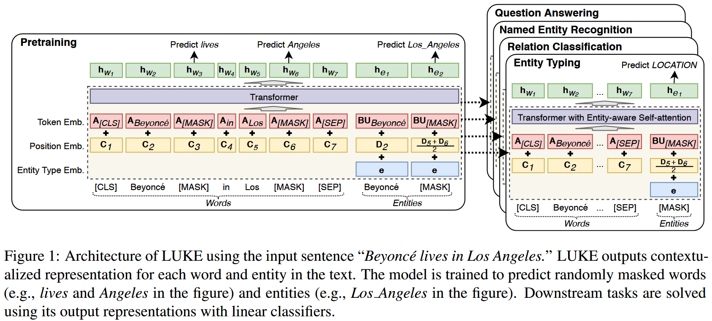

作者提出一种**实体表征**方法，通过在预训练 Transformer Encoder 模型时将实体看作独立的 token 来为实体生成表征。作者提出类似于 MLM 的预训练目标，首先将语料中的实体文本提取并放在语句末端，然后以一定的比例将实体替换为 $\text{[MASK]}$ ，并训练模型预测被遮罩的实体。为了提升效果，作者为放在语句末端的实体设计了特殊的实体 positional embedding，同时在 Encoder 模型的基础上添加 entity-aware self-attention mechanism 来增强模型对 token type(entity or word) 的感知。作者在多个数据集多个实体相关的任务上进行了实验。

<!--more-->

## Introduction

BERT, RoBERTa 等 Transformer Encoder 模型通过上下文词表征(Contextualized Word Representation, CWR)的方式提供了通用语言表征, 由于 CWR 是对 word 生成表征，无法对 span-level 的实体生成表征，通常需要在下游任务的小数据集上训练如何根据 word representation 生成 entity representation，CWR 在实体相关的任务上还需进一步探索。

本文提出的 LUKE 即利用 Transformer Encoder 模型为实体生成上下文表征，解决实体相关的问题。

## LUKE

给定一个包含 $m$ 个字 $w_1, w_2, ..., w_m$ 和 $n$ 个实体 $e_1, e_2, ..., e_n$ 的序列，LUKE 为每个字计算一个 $D$ 维的词表征 $\mathbf{h}_{w_1}, \mathbf{h}_{w_2}, ..., \mathbf{h}_{w_m}$, 其中 $\mathbf{h}_{w_i} \in \mathbb{R}^D$, 为每个实体计算 $D$ 维实体表征 $\mathbf{h}_{e_1}, \mathbf{h}_{e_2}, ..., \mathbf{h}_{e_n}$, 其中 $\mathbf{h}_{e_i} \in \mathbb{R}^D$

### Input Represention

如上图所示，输入文本的 embedding 由以下三个 embedding 计算：

1. Token Embedding：代表对应的词，词典中所有词的表征可记为 $\mathbf{A}\in\mathbb{R}^{V_w\times D}$, 其中 $V_w$ 是词典大小。由于实体数目太多，出于计算效率考虑，实体的 token embedding 被分解为两个小的矩阵 $\mathbf{B}\in\mathbb{R}^{V_e\times H}$ 和 $\mathbf{U}\in\mathbb{R}^{H\times D}$, 其中 $V_e$ 是词典中的实体数量。
2. Position Embedding: 代表 token 在输入序列中的位置。在序列中出现在第 $i$ 位置的普通词和实体词的 position embedding 分别记作 $\mathbf{C}_i\in\mathbb{R}^D$ 和 $\mathbf{D}_i\in\mathbb{R}^D$. 对于实体，如果其包含多个词，则该实体的 position embedding 由所有词的 embedding 平均值计算：$e_i = \{w_j, ..., w_k\}, \mathbf{D}_i = \frac{\Sigma_{l = j}^k \mathbf{D}_l}{k - j + 1}$.
3. Entity type embedding: 代表输入序列中的 token 是否是一个实体，entity type embedding 是一个向量 $\mathbf{e}\in\mathbb{R}^D$

### Entity-aware Self-attention

在 Transformer Encoder 的自注意力机制中，第 $i$ 个 token 的输入嵌入记作 $\mathbf{x}_i$, 输出表征记作 $\mathbf{y}_i$, 则其在自注意层的计算过程为：

$$\begin{aligned}
    \mathbf{y}_i &= \sum_{j = 1}^k\alpha_{ij}\mathbf{V}\mathbf{x}_j\\
    \alpha_{ij} &= \text{softmax}(e_{ij})\\
    e_{ij} &= \frac{\mathbf{Kx}_j^T\mathbf{Qx}_i}{\sqrt{L}}
\end{aligned}$$

其中 $\mathbf{Q}\in\mathbb{R}^{L\times D}, \mathbf{K}\in\mathbb{R}^{L\times D}, \mathbf{V}\in\mathbb{R}^{L\times D}$ 是自注意力机制中的 query, key 和 value 矩阵。

LUKE 的输入 token 分为普通词和实体两类，在自注意力机制计算注意力分数 $e_{ij}$ 时，作者认为结合第 $i, j$ 个 token 的类型是有益的。作者由此提出 entity-aware query mechanism，对于 $i, j$ 个 token 的类型的不同组合，使用不同的 query matrix 进行计算：

$$e_{ij} = \begin{cases}
    \mathbf{Kx}_j^T\mathbf{Qx}_i, &\text{if both }\mathbf{x}_i, \mathbf{x}_j \text{ are words}\\
    \mathbf{Kx}_j^T\mathbf{Q}_{w2e}\mathbf{x}_i, &\text{if }\mathbf{x}_i \text{ is word and }\mathbf{x}_j \text{ is entity}\\
    \mathbf{Kx}_j^T\mathbf{Q}_{e2w}\mathbf{x}_i, &\text{if }\mathbf{x}_i \text{ is entity and }\mathbf{x}_j \text{ is word}\\
    \mathbf{Kx}_j^T\mathbf{Q}_{e2e}\mathbf{x}_i, &\text{if both }\mathbf{x}_i, \mathbf{x}_j \text{ are entities}
\end{cases}$$

即在计算第 $i$ 个 token 对第 $j$ 个 token 的注意力分数时，考虑它们分别的类型并作不同的计算。

### Pretraining

作者在预训练中使用 Wikipedia 数据作为语料，将 Wikipedia 文档中所有带有超链接的文本片段看作实体，由此对数据进行实体标注。训练时，作者首先将文本中的实体标注复制到文本末尾，然后以一定概率遮罩这些实体。在训练模型预测被遮住的实体时，作者是通过将实体表征映射到**实体词典**大小的维度，然后在整个实体词典上进行 softmax 获得概率分布：

$$\begin{aligned}
    \hat{\mathbf{y}} &= \text{softmax}(\mathbf{BTm} + \mathbf{b}_o)\\
    \mathbf{m} &= \text{layer\_norm}(\text{gelu}(\mathbf{W}_h\mathbf{h}_e + \mathbf{b}_h))
\end{aligned}$$

其中 $\mathbf{h}_e$ 是被遮住的实体的表征，$\mathbf{T}\in\mathbb{R}^{H\times D}, \mathbf{W}_h\in\mathbb{R}^{D\times D}$ 是投影矩阵，$\mathbf{b}_o\in\mathbb{R}^{V_e}, \mathbf{b}_h\in\mathbb{R}^D$ 是偏置向量。

预训练的损失函数是 MLM 任务的损失和预测遮罩实体的交叉熵损失之和（两者形式一致，计算过程也一致）。

## Experiment

作者利用新提出的表征在 entity typing(Open Entity Dataset[^OpenEntity]), relation classification(TACRED dataset[^TACRED]), NER(CoNLL-2003 dataset[^CoNLL-2003]), cloze-style QA(ReCoRD dataset[^ReCoRD]) 和 extractive QA(SQuAD 1.1 dataset[^SQuAD1.1]) 任务上做了实验，使用的模型结构类似：在表征后添加简单的线性分类层。实验的模型结构和细节值得参考。

[^OpenEntity]: **Ultra-Fine Entity Typing**. *Eunsol Choi, Omer Levy, Yejin Choi and Luke Zettlemoyer*. [ACL 2018]
[^TACRED]: **Positionaware Attention and Supervised Data Improve Slot Filling**. *Yuhao Zhang, Victor Zhong, Danqi Chen, Gabor Angeli, and Christopher D Manning*. [EMNLP 2017]
[^CoNLL-2003]: **Introduction to the CoNLL-2003 Shared Task: Language-Independent Named Entity Recognition**. *Erik F. Tjong Kim Sang and Fien De Meulder*. [NAACL 2003]
[^ReCoRD]: **ReCoRD: Bridging the Gap between Human and Machine Commonsense Reading Comprehension**. *Sheng Zhang, Xiaodong Liu, Jingjing Liu, Jianfeng Gao, Kevin Duh, and Benjamin Van Durme*. [arXiv: 1810.12885v1]
[^SQuAD1.1]: **SQuAD: 100,000+ Questions for Machine Comprehension of Text**. *Pranav Rajpurkar, Jian Zhang, Konstantin Lopyrev, and Percy Liang*. [EMNLP 2016]