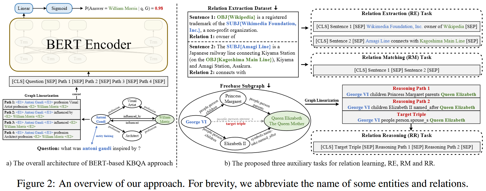

KBQA(Question Answering over Knowlegde Bases) 旨在根据结构化的知识图谱回答自然语言问题，该任务在现代的问答系统和信息检索系统中广泛应用。
由于自然语言问题与知识图谱中的推理链的不相容性，最近的 KBQA 方法更关注于图谱中的逻辑关系，忽略了图谱的节点和边上的文本语义信息。同时预训练模型虽然从大规模的语料中学习到了大量开放世界知识，但是这种知识是非结构化的，与结构化的知识图谱之间存在隔阂。为连接预训练语言模型与知识图谱，作者提出了三种**关系学习任务**来进行关系增强训练。经过这种训练，模型能够将自然语言表述与知识图谱中的关系对齐，同时能够跨过缺失的直接关系进行推理。

<!--more-->

## Introduction

传统的信息检索系统通常是一个 pipeline 的形式：

- named entity recongnization
- entity linking
- subgraph retrieval
- entity scoring

KBQA 任务对这种 pipeline 仍然具有挑战性，特别是面对**多跳**场景时：

- 由于人类语言的复杂性，通常难以将自然语言问题与知识图谱中的关系对齐，模型通常是根据一些 shortcut 特征而不是正确的推理进行预测
- 实践中，知识图谱往往是不完整的，同时缺乏显式推理训练的模型难以在缺失的关系上推理

- GraftNet, PullNet 等通过引入大量额外的文本并使用特殊的架构来融合文档中的信息解决上述问题
- EmbedKGQA 通过引入**预训练 KB embedding** 并训练问题表征以适应关系表征来解决知识图谱不完整问题

本文中，为了获得一个更好的从自然语言问题到知识图谱中推理路径的映射，作者重组了基于检索的 KBQA 任务，将其变成**问题文本匹配**的形式。
作者提出了三个关系学习的辅助任务：

- Relation Extraction, RE: 从句子中推断关系
- Relation Matching, RM: 判断两个句子是否表达同一个关系
- Relation Reasoning, RR: 训练模型在缺失的关系上推理

## Approach

### 基于检索的 KBQA

给定一个输入问题 $q$, 首先标记 $q$ 中的命名实体，然后将其与知识图谱中的节点连接，随后使用一些启发式算法(如 pagerank)从知识图谱中检索出一个特定于 $q$ 的子图 $\mathcal{G} = \{<e, r, e'> | e, e' \in \mathcal{E}, r\in\mathcal{R}\}$, 其中 $\mathcal{E}$ 是问题 $q$ 的候选答案实体的集合，$\mathcal{R}$ 是关系的集合。该任务即为每个候选答案实体 $e_i\in \mathcal{E}$ 计算一个分数 $s_i$ 标示该实体是否是答案实体。

### BERT for KBQA

对于每一个问题 $q$, 作者首先利用 entity linking 结果找出 $q$ 在知识图谱中的 **主题实体** $e_\text{topic}$，随后，作者通过以下步骤将问题转化为文本匹配问题：

- 找出 $\mathcal{G}$ 中所有连接了 $e_\text{topic}$ 和候选答案实体 $e_i$ 的路径，查找时设置一个路径数的最大值以保证可计算性
- 通过将路径中的节点替换成实体名称，边替换为关系名称，将路径 **重组为文本形式**
- 通过将问题文本和重组后的路径文本 $p_1, p_2, ..., p_n$ 拼接，获取BERT的输入样本：$x_i = \text{[CLS]}q\text{[SEP]}p_1\text{[SEP]}...p_n\text{[SEP]}.$
- 将 $x_i$ 送入 BERT，取最终输出中 $\text{[CLS]}$ 的表征做二分类，代表了该候选实体 $e_i$ 是否是问题 $q$ 的答案

该过程中，相当于将知识图谱中所有 $e_\text{topic}$ 和 $e_i$ 之间的路径作为问题 $q$ 的支撑事实，并使用 BERT 推断 "$e_i$ 是问题 $q$ 的答案" 这一假设在支撑事实条件下是否成立。

二分类损失函数计算过程：

$$\begin{aligned}
    s_i &= \sigma(\mathbf{\omega}^T \text{BERT}_\text{CLS}(x_i))\\
    \mathcal{L}_i &= -(y\cdot\log s_i + (1-y)\cdot\log(1-s_i))
\end{aligned}$$

其中 $\sigma$ 代表 sigmoid 函数，$y$ 是 ground truth，代表 $e_i$ 实际上是否是问题 $q$ 的答案。

### 副任务

- **Relation Extraction (RE)**
  - 1-hop: 直接使用 relation extraction 数据集，训练模型从给定的语句中抽取头尾实体之间的关系。在实践方面，作者构建BERT的输入格式：$\text{[CLS]}s\text{[SEP]}h, r, t\text{[SEP]}$, 其中 $s, h, r, t$ 分别表示句子，头实体，关系和尾实体
  - 2-hop: 选取2个1-hop的样本组合成2-hop样本：$\text{[CLS]}s_1, s_2\text{[SEP]}h_1, r_1, t_1(h_2), r_2, t_2\text{[SEP]}$, 其中第一个1-hop样本的尾实体即是第二个1-hop样本的头实体
- **Relation Matching (RM)**
  作者假设：表达相同关系的两个句子应该有相似的表征。因此利用BERT预测两个句子是否表达相同的关系，输入样本格式：$\text{[CLS]}s_1\text{[SEP]}s_2\text{[SEP]}$
- **Relation Reasoning (RR)**
  BERTRL 提出一种自训练模式，用于 KB 补全任务。他们随机从 KB 中选取一个三元组 $(h, r, t)$ 并假设其是缺失的，然后选择从 $h$ 到 $t$ 的其他多跳连接，然后使用 BERT 根据这些多跳连接预测 $(h, r, t)$ 是否存在。
  输入样本格式：$\text{[CLS]}h, r, t\text{[SEP]}p_1\text{[SEP]}...p_n\text{[SEP]}$

注意到以上三种辅助任务都被组织成了二分类任务，且只在输入数据的组织形式上做了改变，因此可以应用在 KBQA 任务之前的预训练过程或者在微调过程中与 KBQA 任务联合训练。

## Experiments

### Dataset

- **KBQA Dataset**: 利用 WebQSP 数据集，使用[Sun et al.](https://github.com/haitian-sun/GraftNet/tree/master/preprocessing)的脚本进行处理，该脚本主要对 WebQSP 做 entity linking 和 subgraph retrieval，同时 entity linking 的结果直接使用 [Yih et al.](https://github.com/scottyih/STAGG) 的。
  对于每个问题，都有一些用于子图检索的种子实体。子图检索过程使用 Personalized PageRank 算法。
- **Relation Extraction Dataset**: 对于关系学习任务，作者使用 WebRED 和 FewRel 作为额外资源
  
### Baselines

- KV-Mem
- GraftNet
- PullNet
- EmbedKGQA
- NSM
- BERT

### Metrics

- **Hits@1**: 如果模型给出的得分最高的结果就是答案，则 Hits@1 是1，否则是0
- **F1**: 给定一个阈值，并认为模型输出结果中得分高于阈值的都是答案，然后计算模型输出的答案和GT答案之间的 F1

F1 指标对阈值的选择很敏感，实验中选取 Hits@1 作为主指标

