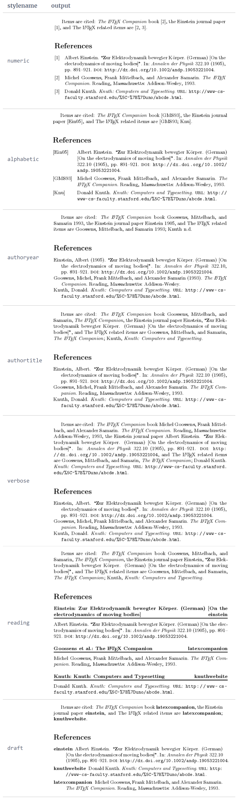
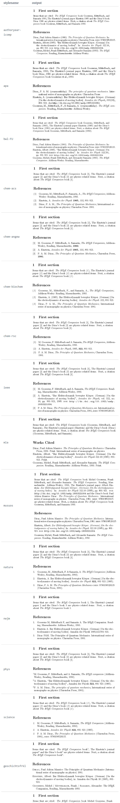

$\LaTeX$ 中有三个主流的 bibliography 包：bibtex, natbib 和 biblatex, 其中 biblatex 支持本地化(多语言), 也更加现代化更加易用。

<!--more-->

```tex
% 导入 biblatex , 使用 biber 后端 , author-year cite style
\usepackage[backend=biber,style=authoryear]{biblatex}
```
导入 biblatex 可以传入的参数[^management]：

1. `backend=biber`: 排序 bibliography 的后端程序，默认的 `biber` 支持不同的排序方式和多种样式，同时也更易于使用。另一个选项是 `bibtex`, 仅支持排序，没有样式支持。
2. `style=alphabetic`: bibliography 样式和 citation 样式
3. `sorting=ynt`: 定义排序方式
   | option  | 排序顺序                                    |
   | ------- | ------------------------------------------- |
   | `nty`   | name, title, year                           |
   | `nyt`   | name, year, title                           |
   | `nyvt`  | name, year, volume, title                   |
   | `anyt`  | alphabetic label, name, year, title         |
   | `anyvt` | alphabetic label, name, year, volume, title |
   | `none`  | 以 citation 顺序排列                        |

## bibliography 样式

style 字段支持的 bibtex 样式[^style]：



拓展的样式：



除此之外还可以自定义 bibliography section 的标题：

```tex
\printbibliography[title={Whole bibliography}]
```

或者以某个标准过滤打印 bibliography：

```tex
\printbibliography[type=article,title={Articles only}]
\printbibliography[type=book,title={Books only}]

\printbibliography[keyword={physics},title={Physics-related only}]
\printbibliography[keyword={latex},title={\LaTeX-related only}]
```

添加 bibliography section 到目录：

```tex
% 顶级目录
\printbibliography[heading=bibintoc,title={Whole bibliography}]
% 次级目录
\printbibliography[heading=subbibintoc,type=article,title={Articles only}]
```

## Citation 样式

没有显示设置时，biblatex 会使用最符合 bibliography 样式的 citation 样式[^citestyle]

1. `numberic`: 数字样式
2. `numberic-comp`: 自动聚合连续的数字：[1, 2, 3] 聚合为 [1-3]
3. `numberic-verb`: 自动分解连续的数字：[1, 2, 3] 分解为 [1];[2];[3]
4. `alphabetic`: 
5. `alphabetic-verb`: 分解连续的 citation
6. `authoryear`: 
7. `authoryear-comp`: 同一个作者的不同年份的引用聚合：*Doe 1992, Doe 1995* 聚合为 *Doe 1992, 1995*
8. `authoryear-ibid`: 
9. `authoryear-icomp`:
10. `authortitle`:
11. `authortitle-comp`:
12. `authortitle-ibid`:
13. `authortitle-icomp`:
14. `authortitle-terse`:
15. `authortitle-tcomp`:
16. `authortitle-ticomp`:
17. `verbose`:
18. `reading`:

**期刊样式**

| Citation style | biblatex stylename | description                                                    |
| -------------- | ------------------ | -------------------------------------------------------------- |
| ACS            | chem-acs           | American Chemical Society (ACS) style                          |
| AIP            | phys (*)           | American Institute of Physics (AIP) style                      |
| Nature         | nature             | Nature style                                                   |
| Science        | science            | Science style                                                  |
| IEEE           | ieee               | Institute of Electrical and Electronics Engineers (IEEE) style |
| Chicago        | chicago-authordate | Chicago Style                                                  |
| MLA            | mla                | MLA style                                                      |
| APA            | apa                | American Psychological Association (APA) style                 |

[^style]: [Biblatex bibliography styles](https://www.overleaf.com/learn/latex/Biblatex_bibliography_styles)
[^management]: [Bibliography management with biblatex](https://www.overleaf.com/learn/latex/Bibliography_management_with_biblatex)
[^citestyle]: [Biblatex Citation styles](https://www.overleaf.com/learn/latex/Biblatex_citation_styles)