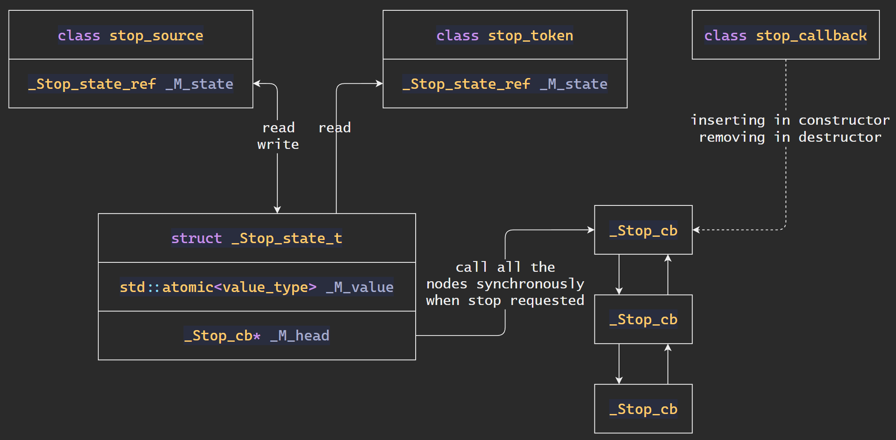

C++ 11 及之后的版本中提供了一系列并发编程的工具和对并发控制原语的抽象封装, 如 `thread`, `atomic`, `mutex`, `condition_varible` 等. 本文介绍 `thread` 以及 `jthread` 的基本语义和功能, 它们在实际场景中的 best practice 和与之密切相关的编程模式不在本文讨论范围之内.

<!--more-->

## Thread

线程提供一种允许多个过程并发执行的方式, C++ 中的 `thread` 则是提供一组平台无关的接口, 为用户屏蔽了不同操作系统所提供的线程 API 的差异. 在 linux 操作系统上, 使用 `thread` 的程序编译时往往需要 `-lpthread` 选项以显式链接 pthread (POSIX thread) 库.

### `thread`

C++ 11 中提供的 `thread` 类接受一个可调用对象和参数作为构造参数, 并且 `thread` 对象在构造完成后立刻开始执行 (将线程标记为 `ready` 状态等待操作系统调度). 

传入 `thread` 构造函数的可调用对象的返回值会被忽略, 并且如果该可调用对象异常终止, 该线程会调用 `std::terminate`, 导致进程终止. 因此不应该依赖返回值或异常实现多线程之间的同步和通信, 可以使用 `std::promise` 或 _同步_ 的共享变量.

C++ 11 中为 `thread` 对象提供的控制操作极少, 只有 `join` 和 `detach` 两种:
1. `join`: 阻塞 _当前_ 线程, 等待调用 `join` 函数的那个 `thread` 对象结束执行
2. `detach`: 将调用 `detach` 函数的线程与 _当前_ 线程剥离并独立执行, 当前线程不再拥有该 `thread` 对象.

值得注意的是, `thread` 还提供了 `joinable` 操作, 用于检查一个 `thread` 对象是否可以调用 `join` 函数. 这个检查的意义在于, 对于 thread_id 与当前线程相同的 `thread` 对象, 一旦调用 `join`, 该线程就会一直阻塞: `join` 的语义是阻塞直到调用者执行结束, 而执行者又恰好正是这个被阻塞的线程, 那么它将永远无法醒来. 幸而在 C++ 中我们无法对 `joinable()` 返回 `false` 的 `thread` 对象调用 `join`, 否则将有多少死锁的线程出现.

`joinable` 函数的实现其实非常简单, 就是判断当前线程和调用该函数的那个对象的 id 是否相同: `this->get_id() != std::thread::id()`.

### `jthread`

`jthread` 是 C++ 20 引入的新线程类, 它的功能和 `thread` 一致, 并非更高级的线程, 只是对 `thread` API 不合理的设计提供一个 wrapper.

与 `thread` 相同, `jthread` 也提供了相同语义的 `join` 和 `detach` 函数. 不同的是, 对于一个 `thread` 对象, 如果你在它析构之前没有调用 `join` 或 `detach` 函数, 那么它就会在析构函数调用 `terminate` 终止整个进程, 这带来很多不便:

```cpp
~thread() {
  if (joinable())
    std::terminate();
}
```

而 `jthread` 则会在析构函数中请求终止该线程并自动 `join`:

```cpp
~jthread() {
  if (joinable()) {
      request_stop();
      join();
    }
}
```

同时 `jthread` 还提供了一个显式终止线程执行的机制, 即 `std::stop_source` 和 `std::stop_token`. 每个 `jthread` 对象都持有一个 `std::stop_source`, 它代表一个共享的终止状态. 在线程开始执行时, `jthread` 会将该共享状态传入可调用对象作为第一个参数, 这就要求可调用对象的接口接受一个 `std::stop_token` 作为第一个参数. 当外部线程对 `jthread` 对象 `request_stop` 时, 实际上就是在尝试设置 `jthread` 内部的 `std::stop_source` 状态.

需要注意的是, 设置了 `std::stop_token` 并不代表真的可以停止线程执行, 真正的线程停止逻辑还需要在用户代码显式地设计. 例如下面的例子:

```cpp
void f(std::stop_token stop_token, int value) {
  while (!stop_token.stop_requested()) {
    std::cout << value++ << ' ' << std::flush;
    std::this_thread::sleep_for(200ms);
  }
  std::cout << std::endl;
}

int main() {
  std::jthread thread(f, 5);  // prints 5 6 7 8... for approximately 3 seconds
  std::this_thread::sleep_for(3s);
  // The destructor of jthread calls request_stop() and join().
}
```

如果没有 `std::this_thread::sleep_for(3s)`, 那么 `jtherad` 对象会在析构时自动 `request_stop`, 使得函数 `f` 及时停止, 最终可能一个数字也不会输出. 而这一行为是由于 `f` 函数中显式地以 `stop_token` 参数的状态作为循环条件实现的.

### 其他功能

1. `yield`: 让出 CPU, 等待下次调度. 显然地, 在某些情况下 (如当前线程是唯一线程), 该函数没有效果.
2. `get_id`: 获取线程 id
3. `sleep_for`: 睡眠 (阻塞) 一段时间, 由于调度策略该时间可能比传入的时间稍长
4. `sleep_until`: 睡眠 (阻塞) 直到给定的时间点, 时间点并 _不_ 会被精确遵守

C++ 20 中为线程终止所提供的三个工具:
1. `stop_token`: 用于查询是否有 `stop_request` 被发起的接口
2. `stop_source`: 用于表示 `stop_request` 的请求情况
3. `stop_callback`: 用于为线程终止注册 callback 的接口

这三个类的实现和关系比较简单. 首先 `stop_token` 和 `stop_source` 中都持有 `_Stop_state_ref` 类型的成员, 而这个 `_Stop_state_ref` 则是一个引用计数型的 pointer wrapper, 类似 `shared_ptr`. 其内部持有的 `_Stop_state_t` 类型的指针指向的是真正的 stop request state. 从这里可以看出是这个 `_Stop_state_t` 指针将 `stop_token` 和 `stop_source` 关联起来的, 即它们都间接通过 `_Stop_state_ref` 指向同一个位于堆上的 `_Stop_state_t`.

`stop_callback` 则是一个 RAII 类, 在构造函数中它将可调用对象即 callback 注册到 `_Stop_state_t`, 并在析构函数中注销. 且注册和注销的实现则是在 `_Stop_state_t` 中持有一个双向链表的头节点, 双向链表的节点元素则是包装为 `_Stop_cb` 的 callback 本体, 这样就可以在注册时插入节点, 注销时删除节点, `stop request` 时执行链表中所有的节点. 同时标准保证所有节点的执行是同步的.



## References

1. [std::thread - cppreference.com](https://en.cppreference.com/w/cpp/thread/thread)
2. [std::jthread - cppreference.com](https://en.cppreference.com/w/cpp/thread/jthread)
3. [std::stop_token - cppreference.com](https://en.cppreference.com/w/cpp/thread/stop_token)
4. [c++ - When should you use std::thread::joinable? - Stack Overflow](https://stackoverflow.com/questions/42924503/when-should-you-use-stdthreadjoinable)
5. [c++ - What is std::jthread in c++20? - Stack Overflow](https://stackoverflow.com/questions/62325679/what-is-stdjthread-in-c20)
