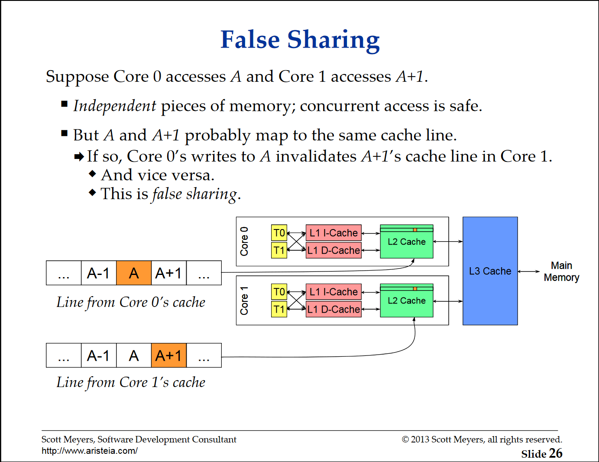

C++ 17 提供了两个编译时常量, 用于表示 CPU Cache 的一些参数. 合理使用这两个编译时常量可以避免在多级 Cache 结构的计算机上并发程序频繁访问同一个对象不同成员时可能发生的 **伪共享 (false sharing)** 问题.

<!--more-->

这两个编译时常量是:

```cpp
inline constexpr std::size_t hardware_destrutive_interference_size; // 下简称: hdis
inline constexpr std::size_t hardware_constructive_interence_size; // 下简称: hcis
```

### False sharing

首先说一说什么是伪共享. 在 [内存屏障和-C-内存模型](/内存屏障和-C-内存模型) 中我们知道现代 CPU 的 Cache 是多级层次的, 不同的 CPU Core 可能持有独立的 Cache, 这种结构很有可能出现 Cache 不一致问题. 那么多个 Core 同时读写同一个内存位置时就是一种 data race. MESI 协议通过为 Cache line 引入四种状态并在需要时广播消息解决了缓存一致性的问题. 具体地说, 当 Core A 和 Core B 的独立 Cache 中都持有字节 C 的缓存时, 如果 Core A 写入字节 C 的同时 Core B 也要访问字节 C, 那么 Core B 必须先 invalidate 字节 C 所在的 Cache line, 并重新从下一级 Cache 中加载包含字节 C 的 Cache line (细节参考: [内存屏障和-C-内存模型](/内存屏障和-C-内存模型)).

值得注意的是, Cache 的最小操作单元是 Cache line, 而一个 Cache line 通常包含几十上百个字节. 那么考虑一种情况: Core A 和 Core B 并发访问 (读写) 字节 C 和字节 C 的相邻字节 D 时, 会发生什么? 答案显而易见, 相邻字节 C 和 D 极有可能被分配到同一个 Cache line (细节参考 [Cache](/Cache)), 这就造成明明并行程序没有访问同一个内存位置, 也就是并不存在 data race, 但 Core A 和 Core B 的 Cache 却需要频繁地 invalidate 整个 Cache line 并重新加载, 结果就是程序执行效率的下降. 这就是 **false sharing** 的情况. Scott Meyers 关于 CPU Cache 的一次 talk 中提到一个很好的例子, 说明了 false sharing 问题对多线程并行程序 scalability 的影响. 详情参考: https://www.aristeia.com/TalkNotes/codedive-CPUCachesHandouts.pdf



### How to avoid

false sharing 的避免手段主要是将可能在不同 Core 中并发访问的数据布局成合适的距离, 使得它们不可能被塞到同一个 Cache line. 例如对于如下的结构:

```cpp
struct ConcurrentStruct {
    int threadA_val{};
    int threadB_val{};
};
```

如果成员 `threadA_val` 和 `threadB_val` 分别在两个 Core 中被频繁读写, 我们可以尝试在它们中间插入一些 padding 字节以强迫它们配分配到不同 Cache line (对于 64 bytes 大小的 cache line):

```cpp
struct FastConcurrentStruct {
    const char padding1[60];
    int threadA_val{};
    const char padding2[60];
    int threadB_val{};
    const char padding3[60];
};
```

这种 padding 不仅使得 `threadA_val` 和 `threadB_val` 无法加载到同一个 Cache line, 也避免了它们和程序其它部分的值加载到同一个 cache line. 那么在不同 Cache line 大小的 CPU 上如何写出统一的避免 false sharing 的代码呢? 操作系统的内核可能会提供一些特殊的宏定义. 那么如何写出跨操作系统统一的代码呢? 这就是上面介绍的两个 C++ 编译时常量 `hdis`, `hcis` 的作用.

### False sharing avoiding in modern C++

引用 [cppreference](https://en.cppreference.com/w/cpp/thread/hardware_destructive_interference_size) 提供的例子:

```cpp
struct keep_apart {
    alignas(std::hardware_destructive_interference_size) std::atomic<int> cat;
    alignas(std::hardware_destructive_interference_size) std::atomic<int> dog;
};
```

`hdis` 表示要避免 false sharing 两个变量的地址所需要的 **最小** 差值. 下面的测试程序说明了它的效果:

```cpp
#include <iostream>
#include <new>
struct no_fs {
  alignas(std::hardware_destructive_interference_size) int a{};
  alignas(std::hardware_destructive_interference_size) int b{};
};
struct fs {
  int a{};
  int b{};
};

int main() {
  no_fs nf{};
  std::cout << "No false sharing: " << '\n'
            << &nf << "\n"
            << &(nf.a) << "\n"
            << &(nf.b) << "\n"
            << std::hardware_destructive_interference_size << "\n";
  fs f{};
  std::cout << "false sharing: " << '\n'
            << &f << "\n"
            << &(f.a) << "\n"
            << &(f.b) << "\n";
}

/** output:
No false sharing: 
0x7ffe0174ff00
0x7ffe0174ff00
0x7ffe0174ff40
64
false sharing: 
0x7ffe0174fef8
0x7ffe0174fef8
0x7ffe0174fefc
**/
```

可以看出测试平台 (https://godbolt.org/z/M3bs16cY6) 的 Cache line 大小是 64 字节, 并且 `no_fs` 结构体中的成员地址都按照 64 字节对齐. 而 `fs` 结构的成员则是 trivial layout, 即成员是紧密排列的.

另外一个常量 `hcis` 表示 true sharing 的最大连续内存长度, 即可能被放入同一个 cache line 的最大字节数. 用于增大整个结构或连续的变量被放入同一个 cache line 的可能性, 不详细介绍, 可以参考 cppreference 给出的例子: [std::hardware_destructive_interference_size, std::hardware_constructive_interference_size - cppreference.com](https://en.cppreference.com/w/cpp/thread/hardware_destructive_interference_size).

## References

1. Scott Meyers. 2013. **Cpu Caches and Why You Care**. In *code::dive conference*. [video](https://www.youtube.com/watch?v=WDIkqP4JbkE). [slide](https://www.aristeia.com/TalkNotes/codedive-CPUCachesHandouts.pdf)
2. [std::hardware_destructive_interference_size, std::hardware_constructive_interference_size - cppreference.com](https://en.cppreference.com/w/cpp/thread/hardware_destructive_interference_size)
