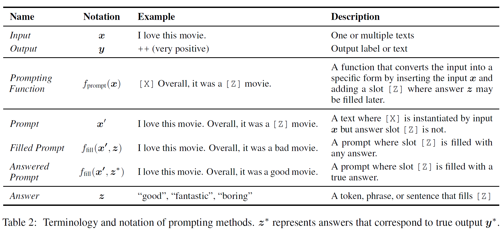
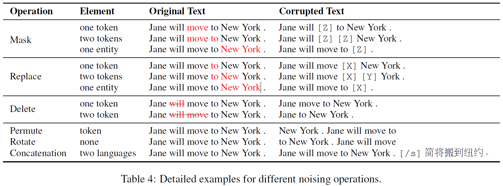
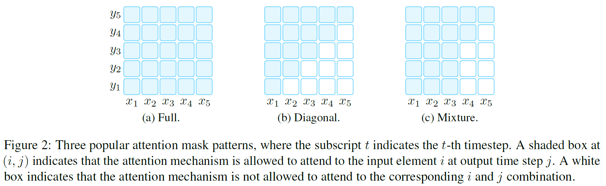
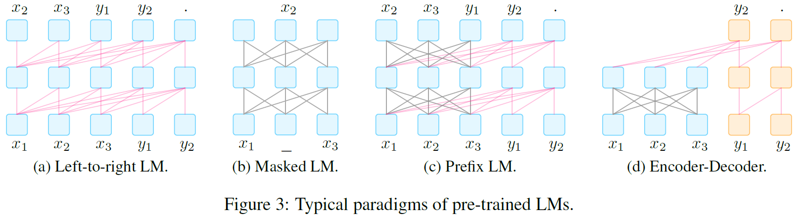
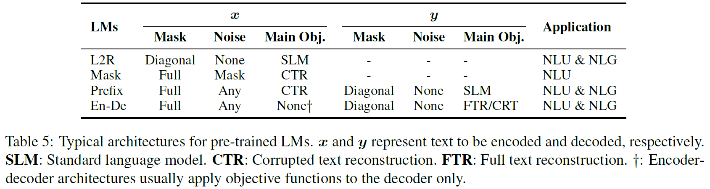
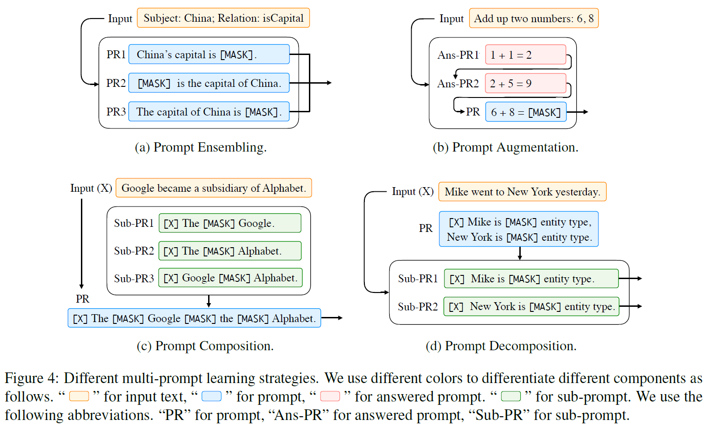
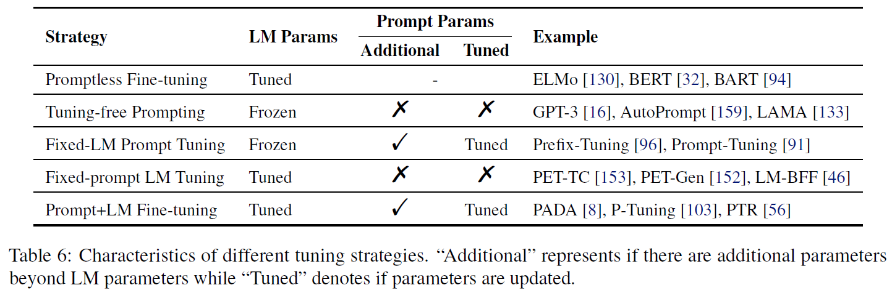

刘鹏飞博士著 Prompt 范式综述

<!--more-->

## NLP中的两次巨变

1. feature/architecture engineering to objective engineering

    早期的NLP主要采用完全监督学习方法，用于特定任务的模型仅在特定的数据集上训练。由于完全监督的方法需要大量高质量的有标签数据集，早期的NLP模型十分依赖研究者的专业领域知识以便从原始数据中定义和抽取特征，并且给模型以恰当的归纳偏置(inductive bias)，这被称为特征工程(feature engineering)

    随着神经网络的发展，模型可以在训练中学习特征。研究者主要通过设计有利于学习某类特征的特殊的网络架构来提供归纳偏差，这被称为架构工程(architecture engineering)

    第一个巨变发生在2017-2019年，NLP的方向转为预训练和微调的模式，完全监督的方法从此式微。这种模式下，一个固定架构的预训练模型从大型数据集中抽取语言的通用特征，然后通过引入额外的参数并使用特定任务的目标函数对它们微调来适应不同的下游任务。这种模式下，NLP的主要任务是设计在预训练和微调时的目标函数，称为目标工程(objective engineering)

2. objective engineering to promot engineering

    2021年正处于第二次巨变中，“预训练-微调”的过程被我们称为“预训练-提示-预测”的过程替代。这种模式下，下游任务通过重组来适配语言模型，而不是语言模型通过微调来适配下游任务。这种模式的优点是，一个完全无监督预训练出的模型在恰当的提示下可以解决多种问题。此时NLP的主要任务就变成了设计出恰当的提示，称为提示工程(promot engineering)

# Prompting 的正式描述

## 传统监督学习的NLP

传统的监督学习的NLP过程中，模型 $P(y|x;\theta)$ 对于输入$x$预测出输出$y$。为了学习参数$\theta$，通常需要成组的输入和输出数据集(有标签数据)来进行训练以对条件概率进行预测。在很多任务背景下这样的数据集数量不够

## Prompting 的基本过程和概念

基于Promopting的学习方法通过计算文本$x$本身的概率而不是条件概率来预测输出$y$减少甚至消除对大规模监督数据集的需求

下表是Prompting的几个基本概念：

基于Prompting的方法分三步来预测输出$\widehat{y}$

### Prompting function

第一步通过形如 $f_{prompt}(\cdot)$ 的prompting function来修改输入的文本$x$为 $x'=f_{prompt}(x)$。这个函数包括两个步骤：

1. 使用一个文本模板，该模板有两个插槽：输入插槽 $[X]$ 用来放输入$x$, 答案插槽$[Z]$用来放模型生成的答案$z$

2. 把输入文本$x$放进输入插槽$[X]$

注意：

1. 上述的Prompts有一个待填充的空插槽$[Z]$，插槽位于Prompts中间的称为*cloze prompt，* 插槽位于末尾的称为*prefix prompt*

2. 许多情况下，模板并不必须由自然语言标记组成，可以嵌入虚拟的字(如数字id)，甚至某些prompting方法可以生成连续的向量

3. 输入插槽$[X]$和答案插槽$[Z]$的数量可以根据任务的需要灵活调整

### 答案最大化搜索

经过 *prompting function* 之后，输入文本 $x$ 变为带有答案插槽的 $x'$，随后我们搜索获得最高分数的答案文本 $\widehat{z}$。定义 $\mathcal{Z}$ 为 $z$ 所有可能值的集合，例如在文本生成任务中， $\mathcal{Z}$ 可能包括所有语言的范围，而在文本识别的任务中， $\mathcal{Z}$ 只是一个小的子集。

定义函数 $f_{fill}(x', z)$ 用于将可能的答案 $z$ 填充进 *prompt* $x'$ 的插槽 $[X]$ 中，将经过这一步骤的 *prompt* 称为 *filled prompt* ，如果填充的是正确答案，称为 *answered prompt* 。

搜索的过程实际是：对于 $\mathcal{Z}$ 中每一个可能的答案 $z$ ，利用预训练的 LM: $P(\cdot; \theta)$ 来计算其概率，并取其中概率最大的答案：

$$\widehat{z} = \underset{z\in \mathcal{Z}}{\text{search}} P(f_{\text{fill}}(x', z); \theta)$$

### 答案映射

最后，还需要将最高分的答案 $\widehat{z}$ 映射为最高分的输出 $\widehat{y}$，在某些应用中，答案 $\widehat{z}$ 就是需要的输出 $\widehat{y}$，所以这一步骤并不一定是必须的

## 设计Prompting的几个要点

- 预训练模型的选择

- 构建prompt函数 $f_{prompt}(x)$ 的方法

- 可能的答案集 $\mathcal{Z}$ 的设计方法和答案映射的方法

- 对于特定的任务对prompt模式的扩展

- prompt 模型的训练策略

# 预训练语言模型

## Training Objectives（损失函数）

- Standard Language Model, SLM

    标准语言模型通过训练来优化对文本的预测概率 $P(x)$，通常是*自回归(autoregressive)* 的方式对文本序列中从左到右的 *tokens* 进行预测

较为流行的用于替换 SLM 的 Objective 是 *noise objective* ，通过噪声函数 $\widehat{x}=f_{noise}(x)$ 向输入文本序列添加噪声，然后根据噪声序列预测原始文本序列 $P(x|\widehat{x})$。

*noise objective* 有以下两种主要的形式：

- Corrupted Text Reconstruction, CTR

    这种目标通过计算文本中受损的loss来恢复处理后的文本

- Full Text Reconstruction, FTR

    这种目标通过计算整个文本序列的loss来恢复处理后的文本

## 噪声函数

在基于重建的训练目标中，不同的噪声函数会影响训练的效果，另外，可以通过控制噪声的种类引入先验知识。例如，使用专注于句子中实体的噪声函数，预训练出的语言模型就会在实体上有较高的预测性能

- Masking: 用一个MASK替换文本中的一个或多个token

- Replacement: 用一段文本替换一个或多个token, 而不是固定的MASK

- Deletion: 删除一个或多个token，通常和FTR Loss一起使用

- Permutation: 把文本分成不同的块，然后重新组合

下表是这几种噪声函数的例子：

## Directionality of Representations

- Left-to-Right: 每个词的表示由词本身和句子中前面的所有词计算，常用于SLM和FTR

- Bidirectional: 每个词的表示由句子中所有词计算

- 混合的模式: 将以上两种策略混用，注意力机制

下图是表示顺序的模式示意图：

## 典型的预训练方法

由不同的损失函数，噪声函数和方向性可以组合出不同的预训练方法：

- Left-to-Right Language Model, L2R LMs

    自回归语言模型的一种，用于预测即将出现的词或给出一组词的概率 $P(\mathbf{x}), \mathbb{x} = x_1, x_2, ..., x_n$。 $P(\mathbf{x})$ 通常由链式法则计算： $P(\mathbf{x}) = P(x_1)\times ... P(x_n|x_1...x_{n - 1})$

    L2R LM 由马尔可夫在1913年提出并被广泛使用，具有代表性的现代L2R LM有：GPT-3, GPT-Neo

- Masked Language Models, Mask

    L2R LM 是建模文本概率的利器，但是它要求必须按照从左到右的顺序来计算表示。这种顺序的表示对于某些下游任务（如分类）可能不是最合适的。

    在 *representation learning* 中广泛使用的一种双向目标函数Masked Language Model用于根据周围的文本预测被Masked的文本片段。即： $P(x_i|x_1,...x_{i - 1}, x_{i+1}, ... ,x_n)$ 代表词 $x_i$ 被给定上下文包围的概率

    使用MLM的代表性预训练模型有：BERT， ERNIE。MLM通常非常适合如 **文本分类** 等自然语言理解和分析的任务。

- Prefix and Encoder-Decoder

    对于条件文本生成任务例如翻译和文本摘要任务，即给定输入文本 $\mathbf{x} = x_1,..,x_n$ ，要求生成目标文本 $\mathbf{y}$，需要一个既能够编码输入文本又能够解码输出文本的模型。

    对此有两种流行的架构，它们都是下面的流程：1. 使用具有完全连接掩码的编码器首先对源 $\mathbf{x}$ 进行编码，然后2. 自动回归从左到右解码 $\mathbf{y}$

 - Prefix Language Model: PLM是一个从左到右的LM，它以前缀序列 $\mathbf{x}$ 为条件解码 $\mathbf{y}$。编码和解码的模型参数相同

    代表性模型：UniLM 1-2, ERNIE-M

 - Encoder-decoder: 使用 L2R LM来解码 $\mathbf{y}$ ，但是编码 $\mathbf{x}$ 的编码器是独立的

    代表性模型：BART, MASS

    常用于文本生成任务，在恰当的 prompts 下也可以用于信息提取，问答和文本生成评估任务

下面是几种LM的结构示意图和不同函数的的组合表：

# Prompt Engineering

*Prompt Engineering* 就是为下游任务构建最佳prompt函数 $f_{prompt}(\mathbf{x})$ 的过程，需要考虑两个关键点： *prompt shape* 和 *manual/automated*

在现有的工作中，Prompt Engineering是一个寻找最佳prompt template的过程，即prompt template engineering

## Prompt Shape

- cloze prompts: 更适合于使用Masked LM解决的任务

- prefix prompts: 生成任务，或使用标准自回归LM解决的任务更适合

## Manual Template Engineering

根据人类的知识和经验手动创建直观的模板，代表性工作：

cloze prompt:

[Language Models as Knowledge Bases?](https://aclanthology.org/D19-1250/)

prefix prompt:

[Language Models are Few-Shot Learners](https://arxiv.org/abs/2005.14165)

## Automated Template Learning

手动创建的模板具有一定的准确性，但是：1. 需要一定的经验和时间，2. 有经验的设计者也无法保证设计出最佳的prompts

针对这些问题，提出了自动的模板设计方法，可以分为 *discrete prompts* 和 *continuous prompts*

### Discrete Prompts

离散的prompts，又名hard prompts，这类prompts是一串实际的文本。它的自动设计过程就是在一个离散空间（通常是自然语言短语）中搜索最佳的模板。

下面是几种具体的方法：

- **Prompt Mining**: 挖掘方法基于一组给定的输入 $x$ 和输出 $y$ 自动寻找最佳的模板，该方法为包含 $x$ 和 $y$ 的字符串抓取一个大型语料库，然后寻找输入和输出之间的中间词或依赖路径，频繁出现的中间词或依赖路径可以作为模板。

    [How Can We Know What Language Models Know?](https://doi.org/10.1162/tacl_a_00324)

- **Prompt Paraphrasing**: 通过一个现有的种子prompt来变换出一组候选prompts，然后选择其中获得目标任务最高训练准确性的。

    paraphrasing 有很多种具体方法，例如：

   - 翻译成别的语言再翻译回来

        [How Can We Know What Language Models Know?](https://doi.org/10.1162/tacl_a_00324)

   - 使用同义词替换部分词

        [BARTScore: Evaluating Generated Text as Text Generation](http://arxiv.org/abs/2106.11520)

   - 使用专门优化过的神经网络重写prompts

        [BERTese: Learning to Speak to BERT](https://www.aclweb.org/anthology/2021.eacl-main.316)

    还可以在输入文本 $x$ 放进种子模板后再执行paraphrasing，这样可以为每个输入生成一个不同的paraphrase：

    [BERTese: Learning to Speak to BERT](https://aclanthology.org/2021.eacl-main.316/)

- **Gradient-based Search**:对一个prompt中的所有token进行梯度迭代搜索。

    [Universal Adversarial Triggers for Attacking and Analyzing NLP](https://doi.org/10.18653/v1/D19-1221)

    [AutoPrompt: Eliciting Knowledge from Language Models with Automatically Generated Prompts](https://arxiv.org/abs/2010.15980)

- **Prompt Generation** : 把生成prompts的任务看作是一个文本生成任务，使用 **标准自然语言生成模型** 进行生成

    [Making Pre-trained Language Models Better Few-shot Learners](https://arxiv.org/abs/2012.15723)

    [PADA: A Prompt-based Autoregressive Approach for Adaptation to Unseen Domains](https://arxiv.org/abs/2102.12206)

- **Prompt Scoring** :

    [Commonsense Knowledge Mining from Pretrained Models](https://aclanthology.org/D19-1109/)

### Continuous Prompts

prompts没有必要限制在自然语言的范围内，连续的prompts可以直接存在于模型的嵌入空间内，这类prompts被称为continuous prompts或soft prompts。具体来说，连续的prompts去除了两条限制：1. prompts的内容必须是自然语言， 2. 模板必须被预训练模型的参数参数化。模板有自己的可训练参数可以使用下游任务的数据训练。

下面是几种具体的方法：

- **Prefix Tuning** : 保持LM的参数不变，将一系列与任务强相关的向量添加到输入中。数学上来讲，这包括在给定可训练的前缀矩阵 $M_{\phi}$ 和参数为 $\theta$ 的LM的情况下优化以下类对数目标：

$$max_{\phi}log P(\mathbf{y}|\mathbf{x}; \theta; \phi) = max_{\phi}\Sigma_{y_i}log P(y_i|h_{<i}; \theta; \phi)$$

 [Prefix-Tuning: Optimizing Continuous Prompts for Generation](https://arxiv.org/abs/2101.00190)

 [The Power of Scale for Parameter-Efficient Prompt Tuning](https://arxiv.org/abs/2104.08691)

- **Tuning Initialized with Discrete Prompts** : 使用离散方法生成的prompts来初始化搜索。

 使用离散方法生成虚拟token:

 [Factual Probing Is [MASK]: Learning vs. Learning to Recall](https://arxiv.org/abs/2104.05240)

 使用离散方法生成初始模板集：

 [Learning How to Ask: Querying LMs with Mixtures of Soft Prompts](https://aclanthology.org/2021.naacl-main.410/)

 根据手动构建模板的结构生成连续模板：

 [WARP: Word-level Adversarial ReProgramming](https://arxiv.org/abs/2101.00121)

- **Hard-Soft Prompt Hybrid Tuning** : 混合的方法，在固定的hard prompt template中插入以下可变参数。除此之外：

 在模板中插入任务相关的锚记：

 

 使用人工构建的子模板来构建模板，实现在逻辑规则下构建模板：

 [PTR: Prompt Tuning with Rules for Text Classification](http://arxiv.org/abs/2105.11259)

# Answer Engineering

Answer Engineering用于搜索答案空间 $\mathcal{Z}$ ，并将答案映射为输出 $\mathcal{Y}$。主要需要考虑的是 *answer shape* 和 *answer design method*

## Answer Shape

Answer Shape即答案的粒度，主要有三种：

- **Tokens** : 预训练语言模型的词汇表中的一个词或一个子集

- **Span** : A short multi-token span, 通常和cloze prompts共同使用

- **Sentence** : 一个句子或文档，通常和prefix prompts共同使用

Answer Shape的选择通常跟任务相关， **Tokens** 和 **Span** 常用于分类任务或关系抽取，命名实体识别任务。更长的 **Sentence** 常用于语言生成任务或多选择问答任务。

## Answer Space Design Methods

即设计合适的答案空间 $\mathcal{Z}$ 以及合适的映射到输出 $\mathcal{Y}$ 的方法

### Manual Design

- **Unconstrained Spaces** : 无约束空间。在许多情况下， $\mathcal{Z}$ 是一个所有token，固定长度的span或token 序列的空间

- **Constrained Spaces** : 约束空间。文本分类，实体识别等任务下可能的输出被限制在一个范围内

### Auto Design

- Discrete Answer Search

 - **Answer Paraphrasing** : 给定一个初始答案空间 $\mathcal{Z}'$ ，然后利用paraphrasing方法来扩展这个空间

[How Can We Know When Language Models Know? On the Calibration of Language Models for Question Answering](http://arxiv.org/abs/2012.00955)

 - **Prune-then-Search** :

 [Making Pre-trained Language Models Better Few-shot Learners](https://arxiv.org/abs/2012.15723)

 - **Label Decomposition** :

 [AdaPrompt: Adaptive Prompt-based Finetuning for Relation Extraction](https://arxiv.org/abs/2104.07650)

- Continuous Answer Search

 [WARP: Word-level Adversarial ReProgramming](https://arxiv.org/abs/2101.00121)

# Multi-Prompt Learning

在某些问题中使用多个Prompt能够提高有效性。

## Prompt-ensembling

推理时对于同一个输入使用多个未解答的prompts来进行预测，这种综合策略可以：

1. 利用不同提示之间的互补

2. 因为选择一个效果最好的提示非常有挑战性，这样可以降低 prompt engineering 的成本

3. 稳定下游任务的性能表现

目前主要的几个方向：

- **Uniform averaging** : 取不同提示的概率平均值，是最为直观的方法。具体来说，概率是： $P(\mathbb{z}|\mathbb{x}):=\frac{1}{K}\Sigma_i^KP(\mathbb{z}|f_{prompt, i}(\mathbb{x}))$，其中 $f_{prompt, i}(\cdot)$ 是第 $i$ 个prompt

 [Exploiting Cloze Questions for Few Shot Text Classification and Natural Language Inference](https://arxiv.org/abs/2001.07676)

 [BARTScore: Evaluating Generated Text as Text Generation](https://arxiv.org/abs/2106.11520)

- **Weighted averaging** : 平均的方法可能是次优的，有一些研究使用加权平均的prompt ensembling

 

 [Exploiting Cloze Questions for Few Shot Text Classification and Natural Language Inference](https://arxiv.org/abs/2001.07676)

- **Majority voting** : 对于分类任务，可以结合投票的方法

 [The Power of Scale for Parameter-Efficient Prompt Tuning](http://arxiv.org/abs/2104.08691)

 [WARP: Word-level Adversarial ReProgramming](https://arxiv.org/abs/2101.00121)

- **Knowledge distillation** （知识蒸馏）: 使用训练好的模型标记数据，用于训练另一个模型(蒸馏知识)

 [Exploiting Cloze Questions for Few Shot Text Classification and Natural Language Inference](https://arxiv.org/abs/2001.07676)

 [It's Not Just Size That Matters: Small Language Models Are Also Few-Shot Learners](https://arxiv.org/abs/2009.07118)

- **Prompt ensembling for text generation** : 这方面的工作较少，一个简单的方法是使用标准方法基于下一个词概率来生成输出： $P(z_t|\mathbb{x}, z_{<t}):=\frac{1}{K}\Sigma_i^KP(z_t|f_{prompt, i(\mathbb{x})}, z_{<t})$

 [Few-Shot Text Generation with Pattern-Exploiting Training](https://arxiv.org/abs/2012.11926)

## Prompt Augmentation

提示增强，有时被称为示范学习(*demonstration learning*)，即在输入中提供几种已经回答的提示(*answered prompts*)来向LM示范如何为输入 $\mathbb{x}$ 生成输出。这种少量的示范利用了强大的语言模型学习重复模式的能力。

prompt augmentation的思想很简单，但是有两个方面需要探索：1. *Sample Selection* 2. *Sample Prdering*

- **Sample Selection** : 根据示范用例选择的不同，模型的表现可能是乱猜和state-of-art的区别。

 [Making Pre-trained Language Models Better Few-shot Learners](https://arxiv.org/abs/2012.15723)

 [What Makes Good In-Context Examples for GPT-$3$?](https://arxiv.org/abs/2101.06804)

 [Natural Instructions: Benchmarking Generalization to New Tasks from Natural Language Instructions](https://arxiv.org/abs/2104.08773)

- **Sample Ordering** : 提示用例的顺序对模型的表现也十分重要

 [Fantastically Ordered Prompts and Where to Find Them: Overcoming Few-Shot Prompt Order Sensitivity](https://arxiv.org/abs/2104.08786)

 [Reordering Examples Helps during Priming-based Few-Shot Learning](https://arxiv.org/abs/2106.01751)

## Prompt Composition

对于可组合的任务，即可以由更基本的子任务组合而成的任务，可以使用提示重组。即使用多个子提示，每个子提示针对一个子任务，然后基于子提示定义一个组合提示。例如对于关系提取任务，可以重组为识别实体特征任务和关系分类任务。

[PTR: Prompt Tuning with Rules for Text Classification](https://arxiv.org/abs/2105.11259)

## Prompt Decomposition

对于如序列标记的任务，需要对同一个样本做多次预测。此时较难给输入直接定义一个整体的提示。一个可行的方法是将整体分解为不同的子提示，然后分别回答每个子提示。如在NER任务中：

[Template-Based Named Entity Recognition Using BART](http://arxiv.org/abs/2106.01760)

上面提到的四种多提示方法示意图如下：

# 训练策略

## Training Settings

许多情况下，提示方法可以在没有额外训练的条件下使用，这种情况称为零样本 *(zero-shot)。*

除 *zero-shot* 外，还有 *full-data learning* 和 *few-shot learning* 。特别是在 *few-shot learning* 中，prompt方法十分适用

## 参数更新方法

在基于提示的下游任务学习中，通常有两种参数：预训练模型的参数和提示参数。根据 1. 预训练模型的参数是否更新，2. 是否引入提示参数和3. 提示参数是否更新，可以把参数参数更新方法分为以下五类：

- **Promptless Fine-tuning：**不使用prompt的模式，仅更新语言模型的参数。

 - 优点：简单，不需要设计提示，更容易适配较大的训练集

 - 模型可能会过拟合或者在小型数据集上不够稳定。可能发生灾难性遗忘(catastrophic forgetting)，即微调后的模型无法做到微调前可以做到的事

- **Tuning-free Prompting**: 即不进行额外训练，直接利用预训练模型配合prompt实现功能

 - 优点：高效，没有参数更新的过程，不会发生灾难性遗忘，适合零样本场景

 - 缺点：prompt是提供给模型的唯一与任务相关的信息，因此需要繁重的prompt engineering来保证准确性

- **Fixed-LM Prompt Tuning**: 引入额外的prompt-relevant 参数，然后在训练时仅更新该参数，保持预训练模型不变

 - 优点：可以维持预训练模型中的知识，不会发生灾难性遗忘，更适合小样本场景。通常精确性会优于tuning-free prompting

 - 缺点：不适合零样本场景，在大量数据的场景下受表征能力的限制。需要进行prompting engineering。prompt通常不是人类可读的

- **Fixed-prompt LM Tuning**: 即在promptless fine-tuning模式下增加固定的prompt参数，在小样本场景下可能带来提升

 - 优点：prompt/answer engineering更加全面地描述特定任务，可以进行更有效的学习

 - 缺点：仍然需要prompt/answer engineering，在一个下游任务上的微调可能对另一个任务无效

- **Prompt+LM Tuning**: 既引入了prompt-relevant参数，又同时更新语言模型和引入的参数（部分或全部的）

 - 优点：表征能力最强的方法，适合多样本场景

 - 缺点：需要训练和储存所有的参数。在小数据集上容易过拟合