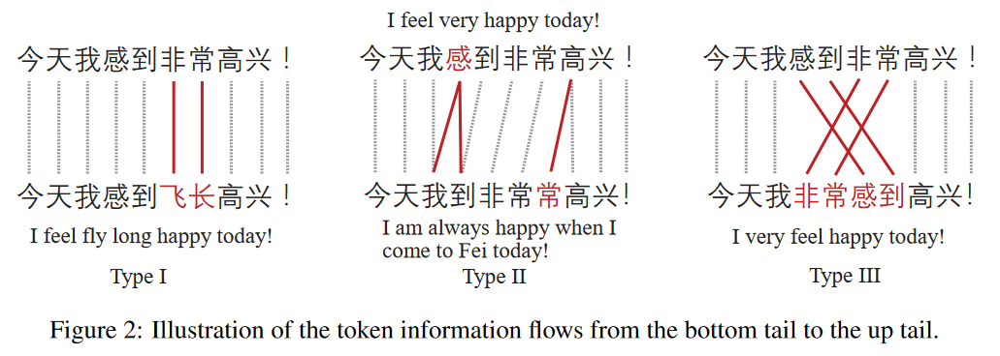
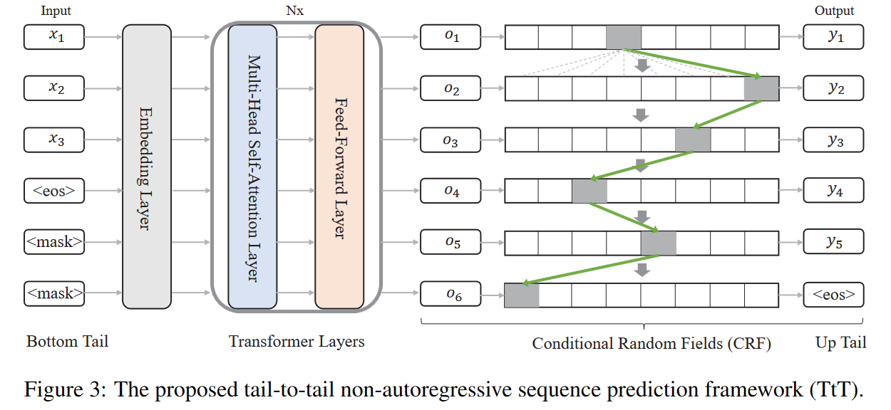

## Motivition

### CGEC

中文语法纠错，旨在自动**检测**和**纠正**中文语句中的语法错误。

中文语法纠错需要的操作种类：

- **替换**，中文中常常出现同音字(拼音输入法)和错别字的错误。可以通过替换对应的字纠正
- **删除和插入**，分别应对文字的冗余和遗漏问题
- **本地释义**，有时语法错误要求通过重新排列等方式重新释义序列中的部分词

其中**插入删除**和**本地释义**是变长操作，**替换**是定长操作

<!--more-->

### Pervious Works

序列翻译(sequence translation)和标记(sequence tagging)是常用于文本语法纠错的方法。

对于序列翻译方法：虽然这种模式可以应对任意类型的语法错误，但是由于*exposure bias issue*和*phenomenon of hallucination*问题的存在，即使引入复制机制也无法保证结果的可信性。

对于*tagging*的方法，该模式使用标记来指导纠错操作：

- 需要将词典扩展到原先的约三倍
- 需要对序列进行多遍预测，直到预测不出新的错误为止

计算开销过大。

最新的工作尝试微调 BERT 来解决 CGEC 问题，但是由于 BERT 模型结构的限制，大多数只能解决定长纠错的场景

CGEC 中大多数 tokens 都没有错误，应该被直接复制。这造成在序列标记和序列翻译任务中常用的参数学习方法 MLE 受到标签不平衡的影响。之前的工作没有探索这种不平衡问题。

## Contribution

1. 提出一个名为 *tail-to-tail non-autoregressive sequence prediction(TtT)* 的解决 CGEC 问题的结构
2. 使用 BERT 编码器和一个 CRF 层作为主干框架，同时可以进行替换，插入，删除和本地释义操作
3. 考虑到句子中大多数 tokens 都不需要操作的不平衡性，采用 Focal Loss 惩罚策略缓解
4. 建立了一个变长 CGEC 数据集，并在上面实验，证明了方法的效果

## Method

模型的输入是一个带有语法错误的句子 $X = (x_1, x_2, ..., x_T)$, 其中 $x_i$ 是句子中的 token，$T$ 是句子的长度。模型的输出是经过纠正的句子 $Y = (y_1, y_2, ..., y_{T'})$, 其中 $T'$ 与 $T$ 并不必须相等。

### 变长场景

假设输入是 $X = (x_1, x_2, x_3, ..., <eos>)$, 长度是 $T$；输出是 $Y = (y_1, y_2, y_3, ..., <eos>)$, 长度是 $T'$

1. T = T'，不需要额外的处理
2. T > T'，即从输入序列中删除了部分 token，可以在输出序列的末尾补充 $T - T'$ 个特殊的 token $<pad>$ 来使输入输出序列长度相等。$Y = (y_1, y_2, ..., <eos>, <pad>)$
3. T < T'，即在输入序列中插入部分 token，可以在输入序列的末尾补充特殊的 token $<mask>$ 使输入输出相等。$X = (x_1, x_2, ..., <eos>, <mask>)$

### 双向语义建模

即标准的 BERT 过程：

$$\begin{array}{rl}
    \mathbf{H}_t^0 &= \mathbf{E}_{w_t}+\mathbf{E}_{p_t}\\
    \mathbf{Q}^0, \mathbf{K}^0, \mathbf{V}^0 &= \mathbf{H}^0\mathbf{W}^Q, \mathbf{H}^0\mathbf{W}^K, \mathbf{H}^0\mathbf{W}^V\\
    \mathbf{H}_t^1 &= \text{LN}(\text{SELF-ATT}(\mathbf{Q}_t^0, \mathbf{K}^0, \mathbf{V}^0) + \mathbf{H}_t^0)\\
    \mathbf{H}_t^1 &= \text{LN}(\text{FFN}(\mathbf{H}_t^1) + \mathbf{H}_t^1)
\end{array}$$

该部分即一个 BERT 编码器，经过 L 层的编码后，最终输出的语言表征向量为 $\mathbf{H}^L \in \mathbb{R}^{\text{max}(T, T')\times d}$

### 非自回归序列预测

**直接预测**。对于经过 BERT 编码器得到的语言表征，可以直接在表征向量上应用 softmax 操作进行预测。具体地说，首先在输出的语言表征上进行一次线性投影：

$$\mathbf{s}_t = \mathbf{h}_t^T\mathbf{W}_s + \mathbf{b}_s$$

其中 $\mathbf{b}_t \in \mathbb{R}^d$ 表示输入序列中第 $t$ 个 token 的表征，来自 $\mathbf{H}^L$, $\mathbf{W}_s \in \mathbb{R}^{d\times |\mathcal{V}|}, \mathbf{b}_s \in \mathbb{R}^{|\mathcal{V}|}$ 是投影参数。如此得到 token 的表征向量投影到词典维度的向量 $\mathbf{s}_t$

然后对 $\mathbf{s}_t$ 进行 softmax 操作，获得该 token 在目标词典上的概率分布：

$$P_{dp}(y_t) = \text{softmax}(\mathbf{s}_t)$$

这种直接的预测可以解决定长的语法纠错问题，但是只能进行替换操作，对于其他种类的操作无能为力。

非自回归的序列预测方法还有忽略掉了邻居 token 之间的依赖关系的问题。

**通过 CRF 进行依赖建模**。对于给定的长度为 $T$ 的输入序列 $X$， 输出的长度为 $T'$ 的序列 $Y$ 的似然函数为：

$$P_{\text{crf}}(Y|X) = \frac{1}{Z(X)}\exp \left(\sum_{t = 1}^{T'}s(y_t) + \sum_{t = 2}^{T'}t(y_{t-1}, y_t)\right)$$

其中 $Z(X)$ 是归一化参数，$s(y_t)$ 即 token $y_t$ 的标签分数，来自第 $t$ 个 token 的表征经过投影的向量 $\mathbf{s}_t$, 相当于 $s_t(\mathcal{V}^{y_t})$, $\mathcal{V}^{y_t}$ 是 token $y_t$ 在词典中的索引。

$t(y_{t-1}, y_t) = \mathbf{M}_{y_{t-1}, y_t}$, 代表从 token $y_{t-1}$ 到 $y_t$ 的转移分数。其中 $\mathbf{M}\in \mathbb{R}^{|\mathcal{V}|\times |\mathcal{V}|}$ 是转移矩阵。

通常情况下，$\mathbf{M}$ 可以通过作为神经网络的参数通过端到端学习得到，但是由于维度过大(词典的维度)，无法有效获取。

作者使用低秩分解的方法定义两个低秩矩阵 $\mathbf{E}_1, \mathbf{E}_2 \in \mathbb{R}^{|\mathcal{V}|\times d_m}$ 来逼近 $\mathbf{M}$:

$$\mathbf{M} = \mathbf{E}_1\mathbf{E}_2^T$$

对于归一化参数 $Z(X)$, 使用维特比算法进行搜索。

### 训练

在训练时：
1. 将解决定长问题的**直接预测**和解决变长问题的**CRF 依赖建模**结合
2. 使用最大似然估计作为参数学习方法，负对数似然作为损失函数

直接预测的损失函数(优化目标)是：

$$\mathcal{L}_\text{dp} = -\sum_{t = 1}^{T'}\log P_{dp}(y_t|X)$$

CRF 依赖建模的损失函数是：

$$\mathcal{L}_\text{crf} = -log P_\text{crf}(Y|X)$$

总的损失函数：$\mathcal{L} = \mathcal{L}_\text{dp} + \mathcal{L}_\text{crf}$

为缓解样本不平衡(大多数 token 不需要纠正)问题，使用 Focal Loss：

$$
\begin{array}{rl}
    \mathcal{L}_\text{dp}^\text{fl} &= -\sum_{t = 1}^{T'}(1 - P_\text{dp}(y_t|X))^\gamma \log P_\text{dp}(y_t|X)\\
    \mathcal{L}_\text{crf}^\text{fl} &= -(1 - P_\text{crf}(Y|X))^\gamma \log P_\text{crf}(Y|X)\\
    \mathcal{L}^{fl} &= \mathcal{L}_\text{dp}^\text{fl} + \mathcal{L}_\text{crf}^\text{fl}
\end{array}
$$