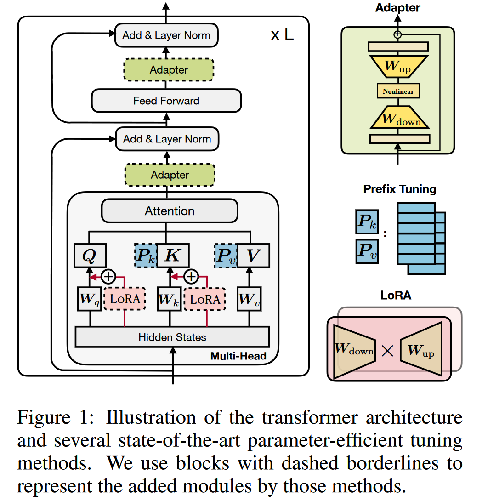
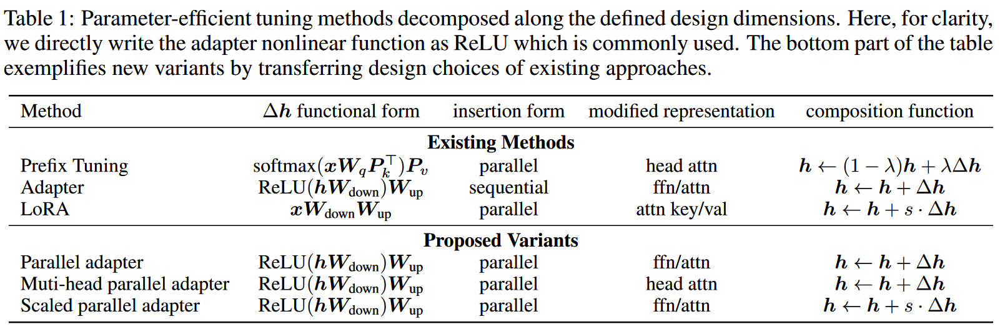
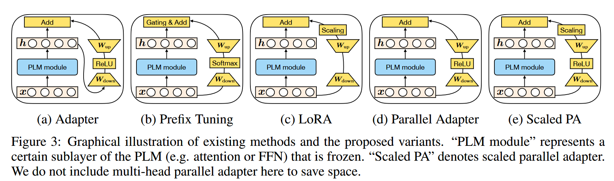

作者认为：现有的 parameter-efficient tuning 方法虽然有效，但是对这些方法中真正有效的设计以及它们之间的联系很少被研究和理解。

<!--more-->

作者基于此研究了 adapter, prefix-tuning 和 LoRA 等方法的设计重点和它们之间的联系，同时研究了这些方法之间的交换或组合。

作者认为：parameter-efficient tuning 方法保持基模型参数不变，其本质相当于以某种方式修饰基模型的表征。主要的设计在于：
1. 用来计算表征修饰的方法(函数)
2. 进行修饰的位置
3. 修饰与原始表征之间结合的方法

# parameter-efficient tuning 计算过程

## Recall Transformer

transformer 层的计算过程即一个 multi-head attention 接一个 FFN 层
- attn 层计算过程为:
  1. 首先输入映射为注意力矩阵 $\mathbf{Q}\in\mathbb{R}^{n\times d_k}$, $\mathbf{K}\in\mathbb{R}^{m\times d_k}$, $\mathbf{V}\in\mathbb{R}^{m\times d_v}$
  2. $\text{Attn}(\mathbf{Q},\mathbf{K},\mathbf{V}) = \text{softmax}(\frac{\mathbf{Q}\mathbf{K}^T}{\sqrt{d_k}}) \cdot \mathbf{V}$

  在 multi-head attn 中，实际是在 $N_h$ 个 heads 中并行进行上述 attn 计算。第 $i$ 个 head 的输入由注意力参数矩阵 $\mathbf{W}_q^i, \mathbf{W}_k^i, \mathbf{W}_v^i\in\mathbb{R}^{d\times d_h}$ 分别与输入相乘得到，即：

  $\text{head}_i = \text{Attn}(\mathbf{xW}_q^i, \mathbf{CW}_k^i, \mathbf{CW}_v^i)$

  其中，$\mathbf{x}$ 是 query vector, $\mathbf{C}$ 是整个输入序列的嵌入。

  multi-head attn 将每个 head 的计算结果拼接，并投影到模型维度：

  $\text{MHA}(\mathbf{C}, \mathbf{x}) = \text{Concat}_{i=1}^{N_h}(\text{head}_i)\mathbf{W}_o$

  其中 $\mathbf{W}_o\in\mathbb{R}^{d\times d}$, $d_h$ 通常是 $\frac{d}{N_h}$, 即：每个 head 通常是在低维空间上进行计算。
- FFN 层的计算过程为:
  $\text{FFN}(\mathbf{x}) = \text{ReLU}(\mathbf{x}W_1 + b_1)W_2 + b_2$
  其中 $\mathbf{W}_1\in\mathbb{R}^{d\times d_m}$, $\mathbf{W}_2\in\mathbb{R}^{d_m\times d}$, $\mathbf{b}_1\in\mathbb{R}^{d_m}$, $\mathbf{b}_2\in\mathbb{R}^{d}$.
  transformer 中通常在 FFN 层使用较大的 $d_m$, 如 $d_m = 4d$。

## Adapters(串行式)

adapter 通常在 transformer 层之间插入较小的 adapter layer, adapter layer 通常由一个下投影层 $\mathbf{W}_\text{down}\in\mathbb{R}^{d\times r}$ 将输入表征 $\mathbf{h}$ 投影到低维空间，然后通过一个非线性层 $f(\cdot)$, 最后通过一个上投影层 $\mathbf{W}_\text{up}\in\mathbb{R}^{r\times d}$ 将表征恢复到高维空间。adapters 层通常会应用残差连接，以保证初始状态下的性能。

$$\mathbf{h}\leftarrow\mathbf{h}+f(\mathbf{hW}_\text{down})\mathbf{W}_\text{up}$$

## Prefix-tuning

prefix-tuning 方法即在每个 transformer 层的 multi-head attn 计算中，向每个 head 的 key 和 value 矩阵的前部添加 $l$ 个可调的向量，即 prefix 向量。

具体来说，prefix-tuning 将两个矩阵: $\mathbf{P}_k, \mathbf{P}_v\in\mathbb{R}^{l\times d}$ 分别与 key, value 矩阵 $\mathbf{K}, \mathbf{V}$ 拼接，则拼接后的 attn 计算过程为：

$$\text{head}_i = \text{Attn}(\mathbf{xW}_q^i, \text{concat}(\mathbf{P}_k^i, \mathbf{CW}_k^i), \text{concat}(\mathbf{P}_v^i, \mathbf{CW}_v^i))$$

其中的 $\mathbf{P}_k^i, \mathbf{P}_v^i\in\mathbb{R}^{l\times d/N_h}$, 即 $\mathbf{P}_k, \mathbf{P}_v$ 分解到 $N_h$ 个 heads 中第 $i$ 个 head 的向量。

## LoRA

LoRA 通过向 transformer layer 中插入低维矩阵，以低秩矩阵相乘的方式近似到高维矩阵，实现对基模型参数的修饰。

具体的说，对于一个高维基模型参数 $\mathbf{W}\in\mathbb{R}^{d\times k}$, 对其进行参数修饰可以表示为：$\mathbf{W} + \Delta\mathbf{W}$. LoRA 则通过两个低秩矩阵近似地得到 $\Delta\mathbf{W}$，即：$\Delta\mathbf{W} = \mathbf{W}_\text{down}\mathbf{W}_\text{up}$, 其中 $\mathbf{W}_\text{down}\in\mathbb{R}^{d\times r}$, $\mathbf{W}_\text{up}\in\mathbb{R}^{r\times k}$。

LoRA 将上述参数修饰方法应用到 query 和 value 的注意力投影参数 $\mathbf{W}_q$ 和 $\mathbf{W}_v$ 上。LoRA 通过对参数的修饰实现对表征的修饰：

$$\mathbf{h}\leftarrow\mathbf{h}+s\cdot\mathbf{x}\mathbf{W}_\text{down}\mathbf{W}_\text{up}$$

其中 $s\geq 1$ 是可调的缩放超参数。

# 区别和联系

## Prefix-tuning 与 Adapters

$$\begin{aligned}
    \text{head} &= \text{Attn}(\mathbf{Q}, \text{concat}(\mathbf{P}_k, \mathbf{K}), \text{concat}(\mathbf{P}_v, \mathbf{V}))\\
    &= \text{softmax}(\mathbf{Q}\text{concat}(\mathbf{P}_k, \mathbf{K})^T)\text{concat}(\mathbf{P}_v, \mathbf{V})\\
    &= (1-\lambda(\mathbf{x}))\text{softmax}(\mathbf{Q}\mathbf{K}^T)\mathbf{V}+\lambda(\mathbf{x})\text{softmax}(\mathbf{Q}\mathbf{P}_k^T)\mathbf{P}_v\\
    &= (1-\lambda(\mathbf{x}))\text{Attn}(\mathbf{Q}, \mathbf{K}, \mathbf{V})+\lambda(\mathbf{x})\text{Attn}(\mathbf{Q}, \mathbf{P}_k, \mathbf{P}_v)\\
\end{aligned}$$

其中的 $\mathbf{Q} = \mathbf{xW}_q$, $\mathbf{K} = \mathbf{CW}_k$, $\mathbf{V} = \mathbf{CW}_v$, 因此又可以写为：

$$\begin{aligned}
   \text{head} &= \text{Attn}(\mathbf{x}\mathbf{W}_q, \text{concat}(\mathbf{P}_k, \mathbf{CW}_k), \text{concat}(\mathbf{P}_v, \mathbf{CW}_v)) \\
   &= \text{softmax}(\mathbf{xW}_q\text{concat}(\mathbf{P}_k, \mathbf{CW}_k)^T)
    \left[
        \begin{matrix}
            \mathbf{P}_v \\
            \mathbf{CW}_v^T
        \end{matrix}
    \right]\\
    &= (1 - \lambda(\mathbf{x}))\text{softmax}(\mathbf{xW}_q\mathbf{W}_k^T\mathbf{C}^T)\mathbf{CW}_v + \lambda(\mathbf{x})\text{softmax}(\mathbf{xW}_q\mathbf{P}_k^T\mathbf{P}_v)\\
    &= (1 - \lambda(\mathbf{x}))\underbrace{\text{Attn}(\mathbf{xW}_q, \mathbf{CW}_k, \mathbf{CW}_v)}_\text{standard attention} + \lambda(\mathbf{x}) \underbrace{\text{Attn}(\mathbf{xW}_q, \mathbf{P}_k, \mathbf{P}_v)}_\text{independent of} \mathbf{C}
\end{aligned}$$

其中 $\lambda(\mathbf{x}) = \frac{\Sigma_i\exp(\mathbf{xW}_q\mathbf{P}_k^T)_i}{\Sigma_i\exp(\mathbf{xW}_q\mathbf{P}_k^T)_i + \Sigma_j\exp(\mathbf{xW}_q\mathbf{W}_k^T\mathbf{C}^T)_j}$. **note**: $\text{softmax}(\mathbf{x}) = \frac{\exp(\mathbf{x})}{\sum_i\exp(\mathbf{x})}$

note:

$\mathbf{x}\in\mathbb{R}^d, \mathbf{W}_q, \mathbf{W}_k, \mathbf{W}_v\in\mathbb{R}^{d\times d_h}, \mathbf{C}\in\mathbb{R}^{m\times d}, \mathbf{P}_k, \mathbf{P}_v\in\mathbb{R}^{l\times d_h}$, hence: $\text{concat}(\mathbf{P}_k, \mathbf{CW}_k), \text{concat}(\mathbf{P}_v, \mathbf{CW}_v)\in\mathbb{R}^{(l+m)\times d}$

注意到上述 head 计算结果中前一项即正常的 attn ， 后一项为独立于输入 $\mathbf{C}$ 的逐 query $\mathbf{x}$ 的 attn。可看作对表征的修饰：

$$\mathbf{h}\leftarrow(1-\lambda(\mathbf{x}))\mathbf{h} + \lambda(\mathbf{x})\Delta\mathbf{h}$$

其中: $\Delta\mathbf{h} :=\text{softmax}(\mathbf{xW}_q\mathbf{P}_k^T)\mathbf{P}_v$

定义 $\mathbf{W}_1 = \mathbf{W}_q\mathbf{P}_k^T$, $\mathbf{W}_2 = \mathbf{P}_v$, $f = \text{softmax}$, 则可以将上式重写为：

$$\mathbf{h}\leftarrow(1-\lambda(\mathbf{x}))\mathbf{h} + \lambda(\mathbf{x})f(\mathbf{xW}_1)\mathbf{W}_2$$

### 相同之处

prefix-tuning 计算过程与 adapter 的计算过程结构相似，$\mathbf{W}_1\in\mathbb{R}^{d_h\times l}$, $\mathbf{W}_2\in\mathbf{l\times d_h}$ 起到 adapter 中 $\mathbf{W}_\text{down}$ 和 $\mathbf{W}_\text{up}$ 的作用, $l$ 则和 adapter 中的 $r$ 类似：是计算修饰向量 $\Delta\mathbf{h}$ 时的秩的约束，即 $\Delta\mathbf{h}$ 是至多 $l$ 个向量的线性组合

### 不同之处

1. 在修饰项链结合上，adapter 没有类似 $\lambda$ 的门控过程
2. prefix-tuning 使用 PLM layer 的输入 $\mathbf{x}$ 来计算 $\Delta\mathbf{h}$, adapter 使用 $\mathbf{h}$ 即 PLM layer 的输出
3. prefix-tuning 在 multi-head attn 的每个 head 内进行修饰过程，adapter 可以选择在 attn 或 FFN 的输出进行修饰

## 设计要点

综合三种方法的计算过程的异同，可以总结其设计要点如下：
1. Functional Form: 即用来计算 $\Delta\mathbf{h}$ 的函数. 三种方法都使用类似 $\text{proj\_down}\rightarrow\text{non\_linear}\rightarrow\text{proj\_up}$ 的过程，LoRA 中没有 non_linear 过程
2. Modified Representation: 即使用什么 hidden state 作为输入来计算 $\Delta\mathbf{h}$
3. Insertion Form: 即添加的模型如何插入到基模型中
4. Composition Function: 即 $\Delta\mathbf{h}$ 如何与基模型的表征 $\mathbf{h}$ 组合，如 adapter 通过简单相加，prefix-tuning 通过门控相加, LoRA 通过缩放相加

作者基于这些设计要点，设计了三种他们的组合, 以研究哪个设计维度和设计方式最为有效：

- Parallel Adapter: 将 prefix-tuning 以 $\mathbf{x}$ 作为输入的并行性引入 adapter
- Multi-head Parallel Adapter: 将 prefix-tuning 作用在每个 head 的特点引入 adapter
- Scaled Parallel Adapter: 将 LoRA 的缩放相加组合方式引入 adapter

### Insertion Form: Sequential or Parallel

作者使用 parallel adapter 和 sequential adaper 实验，结果表明**并行设计在所有 bench mark 上都优于串行设计**

### Where to Modify: Attention or FFN

作者使用并行 adapter 分别作用在 attention 和 FFN 的模型以及 prefix-tuning 和作用在 FFN 层上的 LoRA 进行实验，结果表明 FFN 上的修饰优于 attention 上的修饰。作者认为：**不论使用何种修饰函数和组合方式，FFN 上的修饰可以更加有效地利用新添加的参数**

作者对这一现象提出猜想：**FFN 层学习到的是任务相关的文本模式特征，而 attention 学习到的是文本之间的交互模式(即进行有效自注意力计算的模式)**

进一步地，作者减少添加的参数量 (0.1\%) 发现在参数量小的情况下 attention 层的修饰更有效。

基于此实验结果，作者提出一条设计原则: **应该在 FFN 层的修饰上使用更大的参数量 (更大的维度或更深的层数)**

### Composition Function

作者在 LoRA 上做消融实验，并于 scaled parallel adapter 比较，发现**缩放相加优于直接相加，并且缩放系数的选择对模型性能有影响**

作者最终结合所有被认为更优的设计要素: 基于 prefix-tuning (门控相加), 在 attention 层使用小维度的修饰层 $l=30$, 在 FFN 层使用大维度的修饰层 $r=512$, 设计出新的模型 MAM Adapter

