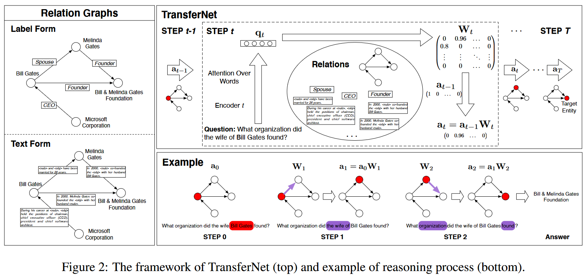
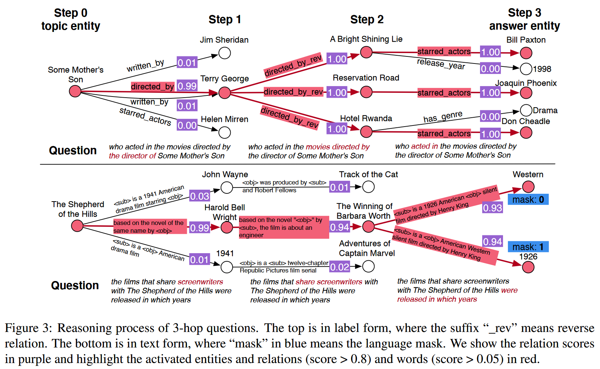

本文针对多跳 KGQA 问题，提出一种透明的框架提升多跳 KGQA 的效率和可解释性。现存的模型通常是通过预测多跳过程中的关系序列或者通过图神经网络提取知识图谱的隐式特征来解决多跳 KGQA 问题，前者由于推理路径的搜索空间太大而难以优化，后者则缺乏可解释性。本文作者提出的 TransferNet 则通过逐步计算，获取推理过程中每个节点激活的实体和关系解决 KGQA 问题，由于推理过程中的中间结果可以轻易被人类理解，具有较好的可解释性。

<!--more-->

## Introduction

文章关注于 *关系图谱(Relation Graph)* 上的多跳 QA 问题，关系图谱中包含实体和他们之间的关系，其关系有两种形式：

- 标签形式：即知识图谱的形式，关系是人工构建的受限的谓语
- 文本形式：关系是从自由文本语料中提取的自由文本。这种关系可以从主客实体同时出现的句子中抽取

标签形式的关系图谱由于需要人工构建和维护，通常成本较高且不完整，文本形式则更加经济且实际。作者提出的 TransferNet 可以在一个统一的框架内解决这两种形式的关系图谱上的多跳 QA 问题。

现存的解决多跳 QA 问题的方法主要有两种思路：

- 在弱监督的设置下学习推理的关系路径，即根据最终答案学习整个推理中间过程。这种方法由于搜索空间太大通常难以优化，对于文本形式的关系图谱，搜索空间则更大。特别地，对于标签形式关系图谱上的多跳 QA 问题(即 KGQA 问题)，主要的解决方案可以归为两类：
  - 信息提取式：通过学习 KG 和问题文本的表征来计算答案
  - 语义解析式：通过将问题语句解析成可执行的逻辑表达式（如 SQL 语句）来查询答案
- 通过图神经网络捕捉图中的隐式特征，这种方法可以解决两种形式的关系图谱，但是由于整个推理过程是黑盒状态，其可解释性较差。

TransferNet 则是通过逐步推理，通过注意力机制让模型在每一步关注于问题文本中某些词，来计算该步中应该激活的关系和实体最终获得答案。

## Methodology

### Relation Graph

记 Relation Graph 为 $\mathcal{G}$, 它的实体和边的集合记为 $\mathcal{E}$ 和 $\mathcal{R}$. 假设 $\mathcal{G}$ 中实体数量是 $n$, 则 $\mathcal{R}$ 是一个 $n\times n$ 的矩阵，其元素 $r_{i, j}$ 表示头实体 $e_i$ 和尾实体 $e_j$ 之间的关系，$r_{i, j}$ 可以是一系列的标签或文本。一个多跳问题 $q$ 通常需要从主题实体 $e_x$ 出发，经过一系列的关系到达答案 $Y = \{e_{y^1}, ..., e_{y^{|Y|}}\}$.

### TransferNet

TransferNet 从主题实体 $e_x$ 出发，经过 $T$ 步逐步推理获得答案。每一步中，TransferNet 关注于问题文本的不同部分来决定最合适的关系路径。TransferNet 维护一个评分向量来表示每个实体的激活概率，初始情况下，主题实体的评分初始化为 1，其余实体评分初始化为 0.

每一步中，TransferNet 通过关注问题不同的部分为每个关系计算一个激活概率，然后据此转移实体评分向量，计算要激活的实体。

形式化地，可以将第 $t$ 步的实体评分向量记为 $\mathbf{a}^t = [0, 1]^n$, 向量维度为 $n$，每个值都是介于 $[0, 1]$ 之间的实数，代表每个实体的激活概率。在第 $t$ 步，模型通过关注于问题文本的特殊部分获得一个查询向量 $\mathbf{q}^t\in\mathcal{R}^d$：

$$\begin{aligned}
    \mathbf{q}, (\mathbf{h}_1, ..., \mathbf{h}_{|q|}) &= \text{Encoder}(q; \theta_e)\\
    \mathbf{qk}^t &= f^t(\mathbf{q}; \theta_{f^t})\\
    \mathbf{b}^t &= \text{Softmax}(\mathbf{qk^t}\cdot[\mathbf{h}_1; ...; \mathbf{h}_{|q|}]^T)\\
    \mathbf{q}^t &= \sum_{i = 1}^{|q|}b_i^t\mathbf{h}_i
\end{aligned}$$

其中，$\mathbf{q}$ 是文本嵌入，$(\mathbf{h}_1, ..., \mathbf{h}_{|q|})$ 是问题文本中每个 token 的嵌入。$f^t$ 是一个投影函数，将问题表征 $\mathbf{q}$ 投影为查询向量 $\mathbf{qk}^t$, $\mathbf{qk}^t$ 即第 $t$ 步的注意力向量，通过其与每个 token 的嵌入 $\mathbf{h}_i$ 相乘再经过 Softmax 获取问题文本中每个 token 的注意力分数向量 $\mathbf{b}^t$, $\mathbf{q}^t$ 则是 $\mathbf{h}_i$ 经过注意力分数加权的加权和。

得到问题文本的注意力查询向量 $\mathbf{q}^t$ 后，TransferNet 基于此计算关系激活分数 $\mathbf{W}^t\in[0, 1]^{n\times n} = g(\mathbf{q}^t; \theta_g)$. 其中的 $\theta_g$ 是函数 $g$ 的可学习参数，对于标签形式和文本形式的关系图谱，将有不同的 $g$ 的实现。

随后，TransferNet 模拟推理过程，计算下一步的激活实体：$\mathbf{a}^t = \mathbf{a}^{t-1}\mathbf{W}^t$, 即：$a_j^t = \sum_{i=1}^{n}a_i^{t-1}\times W_{i, j}^t$. 其物理意义为：实体 $e_i$ 前一步的激活分数乘以边 $r_{i, j}$ 的关系激活分数得到实体 $e_j$ 的当前激活分数。

经过 $T$ 步上述过程后，可以得到每一步的实体激活向量 $\mathbf{a}^1, \mathbf{a}^2, ..., \mathbf{a}^T$, 由于模型无法得知输入的问题实际的跳数，作者通过计算所有 $T$ 步的实体激活向量的加权和作为最终的答案输出：

$$\begin{aligned}
    \mathbf{c} &= \text{Softmax}(\text{MLP}(\mathbf{q}))\\
    \mathbf{a}^* &= \sum_{t=1}^Tc_t\mathbf{a}^t
\end{aligned}$$

其中 $\mathbf{c}\in[0, 1]^T$ 表示输入问题的跳数的概率分布，即 $c_t$ 代表该问题是 $t$ 跳问题的概率。作者在此是寄希望于多层感知机可以根据问题的嵌入 $\mathbf{q}$ 计算出该问题的跳数，并表现为概率分布的形式。因此可以通过该概率分布与每一步的实体激活向量相乘而自动地处理从 1 跳到 $T$ 跳的问题。最终结果 $\mathbf{a}^*$ 中得分最高的实体即为最终答案。

通过上述过程可知，TransferNet 计算过程中每一步的激活实体和激活关系都可以被单独取出观察，由此可以轻易观察到模型的推理过程，因此 TransferNet 是具有高度可解释性的。

### Training

给定问题的答案集 $Y=\{e_{y^1}, ..., e_{y^{|Y|}}\}$, 作者构建目标评分向量 $\mathbf{y}\in\{0, 1\}^n$:

$$y_i = \begin{cases}
    1, \text{if }e_i\in Y\\
    0, \text{else}
\end{cases}$$

作者取 $\mathbf{a}^*$ 与 $\mathbf{y}$ 之间的 $L2$ 范数作为训练目标函数：$\mathcal{L} = \Vert\mathbf{a}^*-\mathbf{y}\Vert$. 由于 TransferNet 整个计算过程是可微的，通过该简单的训练目标可以学习所有中间结果。

### 额外模块

为了帮助训练，作者提出两个额外模块：

1. Score Truncation: 根据实体激活分数计算过程，$a_j^t$ 经过一个转移步之后其值可能会超过 1. 太大的激活分数可能会在跳数过多的情况下导致梯度爆炸，因此作者在每个转移步之后进行分数裁剪，保证激活分数落在 $[0, 1]$ 之间，同时要保证计算过程的可微性：

$$\begin{aligned}
    \text{Trunc}(a) &= \frac{a}{z(a)}\\
    z(a) &= \begin{cases}
        a.\text{detach()}, &\text{if } a > 1\\
        1, &\text{else}
    \end{cases}
\end{aligned}$$

2. Language Mask: TransferNet 在计算时没有考虑可能会提供提示的语言偏向。例如，对于文本形式的关系图： *（Harry Potter, \ was published in \<obj>, United Kingdom）* 和 *（Harry Potter, \ was published in \<obj>, 1997）* 之间的关系文本完全相同，但是一个表示出版地另一个表示出版时间，此时对于问题 *Where was Harry Potter published* , TransferNet 未考虑 *Where* 对答案的提示。

针对此问题，作者引入一个语言遮罩来结合问题提示：$\mathbf{m} = \text{Sigmoid}(\text{MLP}(\mathbf{q}))$, 其中 $\mathbf{m}\in [0, 1]^n$, $m_i$ 表示实体 $e_i$ 的遮罩评分。此处作者寄希望于多层感知机能够根据问题嵌入提取其中的提示，从而从该提示的角度为候选实体评分。

根据语言遮罩修正的结果为：$\hat{\mathbf{a}^*} = \mathbf{m}\odot \mathbf{a}^*$.

注意到相同关系文本不同含义的现象仅出现在文本形式的关系图谱中，标签形式图谱不需要该修正。

### 关系激活分数计算

对于关系分数 $\mathbf{W}^t = g(\mathbf{q}^t; \theta_g)$, 函数 $g$ 对于标签形式和文本形式的关系图谱有不同的实现。

1. 标签形式：关系可以表示为一个固定的谓语集 $\mathcal{P}$. 作者首先根据 $\mathbf{q}^t$ 计算这些谓语的概率，然后根据首尾实体将对应的关系 $r_{i, j}$ 的概率放入 $W_{i, j}$: $\mathbf{p}^t = \text{Softmax}(\text{MLP}(\mathbf{q}^t))$, 如果同时可以激活多个关系，$\text{Softmax}$ 函数可以替换为 $\text{Sigmoid}$ 函数。

假设一对实体之间的关系数目最多为 $b$, 则记 $r_{i, j} = \{r_{i, j, 1}, ..., r_{i, j, b}\}$, $W_{i, j}$ 可以由所有关系 $r_{i, j}$ 的概率之和计算：$W_{i, j}^t = \sum_{k=1}^bp_{r_{i, j, k}}^t$

2. 文本形式：关系是来自文本语料中实体对同时出现的文本，记 $r_{i, j} = \{r_{i, j, 1}, ..., r_{i, j, b}\}$, 其中 $r_{i, j, k}$ 代表第 $k$ 个关系文本。作者使用关系编码器获取关系文本的嵌入，然后计算其分数：

$$\begin{aligned}
    \mathbf{r}_{i, j, k} &= \text{Encoder}(r_{i, j, k}; \theta_r)\\
    p_{r_{i, j, k}}^t &= \text{Sigmoid}(\text{MLP}(\mathbf{r}_{i, j, k}\odot \mathbf{q}^t))\\
    W_{i, j}^t &= \sum_{k=1}^bp_{r_{i, j, k}}^t
\end{aligned}$$

此处作者将关系文本的嵌入与问题文本注意力查询向量相乘，然后寄希望于多层感知机能够根据相乘的结果计算该关系文本的概率分数。

值得注意的是，文本形式的关系图谱中关系文本的数量十分庞大，不可能全部计算其概率分数。因此作者选择在前一步中得分大于一个预定义的阈值 $\tau$ 的实体，然后仅考虑从这些实体开始的关系文本。如果数量仍过于庞大，作者根据它们的头实体激活分数对关系文本进行排序，然后仅取前 $\omega$ 个关系文本。
