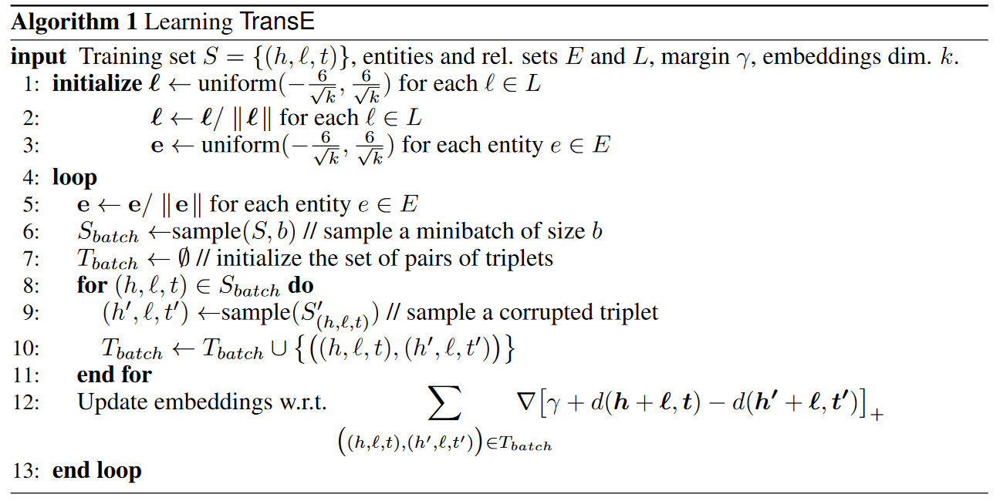

## Motivation

本文主要针对在低维向量空间中嵌入多关系数据(Multi-relational data)的实体和关系信息的问题。

Multi-relational Data, 指节点形如 $(head, label, tail)$ 的有向图，节点中的三元组分别代表**头实体(head entity)**, **尾实体(tail entity)**和头尾实体之间的**关系(label)**。本文的工作主要就关注于如何建模 Multi-relation data 的问题。

**Modeling multi-relational data**

多关系数据建模过程可以归结为实体之间的局部或全局关系模式的抽取过程，并根据观察到的关系模式泛化到所有实体之间进行预测。单一关系的局部性可能是纯粹结构性的，但也与实体类型相关。一般的关系数据则更加复杂，同时涉及关系和实体的类型。因此关系数据是异构的，需要更加泛化性的方法建模。

现存的方法大多基于隐式属性学习的框架，即通过学习实体和关系数据的隐藏表征进行建模。这些工作集中于增加模型的表现力和通用性，一般采用贝叶斯聚类框架或者基于能量的框架在低维向量空间学习实体的表征。这些模型的表现力的提升是以模型复杂度的增加作为代价，这导致其建模假设难以解释，同时带来计算成本的提高。

<!--more-->

## Methodology

本文提出 TransE 模型，它是一个用于实体低维嵌入学习的基于能量的模型。 TransE 将关系视为嵌入空间中的**转移**，即：如果关系 $(h, l, t)$ 存在，那么尾实体 $t$ 的 embedding 应该与头实体 $h$ 的 embedding 和一些与关系 $l$ 相关的向量的加和相近。

**Translation-based model**

定义训练集 $S$, $S$ 中的元素为三元组 $(h, l, t)$. 定义实体集 $E$, 关系集 $L$, 训练集中三元组的 $h, l \in E$ 和 $l$ 分别为 $E$ 中的实体和 $L$ 中的关系。模型为实体和关系学习 $k$ 维嵌入向量 $\mathbf{h, l, t} \in \mathbb{R}^k$. 模型的基本思路是：当关系 $(h, l, t)$ 存在时，使关系 $\mathbf{h} + \mathbf{l} \approx \mathbf{t}$ 也成立( $\mathbf{t}$ 应该是距离 $\mathbf{h + l}$ 最近的向量 )。

根据基于能量的框架(Energy-based Framework), 一个三元组的能量等于 $d(\mathbf{h} + \mathbf{l}, \mathbf{t})$, 其中 $d$ 是某种不相似性评价函数( $L_1$ 或 $L_2$ 范数 )。

训练时，在训练集上最小化下面基于边际的排序标准(margin-based ranking criterion):

$$\mathcal{L} = \sum_{(h, l, t) \in S}\sum_{(h', l, t') \in S'_{(h, l, t)}}[\gamma + d(\mathbf{h} + \mathbf{l}, \mathbf{t}) - d(\mathbf{h'} + \mathbf{l}, \mathbf{t'})]_+$$

其中的 $[x]_+$ 表示 $x$ 的正值部分，$\gamma > 0$ 是一个超参数， $S'$ 定义如下：

$$S'_{(h, l, t)} = \{(h', l, t)|h' \in E\} \cup \{(h, l, t')|t' \in E\}$$

$S'$ 由训练集中的三元组随机替换一个头实体或尾实体(同时只替换一个)组成。

优化的过程通过在所有可能的 $(h, l, t)$ 上进行随机梯度下降算法完成(minibatch mode), 一个附加限制是学习到的所有实体的嵌入其 $L_2$ 范数等于 $1$(关系的嵌入不受此限制) ，这是为了防止训练过程通过减小实体的嵌入向量来最小化损失函数。

TransE 的训练过程如下：

所有实体和关系的嵌入向量首先由随机过程初始化，在每次迭代过程中，首先归一化实体的嵌入向量(归一化限制), 然后从训练集中采样一个小的子集作为训练的 minibatch 。对于每一个训练三元组，为其采样一个受损样本，然后在恒定学习率下根据梯度更新参数。

