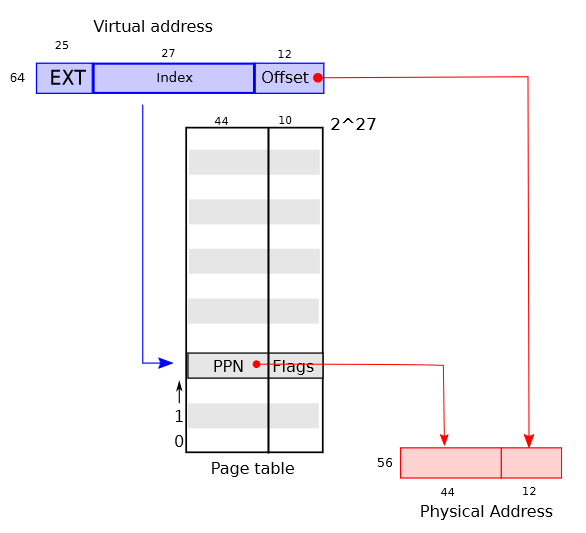
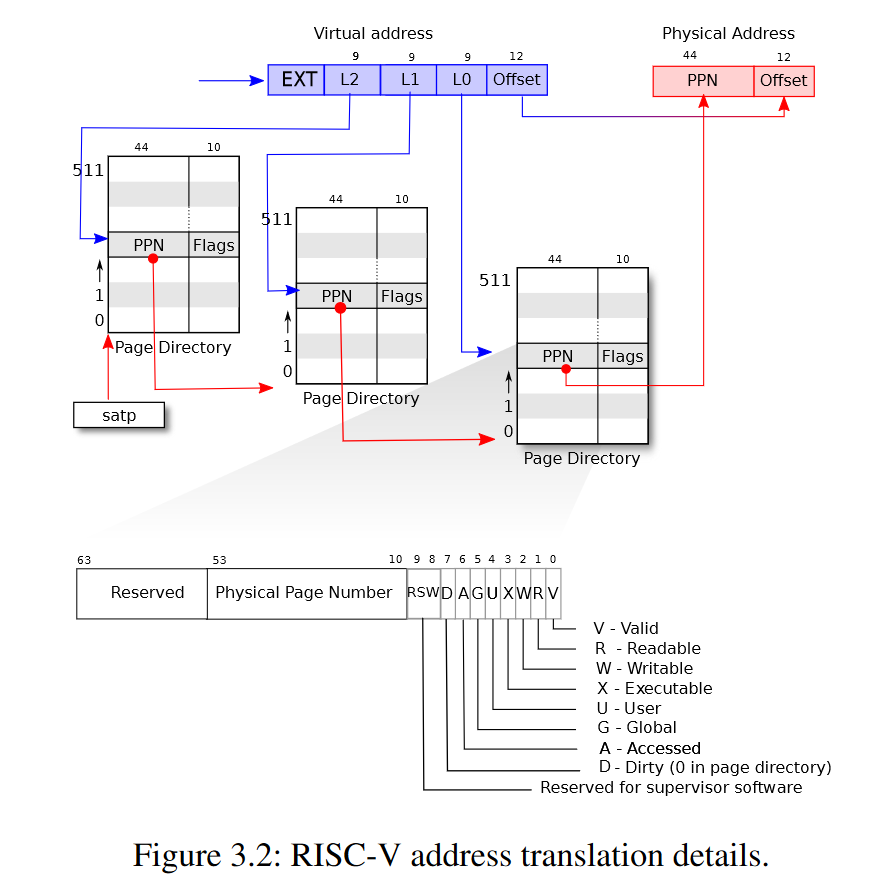

页表是操作系统之所以能够为进程提供独立的地址空间和内存所依赖的机制。

<!--more-->

操作系统使用页表管理物理内存，由页表决定内存地址的意义，以及物理内存的访问。

通过页表提供的中间层，操作系统还可以实现一些额外的 tricks, 例如将同一块内存映射到多个进程的地址空间 (如所有进程地址空间中都一样的内核代码和数据区)，或者通过永远不映射内核所在的内存实现内核和进程之间的隔离。

## 换页硬件

xv6 操作系统是为 RISK-V 处理器设计的，因此这里描述的换页硬件可能和其他系统的有所不同。

在 xv6 所运行在的 Sv39 RISK-V 处理器上，64 位地址的中只有低 39 位被使用，其余 25 位留空。

### 逻辑上
一个 RISK-V 页表是一个 $2^{27}$ 长的 page table entries(PTE) 数组. 而每个 PTE 由一个 44 位宽的物理页编号 (physical page number, PPN) 和一些标志位组成。

换页硬件翻译虚拟地址时，利用虚拟地址低 39 位中的高 27 位在页表中定位 PTE， 然后将找到的 PTE 的 44 位物理页编号和虚拟地址低 39 位中的剩余 12 位组合成一个 56 位的物理地址。

### 实际上
xv6 的页表在实现上并不是一个长度为 $2^27$ 的数组，而是一个三级的树状结构. 数的根部是一个 4096 字节大小的页表页 (储存着页表的页), 其内部保存了 512 个 PTE，其中每个 PTE 保存了下一级页表页的物理地址。

换页硬件使用虚拟地址的 27 位页表地址的高 9 位定位根页表中的 PTE，然后根据该 PTE 定位二级页表，然后使用中间 9 位定位二级页表中的 PTE，并根据二级页表中的 PTE 定位三级页表，最后使用低 9 位定位最终的 PTE。该最终 PTE 的 44 位地址会用来访问实际的页，而虚拟地址中剩余的 12 位会用来在该页中定位字节。

如果三级 PTE 中任意一个不存在 ( 根据虚拟地址检索不到 )，换页硬件会产生页错误异常 (page-fault exception), 将由内核负责处理该异常

### PTE 标志位

每个 PTE 都包含一系列标志位 (flags)， 标识着该 PTE 中的地址被允许的用法：

- `PTE_V (valid)`: 该 PTE 是否可见，如果没有设置 (not set), 对该 PTE 指向的页的引用会导致异常
- `PTE_R (readable)`: 该 PTE 指向的页是否可读
- `PTE_W (writable)`: 该 PTE 指向的页是否可写
- `PTE_X (executable)`: CPU 是否可以将该 PTE 指向的页的内容解释为指令并执行
- `PTE_U (user)`: 该 PTE 指向的页是否可以由用户态指令访问

## 内核地址空间

xv6 为每个进程维护一个页表，该页表描述了进程的用户地址空间。此外，xv6 还维护一个页表用于描述内核的地址空间。

内核将配置自己的地址空间使其能够在可预测的地址上访问物理内存和其他硬件设备。即，内核使用直接映射 (direct mapping) 的方式获取 RAM 和硬件设备寄存器的访问地址。

直接映射即将硬件设备的地址映射为跟它们的物理地址一样的虚拟地址。如内核本身将自己加载到虚拟内存 `KERNBASE=0x80000000` 的位置，同时该地址数值也是其在物理内存中的位置。

内核地址空间中也有一些不是直接映射的虚拟地址:
1. 顶部的 trampoline 页被映射到内核地址空间的顶部，同时它也被映射到用户地址空间的顶部。 ==值得注意的是这个页在物理内存中的位置同时也会被内核的直接映射映射在内核中的某个位置。 
2. 内核栈页. 每个进程都有一个自己的内核栈，所有的内核栈都会被映射在内核地址空间的高处，并且每个内核栈下方会防止一个页的隔离区。该隔离页的 `PTE_V` 没有设置，因此当内核栈溢出到隔离页时，对 invalid 内存的访问会导致异常，并造成 kernel panic.


内核没有全部使用直接映射而是将内核栈以及 trampoline 页映射到顶部主要目的是提供保护机制 (隔离区)


## 物理内存分配

xv6 使用链表管理物理内存, 管理的最小单位是 4096 字节大小的页. 具体地说, xv6 通过链表串起物理内存中所有的页 (从内核地址的结尾到物理内存的结尾) , 分配内存即从链表中移除对应的页节点, 回收内存即将待回收的内存加回到链表

## 进程空间(用户地址空间)

进程的地址空间从虚拟地址 0 一直到 `MAXVA`. 

当进程向 xv6 要求更多内存时, xv6 首先调用 `kalloc` 分配物理页, 随后 xv6 向进程的页表添加指向新分配的物理页的 PTE, 同时为这些 PTE 设置标志位. 

大多数进程用不到全部的地址空间, xv6 将没有使用的 PTE 设置成不可用状态.

页表管理用户地址空间的几点好处:
1. 不同进程维护不同的页表, 可以将用户地址映射为物理内存上不同的页, 使得每个进程拥有自己的私有内存.
2. 每个进程都认为自己的地址空间是从 0 开始且连续的, 但实际的物理内存可以是不连续的
3. 内核可以将同一块在所有进程中共享的物理内存映射到所有进程的地址空间, 即同一块物理内存可以出现在所有进程的地址空间中
