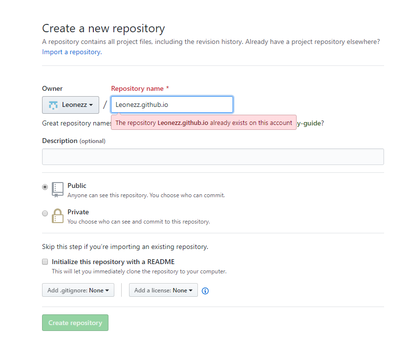
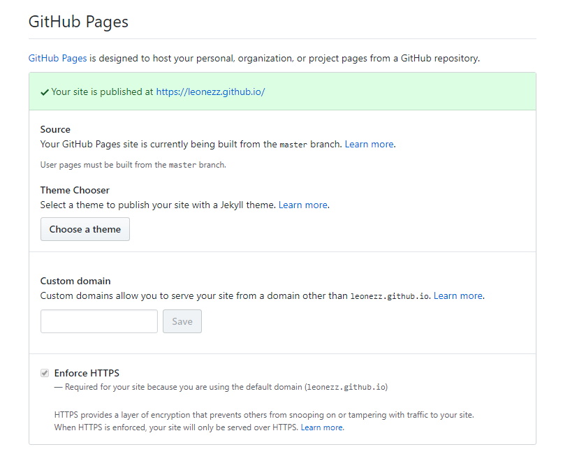

GitHub Pages 是一项静态站点托管服务，它直接从 GitHub 上的仓库获取
HTML、CSS 和 JavaScript
文件，（可选）通过构建过程运行文件，然后发布网站。对于没有服务器和域名的广大人民群众来说，它简直就是搭建个人博客的首选托管平台。

Hexo是一个博客类的快速建站，快速部署脚手架，通过它，即使不具有任何前端知识，也可以快速地建立精美的个人博客网页。

<!--more-->

## 1-在GitHub上新建repository并设置GitHub-Pages

1.  首先登陆你的GitHub帐号，新建一个repository

    

    **注意Repository
    name应该以自己的GitHub用户名+.github.io命名**即：（这里因为我已经有了同名仓库所以报错）

    > .github.io

2.  进入repository的设置页面，设置GitHub Pages

    

    在Theme Chooser 中随便选择一个主题或者不选择都可以。

    如果你有其他的域名，也可以绑定在Custom domain中。

## 2-安装hexo并在本地建站

1.  作为github用户，git的安装不再赘述，可以直接到[Git官网](https://git-scm.com/)下载安装。

2.  安装Node.js。可直接到[Node.js官网](https://nodejs.org/zh-cn/)下载安装。

3.  安装hexo并初始化blog文件夹\
    使用npm包管理工具安装hexo。\
    打开命令行，输入命令：

    `$ npm install -g hexo-cli`

    安装完成之后，命令行进入你预备的博客文件夹(必须是空文件夹)，输入：

    `$ hexo init`

    此时会发现文件夹中呈以下结构：

         └─<yourblogfolder>
             ├─node_modules/
             ├─scaffolds/
             ├─source/
             ├─themes/
             ├─.gitignore
             ├─_config.yml
             ├─package.json
             └─package_lock.json

4.  更换主题\
    在hexo的[主题页面](https://hexo.io/themes/)上有许多漂亮的博客主题，选择一个进入它的github页面，找到项目地址。\
    输入以下命令安装:(这里我用的ayer主题)\
    `$ git clone https://github.com/Shen-Yu/hexo-theme-ayer.git themes/ayer`

    完成后打开themes文件夹，发现多了文件夹ayer/，里面便是ayer主题的文件。

    回到blog文件夹下，打开_config.yml文件，找到


```
# Extensions
## Plugins: https://hexo.io/plugins/
## Themes: https://hexo.io/themes/
theme: ''
```

代码块，将字段theme改成你下载的主题名。

其他更多配置都在文件_config.yml中，访问[hexo文档](https://hexo.io/zh-cn/docs/)查看详情。

## [](#3-网站部署 "3. 网站部署"){.headerlink}3. 网站部署 {#3-网站部署}

1.  配置部署\
    在_config.yml文件中，找到：

```conf
# Deployment
## Docs: https://hexo.io/docs/deployment.html |
deploy:
type: git
repo: https://github.com/Leonezz/Leonezz.github.io.git
branch: master
```

其中字段*repo*填写你刚刚新建的GitHub repository地址。

该代码段实际上是在配置Hexo
Deploy，它描述了要网站托管的GitHub地址和分支。但是hexo需要安装额外的插件才能正确执行该deploy。在blog文件夹下输入以下命令：

`$ npm install hexo-deployer-git --save`

完成后，hexo的git 部署插件便安装到了你的blog文件夹。

输入以下三条命令：

```bash
hexo clean #清除hexo缓存
hexo g      #生成网站
hexo d      #将网站部署到托管服务器
```

便完成了网站的部署，随后便可在域名https://\<你的github用户名\>.github.io访问你的博客网站了。

## 4-hexo-常用命令

```bash
> hexo init #初始化网站文件夹
> hexo clean #清除缓存
> hexo g #生成网站
> hexo s #在localHost预览网站
> hexo d #将网站部署到服务器
> hexo new page "newMenu" #新增的菜单项文件夹
> hexo n "博客名字" #新建博客
```

## ref

[hexo Doc](https://hexo.io/zh-cn/docs/)
[GitHub+Hexo搭建个人网站详细教程](https://zhuanlan.zhihu.com/p/26625249)

## 其他

刚刚建立好博客网站，作为第一篇博文，写下我建站时遇到的问题和查阅的资料以及解决的方法再合适不过了。
