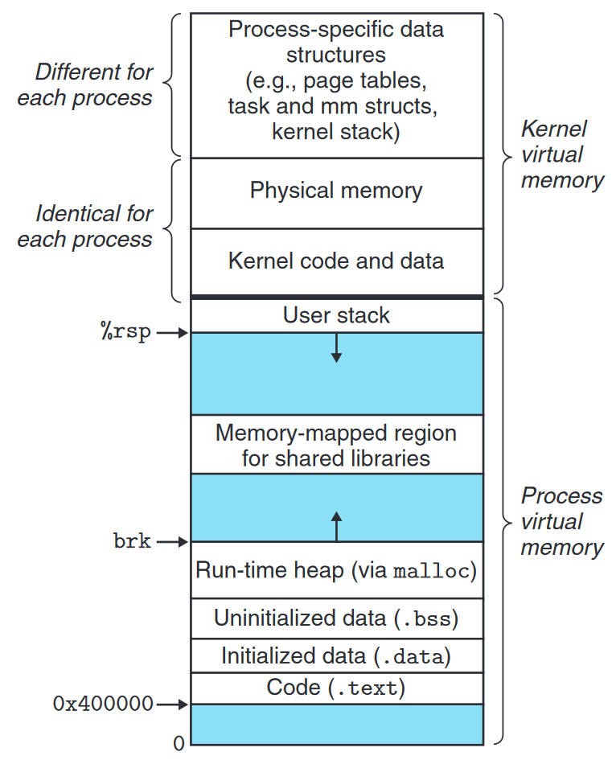

## The core functionality of an OS

操作系统的核心任务在于**同时支持多个活动**，即，操作系统必须将硬件资源分时共享给所有的进程使用。

为了保证进程的活动质量，操作系统还必须保证进程的执行是 **独立/孤立(isolation)** 的，即进程不会因意外或恶意目的破坏其他进程的执行，以及不会被其他进程破坏。

保证独立性的前提下，进程之间合理的交互和通信也应该被支持，因此操作系统应该提供 **进程间通信** 的方式，例如 `pipe`

总的来说，操作系统必须为进程提供以下服务：
- ==时分复用== 底层硬件
- ==独立== 的执行环境(内存，内核状态等)
- 进程之间的合法 ==交互==

<!--more-->

## Abstracting physical resources

为实现进程之间的独立性, 操作系统需要完全接管对系统硬件的管理，在进程和硬件之间提供一层抽象中间层，即将硬件抽象成服务。同时防止进程直接操作系统硬件。

这是因为如果进程可以直接操作硬件，那么则需要进程之间实现很强的协调或同步机制才能实现硬件在多个进程之间的共享。


1. 恶意进程长时间占用硬件或破坏硬件会破坏其他进程的运行
2. 非恶意进程不协调的硬件操作 (例如所有进程都在主动让出硬件) 也会导致进程无法正常运行


### Storage

进程与存储硬件的交互只能通过操作系统提供的 `open`, `read`, `write` 和 `close` 等系统调用进行，由操作系统进行存储硬件(磁盘，光盘，磁带，远程存储服务)的管理和实际的硬件操作。

### CPU

操作系统会透明地在进程之间切换 CPU。即，将进程切出 CPU 是保存寄存器等进程上下文，并在切回时重新载入上下文，如此 **上下文切换** 使得进程对于 CPU 时分复用没有感知，不会干扰进程的执行状态。

### Memory

进程的内存由 `exec` 系统调用交由操作系统内核分配，进程的创建者不需要关心进程在物理内存中的位置。

## User mode, supervisor mode, and system calls

为实现进程的孤立性，即保证进程无法操作其他进程的内存，以及保证进程无法操作系统内核的内存，必须在进程之间设置硬件隔离。

类似目的的硬件隔离可以由 CPU 提供，以 RISC-V 为例，CPU 提供三种指令执行模式：machine mode, supervisor mode, user mode.

### machine mode

在 machine mode 下执行的指令具备全部的特权，即可以操作任意设备。CPU 启动时默认处在 machine mode, 在操作系统的声明周期中，machine mode 一般用来进行系统启动过程的配置，之后操作系统将切换到 supervisor mode

### supervisor mode

在 supervisor mode 下，CPU 可以执行特权指令，例如：使能/失能中断，读取/写入持有页表地址的寄存器等。

1. 在 supervisor mode 下运行的程序也可以称为是在 kernel space 中运行
2. 运行在 kernel space 中的程序被称为 kernel


kernel is running in kernel space, and there is nothing but the kernel in kernel space.


### user mode

user mode 下 CPU 只能执行如算数运算等用户态指令。

如果 user mode 下的程序试图执行特权指令，那么 CPU 会切换到 supervisor mode 并终止该程序。

在 user mode 下执行的程序也被称为在 user space 中执行

## Kernel organization

有很多种组织方式可以实现 OS 的核心要求，两种大的分类是**宏内核(monolithic kernel)** 和 **微内核(micro kernel)**. 它们的主要区别在于哪些组件运行在 supervisor mode (kernel space)

其中宏内核是目前大多数 Unix 操作系统内核所采用的组织方式。

### Monolithic Kernel

宏内核即整个操作系统都运行在 kernel space, 也即整个操作系统都属于内核的一部分。

这样的组织方式下所有的操作系统部件都具备硬件特权，其具备如下优缺点:

优点：
- 设计方便，操作系统设计者不需要考虑不同操作系统部件对特权指令的要求不同
- 利于操作系统组件之间的协作，例如虚拟内存部件和文件系统部件之间可以共享缓存

缺点：
- 操作系统部件之间的接口较复杂，因此系统中存在 bug 的可能性更高
- 一旦某个部件运行错误，由于其运行在 supervisor mode, 错误通常会导致整个内核 fail, 进而导致计算机停止运行。

### Micro Kernel

考虑宏内核的缺点，即复杂性带来的工程问题，OS 设计者考虑将内核最小化，即将大部分的操作系统组件移到 user space. 

这种内核组织方式即 微内核

在微内核操作系统中，部分操作系统功能以进程的形式运行在 user mode 下，这种进程称为服务

## Process overview

进程是 Unix 提供的孤立 (isolation) 执行单元，进程对执行程序的抽象保证了程序无法破坏或监视其他程序的内存，CPU，文件描述符等运行时上下文，无法破环内核的运行状态。

操作系统内核通过进程这一抽象为执行程序提供了一种幻觉：程序会幻觉自己在独占机器硬件

实现这一幻觉所使用的机制包括 user/supervisor mode flag, address spaces, time-slicing of threads

### Address space

操作系统通过为每个进程维护独立的地址空间为程序提供其在独占内存的幻觉。

具体地说，操作系统使用**页表 (page tables)** 将进程地址空间中的 ==虚拟地址 (virtual address)== 映射为硬件上的 ==物理地址(physical address)== . 其中虚拟地址即程序指令操作的地址，物理地址则是 CPU 在访存时发给主存的地址。

操作系统内核为每个进程维护一个独立的页表，该页表定义了进程的地址空间。地址空间通常组织如下(一个典型 Linux 进程的地址空间，与 xv6 实现的地址空间存在差异)：

### Thread

进程的指令是由 thread 执行的，thread 可以被暂停和恢复。当 CPU 在进程间切换时，关于指令执行部分的切换工作实际上是暂停上个进程的 thread 然后恢复下个进程的 thread。

thread 的状态(local variables, function call return addresses) 主要存储在 thread 的 stack 中。而进程维护两个 stack: user stack 和 kernel stack. 当 process 的 thread 在执行用户指令时，使用的是 user stack, 此时 kernel stack 是空的。当进程进入内核时(通过系统调用或中断)，内核中的代码会在进程的 kernel stack 中执行，此时进程的 user stack 没有被占用，但其中仍储存着数据。

进程的整个生命周期中，user stack 和 kernel stack 一直在交替被占用。同时 kernel stack 不能由用户代码操作，以防用户代码破坏内核代码的执行。