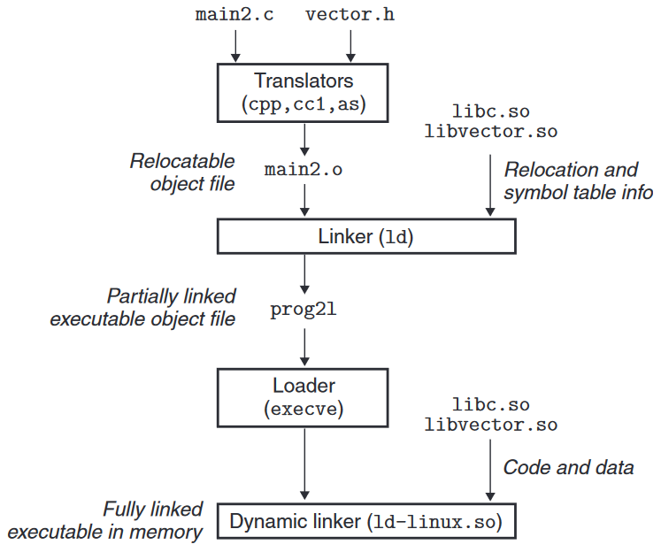
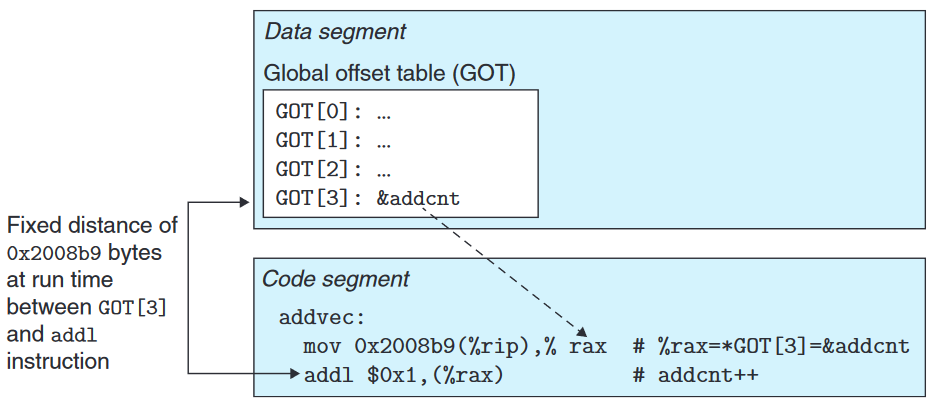
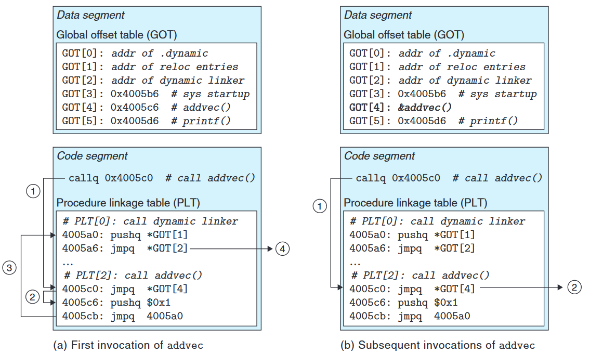

对于被广泛使用的标准库或其他库, 如果一个系统中多个程序都在引用相同的符号, 此时使用静态库将需要为每个程序都加载一份符号定义的代码和数据, 这对内存是极大的浪费.

共享库 (shared library) 是解决静态库这一问题的产物. 共享库是一个目标模块, 在运行或加载时可以被加载到任意内存地址, 并和一个在内存中的程序链接起来. 这一过程称为动态链接, 是由一个叫做 *动态链接器 (dynamic linker)* 的程序执行的.

<!--more-->

## 动态链接

- 在链接时, 文件系统中对于一个共享库只有一份 `.so` 文件, 所有引用该库的可执行目标文件共享这个 `.so` 文件中的代码和数据, 而不是像引用静态库一样将静态库的内容嵌入进可执行目标文件. 
- 在执行时, 一个共享库的 `.text` 节在内存中的副本可以被不同的进程共享

下图是动态库的链接过程:



链接器在构造可执行目标文件时, 没有将任何动态库的代码和数据被复制进可执行目标. 但链接器需要复制关于重定位和符号表的信息进入可执行目标, 这些信息指引加载器解析程序对动态库的引用.

在加载和运行时:
1. 加载器加载部分链接的可执行目标文件
2. 加载器会注意到部分链接的可执行目标文件中存在一个 `.interp` 节, 这一节中包含动态链接器的路径名
3. 动态链接器也是一个共享库 (在 Linux 系统上是 `ld-linux.so`). 加载器加载并运行动态链接器
4. 动态链接器执行以下重定位以完成链接:
    1. 分别重定位 被引用的共享库 的文本和数据
    2. 重定位可执行目标中对共享库中符号的引用
5. 动态链接器将控制权传递给可执行目标程序 

## 动态加载

除了在链接时由链接器提供重定位信息, 并在运行前由加载器加载, 动态库还可以在运行时动态地加载, 不需要链接器的重定位信息

具体地说, 动态加载是在程序运行时动态地调用动态链接器提供的接口实现的, 通过这些接口可以动态地调用动态链接器在运行时解析共享库.

下面是 Linux 系统提供的简单接口:

```c
#include <dlfcn.h>

/*
* @filename: 动态链接库路径
* @flag: 打开的模式
* 打开和链接一个本地动态链接库, 返回指向该库的句柄. 打开失败则返回 NULL
*/
void* dlopen(const char* filename, int flag);

/*
* @handle: 动态链接库句柄
* @symbol: 符号名称
* 在给定动态链接库句柄中查找给定名称的符号的句柄. 查找失败返回 NULL
*/
void* dlsym(void* handle, char* symbol);

/*
* @handle: 要关闭的动态链接库句柄
* 卸载一个共享库
*/
int dlclose(void* handle);

/*
* 返回最近一次调用 dlopen, dlsym 或 dlclose 的错误
*/
const char* dlerror(void);
```

## 位置无关代码 (Position-Independent Code, PIC)

实现共享库的一项关键技术是位置无关代码, 这类代码可以被加载到内存中的任意位置而无需链接器修改.

GCC 编译器可以使用 `-fpic` 选项生成 PIC 代码. 对于共享库中模块内部定义的符号, 编译器可以使用 PC 相对偏移地址生成 PIC 代码. 但是对于全局符号的处理则需要特殊技巧.

### PIC 数据引用

编译器利用一个有趣的事实生成对全局变量的 PIC 引用: 即无论我们在内存中的何处加载一个目标模块 (包括共享目标模块), 数据段和代码段之间的距离总是保持不变. 因此, 代码段中的任何指令和数据段中的任何变量之间的距离都是一个运行时常量.

编译器利用了上述事实, 它在数据段开始的地方创建一个 *全局偏移量表  (Global Offset Table, GOT)*. 在 GOT 中, 每个被这个目标模块引用的全局符号都有一个 8 字节条目. 编译器还为每个条目生成一个重定位记录. 在加载时, 动态链接器会重定位 GOT 中的每个条目, 使它包含正确的绝对地址.

如下图, 代码段中对 `addcnt` 的地址的访问被设置为了 `0x2008b9(%rip)`, 即 PC 指针偏移  `0x2008b9` 的位置, 即 `GOT[3]`. GOT 在编译时不会填充有效的值, 但在加载时, 动态链接器会将其填充为加载到内存中的动态连接库中定义的符号的地址.



### PIC 函数调用

对于对共享库中定义的函数的调用, PIC 代码编译系统使用 *延迟绑定 (lazy binding)* 技术解析其地址. 具体地说, 就是将对函数地址的解析延迟到第一次调用该函数时. 其动机是对于定义了很多个函数的标准共享库, 典型的程序只会使用其中的一小部分, 延迟绑定可以避免对没有调用过的函数地址的解析.

延迟绑定是通过 GOT 和 *过程连接表 (Procedure Linkage Table, PLT)* 之间的交互实现的.
- PLT 是一个数组, 其中每个条目是一个 16 字节的代码:
    - 每个对共享库函数的调用都有一个条目, 每个条目负责解析一个函数调用.
    - `PLT[0]` 是一个特殊的条目, 它跳转到动态链接器.
    - `PLT[1]` 调用系统启动函数 `__libc_start_main`, 它初始化执行环境, 调用 `main` 函数并处理其返回值.
    - `PLT[2]` 及以后的条目调用用户代码中调用的函数
- 和 PLT 联合使用时:
    - `GOT[0]` 和 `GOT[1]` 包含动态链接器在解析函数地址时会用到的信息
    - `GOT[2]` 是动态链接器在 `ld-linux.so` 模块中的入口点.
    - 其余的每个条目对应一个被调用的函数, 其地址在运行时被解析. 每个条目都有一个相匹配的 PLT 条目. 初始时, 每个 `GOT` 条目都指向对应于 `PLT` 条目的第二条指令

当第一次调用一个共享库中定义的函数时, 延迟绑定的流程如下图:



1. Instead of directly calling `addvec`, the program calls into `PLT[2]`, which is the PLT entry for `addvec`.
2. The first PLT instruction does an indirect jump through `GOT[4]`. Since each GOT entry initially points to the second instruction in its corresponding PLT entry, the indirect jump simply transfers control back to the next instruction in `PLT[2]`
3. After pushing an ID for `addvec` (`0x1`) onto the stack, `PLT[2]` jumps to `PLT[0]`.
4. `PLT[0]` pushes an argument for the dynamic linker indirectly through `GOT[1]` and then jumps into the dynamic linker indirectly through `GOT[2]`. The dynamic linker uses the two stack entries to determine the runtime location of `addvec`, overwrites `GOT[4]` with this address, and passes control to `addvec`.