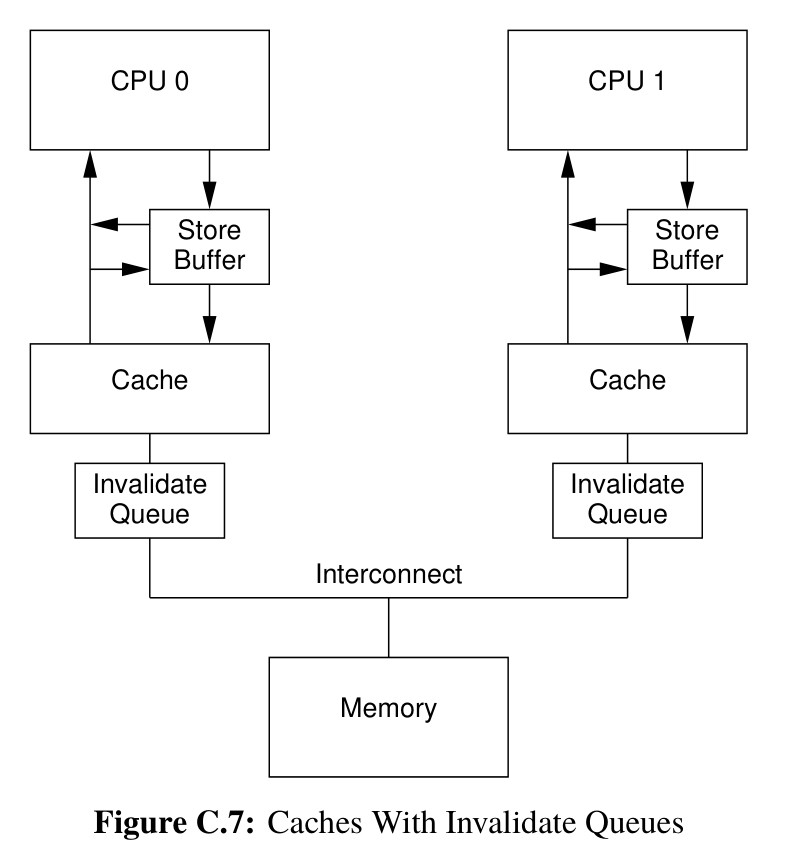

Memory Barrier 是 CPU 提供的一种机制, 它的作用是在程序中设置一个内存屏障, CPU 会保证所有在 Memory Barrier 之前的代码对内存的访问 (改动) 在 Memory Barrier 之后都是可见的. 这一保证据有两方面的效应:
1. 所有 Memory Barrier 之后的代码都不能被重排 (Reordering) 到 Memory Barrier 之前执行
2. 当执行到 Memory Barrier 时, CPU 必须在所有 Core 之间同步 Cache, 保证此刻所有 Core 看到的内存是一致的.

Memory Order 是 C++ 11 提供的一种并发编程机制, 它允许显式地限制编译器/CPU 对指令的重排 (Reordering), 以及显式地控制多核 CPU Cache 之间的同步. 其效果是使得不同线程/不同 CPU Core 所观察到的原子操作附近的内存操作具有可预测的顺序.

<!--more-->

## 从编译器优化说起

众所周知, 编译器不会忠实地将程序代码翻译为机器码, 而是在遵守 As-if 原则的前提下使用一定程度的指令重排以提高程序效率. As-if 原则是指优化前后的程序在单线程执行时应该具有相同的行为. 因此, 在多线程并发情况下, 无法完全假定程序中位于前面的代码会先于后面的代码执行. 例如如下的简单程序:

```cpp
int a{};
int b{};
int main(){
  ++a;++b;
  a = a + b;
}
```

在 `g++ -S p1.cpp -o p1.s -O3` 命令下编译得到的汇编代码 (部分) 为:

```asm
main:
	movl	b(%rip), %eax       ; move b to %eax
	movl	a(%rip), %edx       ; move a to %edx
	addl	$1, %eax            ; ++b
	movl	%eax, b(%rip)       ; move (b + 1) back to b
	leal	1(%rax,%rdx), %eax  ; move (1 + b + a) to %eax
	movl	%eax, a(%rip)       ; move (1 + b + a) to a
	xorl	%eax, %eax
	ret
```

可以看出:
1. 汇编代码首先计算了排在 `++a` 后面的 `++b`
2. 汇编代码没有计算 `++a`, 而是直接计算出了 `a` 的最终值 `a = 1 + b + 1 + a`

如果在多线程环境下, 一个线程读到 `b` 自增了 `1` 就错误地假设 `a` 已经完成了自增, 那么程序的行为就无法定义.

### CPU 重排

另一个会重排指令的地方是 CPU 指令执行模型. 在现代 CPU 设计中, 设计者利用很多机制如乱序发射, 分治预测等提高指令执行的并行性. 这种设计加速程序执行的同时也使得在并发情况下程序的指令执行顺序不可预测.

### 内存可见性

CPU Cache 的存在使得指令执行的结果 (内存的变动) 可能不会立即被其他 CPU Core 观察到. 对这个现象的理解需要了解 CPU Cache 的架构和缓存一致性协议.

大致地说, CPU 直接能够访问的 Cache 是存在于每个 CPU Core 上的, 即, 每个内核独占地使用一份 Cache. 而 Cache 实际上是主存的缓存, 即一份副本, 那么为了保持每个 CPU Core 中的内存副本是一致的, 就需要一套 cache coherence protocol. Cache coherence Protocol 定义了 Cache line (Cache 操作的最小单位) 的几种状态, 以及 Core 之间沟通的几种消息:

Cache line 状态:
1. Modified(M): 即当前的 core 修改了该 cache line, 在当前的 core 将这个 cache line 同步到 memory 之前, 其他的 core 不能再修改这个 cache line 对应的内存位置
2. Exclusive(E): 即当前 core 缓存的这个 cache line 是最新的, 当前的 core 可以直接 modify 这个 cache line 而不需要等待其他 core 的同步.
3. Share(S): 当前 core 缓存的这个 cache line 在其他的 core 的 cache 中也存在副本, 如果当前 core 需要修改这个 cache line 则需要与其他 core 同步
4. Invalid(I) 表示这个 cache line 是空的

Protocol Message:
1. Read: 当一个 core 需要读某个 cache line 时发起 read 消息
2. Read Response: 对 Read 的回应, 可以来自其他 core 的 cache 也可以来自 memory. 如果其他 core 中的该 cache line 是 Modified(M) 状态, 则由该 core 发起 Read Response.
3. Invalidate: 该消息包含一个 memory location, 收到此消息的 core cache 需要删除包含该 memory location 的 cache line, 并响应.
4. Invalidate Acknowledge: 收到 Invalidate 的 Core 删除 cache line 中的数据, 然后向发起者响应 Invalidate Acknowledge 消息.
5. Read Invalidate: 即 Read 和 Invalidate 的结合.
6. Write back: 消息中包含数据和地址, 将数据写入内存中给定的地址位置.

通过上述的一致性协议, 可以保证所有 CPU Core 对 cache line 的访问总是一致的:
- 如果某个 Core A 需要写入一个 memory location, 而这个 memory location 存在于另一个 Core B 的一个 Modified cache line 中. 那么 Core A 就必须发起 Invalidate 消息, 然后等待来自 Core B 的 Invalidate Ack 后才能写入.
- Core B 收到 Invalidate 消息后需要先将 cache line invalidate 掉再响应 Invalidate Ack.

但是 CPU 设计者不满足于这样的等待, 于是他们又引入了两层缓存, 即 Store Buffer 和 Invalidate Queue.
- Store Buffer 位于 Core 和 Cache 之间. 这一层 buffer 提供了这样的功能: 当 Core A 执行写入操作时, 不需要等待来自 Core B 的 Invalidate Ack 消息, 而是直接写入在 Store Buffer 中, 然后执行后续的操作. 等收到 Invalidate Ack 消息后再将 Store Buffer 同步到 Cache 中.

    值得注意的是, 由于 Store Buffer 的存在, Core 需要 `load` 数据时需要先在 Store Buffer 中查找以保证 `load` 的数据是最新的. 这一过程叫做 Store Forwarding
- Invalidate Queue 位于 Core Cache 和 memory 之间. 当 Core A 向 Core B 发送 Invalidate 消息时, Core B 可以直接将该消息放入自己的 Invalidate Queue, 并立即返回 Invalidate Ack.

    需要注意的是, 如果 Core A 的 Invalidate Queue 中已经存在了该 cache line 的 Invalidate 消息, 那么它必须处理该 cache line 的 Invalidate 事件. 总的来说, 带有 Invalidate Queue 的 Core 提供这样一种保证: 在传输任何关于该 cache line 的 MESI 消息之前处理该条目.



这样的策略进一步压栈了 CPU 性能, 但是其带来一些问题, 例如如下的程序:

```cpp
#include <assert.h>

#include <thread>
int a{};
int b{};

void foo() {
  a = 1;
  b = 1;
}

void bar() {
  while (b == 0) continue;
  assert(a == 1);
}
```

假设 Core A 上运行的线程 1 和 Core B 上的线程 2 分别运行 `foo()` 和 `bar()`. 那么理想情况下, 当线程 2 从 `while` 循环退出时, 全局变量 `a` 的值应该已经变为了 `1`, 即断言会成功. 但实际上, 由于内存可见性以及可见性顺序的不确定性, 断言可能会失败:
1. 假设此时 `a` 不存在于 Core A 的 Cache 中, `b` 存在于 Core A 的 Cache 中且状态为 M. 那么:
    1. Core A 执行 `a = 1` 之后将 `a` 的值放进 Store Buffer, 然后继续执行 `b = 1`, 因为 `b` 在 Core A 上是 M 状态, 因此对 `b` 的修改不需要和其他 core 同步. 
    2. 此时 Core B 执行 `while(b == 0)` 时发现 `b == 1`, 那么就会退出循环执行 `assert`.
    3. 但此时如果 Core A 的 Store Buffer 还没有将 `a` 的值同步到 Cache 的话, Core B 获取到的 `a` 值将为 0. 此时结果不符合预期.
2. 假设 Core A 及时将 Store Buffer 中的值刷到 Cache 中.
    1. 那么 Cache 会向 Core B 发送 Invalidate 消息, 提醒其关于 `a` 的值已经失效. 这个消息会 push 到 Core B 的 Invalidate Queue 中
    3. 当 Core B 发现 `b == 1` 退出循环时, 如果它还没有处理 Invalidate Queue 中的消息, 即 Core B 中 `a` 的 Cache Line 状态不为 `l`, 那么 Core B 此时获取到的 `a` 的取值仍然是 0. 结果不符合预期.

上面两种情况下不符合预期的行为是无法在 CPU 层面解决的: 读取变量的 CPU Core 并不知道读取的变量与其他 Core 有什么关系.

### Memory Barrier

为了保证程序的正确性, CPU 设计者提供了 Memory Barrier 机制. 它具体的形式是一种指令, 它的执行效果是将 Store Buffer 和 Invalidate Queue 与 Cache 同步, 即要求 CPU Core 立即处理这些缓存.

更具体地说, CPU 设计者为读写操作分别引入了不同的 Memory Barrier 指令:
- 对于读操作, Read Memory Barrier 会将 Invalidate Queue 与 Cache 同步
- 对于写操作, Write Memory Barrier 会将 Store Buffer 与 Cache 同步

## Memory Order

由于以上的原因, 并发编程在没有设置 Memory Barrier 时难以获取跨线程一致的内存顺序. C++ 对这些现代多核 CPU 并行运行时的内存可见性提供的抽象是 Memory Order.

具体地说, C++ 抽象了 3 种内存顺序模型:

### Sequential Consistent

即顺序一致性模型, 这种模型下编译器和 CPU 严格按照代码顺序生成和执行指令. 同时所有的内核观察到的内存顺序都一致, 即内存修改的顺序以及可见的顺序是全局一致的 (global memory order)

### Happens Before

即按照代码顺序, 如果语句 A 在语句 B 的前面, 那么 **语句 A 的执行所产生的效果需能够被语句 B 的执行观察到**, 则称语句 A *Happens Before* 语句 B. 值得注意的是 Happens Before 强调内存修改的可见性顺序, 并不强调 「实际的执行顺序」.

### Synchronizes With

如果线程 A 中的一个 atomic store 操作是 「Release 操作」, 线程 B 种对同一个变量的 atomic load 操作是 「Acquire 操作」, 并且线程 B 中的 load 操作读取到了线程 A 中的 store 操作所写入的值, 那么称线程 A 中的 Store 操作 *synchronizes with* 线程 B 中的 Load 操作.

## `std::atomic` 和 `std::memory_order`

对于上面三种抽象内存顺序模型, C++ 标准提供了 6 个 flag 用于控制对 atomic 变量 load 和 store 操作, 以使得原子变量周围的内存可见性顺序能够满足以上顺序模型.

### `memory_order_relaxed`(Relaxed Ordering)

松散模型, 用该 flag 标记的原子变量操作只保证原子变量本身的内存一致性, 对其他内存的读写操作没有任何的同步和重排限制.

### `memory_order_acquire` 和 `memory_order_release` (Acquire-Release Ordering)

C++ 借鉴 lock 的 lock 和 unlock 操作, 引入了两个概念: Acquire 和 Release.

Acquire 操作是一种 load 操作, 它保证该 load 操作之后的操作不会被重排到该 load 操作之前. 如果对同一个原子变量的一个 Release 操作 synchronizes with 该 Acquire 操作, 那么这个 Release 操作之前所有的写操作对内存的影响对于该 Acquire 操作以及之后的操作都可见.

Release 操作是一种 store 操作, 它保证该 store 操作之前的操作不会重排到该 store 操作之后. Release 操作和 Acquire 操作一般配合使用.

### `memory_order_consume`

Consume 操作类似于 Acquire 操作, 也是一种 load 操作, 但是其要求更加宽松. 一个某原子变量上的 Consume 操作仅能看到对于 **该原子变量依赖于的内存** 的修改, 而不是所有对于该原子变量的 Release 操作之前的内存修改.

### `memory_order_acq_rel`

该操作用于 read-modify-write 操作, 即一个即读取, 又修改, 又写入的原子变量操作. 它保证该 rmw 操作前后的语句都不会跨越该操作而重排. 该操作兼容 Acquire 和 Store 操作, 且整体上是原子的.

### `memory_order_seq_cst`(Sequentially Consistent Ordering)

即 Sequential Consistent 操作, 可以用于 load/store/read-modify-write 操作. 且所有操作都保证有双向屏障 (读写 memory barrier), 操作的前后语句都保证不会重排, 所有变量的内存可见顺序对于所有的线程都是一致的.

## Conclusion

本文从编译器优化会重排程序代码的执行顺序说起, 对于会产生代码执行顺序变化的 *编译器优化* 和 *CPU reordering* 进行了讨论. 对于一个确定的指令执行顺序, **内存可见性顺序** 也会影响程序在 **并发** 时的行为. 针对这一现象, 本文从 CPU Cache 的结构和缓存一致性协议说起, 介绍了引起内存可见性顺序不定的原因: store buffer 和 invalidate queue. 针对这些原因, 本文介绍了 CPU 设计者提供的 Memory Barrier 指令. 基于上述基础, 本文介绍了 C++ 对内存可见性顺序的抽象: Memory Order, 并分别对 C++ 提供的 6 个 memory order flag 和它们能够组合成的 3 种 memory order model 进行了介绍.

## References

1. [std::memory_order - cppreference.com](https://en.cppreference.com/w/cpp/atomic/memory_order#Relaxed_ordering)
2. Paul E McKenney. **Is Parallel Programming Hard, And, If So, What Can You Do About It?**.
3. [现代C++的内存模型 - 知乎 (zhihu.com)](https://zhuanlan.zhihu.com/p/382372072)
4. [高并发编程--多处理器编程中的一致性问题(上) - 知乎 (zhihu.com)](https://zhuanlan.zhihu.com/p/48157076)
5. [谈谈 C++ 中的内存顺序 (Memory Order) - Luyu Huang's Blog](https://luyuhuang.tech/2022/06/25/cpp-memory-order.html)
