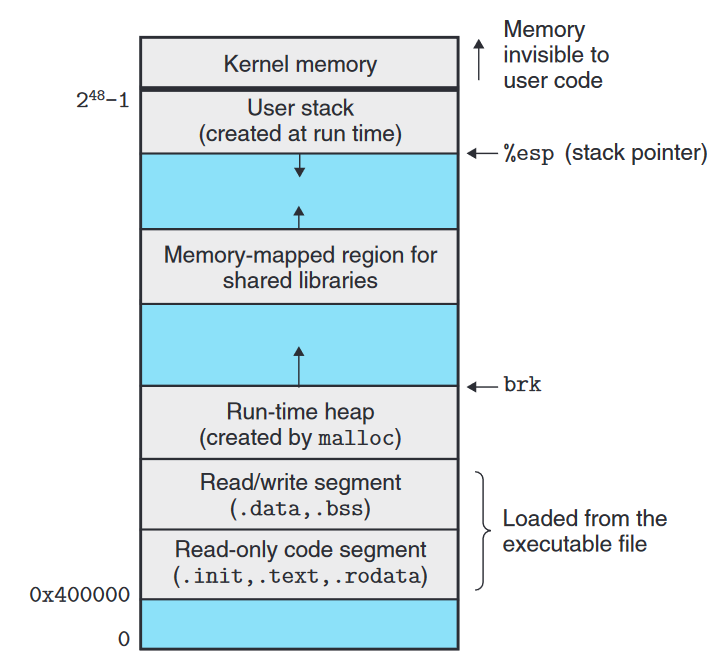

链接器 [链接](../Linkage) 的结果是生成一个可执行目标文件, 这个目标文件中包含将程序加载到内存并运行的所有信息. 下图是一个 ELF 可执行目标文件所包含的信息:

<!--more-->

- ELF header 描述文件的总体格式, 以及程序的入口点 (entry point), 即程序运行时执行的第一条指令的地址
- `.init` 节定义了一个 `_init` 函数, 程序的初始化代码会调用该函数
- program header table 描述了文件中连续的片 (chunk) 与连续的内存段之间的映射关系

## 加载

可执行目标文件的运行由加载器 (loader) 完成. 加载器将可执行文件中的代码和数据从磁盘复制到内存, 然后通过跳转到程序的第一条指令或入口点运行该程序.

每个 Linux 程序都有一个如下图所示的运行时内存映像:

- 在 Linux x86-64 中, 代码段总是从 `0x400000` 处开始,
- 后面是数据段 (已初始化数据 `.data` 和未初始化数据 `.bss`).
- 运行时堆在数据段之后, 通过 `malloc` 函数调用向上增长.
- 堆之后有一块为 [动态库](../共享目标文件-共享库) 保留的内存, 共享库将被加载到该区域.
- 其后是用户栈区, 其总是从最大的合法用户地址 ($2^{48} - 1$) 开始, 随程序的栈帧分配和释放向下增长或向上回收. 
- 地址 $2^{48}$ 开始是为系统内核的代码和数据保留的区域


上面对程序内存映像的描述和图示在逻辑上是正确的, 但实际上由于内存对其, 内存保护等的要求在实现上略有不同.


**当运行一个程序时, 具体发生了什么**:

加载器为程序创建上图所示的内存映像,
并在程序头部表 (`program header table`) 的引导下完成片 (chunk) 的复制.
随后, 加载器跳转到程序的入口点, 即 `_start` 函数的地址, 这个函数在系统目标文件 `ctrl.o` 中定义,
`_start` 函数会调用系统启动函数 `__libc_start_main`, 该函数定义在 `libc.so` 中,
它会初始化执行环境, 调用用户层的 `main` 函数, 处理 `main` 函数的返回值, 并在需要的时候将控制还给内核.

