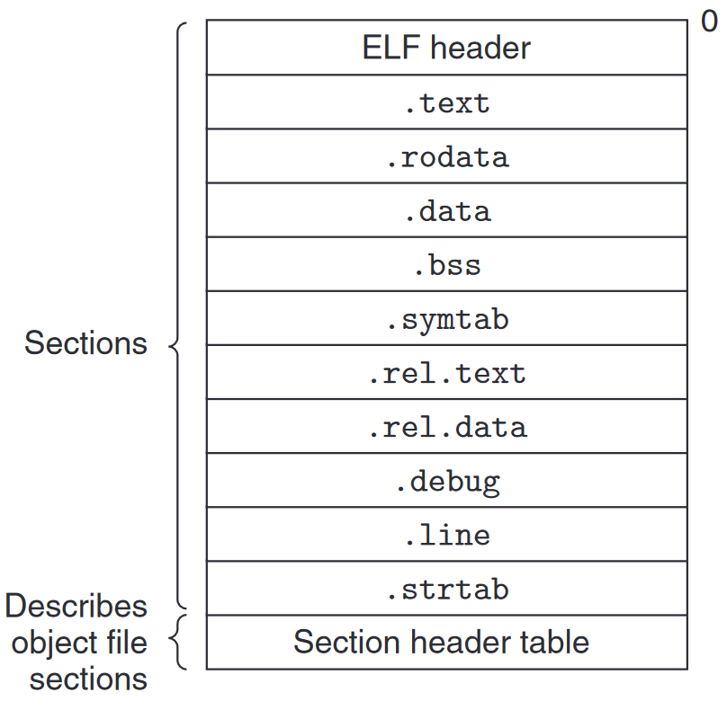

现代 x86-64 系统使用可执行可链接格式文件 (Executable and Linkable Format, ELF)

ELF 文件的结构:



<!--more-->

- ELF header: 
    - 一个 16 字节的序列描述生成该文件的系统的 ==字长== 和 ==字节顺序 (大小端)==
    - 剩下的部分包含帮助链接器语法分析和解释目标文件的信息, 如 ELF 头的大小, 目标文件的类型 (e.g. 可重定位目标文件/可执行目标文件/共享目标文件), 机器类型 (e.g. x86-64), 节头部表 (section header table) 的偏移地址, 以及节头部表的条目大小和数量
- section:
    - `.text`: 已编译程序的机器代码 (指令)
    - `.rodata`: 只读数据
    - `.data`: ==已初始化的全局和静态变量==
    - `.bss`: 未初始化的全局和静态变量, 以及所有被初始化为 0 的全局或静态变量
    - `.symtab`: 符号表, 存放程序中定义和引用的函数和全局变量的信息
    - `.rel.text`:  `.text` 节中位置的列表, 链接器需要修改这些位置
    - `.rel.data`: 被模块引用或定义的所有全局变量的重定位信息
    - `.debug`: 调试符号表, 其条目是程序中定义的局部变量和类型定义, 程序中定义和引用的全局变量, 以及原始的 C 文件. 只有以 `-g` 选项调用编译器才会得到这张表
    - `.line`: 原始 C 文件中的行号和 `.text` 节中机器指令之间的映射, 只有以 `-g` 选项调用编译器才会得到这张表
    - `.strtab`: 一个字符串表, 其内容包括 `.symtab` 和 `.debug` 节中的符号表, 以及节头部中的节名字.
- 节头部表 (section header table)

### 符号和符号表

每个 ELF 文件都有一个符号表, 包含该模块 (文件) 定义和引用的符号的信息. 链接器考虑三种类型的符号:
- 由当前模块定义的并能被其他模块引用的 *全局符号*, 对应于非静态的函数和全局变量
- 由其他模块定义并被当前模块引用的 *全局符号*, 称为 *外部符号*. 对应于其他模块中定义的非静态函数和全局变量
- 只被当前模块引用和定义的 *局部符号*, 对应于带 `static` 属性的函数和全局变量

### 重定位条目 (relocation entry)

汇编器生成可重定位目标模块时, 它并不知道该模块的数据和代码在最终程序中的内存位置, 也不知道这个模块所引用的外部符号 (函数, 全局变量) 的位置. 

因此, 当编译器遇到一个对未知位置的目标引用时, 它就会生成一个 *重定位条目*, 告诉链接器在链接时如何修改这个引用. 

代码的重定位条目存在于 `.rel.text` 节, 数据重定位条目存放在 `.rel.data` 节.

下面是重定位条目的结构:

```c
typedef struct {
    long offset;     // Offset of the reference to relocate
    long type: 32,   // Relocation type
         symbol: 32; // Symbol table index
    long addend;     // Constant part of relocation expression
} Elf64_Rela;
```

- `offset`: 需要被修改的引用的节偏移
- `symbol`: 需要被修改的引用应该指向的符号
- `type`: 告知链接器应该怎么修改新的引用. 两种基本的类型:
    - `R_X86_64_PC32`: 相对地址, 使用一个 32 位的相对 PC 的偏移量重定位目标引用, 如 `call` 指令
    - `R_X86_64_32`: 绝对地址, 使用一个 32 位的绝对地址重定位目标引用
- `addend`: 一些类型的重定位需要该字段对被修改引用的值做偏移调整