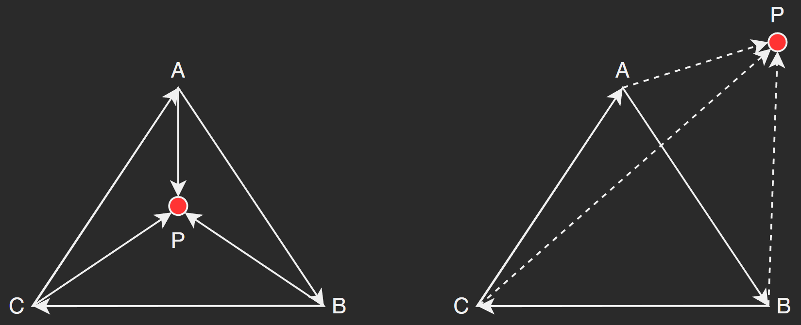

最近遇到这么一个问题: 给定一个点 $P$ 和三角形的三个点 $A, B, C$, 如何判断点 $P$ 是否在 $\triangle_{ABC}$ 内部?

<!--more-->

### 面积法

第一种做法基于面积, 即分别连接 $AP$, $BP$, $CP$, 那么如果点 $P$ 在 $\triangle_{ABC}$ 内部, 有:

$$\mathcal{S}_{\triangle_{ABC}} = \mathcal{S}_{\triangle_{PAC}} + \mathcal{S}_{\triangle_{PAB}} + \mathcal{S}_{\triangle_{PBC}}$$

如下图中:

显然内部点 $P2$ 与点 $A$, $B$, $C$ 构成的三个三角形满足上述面积关系, 而外部点则不满足.

关于三角形的面积, 则可以选择两种计算方法
1. 海伦公式: $\mathcal{S} = \sqrt{p(p - a)(p - b)(p - c)}$, where $p = \frac{a + b + c}{2}$. $a, b, c$ 是三角形三个变长.
2. 向量叉乘结果的长度: 两个向量叉乘的结果的长度等于以这两个向量为临边构成的平行四边形的面积. 因此, $\triangle_{ABC}$ 的面积可以由下式计算:
   $$\mathcal{S}_{\triangle_{ABC}} = \frac{\vert\vec{AB}\times\vec{AC}\vert}{2}$$

### 同侧法

这种方法基于一种简单的观察: 如果点 $P$ 在 $\triangle_{ABC}$ 内部, 那么从分别向量 $\vec{AB}$, $\vec{BC}$, $\vec{CA}$ 的方向看, 点 $P$ 都在 *同一侧*

那么如何判断点是否在两个向量的同一侧? 方法是利用向量叉乘. 分别从向量的起点向待判断的点 $P$ 构造一个新的向量, 然后将原向量与新的向量做叉乘, 叉乘结果的方向就代表点 $P$ 位于原向量的「哪一侧」.

以上图为例, 记向量方向从内向外为 $\uparrow$ ($\odot$), 相反为 $\downarrow$ ($\otimes$), 那么根据向量叉乘方向的「右手定律」:

显然当 $P$ 在 $\triangle_{ABC}$ 内部时:

$$\begin{aligned}
(\vec{AB}\times\vec{AP})\downarrow\\
(\vec{BC}\times\vec{BP})\downarrow\\
(\vec{CA}\times\vec{CP})\downarrow
\end{aligned}$$

当 $P$ 在 $\triangle_{ABC}$ 外部时:

$$\begin{aligned}
(\vec{AB}\times\vec{AP})\uparrow\\
(\vec{BC}\times\vec{BP})\downarrow\\
(\vec{CA}\times\vec{CP})\downarrow
\end{aligned}$$

### 重心坐标法

如果以 $\triangle_{ABC}$ 的两条有向边 $\vec{AB}$, $\vec{AC}$ 作为平面空间的基, 那么向量 $\vec{AP}$ 也可以用这组基表示:

$$\vec{AP} = \alpha\vec{AB} + \beta\vec{AC}$$

可以证明: 当 $P$ 在 $\triangle_{ABC}$ 内部时, $\alpha$ 和 $\beta$ 满足:

$$\alpha\in(0, 1), \beta\in(0, 1), \alpha + \beta\in(0, 1)$$

## 判断点在矩形内部

有了上述判断点在三角形内的基础, 实际上, 对于任意多边形我们都可以把它分割为一系列的三角形, 然后分别对这些三角型判断.

对于如矩形的凸多边形, 也可以通过向量叉乘法判断点是否在所有边向量的同一侧.

## 判断点是否在任意(凹)多边形内部

一种朴素的方法就是分割多边形为三角形, 然后分别判断. 另一种方案是「射线法」

即从待判断点出发任意作一条射线, 如果该射线与多边形的边相交 *奇数* 次, 那么说明点在多边形之内, 如果相交 *偶数* 次, 说明在多边形之外.

## References

1. [如何判定一点是否在给定顶点的不规则封闭区域内? - 知乎 (zhihu.com)](https://www.zhihu.com/question/26551754/answer/33185339)
2. [学习｜判断一个点是否在三角形内 - 知乎 (zhihu.com)](https://zhuanlan.zhihu.com/p/106253152)
3. [计算几何--O(logN) 判断点在凸多边形内 - lxglbk - 博客园 (cnblogs.com)](https://www.cnblogs.com/lxglbk/archive/2012/08/17/2644805.html)
4. [叉积 - 维基百科，自由的百科全书 (wikipedia.org)](https://zh.wikipedia.org/wiki/%E5%8F%89%E7%A7%AF)

附另一个有趣的问题: 如何判断平面上一个圆形和一个矩形有重叠?

1. [怎样判断平面上一个矩形和一个圆形是否有重叠？ - 知乎 (zhihu.com)](https://www.zhihu.com/question/24251545/answer/27184960)
