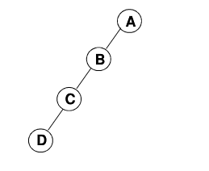

> 本文写于 2020 年 3 月 24 日，2022 年 3 月 6 日重新整理

<!--more-->

# 定义

二叉树是一个有穷的节点集合，这个集合可以为空。若集合不为空，则集合是由根节点 `root` 和被称为左子树和右子树的两颗不相交的二叉树组成。

## 特殊二叉树

- 斜二叉树 `(Skewed Binary Tree)`
    如图：



- 完美二叉树 `(Perfect Binary Tree)` 或满二叉树 `(Full Binary Tree)`


- 完全二叉树 `(Complete Binary Tree)`

    有 `n` 个节点的二叉树，对树中节点按从上到下，从左到右的顺序进行编号。与满二叉树相比，相同位置处的节点编号相同。

    即：完全二叉树相当于满二叉树少了最下层叶子节点的右侧若干节点。

# 性质

- 二叉树的第 `i` 层最大节点个数为 $2^{i - 1}$
- 深度为 `k` 的二叉树最大节点总数为 $2^k - 1$
- 对于任何非空二叉树 `T` ，若 $n_0$ 表示叶节点的个数， $n_2$ 是度为2的非叶节点的个数，那么两者满足关系 $n_0 = n_2 + 1$


证明：对于总结点数为 `n` 的二叉树，其边总数为 `n-1` 。总的节点数 `n` 由度为 `0,1,2` 的节点组成，即 $n - 1 = n_0 + n_1 + n_2 - 1$ 。

同时，对于二叉树的节点，其度数即为其对总边数的贡献值，即：度为 `i` 的节点将贡献 `i` 条边。所以边数 `n-1` 满足 $n - 1 = 0\times n_0 + 1\times n_1 + 2\times n_2$ 。

所以 $n-1 = n_0+n_1+n_2 - 1=0\times n_0+1\times n_1 + 2\times n_2$ ，即： $n_0 = n_2 + 1$ 。

# ADT描述

## 操作集

```c
bool isEmpty(BinaryTree* tree);     //判断二叉树是否为空
BinaryTree* createBinaryTree();     //创建一个二叉树
void traversal(BinaryTree* tree);   //遍历二叉树
```

对于二叉树而言，遍历是其最重要的操作。常见的遍历方法有：

```c
void preOrderTraversal(BinaryTree* tree);   //先序遍历，根--左子树--右子树
void inOrderTraversal(BinaryTree* tree);    //中序遍历，左子树--根--右子树
void postOrderTraversal(BinaryTree* tree);  //后序遍历，左子树--右子树--根
void levelOrderTraversal(BinaryTree* tree); //层次遍历，从上到下，从左到右
```

# 储存结构

## 顺序结构

- 对于完全二叉树，对其按从上到下，从左到右的顺序进行编号：


如图不难看出，父节点的编号为 `i` 时，其左子节点的编号为 `2i` ，其右子节点的编号为 `2i+1` ，父节点的编号是子节点编号除以 `2` 的向下取整。

对于这样的二叉树，我们可以定义一个长度合适的数组来储存数的数据，由于其节点编号的规律性，树的遍历等操作不会困难。


| 节点 | A   | B   | O   | C   | S   | M   | Q   | W   | K   |
| ---- | --- | --- | --- | --- | --- | --- | --- | --- | --- |
| 编号 | 1   | 2   | 3   | 4   | 5   | 6   | 7   | 8   | 9   |

- 对于一般二叉树，也可以用这样的方式储存。不过首先需要把非完全二叉树用空节点变为完全二叉树：


用数组储存为：

| 节点 | A   | B   | O   | null | null | M   | null | null | null | null | null | null | C   |
| ---- | --- | --- | --- | ---- | ---- | --- | ---- | ---- | ---- | ---- | ---- | ---- | --- |
|编号|	1|	2|	3|	4|	5|	6|	7|	8|	9|	10|	11|	12|	13|

可见，数组结构的二叉树会造成一定的空间浪费。

## 链式结构

将节点设计成如图样式，内部储存节点数据和指向左右子节点的指针。


```C
typedef struct binaryTree{
    ElementType data;
    BinaryTree* left;
    BinaryTree* right;
}BinaryTree;
```