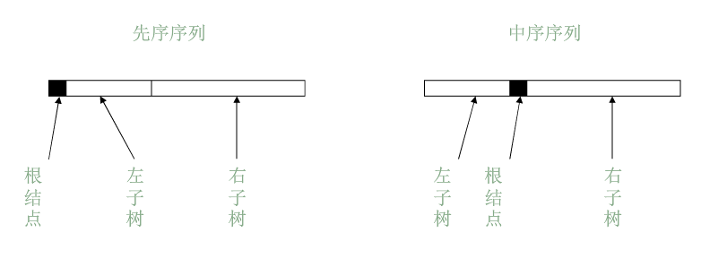

> 本文写于 2020 年 3 月 25 日，2022 年 3 月 6 日重新整理

<!--more-->

# 写在前面

树是一种复杂的数据结构，同时也是一种重要的二维结构。树的遍历过程实际上就是一种把二维结构转换为一维序列即线性化的过程。

# 四种遍历

- 前序遍历 `(PreOrderTraversal)` ：根节点—>左子树—>右子树
- 中序遍历 `(InOrderTraversal)` ：左子树—>根节点—>右子树
- 后序遍历 `(PostOrderTraversal)` ：左子树—>右子树—>根节点
- 层序遍历 `(LevelOrderTraversal)` ：从上到下—>从左到右

## 遍历实现

抽象一个函数 `void visit(BinaryTree *tree)` 用来访问节点：

```c
typedef struct treeNode
{
    ElementType data;
    BinaryTree *left;
    BinaryTree *right;
} BinaryTree;

void visit(BinaryTree *tree); //访问节点
```

### 递归实现

1. 前序遍历

    前序遍历首先访问根节点，然后访问左子树的根节点，然后访问左子树的左子树的根节点…直到左子树一路向左访问完毕，它将自下而上访问右子树。对于右子树，它也将贯彻根—左—右的顺序一路访问，直到遍历完成。
    
    递归实现如下：
    ```c
    void preOrderTraversal(BinaryTree *tree)
    {
        if (tree)
        {                                  //if empty tree or reaches the leaf,exit
            visit(tree);                   //pay a visit to the root
            preOrderTraversal(tree->left); //pre order,traversal left first
            preOrderTraversal(tree->right);
        }
    }
    ```

2. 中序遍历
    中序遍历先访问左子树，然后访问根节点，最后访问右子树。因此可以将前序递归的访问移到对左子树递归的后面简单的实现。

    ```c
    void inOrderTraversal(BinaryTree *tree)
    {
        if (tree)
        {                                 //if empty tree or reaches the leaf,exit
            inOrderTraversal(tree->left); //pre order,traversal left first
            visit(tree);                  //pay a visit to the root
            inOrderTraversal(tree->right);
        }
    }
    ```

3. 后序遍历

    同样的，可以把访问语句移到访问右子树的后面。
    
    ```c
    void postOrderTraversal(BinaryTree *tree)
    {
        if (tree)
        {
            postOrderTraversal(tree->left);
            postOrderTraversal(tree->right);
            visit(tree);
        }
    }
    ```
4. 层序遍历不具有明显的递归特征，暂不讨论其递归实现

### 非递归实现

众所周知，递归的程序虽然逻辑清晰代码简单，但是其运行起来有许多不稳定因素。由于函数在构建时是以函数栈的形式储存函数信息的，因此在处理较大规模的输入时，递归的程序常常会发生爆栈的严重异常。
同时，递归实现的遍历本质上是把节点压入堆栈并在适当的时机弹出，因此，可以考虑使用堆栈 `(Stack)` 实现二叉树的遍历。
首先实现一个大致的堆栈，关于堆栈的详细介绍和实现可见[这篇博客]()

```c
typedef struct stack
{
    ElementType data;
    Stack *next;
} Stack;

Stack *createEmpty()
{
    Stack *top = (Stack *)malloc(sizeof(Stack));
    top->next = NULL;
    return top;
}

int isEmpty(Stack *stack)
{
    return stack->next == NULL;
}

void push(Stack *stack, ElementType item)
{
    Stack *temp = (Stack *)malloc(sizeof(Stack));
    temp->data = item;
    temp->next = stack->next;
    stack->next = temp;
}

ElementType pop(Stack *stack)
{
    if (isEmpty(stack))
    {
        return; //error!Empty stack
    }
    ElementType targetValue = stack->next->data;
    Stack *target = stack->next;
    stack->next = target->next;
    free(target);
    return targetValue;
}
```

1. 前序遍历

    根据前序遍历的顺序，我们首先把二叉树 `T` 的左边最外侧节点依照从上到下的顺序依次访问（保证了先访问根节点和先处理左子树）和压栈（保存节点，后面才能取到右子节点）。左外侧访问并压栈完后，如果堆栈不为空，弹出一个节点，此节点是最后一个压栈的也是二叉树左下角的节点。将此节点转向它的右子节点，重复前面的过程（保证了后处理右子树）。

    ```c
    void preOrderTraversal(BinaryTree *tree)
    {
        BinaryTree *t = tree; //make a copy
        Stack *stack = createEmpty();
        while (t || !isEmpty(stack))
        { //if t==null && stack is empty,exit
            while (t)
            { //push left nodes
                push(stack, t);
                visit(t); //visit root and left nodes first
                t = t->left;
            }
            if (!isEmpty(stack))
            {
                t = pop(stack);
                t = t->right; //turn to right
                visit(t);     //visit right node
            }
        }
    }
    ```
2. 中序遍历
    
    中序遍历按照左子节点—根节点—右子节点的顺序访问，先把左外侧节点压栈但不访问，压栈完成后弹出节点进行访问（保证了先访问的是左子节点先处理的是左子树）。访问完成后转向弹出节点的右子节点重复过程。

    ```c
    void inOrderTraversal(BinaryTree *tree)
    {
        BinaryTree *t = tree;
        Stack *stack = createEmpty();
        while (t || !isEmpty(stack))
        {
            while (t)
            {
                push(stack, t);
                t = t->left;
            }
            if (!isEmpty(stack))
            {
                t = pop(stack);
                visit(t);
                t = t->right;
            }
        }
    }
    ```

3. 后序遍历
    
    后序遍历先处理左子树，再处理右子树，最后处理根节点。在先处理左子树的中序遍历的基础上，弹出节点 `T` 后并不立刻进行处理，而是进行一次判断：若 `T` 没有右子节点 `T->right == null` ，则该节点为叶节点，进行访问；若节点存在右子节点，则不进行访问，把 `T` 转向 `T` 的右子节点，重复上面的过程转而处理右子树。

    这个过程存在一个错误：当 `T` 存在右子节点时，把 `T` 转向了 `T->right` ，由于 `T` 是以 `pop` 的方式出栈，则堆栈中尚未进行处理的 `T` 节点（根节点）被删除了，这就导致了根节点缺失。
    
    为了解决这个问题，我们可以在 `T` 存在右节点时，为 `T` 的值做一个拷贝 `TCopy` ，但不保留 `T` 的子节点信息。即： `TCopy->left == TCopy->right == null` 。然后把 `TCopy` 压栈，这样保证了根节点 `T` 的值能够被访问到，同时在 `T` 的右子树处理完成，堆栈再次弹出根节点时，其右子节点不会被重复处理。

    ```c
    void postOrderTraversal(BinaryTree *tree)
    {
        BinaryTree *t = tree;
        Stack *stack = createEmpty();
        BinaryTree *tCopy = (BinaryTree *)malloc(sizeof(BinaryTree));
        while (t || !isEmpty(stack))
        {
            while (t)
            {
                push(stack, t);
                t = t->left;
            }
            if (!isEmpty(stack))
            {
                t = pop(stack);
                tCopy->data = t->data;
                t = t->right; //turn to right
                if (t)
                { 
                    tCopy->left = tCopy->right = NULL;
                    push(stack, tCopy); //temp will be visited after right sub tree
                }
                else
                {
                    visit(tCopy);
                }
            }
        }
        free(tCopy);
    }
    ```

4. 层序遍历
    
    层序遍历按照先上后下，先左后右的顺序，因此在访问左子节点时，需要暂存右子节点。可以采用堆栈 `(Stack)` 或者队列 `(Queue)` 储存。
    
    - 堆栈实现
        暂不讨论（不会）
    - 队列实现
        队列的详细实现见这篇博客
        先将根节点入队，然后出队根节点进行访问，访问完成后顺序压栈根节点的左子节点，右子节点。
        再次出队一个节点，访问完成后顺序入队它的左右子节点。重复本过程直到访问完毕。
        ```c
        void levelOrderTraversal(BinaryTree *tree)
        {
            if (tree == NULL)
                return; //Error!empty tree
            Queue *queue = createQueue();
            add(queue, tree); //add root to queue
            while (!isEmpty(queue))
            { //when queue is empty,traversal done
                BinaryTree *t = delete (queue);
                visit(t);
                if (t->left)
                    add(queue, t->left);
                if (t->right)
                    add(queue, t->right);
            }
        }
        ```

# 最后

二叉树十分复杂且重要，二叉树的遍历又是二叉树重要的基础操作之一，理解并掌握上述遍历方法十分必要。

# 由两种遍历唯一地确定一颗二叉树

设前序遍历为 `Pre` ，中序遍历为 `In` ，后序遍历为 `Post` 。则在已知 `In & Pre` 或者 `In & Post` 的情况下可以唯一低确定一颗二叉树。

分析：

一个先序遍历序列由**根节点—左子树节点—右子树节点**组成
一个中序遍历序列由**左子树节点—根节点—右子树节点**组成
一个后序遍历序列由**左子树节点—右子树节点—根节点**组成
例如已知 `Pre & In` :



由先序序列的第一个元素可以知道根节点，利用根节点在中序序列中查询其位置，可以得知左子树的长度。然后在先序序列中的根节点后方截取该长度，即得二叉树的左子树序列。
左子树序列的首元素是左子树的根节点…如此迭代到叶节点便确定了左子树的构造，右子树同理。

如果只已知 `Pre & Post` 则无法确定左子树序列或者右子树序列的长度，无法确定二叉树。