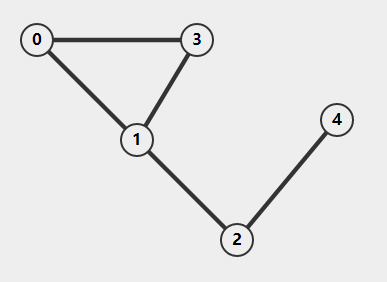

> 本文写于 2020 年 4 月 1 日，2022 年 3 月 20 日重新整理

<!--more-->

图是一种表示多对多关系的数据结构，它包含一组顶点 `(Vertex)` 和顶点之间的连接关系（称为边 `(Edge)` ）。
对于节点 $v_i$ 和 $v_j$ ，一般用 $<v_i, v_j>$ 表示由 $v_i$ 指向 $v_j$ 的边。图中的相同节点对一般只考虑一条边，不考虑重复的边和指向自己的边，根据边的单向双向，带权不带权，图可以分为 `无向无权图，无向带权图，有向无权图，有向带权图`




# 图的操作集

```c
Graph *create(int vertexCnt);                                             //创建空图返回
void insertVertex(Graph *graph, Vertex *vertex);           //将节点插入图
void insertEdge(Graph *graph, Edge *edge);                 //将边插入图
void depthFirstSearch(Graph *graph, Vertex *vertex);         //从顶点vertex出发深度优先遍历
void breadthFirstSearch(Graph *graph, Vertex *vertex);       //从顶点vertex出发宽度优先遍历
void shortestPath(Graph *graph, Vertex *vertex, int dist[]); //计算从节点vertex到任意节点的最短路径
void minSpanningTree(Graph *graph);                          //计算图的最小生成树
```
图的建立实现在后文给出

# 如何表示一个图

## 邻接矩阵

使用一个二维矩阵可以描述一个图。对于有 `n` 个顶点的图，可以用一个 `n*n` 大小的矩阵 `G[n][n]` 来表示。
首先给顶点编号 `0 - n-1` ，矩阵的值 $G[i][j] = 1$ (若 $<v_i, v_j>$ 存在) ，$G[i][j] = 0$ 若 $<v_i, v_j>$ 不存在 。对于带权图，矩阵的值一般是边的权重。

如下面的有向带权图：


其邻接矩阵为：

|       | $v_0$ | $v_1$ | $v_2$ | $v_3$ | $v_4$ |
| ----- | ----- | ----- | ----- | ----- | ----- |
| $v_0$ | 0     | 2     | 0     | 0     | 0     |
| $v_1$ | 0     | 0     | 2     | 2     | 3     |
| $v_2$ | 0     | 0     | 0     | 0     | 0     |
| $v_3$ | 0     | 0     | 0     | 0     | 0     |
| $v_4$ | 0     | 0     | 0     | 0     | 0     |

对于无向图，他们的邻接矩阵一般是对称的：


邻接矩阵为：

|       | $v_0$ | $v_1$ | $v_2$ | $v_3$ | $v_4$ |
| ----- | ----- | ----- | ----- | ----- | ----- |
| $v_0$ | 0     | 1     | 0     | 1     | 0     |
| $v_1$ | 1     | 0     | 1     | 1     | 0     |
| $v_2$ | 0     | 1     | 0     | 0     | 1     |
| $v_3$ | 1     | 1     | 0     | 0     | 0     |
| $v_4$ | 0     | 0     | 1     | 0     | 0     |

因此，对于无向图，可以使用一个长度为 $N(N+1) / 2$ 的序列储存，这样可以节省一半的空间。例如取上述矩阵的下半部分：

|       | $v_0$ | $v_1$ | $v_2$ | $v_3$ | $v_4$ |
| ----- | ----- | ----- | ----- | ----- | ----- |
| $v_0$ | 0     |
| $v_1$ | 1     | 0     |
| $v_2$ | 0     | 1     | 0     |
| $v_3$ | 1     | 1     | 0     | 0     |
| $v_4$ | 0     | 0     | 1     | 0     | 0     |

将上述数据按行优先顺序储存在一个数组里，数组的长度为 $N(N+1)/2$ 。要访问节点 `i,j(i行，j列)` 之间的连接，可以访问数组的 $i*(i+1)/2+j$ 位置。

邻接矩阵是一种较为直观的表示方法，它的好处有：

1. 方便检查任意一对节点之间是否存在边
2. 方便查找所有与某一结点直接相连的节点
3. 方便计算节点的度（指向节点的边个数叫入度，从节点指向别的节点的边个数叫出度）。
它的缺点也很明显：对较为稀疏的图（点多边少）而言，空间利用效率不高，计算图的总边数是时间效率不高。

## 邻接表

使用一个长度为 `n` (节点个数)的链表数组 `G[n]` 储存图。数组的元素 `G[i]` 表示编号为 `i` 的节点， `G[i]` 后接它指向的所有节点指针。

如：


上图的邻接表为：

| $v_0$ | 3   | 1   |     |
| ----- | --- | --- | --- |
| $v_1$ | 0   | 2   | 3   |
| $v_2$ | 1   | 4   |
| $v_3$ | 1   | 1   |
| $v_4$ | 2   |

这样的表示方法不会储存没有连接的无效信息，但是它把每条边都储存了两遍。对于稀疏的图而言，它的空间利用率较高，但是较为稠密的图会浪费较多空间。
邻接表可以方便的查找一个节点的所有直接相连节点，如果储存的图是无向图，它也可以方便的计算出节点的度。但是如果储存的是有向图，邻接表将无法方便的计算出节点的入度，同时它也无法方便地判断出给定节点对之间是否存在边。

# 图的建立

## 邻接矩阵
首先给出图的原型：

```c
typedef struct graph
{
    int vertexCount;                       //顶点数
    int edgeCount;                         //边数
    WeightType graphMat[MaxSize][MaxSize]; //邻接矩阵，元素表示边的权重
    DataType data[MaxSize];                //节点数据
} Graph;
```

图的建立首先需要建立一个只有节点没有边的图：

```c
Graph *create(int vertexCnt)
{
    Graph *graph = (Graph *)malloc(sizeof(Graph));
    graph->vertexCount = vertexCnt; //初始化顶点数
    graph->edgeCount = 0;           //初始化边数
    for (int i = 0; i < graph->vertexCount; ++i)
    {
        graph->data[i] = 0; //数据初始化，应该初始化为用户给定的数据
        for (int j = 0; j < graph->vertexCount; ++j)
        {
            graph->graphMat[i][j] = 0; //连接初始化
        }
    }
    return graph;
}
```

然后把边插入到图中，边应该保存起点和终点以及权重数据：

```c
typedef int Vertex;//邻接矩阵中，节点可用坐标表示
typedef struct edge
{
    Vertex start;      //起点
    Vertex end;        //终点
    WeightType weight; //权重
} Edge;

void insertEdge(Graph *graph, Edge *edge)
{
    if (graph == NULL)
        return NULL;
    if (edge->start >= graph->vertexCount || edge->end >= graph->vertexCount)
        return NULL;
    graph->graphMat[edge->start][edge->end] = edge->weight;
    //对于无向图，还需要下面一句
    graph->graphMat[edge->end][edge->start] = edge->weight;
}
```

对于给定的边的集合 `Edge edges[someNumber]` 只要对其中每个边调用插入函数就可以了
```c
Edge edges[cnt];
for(int i = 0;i < cnt;++i)
{
    insertEdge(graph,edges[i]);
}
```

## 邻接表

邻接表表示的图原型有所不同，首先建立节点的原型，根据邻接表的结构，节点应该是一个链表。
```c
typedef struct lnode
{
    int vertexPosition; //邻接点下标，即顶点编号
    WeightType weight;  //边权重
    LVertex *next;
} LVertex;
```
邻接表应该是一个指针数组，数组元素是链表指针：

邻接表应该是一个指针数组，数组元素是链表指针：
```c
typedef struct table
{                         //忽略顶点数据
    LVertex *firstVertex; //第一个顶点
} LTable;
```
根据上面两个结构实现图的结构原型：
```c
typedef struct lgraph
{
    int vertexCount;            //顶点数
    int edgeCount;              //边数
    LTable graphTable[MaxSize]; //邻接表
} LGraph;
```
邻接表实现的图建立第一步仍然是建立一个一定数量节点的空图：

```c
LGraph *createGraph(int vertexCount)
{
    LGraph *graph = (LGraph *)malloc(sizeof(LGraph));
    graph->edgeCount = 0;
    graph->vertexCount = vertexCount;
    for (int i = 0; i < graph->vertexCount; ++i)
    {
        graph->graphTable[i].firstVertex = NULL; //邻接表链表初始化为空
    }
    return graph;
}
```
然后将边插入，由于邻接表中只保存了头节点，因此插入方式采用头插法。

```c
void insertLEdge(LGraph *graph, Edge *edge)
{
    //建立要插入的节点
    LVertex *vertex = (LVertex *)malloc(sizeof(LVertex));
    vertex->vertexPosition = edge->end;
    vertex->weight = edge->weight;

    //插入邻接表
    vertex->next = graph->graphTable[edge->start].firstVertex;
    graph->graphTable[edge->start].firstVertex = vertex;

    //对于无向图，还需要插入边<end,start>
    LVertex *sVertex = (Vertex *)malloc(sizeof(Vertex));
    sVertex->vertexPosition = edge->start;
    sVertex->weight = edge->weight;

    sVertex->next = graph->graphTable[edge->end].firstVertex;
    graph->graphTable[edge->end].firstVertex = sVertex;
}
```
通过给定边数据建立完整图的过程与邻接矩阵无异。
