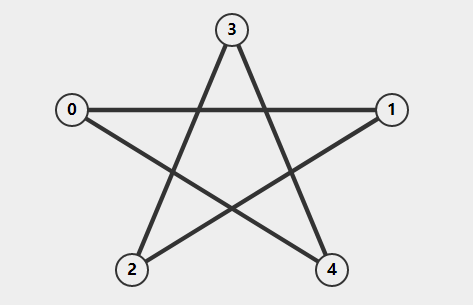
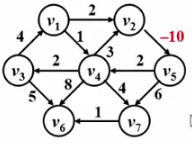

> 本文写于 2020 年 4 月 10 日，2022 年 3 月 20 日重新整理

<!--more-->

即：在网络（带权图）中，求两个不同顶点之间的所有路径中，边的权值和最小的那条路径。这条路径就叫最短路径 `(Shortest Path)` ，这条路径的起点叫做源点 `(Source)` ，路径的最后一个顶点叫做终点 `(Destination)` 。
最短路径问题不是一个孤立的问题，它是一系列问题的集合，可以分为**单源最短路径问题**和**多源最短路径问题**。

# 单源最短路径问题

即从某固定源点出发，求其到其他任一点的最短路径。
其过程是按照路径长度递增（非递减）的顺序找到到达各个顶点的最短路径。
如下图所示的图：



假设顶点 `0` 是源点，则距源点的距离为的顶点是 `0` ，距离源点为的顶点有 `1,4` ，他们是源点的邻接点。查找距离为 `2` 的顶点时，不需要从源点开始查找，可以从距离为 `1` 的顶点查找他们的邻接点（同时不能是源点的邻接点）。这一过程与广度优先搜索相似，都是优先查找顶点的所有邻接点。
对距离从 `0` 到 `1` 的顶点列表，可得下表：

| 距源点的距离 | 顶点     |
| ------------ | -------- |
| 0            | `0`      |
| 1            | `1`, `4` |
| 2            | `2`, `3` |

回忆广度优先搜索的程序过程：

```c
int Visited[MaxSize] = 0;
void breadthFirstSearch(Graph *graph, Vertex *vertex)
{
    visit(vertex);           //visite vertex first
    Visited[vertex->id] = 1; //set visited true
    Queue *queue = createQueue();
    add(queue, vertex); //add to queue to find its neighbors
    while (!isEmpty(queue))
    {
        Vertex *v = delete (queue);
        for (v 的每个邻居节点 neighbor)
        {
            if (!Visited[neighbor->id]) //if not visted,visit and add to queue
            {
                visit(neighbor);
                Visited[neighbor->id] = 1;
                add(queue, neighbor);
            }
        }
    }
}
```

## 无权单源最短路径算法

对于广度优先搜索，我们需要一个 `Visited` 数组来记录顶点有没有被访问过，在最短路径问题中，我们还需要记录顶点与源点之间的距离。这里使用一个 `dist` 数组 `dist[v] = 顶点v与源点之间的距离` 来记录距离。同时最短路径问题实际上需要求解的不仅是最短距离，还需要求解实际的路径，因此我们还需要一个容器记录从源点到达顶点的路径。可以使用一个 `path` 数组 `path[w] = v //v是从源点去顶点w的必经顶点来记录路径` ，这样，当需要直到源点到顶点 `w` 的路径时，递归的访问数组 `path` 就可以得到:

```c
vertex v;//目的顶点w
Stack stack;
while(dist[w]!=0)//Dist[w] == 0时，说明递归到了源点，路径生成完毕
{
    push(stack,w);//路径顶点压栈
    w = path[w];
}
```

综上，无权单源最短路径问题的程序过程大致如下：

```c
int dist[MaxSize] = {-1};
int path[MaxSize];
void shortestPath(Vertex vertex)
{
    Queue *queue = new Queue();
    enqueue(queue, vertex);
    while (!isEmpty(queue))
    {
        Vertex v = dequeue(queue);
        for (v 的所有邻居顶点 n)
        {
            if (dist[n] == -1)
            {
                dist[n] = dist[v] + 1;
                path[n] = v;
                enqueue(queue, n);
            }
        }
    }
}
```

这个过程的大部分与广度优先搜索无异，只是在判断是否已访问以及标记路径距离和记录路径方面稍有不同。
程序执行完成后，从源点到图中各个顶点的最短路径长度被记录在数组 `dist[]` 中，路径信息被记录在数组 `path[]` 中。

## 带权单源最短路径算法
 
首先看如下图所示的带权图：



可以看到边 $<v_2, v_5>$ 的权值是 $-10$ ，对这个图而言，只要沿着路径 $v_4\rightarrow v_2\rightarrow v_5$ 走一圈，总的权值和就是 $-5$ ，如果走无数圈，权值和就是 $-\infty$ 。这种走一圈权值和为负值的圈被称为负值圈 `(nagative-cost cycle)` ，显然，只要图中存在负值圈，一般的算法肯定无法正常工作。因此，下面的讨论默认图中不存在负值圈。

无权图可以看作特殊的带权图，因此，带权图的单源最短路径算法实际上与无权图的单源最短路径算法有一定的相似之处，他们都是按照路径长度递增（非递减）的顺序找到最短路径。下面讨论的带权图的单源最短路径算法就是大名鼎鼎的 **迪杰斯特拉 `(Dijkstra)`**算法。

Dijkstra算法大致有以下过程：

- 定义一个集合 `s` ， `s` 在初始状态下只有源点 `source` 存在。然后逐步将**已经确定了最短路径的节点**收进集合 `s` 。即：$s = source + 已经确定了最短路径的顶点 v_i$
- 对于图中任何一个尚未收进 `s` 的顶点 `v` ，定义 `dist[v] = 源点到顶点 v 的最短路径长度` ，同时该路径必须仅仅经过集合 `s` 中的顶点，即路径 $source\rightarrow v_i \in s\rightarrow v$ 的长度。值得注意的是，在程序运行的初始阶段，集合 `s` 中的顶点较少，此时路径 $source\rightarrow v_i \in s\rightarrow v$ 多半并不是最短路径，但是随着集合 `s` 的扩大，该路径也会不断完善，最后当所有顶点都被收入集合 `s` ，最后的路径就一定是最短路径了。
- 由于路径是按照递增（非递减）的顺序生成的，因此有以下结论：
- 真正的最短路径肯定只经过集合 `s` 中的节点
- 每次收录进集合 `s` 的顶点是剩余未收录顶点中 `dist` 值最小的顶点（贪心算法）
- 增加一个顶点 `v` 进入集合 `s` 时，可能会影响到其他顶点 `w` 的 `dist` 值，这是因为源点到顶点 `w` 的路径可能会经过顶点 `v` ，并且顶点 `v` 到顶点 `w` 之间可能存在一条边。因此需要对顶点 `w` 的 `dist` 值进行更新： $dist[w] = min(dist[w],dist[v] + <v,w>的权值)$ 。

下面是 `Dijkstra` 算法的大致过程，首先为了表示集合 `s` ，我们使用一个数组 `collected` 来记录顶点是否被收录（类似图的搜索算法中的 `Visited` 数组）

```c
int dist[MaxSize] = {infty};
int path[MaxSize];
bool collected[MaxSize] = {false};
void dijkstra(Vertex vertex)
{
    while (true)
    {
        取未被集合收录的顶点中dist值最小的顶点v //这个过程可以直接扫描全部顶点然后取最小或者把顶点存在一个最小堆中
        if (v不存在，即顶点完全被收录)
            break;           //跳出循环
        collected[v] = true; //收录顶点
        for (v 的所有邻居节点 w)
        {
            if (!collected[w])
            {
                if (dist[v] + weight(v, w) < dist[w])
                { //注意到这个条件要求dist[w]>=dist[v]+weight(v,w)时下面的更新路径长度代码才会运行
                    //因此dist的初始值应该是正无穷，否则其初始值可能无法被更新
                    dist[w] = dist[v] + weight(v, w);
                    path[w] = v;
                }
            }
        }
    }
}
```
这段伪代码不适用于存在负边的情况.

## 多源最短路径算法

多源最短路径问题求解的是任意两点之间的最短路径，要实现这个问题的求解，可以用图中每一个顶点作为源点对其运行一次单源最短路径算法，这种方法比较 `low` 而且对于稠密图效率不高。或者还有一种大名鼎鼎的算法专门解决这个问题：佛洛伊得 `(Floyd)` 算法

`Floyd` 算法对于稠密图的效果较好，因此下面的图使用邻接矩阵表示。 `Floyd` 算法的路径是按照顶点的编号递增的顺序生成的，它的大致过程如下：

- 用矩阵 $D^k[i][j]$ 表示顶点 $i$ 到顶点 $j$ 之间仅经过编号小于等于 $k$ 的顶点的最短路径长度，即路径 $i\rightarrow (l \leq k)\rightarrow j$ 的长度。程序运行的初始阶段，$k$ 值较小，路径并不一定是最短路径，当 $k$ 增长到顶点个数少一时，所得的最短路径就是实际上的最短路径了，即最短路径是逐步生成的
- 矩阵 $D^k[i][j]$ 的初始值是 $D^{-1}[i][j]$ ，它可以直接初始化为图的邻接矩阵，对角元全部是 $0$ ，对于没有直接边的顶点 $k$ 和 $m$ ，其初始值 $D^{-1}[k][m]$ 应该被初始化为无穷大
- 从矩阵 $D^{k-1}[i][j]$ 递推到矩阵 $D^k[i][j]$ 时，即新读入一个顶点 $k$：
  1. $k$ 不影响 $i$ 到 $j$ 的最短路径，即 $k$ 不在路径上，则不需要更新最短路径长度：$D^k[i][j] = D^{k-1}[i][j]$
  2. $k$ 影响 $i$ 到 $j$ 的最短路径，即从 $k$ 走的路径更短，则新的路径由两部分组成：$D^k[i][j] = D^{k-1}[i][k] + D^{k-1}[k][j]$
- 要记录最短路径，同样需要一个矩阵 $Path[i][j]$ 储存从 $i$ 到 $j$ 的路径。假如我们给矩阵赋值为 $Path[i][j]=k$ ，这表明从 $i$ 到 $j$ 的路径等于从 $i$ 到 $k$ 的路径加上从 $k$ 到 $j$ 的路径。因此，路径的取出可以使用一个递归过程实现。

`Floyd` 算法的程序过程如下：

```c
int Dist[MaxSize][MaxSize];
int Path[MaxSize][MaxSize];
void floyd(Vertex **map, int mapSize)
{
    //初始化
    for (int i = 0; i < mapSize; ++i)
    {
        for (int j = 0; j < mapSize; ++j)
        {
            Dist[i][j] = map[i][j];
            Path[i][j] = -1;
        }
    }
    for (int k = 0; k < mapSize; ++k)
    {
        for (int i = 0; i < mapSize; ++i)
        {
            for (int j = 0; j < mapSize; ++j)
            {
                if (Dist[i][k] + Dist[k][j] < Dist[i][j])
                { //这里判断k是否影响最短路径
                    //若无连接的两点未被初始化为无穷大，会影响这里的判断
                    Dist[i][j] = Dist[i][k] + Dist[k][j]; //更新最短路径长度
                    Path[i][j] = k;
                }
            }
        }
    }
}
```
