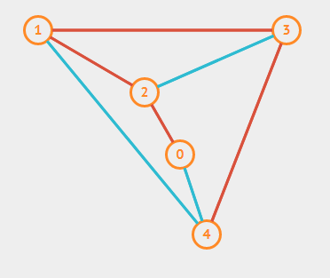
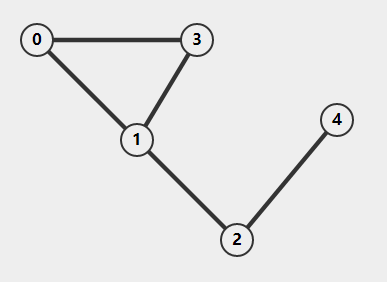

> 本文写于 2020 年 4 月 2 日，2022 年 3 月 20 日重新整理

<!--more-->

# 两种遍历

## 深度优先搜索 `(Depth First Search,DFS)`

深度优先搜索顾名思义就是在搜索过程中瞅准某条路径一直向下访问，直到访问到了这条路径的终点才切换到其他路径。问题是，在某条路径上一路向下访问时，需要保存住来时的路径信息，否则在到达终点的时候将无法返回到起点切换其他路径。
这种一路向下直到某个条件（终点）再原路返回的过程很像程序设计中的递归思想，因此，深度优先搜索可以方便的使用栈 `(Stack)` 实现。

如下面所示的图：



假设使用深度优先搜索从节点 `0` 开始遍历，则首先对节点 `0` 的所有邻居节点（与 `0` 直接相连的节点）中的一个访问，假设访问到了节点 `2` ，则对节点 `2` 的邻居节点进行访问。首先访问邻居节点 `0` ，`0` 已经被访问，因此切换到节点 `1` 。接着对节点 `1` 的邻居节点 `2` 访问， `2` 已被访问，因此切换到 `3` 。接着访问 `3` 的邻居节点 `4` 。访问到节点 `4` 之后，对节点 `4` 的所有邻居节点访问，发现均被访问过。然后开始回溯，查找是否有尚未访问到的分支。比如此例中回溯到节点 `3` ，发现所有邻居节点都被访问过，继续回溯亦然，当回溯到起始节点 `0` 时，便知道所有节点都被访问过，遍历完成。

实际的程序过程可以描述为：
- 建立一个空栈，访问起始顶点 `0` ，并把 `0` 压栈
- 访问节点 `0` 的邻居节点 `2` ，把 `2` 压栈
- 访问节点 `2` 的未访问节点 `1` ，把 `1` 压栈
- 访问节点 `3,4` ，把 `3,4` 压栈
- 遍历节点 `4` 的邻居节点之后，前方无路可走，开始出栈
  - 首先出栈节点 `3` ，访问节点 `3` 的未访问邻居节点并压栈，一直访问并压栈到尽头。之后对每个出栈的顶点做同样的操作，直到栈为空（顶点全部弹出）。

```c
int Visited[Size] = 0;
//深度优先搜索
void depthFirstSearch(Graph *graph, Vertex *vertex)
{
    Stack *stack = createStack();
    Vertex *nextNode = vertex;
    while (!isEmpty(stack))
    {
        visit(nextNode);                                //visit vertex
        push(stack, nextNode);                          //push vertex to stack
        Visited[nextNode->id] = 1;                      //shows that this vertex was visted
        int end = 1;                                    //flag that shows if route comes to end
        for (int i = 0; i < nextNode->neighborNum; ++i) //neighbor of vertex
        {
            Vertex *neighbor = nextNode->neighbors[i];
            if (!Visited[neighbor->id]) //if not visited
            {
                nextNode = neighbor; //set nextNode neighbor not visited
                end = -1;            //shows that end is not coming
                break;
            }
        }
        if (end)
        {
            nextNode = pop(stack); //if end comes,pop a vertex from stack
        }
    }
}
```

这个实现首先构造了一个顶点个数长度的数组来标识顶点是否被访问，然后利用循环和堆栈实现遍历过程。这是一个并不优雅的实现，甚至不知道是否正确。
如果直接用递归程序会非常清晰：(两段代码实际上都是伪代码，因为节点的邻居节点信息的取出是不规范的，不正确的)

```c
int Visited[Size] = 0;
void depthFirstSearch(Graph *graph, Vertex *vertex)
{   
    visit(vertex);
    Visted[vertex->id] = 1;
    for(int i = 0;i < vertex->neighborNum;++i)
    {
        if(!Visited[vertex->neighbor[i]]){
            depthFirstSearch(graph,vertex);
        }
    }
}
```

## 广度优先搜索 `(Breadth First Search,BFS)`

广度优先搜索过程类似于二叉树的层序遍历，都是先访问某节点，然后把该节点的相邻节点挨个访问，同样类似的是，广度优先遍历的实现也可以使用 队列 `(Queue)` 实现。

同一个图：



使用广度优先遍历的过程大致是，首先从起始顶点 `0` 出发，挨个访问它的邻居顶点 `2,4` 。然后访问节点 `2` 和它的邻居节点 `0` (已被访问), `1,3` ，然后访问节点 `4` 和它的邻居节点 `0,1,3` 。最后对节点 `0,1,3` 挨个进行上述的动作。

使用队列实现的程序过程为：
- 首先建立空的队列，将节点 `0` 入队，
- 弹出节点 `0` 进行访问，同时把节点 `0` 的所有 未被访问过的 邻居节点 `2,4` 加入队列
- 从队列弹出一个顶点，对其进行访问并把它的所有 未被访问过的 邻居顶点加入队列。直到队列为空，说明遍历完成。

```c
void breadthFirstSearch(Graph *graph, Vertex *vertex)
{
    visit(vertex);           //visite vertex first
    Visited[vertex->id] = 1; //set visited true
    Queue *queue = createQueue();
    add(queue, vertex); //add to queue to find its neighbors
    while (!isEmpty(queue))
    {
        Vertex *v = delete (queue);
        for (int i = 0; i < v->neighborNum; ++i) //find all neighbors
        {
            Vertex *neighbor = v->neighbors[i];
            if (!Visited[neighbor->id]) //if not visted,visit and add to queue
            {
                visit(neighbor);
                Visited[neighbor->id] = 1;
                add(queue, neighbor);
            }
        }
    }
}
```

这个实现仍然是伪代码，需要更加合理的查找顶点邻居信息的方法才能工作。

两种遍历的时间复杂度实际上是相同的（全部遍历时），但是对于遍历的中途退出的问题，需要认真思考选择更合适的遍历方式。如寻路问题中需要根据地图的样式选择遍历方式。

# 图的一些术语

- 连通：如果从顶点 `v` 到顶点 `w` 之间存在一条（无向）路径，则称顶点 `v` 和顶点 `w` 之间是连通的。
- 强连通：有向图中顶点 `v` 和 `w` 之间的路径是双向路径，则 `v` 和 `w` 之间是强连通的。
- 路径：顶点 `v` 到顶点 `w` 之间的路径是一系列顶点的序列，其中任意一对相邻的顶点之间在图中都有 边 `(Edge)`  。路径的长度是路径中的边数（对于带权图，路径长度是边的权值之和）。如果路径序列中所有的顶点都不相同（路径是无环的），则称路径为 简单路径 。
- 回路：起点等于终点的路径
- 连通图：图的 任意两点 均连通
- 强连通图：有向图 的 任意两点 均强连通
- 连通分量：无向图的极大连通子图：
  - 极大顶点数：子图中再加任意一个点就不是连通图了
  - 极大边数：子图中所有顶点之间的边数
- 强连通分量：有向图 的极大强连通分量
对于不连通的图，可以对图的每个连通分量调用上面两个遍历函数实现整个图的遍历。