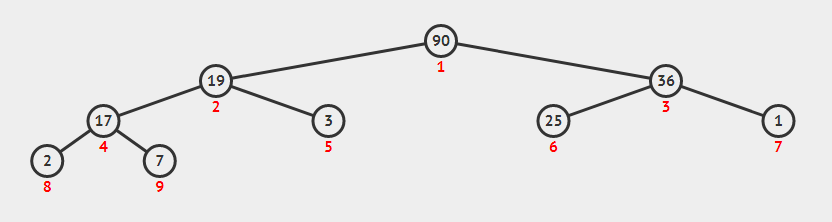
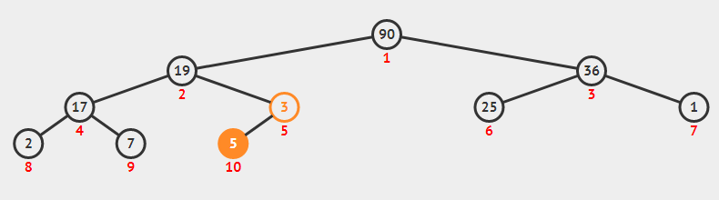
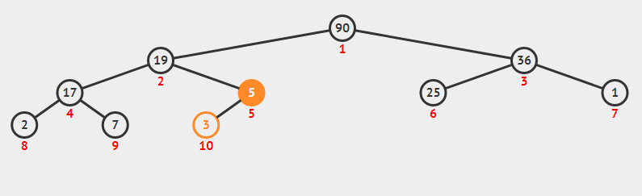
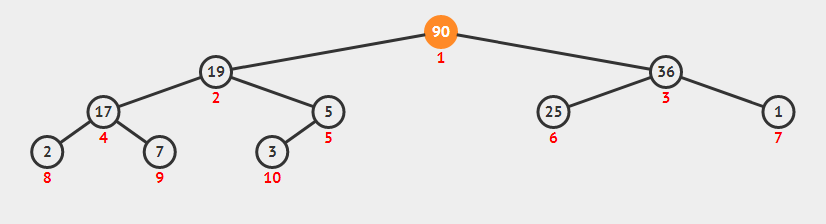
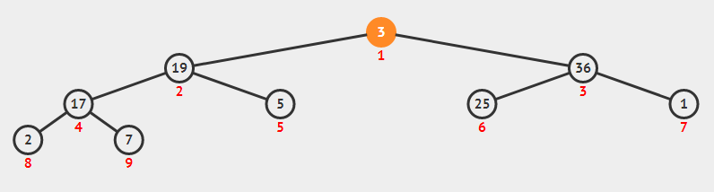
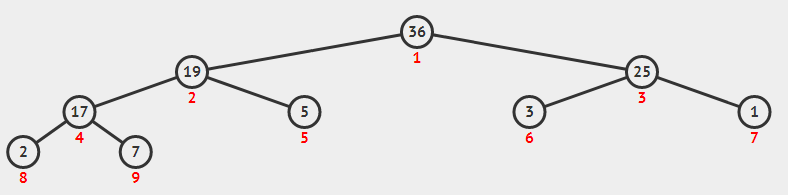

> 本文写于 2020 年 3 月 30 日，2022 年 3 月 20 日重新整理

<!--more-->

堆 `Heap` 即 优先队列 `Priority Queue`

# 几种实现方式

- 一般数组（无序）：
  - 插入：对于一般数组，可以总是把元素插入到数组的头部或尾部，因此它的时间复杂度是 $O(1)$
  - 删除：首先要在数组中找到最大(或最小)元素，查找的时间复杂度是 $O(n)$ 的。然后将元素删除，被删除元素的后方元素需要前挪一位，时间复杂度也是 $O(n)$
- 有序数组：
  - 插入：对于有序数组，插入时需要找到合适的位置，这一操作的时间复杂度一般是 $O(n)$ 或者 $O(\log n)$ 的
  - 删除：由于数组是有序的，删除的位置总是在数组的头部或尾部，它的时间复杂度是 $O(1)$ 的
- 一般链表（无序）：
  - 插入：插入可以简单的插入在链表头部，时间复杂度是 $O(1)$ 的
  - 删除：首先找到最大（或最小）元素，时间复杂度是 $O(n)$ ，然后删除掉该节点，删除操作对链表而言是 $O(1)$ 的
- 有序链表：
  - 插入：首先找到合适的位置，时间复杂度是 $O(n)$ ，然后插入，操作是 $O(1)$ 的
  - 删除：删除总是在两端进行，时间复杂度是 $O(1)$
- 二叉树：
  - 二叉搜索树：二叉搜索树的最大值在最右侧，最小值在最左侧。对于优先队列这个使用场景，经过若干次删除操作之后二叉搜索树将退化为一颗斜二叉树，时间效率会迅速下降。

# 最大堆

注意到优先队列只有两个主要操作： 插入 `(Insert)` 和 删除 `(Delete)`
如果我们使用一颗二叉树储存优先队列的数据，应该着重优化更加困难的删除操作。考虑这样一种结构：二叉树的最大节点始终在它的根节点处，对每一棵子树而言亦如此，那么删除操作将始终在根节点进行。为了避免二叉树变斜，我们使用完全二叉树储存数据，这样就形成了一个 **最大堆(MaxHeap)**

最大堆是一颗 完全二叉树 `(Complete Binary Tree)` ，同时它的每个节点比它的左右子树中每个节点大（比子树小称为最小树）。
如下图就是一个最大堆：



## 最大堆的实现

[[数据结构-二叉树和二叉树的储存结构]] 中提到，对于完全二叉树，它具有父节点序号是子节点序号的二分之一这一性质，因此完全二叉树内部可以使用数组实现，同时数组实现的完全二叉树具有很高的效率也很方便操作，只是容量一般是固定的，空间效率较低。数据结构原型如下：
```c
typedef struct maxheap
{
    KeyType *data; //堆的数据
    int size;      //当前元素个数
    int capacity;  //堆的最大容量
} MaxHeap;
```

主要操作有：

```c
MaxHeap *createHeap(const int maxSize);  //创建空堆，最大空间为maxSize
int isFull(MaxHeap *heap);               //判断堆是否已满
int isEmpty(MaxHeap *heap);              //判断堆是否为空
void insert(MaxHeap *heap, KeyType key); //把元素key插入堆
KeyType deleteMax(MaxHeap *heap);        //删除并返回堆中的最大值
```
下面只讨论插入和删除操作

### 插入

一般的数组实现的完全二叉树可以很方便的插入。我们在原型中维护有表示二叉树当前元素个数的 `tag`，并且完全二叉树的节点下标有简单的层序规律（自上而下，自左而右）。因此可以直接把元素插入到数组的 `size + 1` 处。
然而作为一个最大堆，这样的插入可能会破坏最大堆的另一个原则：根节点总是大于左右子树节点。因此，在插入到 `size + 1` 位置后，还需要判断该原则是否被破坏，如果被破坏则需要修复这一原则。

例如上面图片中的堆如果插入元素 `2` ，被插入的位置下标为 `10` ，是下标为 `5` 的节点 `3` 的左子树位置。同时 `2` 小于 `3` ，这个插入不会破坏根最大原则。

假如插入的元素是 `5` ，则会因为 `5` 大于 `3` 而需要对最大堆进行修复。修复的过程也很简单，只要把节点 `5` 与节点 `3` 交换位置就行了（插入的节点与父节点交换位置）。假如插入的元素是 `91` ，则需要一直交换到整棵树的根节点处。





这个实现采用了另一个方案，插入时先根据根最大原则判断合适的位置在哪里，在判断的同时把不合适的节点统统后移，为新插入的节点腾出位置。

```c
void insert(MaxHeap *heap, KeyType key)
{
    if (heap == NULL)
        return; //if heap is NULL,do nothing
    else if (isFull(heap))
        return;                  //if heap is full,do nothing
    int position = ++heap->size; //insert position should be 1 after size
    //when break out loop,heap->data[position]>key && position is the right position
    for (; heap->data[position] < key; position /= 2)
    { //in loop,heap->data[position]>key,move data down
        heap->data[position] = heap->data[position / 2];
    }
    heap->data[position] = key; //insert key to the right pos
}
```

### 删除

最大堆删除的位置是确定的：总是二叉树的根节点位置。然而不能直接地就把根节点删除掉，因为一方面根节点在数组中的下标是 `0` ，把它删除了以后后面所有的元素都要前移，时间复杂度是 $O(n)$ （如果不移迟早空间会被全部丢失）；另一方面是因为我们有更好的选择：删掉数组尾部位置的节点，然后把尾部节点的元素拿到根节点替换原来的根节点。这样删除过程可以简述为：删掉尾部节点，替换根节点。

与插入过程类似，根节点被尾节点替换之后最大堆的根最大原则无法得到保证。
如下图最大堆：



删掉最大值之后，使用尾部节点 `3` 代替根节点，大小顺序被破坏：



大小顺序恢复的过程为：找到根节点左右子节点中较大的一个，让他与根节点交换位置，然后在被交换的子节点位置对它的子树重复前述操作。
例如上面的最大堆恢复之后如下：



下面的实现采用了与插入类似的方案：先不做替换，而是先让不合适的节点移位，腾出合适的节点把被删掉的尾部节点插入。

```c
KeyType deleteMax(MaxHeap *heap)
{
    if (heap == NULL)
        return;
    else if (isEmpty(heap))
        return;
    KeyType target = heap->data[1];
    KeyType temp = heap->data[heap->size--];
    int child = 0;
    int parent = 1;
    for (; parent * 2 <= heap->size; parent = child)
    {
        child = parent * 2; //left child index,may overflow
        if (child <= heap->size && heap->data[child] < heap->data[child + 1])
        { //if right child is bigger,turn to right child
            child++;
        }
        if (heap->data[child] <= temp)
            break; //if order is corrict,break
        else       //replace nodes
            heap->data[parent] = heap->data[child];
    }
    heap->data[parent] = temp; //put temp to right position
    return target;
}
```

或者也可以直接把尾部节点放在根节点，然后从上到下判断顺序是否正确，不正确就交换位置。
```c
KeyType deleteMax(MaxHeap *heap)
{
    if (heap == NULL)
        return;
    else if (isEmpty(heap))
        return;
    KeyType target = heap->data[1];
    heap->data[1] = heap->data[heap->size--];
    int child = 0;
    for (int i = 1; i * 2 < heap->size; i = child)
    {
        child = i * 2;
        if (heap->data[child] < heap->data[child + 1])
            child++;
        if (heap->data[i] < heap->data[child])
            swap(&heap->data[i], &heap->data[child]);
        else
            break;
    }
}
```

## 从序列建堆

```c
MaxHeap* createHeap(KeyType* list, int size);
```

有两种思路，一种是先建立一个空堆，然后把元素一个一个插入到空堆中，这种方法的时间复杂度是 $O(n\log n)$ 。另一种是将序列中的元素直接放在一个数组里，按照完全二叉树的构造，这个数组就是一个完全二叉树。然后对完全二叉树中的每个父节点进行修正，最终得到一个最大堆，这个操作是线性的复杂度 $O(n)$ (不包括数组拷贝的时间)。

```c
//
MaxHeap *createHeap(KeyType *list,int size)
{
    MaxHeap *heap = (MaxHeap*)malloc(sizeof(MaxHeap));
    heap->data = (KeyType*)malloc(sizeof(KeyType) * (size + 1));
    for (int i = 1;i<size;++i){
        heap->data[i] = list[i];
    }
    int parent = heap->size / 2;
    for(;parent > 0;parent--)
    {
        int child = parent * 2;
        if(child + 1 <= heap->size)
        {
            child += heap->data[child] < heap->data[child + 1];
        }
        if(heap->data[parent] < heap->data[child])
            swap(&heap->data[parent],&heap->data[child]);
    }
}
```