> 本文写于 2020 年 3 月 27 日，2022 年 3 月 20 日重新整理

<!--more-->

# 写在前面

假如搜索一颗二叉搜索树 `(Binary Search Tree)` 中的某个节点，那么搜索的最坏次数将是该二叉搜索树的高度。再假如被搜索的二叉树是一颗斜二叉树，那么搜索的最坏情况将需要树的节点个数 `n` 次。如果二叉搜索树的高度尽可能小，将大大降低搜索的时间复杂度，相比斜二叉树的最坏时间复杂度为 `O(n)` ，较为平衡的二叉树将把时间复杂度降低为 `O(log n)` 。
按照高度尽可能低或者左右尽可能平衡来排列节点的二叉搜索树就是**平衡二叉树 (Balance Binary Tree)** or (AVL Tree)( AVL 是以发明这一数据结构的科学家命名的)。

## 平衡因子

平衡因子 `(Balance Factor)` 表示一个树节点的平衡程度，它的值 $BF(T)$ 由节点 `T` 的左右子树高度差决定： $BF(T) = Hl(T) - Hr(T)$

# 平衡二叉树

平衡二叉树的任一节点它的左右子树高度差即平衡因子的绝对值不超过 1，即 $|BF(T)|<=1$

## 平衡二叉树的高度

设一颗高度为 $h$ 的平衡二叉树能拥有的最小的节点数为 $n_h$, 则对于该二叉树的任一节点，其左右子树的高度分别为 $h - 1$ 和 $h - 2$, 其节点数分别为 $n_{h-1}$ 和 $n_{h-2}$, 则该二叉树的总节点数为 $n_h = n_{h-1} + n_{n-2} + 1$. 该递推公式推广到该二叉树的任一子树都成立，因此，高度为 $h$ 的平衡二叉树节点数满足**类斐波那契数列递推公式**

设斐波那契数列的第 $h$ 项值为 $F_h = F_{h-1} + F_{h-2}$, 则 $n_h = F_h - 1$. 又因为 $F_h \approx \frac{1}{\sqrt{5}}(\frac{1 + \sqrt{5}}{2})^h$, 故 $n_h \approx \frac{1}{\sqrt{5}}(\frac{1 + \sqrt{5}}{2})^h - 1$，所以，对于节点数为 $n$ 的平衡二叉树，他的高度是 $\log_2n$ 数量级的，搜索的最坏时间复杂度是 $O(\log n)$

# 平衡二叉树的自平衡

由于平衡二叉树也是一颗二叉搜索树，它在节点插入时仍需满足二叉搜索树左小右大的规则。这种情况下难免会破坏原有的平衡（平衡因子会改变）。如：

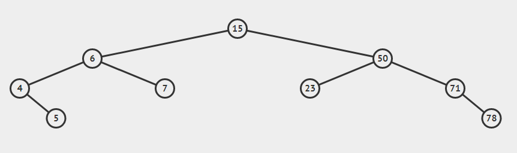

对这颗树而言，它是平衡的，除最倒数第二层节点外其他节点的平衡因数都是 `0` 。此时如果要插入元素 `8` ，根据二叉搜索树的插入规则，节点将被插入到节点7的右子节点位置，不会破坏树的平衡。
如果被插入的元素是 `79` ，则会被插入到节点 `78` 的右子节点位置，此时节点 `71` 的平衡因数将变为 `-2` ，节点 `50` 的平衡因数也会变为 `-2` ，平衡性被破坏。
我们称平衡性被破坏的节点为发现者，破坏平衡性的节点为破坏者。根据破坏者与发现者的相对位置，把破坏平衡的插入分为 `4` 种情况：

- `RR插入` —破坏者位于发现者的右子树的右边
- `LL插入` —破坏者位于发现者的左子树的左边
- `RL插入` —破坏者位于发现者的右子树的左边
- `LR插入` —破坏者位于发现者的左子树的右边
对这四种情况分别进行处理，把被破坏的平衡树重新构造成平衡二叉树，就是平衡二叉树的自平衡。
四种处理方式分别为：`RR旋转`，`LL旋转`，`RL旋转`，`LR旋转`，旋转的结果需要满足二叉查找树的规则。

## `RR旋转`

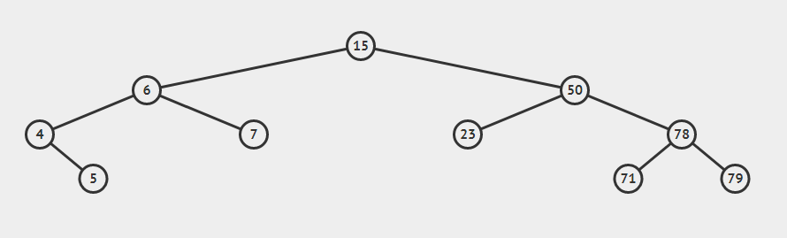

如图所示的平衡二叉树，假设插入元素 `80`

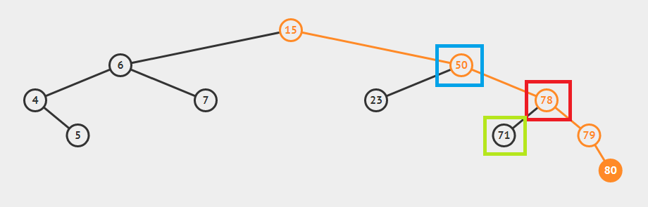

此时发现者是 `50` ，破坏者是 `80` 。
根据二叉搜索树的性质不难知道，发现者 `50` 的右子树所有节点均大于 `50` 。因此，可以用 `50` 的右子节点替换 `50` 的位置，同时把 `50` 右子节点 `78` 的左子树（一定小于 `78` ）挂在 `50` 的右子节点处（一定大于 `50` ），最后把 `50` 这一节点连同它的子树挂在节点 `78` 的左子节点位置。

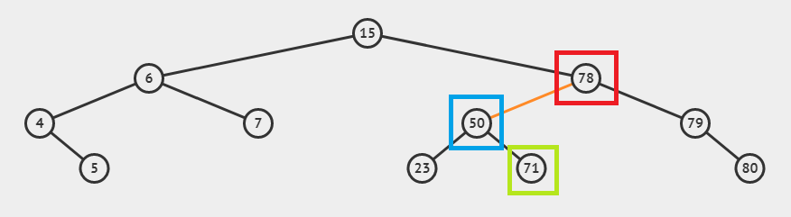

过程可以简述为：
1. 使用发现者 `F` 的右子节点 `r` 代替发现者
2. 把发现者 `F` 挂到 `r` 的左子节点处
3. 把 `r` 的左子节点（可以为空）重新挂在 `F` 的右子节点处
4. 返回占据原 `F` 节点位置的节点（应该为 `r` ）。

```c
//注意：此函数不应单独使用，它应该配合插入操作使用
//      因为单单将finder的子树旋转是不够的，还需要把返回的节点挂载到原树上
AVLTree *singleRightRotation(AVLTree *tree)
{                                    //tree is the finder
    AVLTree *replacer = tree->right; //right child of finder
    tree->right = replacer->left;    //right child's left child to finder's right child
    replacer->left = tree;           //finder to right child's left child
    //update heights of changed nodes
    replacer->height = maxOfTwo(replacer->left->height, replacer->right->height) + 1;
    tree->height = maxOfTwo(tree->left->height, tree->right->height) + 1;
    return replacer;
}
```

## `LL旋转`

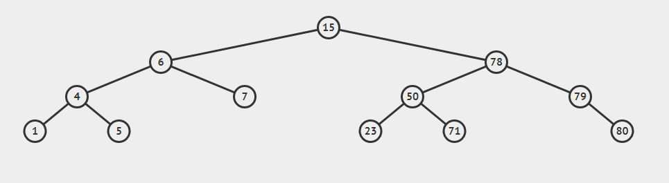

类似的，假设上图所示的平衡二叉树要插入元素 `2`

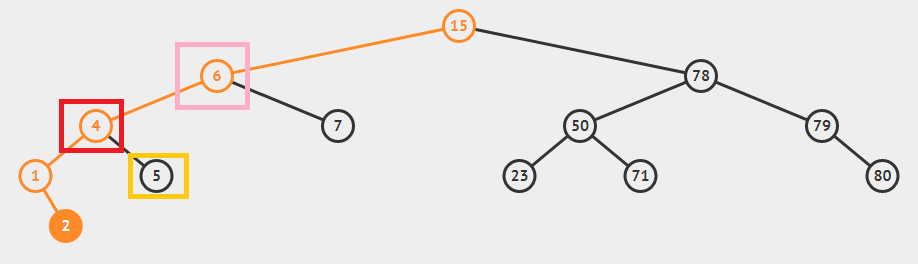

则新插入的元素位于最左侧节点 `1` 的右子节点位置。此时发现者是 `6` ，破坏者是 `1` ，破坏者位于发现者的左子树的左子树的右子节点处（注意：虽然位于右子节点，但仍然是发现者的左子树的左子树上）,因此是 `LL插入`。

与 `RR插入` 类似，发现者的左子树所有节点都小于发现者，因此可以:
- 用发现者的左子节点代替发现者的位置
- 把发现者挂在其左子节点的右子节点处（发现者一定大于它的左子节点）
- 把发现者的左子节点的右子树挂在发现者的左子节点位置

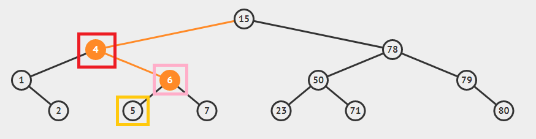

```c
AVLTree *singleLeftRotation(AVLTree *tree)
{
    AVLTree *replacer = tree->left;
    tree->left = replacer->right;
    replacer->right = tree;
    //update heights of changed nodes
    replacer->height = maxOfTwo(replacer->left->height, replacer->right->height) + 1;
    tree->height = maxOfTwo(tree->left->height, tree->right->height) + 1;
    return replacer;
}
```

## `RL旋转`

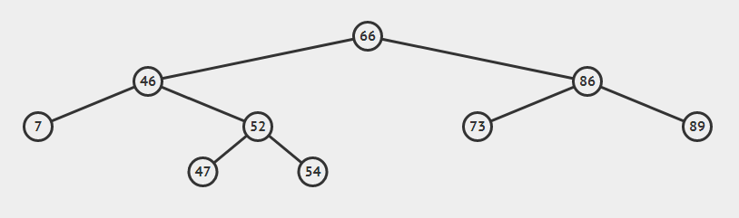

如上平衡二叉树，插入元素 `49`

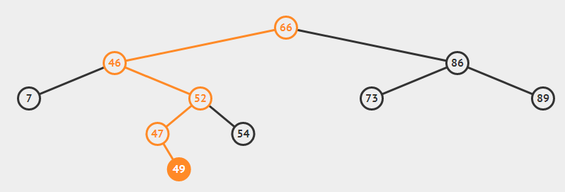

`49` 插入到节点 `47` 的右子节点处，此时发现者是 `46` ，破坏者是 `49` 。破坏者位于发现者的右子树的左子树上，因此是 `RL插入`。

此时，发现者 `F` 必有一个右子节点 `R` ，节点 `R` 必有一个左子节点 `L`。
所谓 `RL旋转` 就是先对节点 `R` 做右旋:

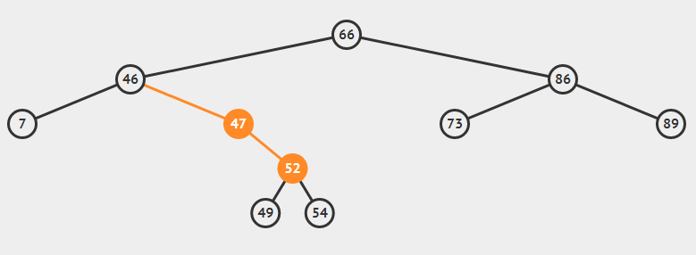

然后对节点 `F` 做左旋：

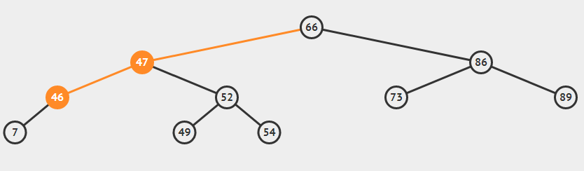

```c
AVLTree *rightLeftRotation(AVLTree *tree)
{
    tree->right = singleRightRotation(tree->right);
    return singleLeftRotation(tree);
}
```

## `LR旋转`

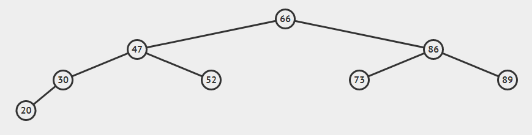

上图所示树插入元素 `25`

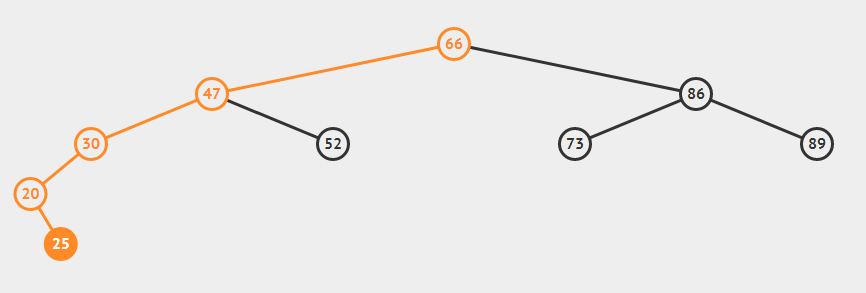

发现者是 `30` ，破坏者是 `25` 。先对节点 `20` 做左旋:

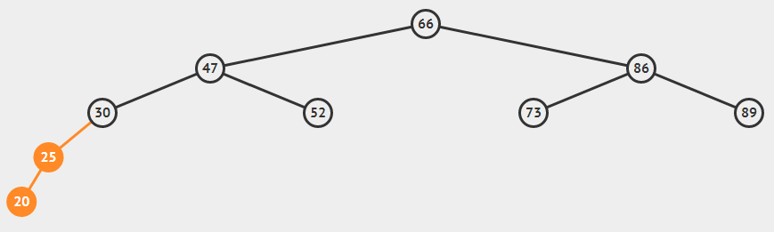

在对节点 30 右旋：

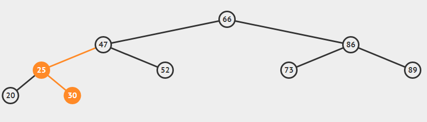

```c
AVLTree *leftRightRotation(AVLTree *tree)
{
    tree->left = singleLeftRotation(tree->left);
    return singleRightRotation(tree);
}
```

## 插入操作

在上述四种旋转的基础上，可以实现新的具有自平衡特点的插入操作。插入之后判断其父节点的平衡因子，如果平衡被破坏，使用对应的旋转操作恢复平衡。

```c
AVLTree *insert(AVLTree *tree, KeyType key)
{ //插入完成后该程序的递归过程会从下而上检查父节点的平衡性
    if (tree == NULL)
    {
        tree = (AVLTree *)malloc(sizeof(AVLTree));
        tree->key = key;
        tree->left = tree->right = NULL;
    }
    else if (key < tree->key)
    { //insert left sub tree
        tree->left = insert(tree->left, key);
        if (getHeight(tree->left) - getHeight(tree->right) == 2)
        { //balance broken
            if (key < tree->key)
            { //single left rotation
                tree = singleLeftRotation(tree);
            }
            else
            { //signle left right rotation
                tree = leftRightRotation(tree);
            }
        }
    }
    else if (key > tree->key)
    {
        tree->right = insert(tree->right, key);
        if (getHeight(tree->right) - getHeight(tree->left) == 2)
        { //balance broken
            if (key > tree->key)
            { //single right rotation
                tree = singleRightRotation(tree);
            }
            else
            { //right left rotation
                tree = rightLeftRotation(tree);
            }
        }
    }
    //update height
    tree->height = maxOfTwo(getHeight(tree->left), getHeight(tree->right)) + 1; 
    return tree;
}
```

## 删除操作

TODO