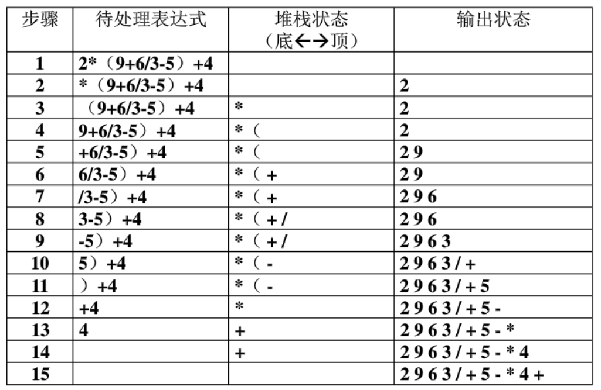

> 本文写于 2020 年 3 月 19 日，2022 年 3 月 5 日重新整理

<!--more-->

# 后缀表达式

数学中常见的运算表达式如 $a + b \times c + d / e$ 称为中缀表达式，它的一个特点就是运算符号如 $+$，$-$，$\times$，$/$ 都是位于运算符的数据中间的。把运算符拿到数据的后面，如 $abc\times + de / +$ 就称位后缀表达式。在使用计算机计算普通的中缀表达式求值时，一般就需要先把中缀表达式转换为后缀表达式，这是因为后缀表达式包含了表达式中各运算符的优先级信息，计算机解析执行起来逻辑清晰，容易实现。

而在中缀表达式转换为后缀表达式以及计算机解析执行后缀表达式时，就需要栈 `(Stack)` 这一数据结构。

# 栈

堆栈是一种只能在一端（栈顶）进行插入`(push)`，和删除`pop`操作的线性表，因此他也是一中后入先出`(Last In First Out)`的数据结构。

## 操作集

堆栈应具有以下基本操作：

```c
Stack *createEmpty(); // 生成空栈
int isFull(Stack *stack); // 查询是否满栈
int isEmpty(Stack *stack); // 查询是否空栈
void push(Stack *stack, ElementType item); // 在栈顶插入元素
ElementType pop(Stack *stack); // 删除并返回栈顶元素
```

## 实现

### 链式结构

1. 首先实现数据结构原型：
    使用链表储存数据时，链表的头节点指向栈顶，为了便于操作，头节点的`next`节点指向的是堆栈的第一个元素，即头节点只作为指示作用。

    ```c
    #define ElementType int
    typedef struct stack {
        ElementType data;
        Stack* next;
    }Stack;
    ```

2. 生成空表
    创建一个空的链表节点并返回：

    ```c
    Stack* createEmpty() {
        Stack* top = (Stack*)malloc(sizeof(Stack));
        top->next = NULL;
        return top;
    }
    ```
3. 查询是否满栈
    链式结构不存在满栈
4. 查询是否为空栈
    由于链式结构的堆栈始终指向头节点，因此只要头节点的`next`节点不为`NULL`，栈就不是空的：

    ```c
    int isEmpty(Stack* stack) {
        return stack->next == NULL;
    }
    ```
5. 在栈顶插入元素
    创建一个空节点`temp`，并把空节点的`next`指针指向头节点`top`的下一节点，然后把头节点的`next`指针指向`temp`。（`temp`的值初始化为要插入的值`item`）
    ```c
    void push(Stack *stack, ElementType item) {
        Stack *temp = (Stack *)malloc(sizeof(Stack));
        temp->data = item;
        temp->next = stack->next;
        stack->next = temp;
    }
    ```
6. 删除并返回栈顶元素
    如果栈非空，首先把栈顶元素(`top`节点的`next`指针指向的节点的值`targetValue`)储存下来，然后删除栈顶节点，返回`targetValue`。
    ```c
    ElementType pop(Stack *stack) {
        if (isEmpty(stack))
        {
            return; //error!Empty stack
        }
        ElementType targetValue = stack->next->data;
        Stack *target = stack->next;
        stack->next = target->next;
        free(target);
        return targetValue;
    }
    ```

### 顺序结构（数组）

1. 首先实现数据结构原型
    在顺序结构中，由于数据在数组中储存，需要使用数组下标访问元素。因此需要一个下标始终指向栈顶。同时堆栈在创建时也需要指定最大的空间大小`MaxSize`.

    ```c
    typedef struct stack
    {
        ElementType *data;
        int top;
    }Stack;
    ```
2. 生成空表
    由于需要指定堆栈最大长度，因此需要有一个参数传入。同时，堆栈的内存空间将在堆栈创建时分配完成。

    堆栈中指示栈顶位置的变量将被初始化为`-1`，它代表这是一个空栈。
    ```c
    Stack *createEmpty(const int maxSize)
    {
        ElementType *data = (ElementType *)malloc(maxSize * sizeof(ElementType));
        Stack *stack = (Stack *)malloc(sizeof(Stack));
        stack->data = data;
        stack->top = -1;//means an Empty Stack
    }
    ```
3. 查询是否满栈
    由于数组实现的堆栈中不含堆栈长度的信息，因此被查询堆栈的大小需要显式传参。通过比交传入的大小数据和栈顶位置`top`，可以轻易得到堆栈是否满栈。
    ```c
    int isFull(Stack *stack, int maxSize)
    {
        return stack->top >= maxSize;
    }
    ```
4. 查询是否为空栈
    当为空栈时，`top`值为`-1`
    int isEmpty(Stack *stack)
    {
        return stack->top == -1;
    }
5. 在栈顶插入元素
    在栈未满的情况下，`push`操作可以简单地把`top`指示器`+1`并把栈顶赋值为要插入的元素完成：
    ```c
    void push(Stack *stack, ElementType item, const int maxSize)
    {
        if (isFull(stack, maxSize))
        {
            return; //Error!stack overflow
        }
        stack->data[stack->top++] = item;
    }
    ```
6. 删除并返回栈顶元素
    栈不为空时，删除操作可以简单地把`top`指示器`-1`完成，此时虽然原栈顶元素仍在`data`数组中，但是由于栈顶指示器已经下移，原栈顶地址处于可擦写的状态，相当于删除。并且由于栈的内存空间在栈被构建时已经申请完毕，在栈上进行的操作将不会影响栈所占用的内存大小。
    ```c
    ElementType pop(Stack *stack)
    {
        if (isEmpty(stack))
        {
            return NULL; //Error!stack is Empty
        }
        return stack->data[stack->top--];
    }
    ```

## 最后

栈的两种C语言（伪）实现大致如上，下面看看后缀表达式如何工作的。

### 转换中缀表达式为后缀表达式

首先建里堆栈用于储存运算符，然后顺序读取表达式每个对象（数值，符号等），对于每个对象，按如下法则处理：

1. 若对象是运算数值，直接输出
2. 若对象是左括号`'('`，压入`(push)`堆栈
3. 若对象是右括号`')'`，将栈内的运算符挨个弹出，直到遇到左括号`'('`
4. 若对象是运算符，将其与栈顶运算符比较：
   1. 若优先级大于栈顶运算符，则把该运算符压栈
   2. 若优先级小于栈顶运算符，则把栈顶运算符弹出，继续与新的栈顶运算符比较，直到其优先级大于栈顶运算符为止。
若表达式中的对象读取完毕，挨个弹出栈内所有运算符。
这样就把一个中缀表达式转换为了后缀表达式，看这个例子：



### 计算后缀表达式

首先建立堆栈用于储存计算结果，然后顺序读取后缀表达式每个对象，并按如下法则处理：

1. 如果对象是运算数，压栈
2. 如果对象是操作符，弹出栈内的两个元素按该操作符计算，并把结果压栈
3. 处理完所有对象后，栈顶的对象就是运算结果