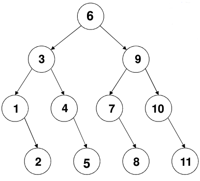
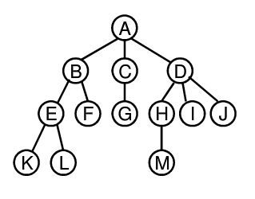
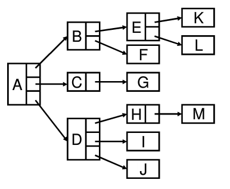
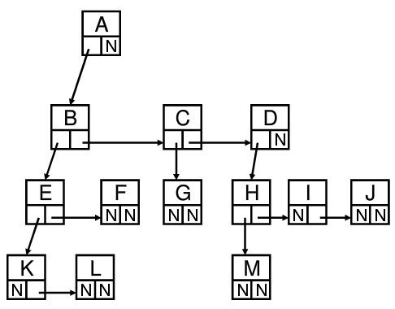
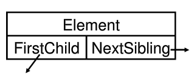

> 本文写于 2020 年 3 月 23 日，2022 年 3 月 6 日重新整理

<!--more-->

# 写在前面

客观世界中许多事物存在层次关系，如人类的族谱，社会组织的结构等。这些分层次的结构在管理方面具有一定的效率优势，树就是类似的一种具有层次结构关系的数据结构。

# 二分查找

二分查找 `binarySearch` 作为一种时间复杂度为的优秀查找算法，其在数据管理的查询方面具有重要地位。二分查找接受被查找元素所属的序列 `list` （有序的，假设为升序）和被查找元素的值 `target` 两个参数，它的基本流程如下：

1. 定义两个变量 `left` 和 `right` 指向序列的左端和右端，变量 `mid` 指向两端的中间位置，查找将在这两端之间进行。
2. 初始化 `left = 1` ， `right = list.length` ， `mid = (left + right) / 2` 。
3. 比较 `mid` 处的元素与待查找元素 `target` 之间的关系：
   1. 若 `list[mid] = target` ，说明在 `mid` 处找到了元素 `target` ，返回 `mid` 。
   2. 若 `list[mid] < target` ，说明 `target` 在 `mid` 的右侧，这时应把 `left` 右移为 `mid + 1` ，然后更新 `mid` 为 `(left + right) / 2` ，重复过程 3。
   3. 若 `list[mid] > target` ，说明 `target` 在 `mid` 的左侧，这时应把 `right` 左移到 `mid - 1` ，然后更新 `mid` 为 `(left + right) / 2` ，重复过程 3。
4. 最后若始终未从过程3.1跳出，则会导致左右交叉即 `left > right` ，此时说明元素未查找到，应退出程序。

算法C语言代码（伪）如下：

```c
int binarySearch(ElementType *list, int listLength, ElementType target)
{
    int left = 0;
    int right = listLength - 1;
    int mid = 0;
    while (left <= right)
    {
        mid = (left + right) / 2;
        if (list[mid] == target)
            return mid;
        else if (list[mid] > target)
            right = mid - 1;
        else
            left = mid + 1;
    }
    return -1; //means not frond!
}
```

二分查找算法之所以能获得较高的时间效率，原因之一就是它的搜索过程实际上是一颗搜索树。例如序列 `[1,2,3,4,5,6,7,8,9,10,11]` ，按照二分法建立树状结构如下：



则对于任何一个元素的搜索次数都将不超过树的深度 `4` 。而对于一颗有 `n` 个节点的树（长度为 `n` 的序列），其搜索树的深度为 $\log_2 n + 1$ ，因此二分搜索的最坏时间复杂度是 $O(\log_2 n)$

# 定义

树是由 `n` 个元素构成的有穷集合。当 `n = 0` 时，称为空树。对于任何一颗非空树，它具有以下性质：

- 一颗树有一个根节点 `root`
- 其余节点可分为m个互不相交的有限集，其中每个集合本身又可以视为一颗树，称为原树的子树 `SubTree` 。

## 术语解释

树的一些基本术语：

- 节点的度 `Degree` ：节点的子树个数
- 树的度：树的所有节点中最大的度数
- 叶节点 `Leaf` ：度为 `0` 的节点
- 父节点 `Parent` ：有子树的节点是其子树根节点的父节点
- 子节点 `Child` ：若 `A` 是 `B` 的父节点，则 `B` 是 `A` 的子节点
- 兄弟节点 `Sibling` ：具有同一父节点的各节点彼此之间是兄弟节点
- 路径和路径长度：从节点到的路径是一个节点序列，其中是的父节点。路径所包含的边的条数是路径长度
- 祖先节点 `Ancestor` ：沿着从根节点到某一节点的路径所包含的所有节点都是节点的祖先节点
- 子孙节点 `Descendant` ：某一节点的子树中的所有节点都是这个节点的子孙节点
- 节点的层次 `Level` ：规定根节点在 `1` 层，其他节点的层次为其父节点层次 `+1`
- 树的深度 `Depth` ：树中所有节点的最大层次称为树的深度

# 树的表示

对于下图所示的树：



可以用链表表示节点：



问题：节点规格不统一，有的节点度为 `1` ，有的节点度为 `3` 。为了统一而采用树的度作为节点中需要保存的子节点个数过于浪费空间，可采用**儿子-兄弟表示法**

如图所示采用每个节点中保存一个子节点和相邻的兄弟节点的结构：



节点结构如下图：



这样的结构保证了节点的统一也保证了空间的利用效率，由于每个节点结构上连接其他两个节点，也称为**二叉树**。